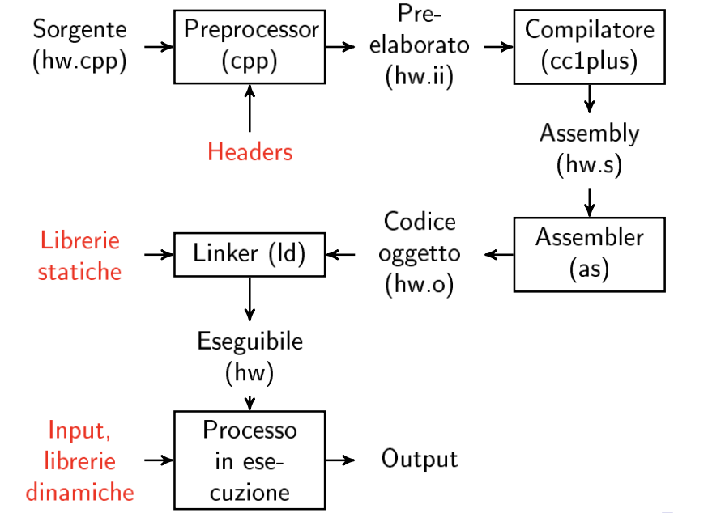
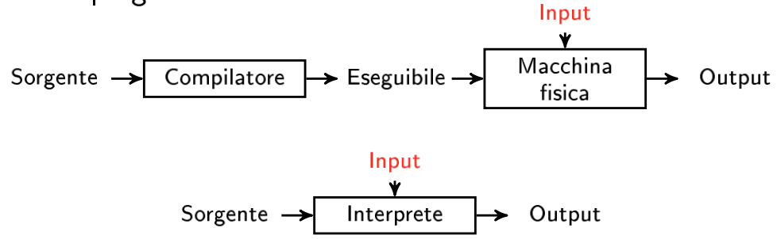
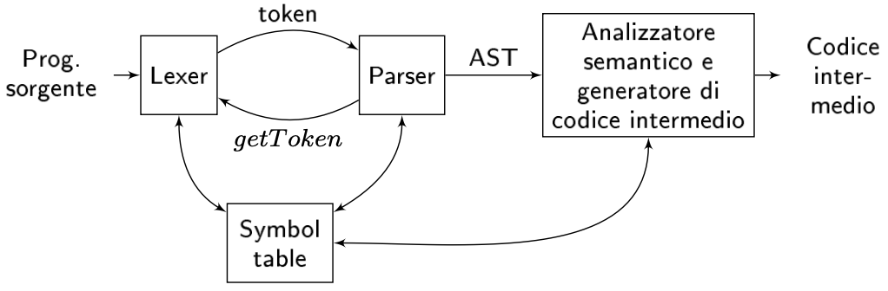

# Compilatori e Interpreti:

### Cos'è un compilatore:
Un compilatore per un linguaggio di programmazione $L$ è un componente di una _toolchain_ di programmi il cui obiettivo è creare **eseguibili** a partire da programmi scritti in $L$.  

I componenti che fanno parte della toolchain sono:
- precompilatore
- assemblatore
- linker

Il compilatore GCC (Gnu Compiler Collection) è il responsabile del linguaggio C/C++ (ma anche di altri come fortran e ada) e i vari elementi della toolchain sono:
- `cpp` $\rightarrow$ preprocessore C/C++
- `cc1plus` $\rightarrow$ nome del compilatore vero e proprio
- `as` $\rightarrow$ programma assemblatore
- `ld` $\rightarrow$ linker

Normalente si usa un programma driver (g++) che invoca le varie fasi in automatico.  

## Compilatori vs Interpreti:
Un diverso modo di implementare un linguaggio di programmazione è costituito dall'interpretazione, che fornisce l'impressione di eseguire il programma direttamente nel linguaggio sorgente.  

Un interprete **puro** legge il testo sorgente del programma, lo analizzae lo esegue mentre procede, questo procedimento è inefficiente in quanto l'interprete spende molto tempo nell'analisi dell'input [LISP].  

In generale, un implementazione interpretata richiede anche un traduttore, che funziona essenzialmente come il frontend di un compilatore. 
Modello Perl (AST + ottimizzazioni iniziali)

## Struttura del compilatore:

Un compilatore è strutturato in **Tre Moduli:**
- **Fronted**: Parte specializzata nell'analisi del linguaggio, esso opera sul codice sorgente e produce una rappresentazione intermedia.
- **MiddleEnd**: Esegue ottimizzazioni sul codice intermedio 
- **BackEnd**: Prouce il codice per l'architettura target

### Struttura del FrontEnd:

I moduli che compongono il FE di un compilator sono riassunti nell'immagine sottostante:

