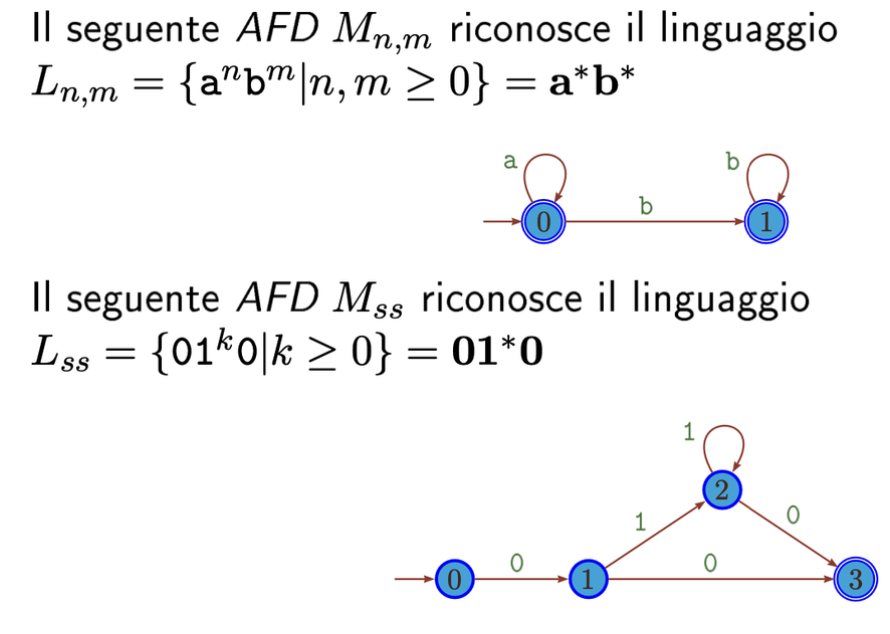
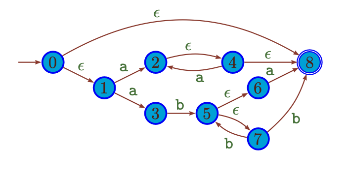

# Automi Finiti

Nel contesto dei linguaggi, gli automi rappresentano uno strumento modellistico importante, essi consentono di dare una formulazione alternativa e algoritmica dello stesso insieme di linguaggi definiti da espressioni regolari (si può passare da regex ad automa e viceversa).  

## Automa Finito Deterministico (AFD): 

Consiste in un 'calcolatore elementare' dotato di stati interni e supporto di input unidirezionale.  
Il comportamento dell'automa è dettato dakke **transazioni di stato**, conseguenza della lettura di uno specifico simbolo in input.

### Definizione di AFD

$$
M = (\Sigma,Q,q_0,Q_f,\delta)
$$

In cui:
- $\Sigma$ $\rightarrow$ Alfabeto in input 
- $Q$ $\rightarrow$ Insieme finito degli stati dell'automa
- $q_0$ $\rightarrow$ Rappresenta lo stato iniziale
- $Q_f$ $\rightarrow$ Insieme degli stati finali - stati di accettazione
- $\delta$ $\rightarrow$ **Funzione di Transizione**, ha il compito di determinare le transazioni di stato, mappa le coppie $\langle$ stato, simbolo $\rangle$ in stati: $\delta : Q\times \Sigma \rightarrow Q$

### Computazione Automa:

La computazione consiste in una sequenza di passi finiti dove ad ogni passo l'automa si trova in uno stato $q$, legge un simbolo $x$ dall'input e transita nello stato: $\delta (q,x)$  

La computazione termina se:
- Si finisce tutta la sequenza di input
- Si affronta una funzione di transizione indefinita per lo stato attuale e il simbolo in lettura

Il numero di transazioni effettuate prima della terminazione è detto: _Lunghezza della computazione_, e su input $n$ avrà costo $O(n)$.  

Come anticipato precedentemente gli automi possono essere utilizzati per riconoscere linguaggi formalmente (come le regex), e diremo quindi che un automa riconosce il linguaggio $X$ se la computazione termina in uno stato $Q_f$ dopo aver letto tutta la stringa in input.  

## Automi Non Deterministici (AFND):

Definiamo come **Automa non Deterministico AFND** un atuoma dove in uno stato $q$ la funzione di transizione non è univocamente determinata dal simbolo in input.  
Cioè se dallo stato $q$ dato lo stesso simbolo di input risult a possibile transitare in modo non deterministico in due o più stati diversi.  

Il concetto di **non determinismo** è da considerarsi come una di queste immagini:
-  Un computer (o automa) non deterministico è ua macchina che posta di fronte a una scelta _azzecca_ sempre quella giusta (macchina fortunata).
- Una macchina in gradpo di eseguire in parallelo tutte le computazioni originate dalle varie opzioni non deterministiche

### Differenza Formale di un AFND
Traducendo formalmente il concetto di non determinismo possiamo dire che in un AFND ciò che cambia è la definizione della **funzione di transizione**:
- mappa coppie $\langle$ stato, simbolo $\rangle$ in **_Sottoinsiemi_** di $Q$

### $\epsilon$-Transazioni

Una $\epsilon$-Transazione che collega due nodi $q$ ed $r$ permette all'automa di transitare da $q$ ad $r$ senza consumare input!  

Gli automi non deterministici sono usati per la ricostruzioni agevolizzata di un riconoscitore di linguaggio da REGEX ad AFD, gli afnd sono il passaggio intermedio.  

 

Inoltre sottlinieiamo il fatto che gli automi che nascono da una regex sono **normalizzati** in quanto:
- Da ongi nodo del grafo dipartono o un singolo o al massimo due $\epsilon$-transazioni.  

 

## Subset Construction: 

Iniziamo affermando che per ogni AFND esiste la controparte AFD che riconosce lo stesso linguaggio, possiamo dire quindi che la computazione finale è 'equivalente'.  
Serve quindi un processo automatico in grado di tradurre un AFND in un AFD, questo processo di costruzione prende il nome di **Subset Construction**.  

- Se $Q$ è l'insieme degli stati di un AFND $N$ allora, dopo la lettura di $i$ simboli dell'input, $N$ può essersi arrestato **oppure** può trovarsi in uno degli stati di un qualche sottoinsieme di $Q$.  
- **L'idea** è quindi: Dato $N$, avrò un automa $D$ equivalente che procede tenendo traccia proprio di tutti gli stati in cui può trovarsi $N$ dopo aver letto $i$ simboli di input.  

$\riightarrow$ Schema e spiegazione dell'algoritmo **Subset Construction** nel quaderno, consultarlo in caso di dubbi.

---

Costruzione di un AFND da ua REGEX

