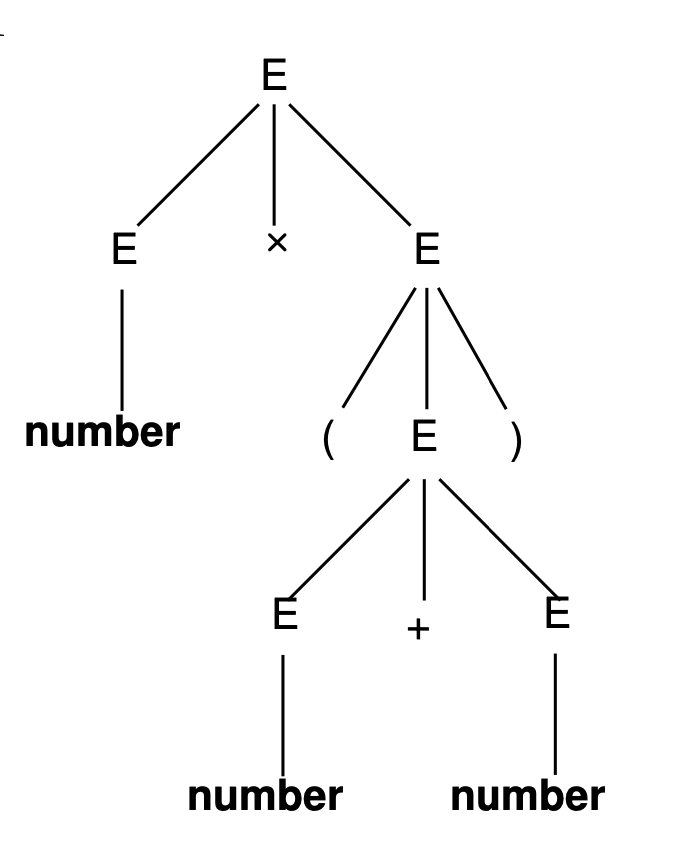

# Grammatiche:

Una grammatica G è una quadrupla di elementi

$$

G(N,T,P,S)

$$

dove:
- $P$ : Insieme delle produzioni: $X\rightarrow Y, (X,Y \in N\cup T)$
- $S$ : Assioma della grammatica (simbolo iniziale)
- $N$ : Insieme dei caratteri non terminali 
- $T$ : Insieme dei caratteri terminali   

I caratteri maiuscoli $X \in N$ mentre i minuscoli $x\in T$  
L'insieme $V = N\cup T$ è il **vocabolario della grammatica**

## Struttura delle produzioni:

Le Produzioni caratterizzano la capacità espressiva di una grammatica

**Grammatica Lineare Destra:** $A \rightarrow xB \space |\space A\rightarrow x$

**Grammatica Lineare Sinistra:** $A \rightarrow Bx \space |\space A\rightarrow x$

Se una grammatica è Lineare DX o SX allora viene detta _grammatica regolare_.  

### Grammatica Libera:  

Per definire la sintassi e la grammatica dei linguaggi di programmazione non bastano le grammatiche regolari, servono le **Grammatiche Libere**.  

$$

A\rightarrow \alpha\space\space\space\space   A\in N,\space\space\space \alpha \in {V}^*

$$

**Grammatica Libera vs Grammatica Regolare**

- **Regolare**: Permette solo produzioni 'singole' (lineari), ossia produzioni il cui risultato può avere massimo un Non terminale!

- **Libera**: Permette produzioni generali con $n$ simboli Non terminali!

## Derivazioni:

>Le derivazioni sono il processo mediante il quale applicando un numero di produzioni a partire dall'assioma, otteniamo una stringa di soli terminali. 
>

Una derivazione è quindi composta da più applicazioni di produzioni, ossia da tante sequenze intermedie.  

- **Forme di Frase:** Esiste almeno un non terminale 
- **Frase del Linguaggio:** sequenza composta da soli caratteri terminali

# Alberi di derivazioni: Parse Tree

Il compito del ***Parser*** è quello di trovare una derivazione dall'assioma fino alla stringa passata in input (per determinare se appartiene alla grammatica).  

Il parser riconosce stringhe della grammatica attraverso i ***Parse Tree***

### Parse Tree
Albero radicato la cui radice è l'assioma della grammatica e ha:
- Nodi Interni: Simboli $\in N$
- Nodi Foglia: Simboli $\in T$

### Conseguenze:

- Se $A\in N$ e ha figli $X_1,X_2,...,X_n$ con $X_i\in V$, allora vuol dire che deve esistere in $P$ la produzione $A\rightarrow X_1,X_2,...,X_n$
- Se $A\in N$ e l'unico figlio che ha è $\epsilon$, allora deve esistere la produzione $A\rightarrow\epsilon$
- Ad ogni parse tree corrisponde una e una sola frase (BFS sinistra), il viceversa non vale sempre!

Es: Parse Tree per la frase `number x (number + number)` da $G_{expr1}$

---

 

### Ambiguità: 

Tornando al discorso di prima, introduciamo la necessità di eliminare le ambiguità e indeterminaztezza, in quanto ad una frase potrebbero corrispondere più parse tree.  
Infatti le grammatiche libere sono spesso ambigue, questo significa che una stessa frase potrebbe essere derivata in modi diversi, e modi diversi di derivare una stessa frase producono parse tree diversi per la stessa.  

**In realtà** ciò che conta sono i parse tree in relazione alle _derivazioni delle frasi_ piuttosto che alle frasi.  

es: Per la frase `number x (number + number)` esistono almeno due derivazioni diverse:

$$

E \Rightarrow E\times E \Rightarrow E \times (E) \Rightarrow E \times (E + E)

$$

$$
\Rightarrow E \times (E + n) \Rightarrow E \times (n + n) 
\Rightarrow n \times (n + n) 

$$

e

$$
E \Rightarrow E \times E \Rightarrow n \times E \Rightarrow n \times (E) 
$$

$$
n \times (E + E) \Rightarrow n \times (n + E) \Rightarrow n \times (n + n)
$$

Questa indeterminatezza è affrontata e gestita considerando derivazioni con un ordine di riscrittura **prefissato**, dette ***Derivazioni Canoniche***.  

## Derivazioni Canoniche:

Le Derivazioni canoniche, che sono derivazioni con un ordine di riscrittura prefissato, non eliminano completamente le ambiguità, ma aiutano a diminuirle e snellire il processo di parsing.

- **Derivazione Canonica Destra**: derivazione in cui si applicano le produzioni partendo **sempre** dal non terminale più a destra!

- **Derivazione Canonica Sinistra**: come sopra ma partendo **sempre** dal non terminale più a sinistra!

si definisce ***grammatica ambigua*** una grammatica in cui almeno una frase ammette differenti parse tree (esiste almeno una frase con derivazioni canoniche diverse e quindi diversi parse tree).  

Il parsing risulta più complicato per grammatiche di questo tipo, esistono algoritmi per eliminare le ambiguità ma sono molto macchinosi e si preferisce gestire le ambiguità direttamente nel parser.  

### Altri aspetti problematici: 

- **Possibilità di cicli o ricorsioni:**  
    I cicli sono derivazioni del tipo $A {\Rightarrow}^+ A$ o comunque di _left recursion_ $A\Rightarrow^+ A\alpha$ con $\alpha \neq \epsilon$

- **Presenza di prefissi comuni a due o più produzioni relative allo stesso non terminale:**  
    $A \rightarrow \alpha\beta _1$ e $A \rightarrow \alpha\beta _2$ con $\alpha = \alpha$ e $\beta _1 \neq \beta _2$

Queste ambiguità consistono in un severo ostacolo per il processo di parsing.  
Per cercare di alleviare a tale conseguenza si possono introdurre nella grammatica nuovi non-terminali che forzino una precedenza nelle regole di riscrittura.  

## Possibili esercizi:

- Ricostruire una grammatica Lineare DX(|SX) da automa 
- Costruire un AFND da una grammatica lineare DX(|SX)
