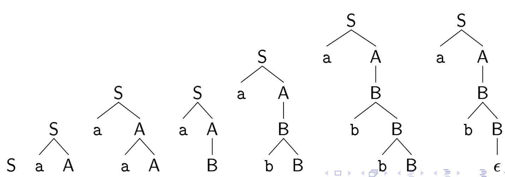

# Parsing (1)
 
Mini expl

## Generalità sul Parsing 

Nel contesto della compilazione **l'input** per il parse è costituito da una stringa di Token (fornita dallo scanner).  
Per individuare la fine della stringa di analisi $\rightarrow$ `$`

Se $S$ è l'assioma inziale della grammatica, per tenere conto del simbolo di terminazione si introduce un nuovo assioma: $S'\rightarrow S$$  
Indicheremo invece con: $\theta$ la **stringa di token**.  

### Tipi di Parser:

I parser vengono classificiati in accordo all'ordine di costruzione del parse tree per $\theta$.  
- **Parsing Top-Down:** L'albero viene costruito a partire dalla radice, che corrisponde all'assiome iniziale, questo tipo di parser cerca una derivazione canonica **sinistra** per $\theta\space$$.  
- **Parsing Bottom-Up:** L'albero viene costruito partendo dalle foglie verso la radice, il parser cerca quindi una derivazione canonica destra.  
- Parser a **discesa ricorsiva:** possono esere ricorsivi con backtracking o implementati anche senza backtracking $\rightarrow$ Top-Down.  
- Parser **Shift-Reduce**  $\rightarrow$ Bottom Up.  

### Scelta della produzione:
Al generico passo di derivazione o riduzione, il aprser deve decidere quale produzione della grammatica utlizzare.  
Tale scelta viene fatta in base allo **stato interno del parser** e dal **Lookahead**.  
- Stato interno del parser $\rightarrow$ informazione memorizzata nella cima di una struttura dati `Stack`.  
- Il numero di token considerati per prendere la decisione è noto come Lookahead, in generale interessano valori di LookAhead limitati [0 o 1].  

## Parser a discesa ricorsiva: 

Un parser a discesa ricorsiva (d.r) costruisce il **parse tree** a partire dall'assioma ed esaminando progressivamente l'input.  

### Algorimto:
- Al generico passo il parser è posizionato su un nodo $x$ dell'albero
- Se il nodo è una foglia etichettata con un simbolo terminale $a$, si controlla se il prossimo carattere in input coincide con tale input
    - Se si, fa avanzare il puntatore di input
    - Altrimenti dichiara `errore`
- Se il nodo è un non terminale $A$, il parser sceglie una delle produzioni $A\rightarrow X_1,X_2,...X_k$, crea i nodi (figli di $A$) con le realtive label e passa riscorsivamente ad esaminare tali nodi, da sinistra verso destra.  

**ATTZ**: Il problema fondamentale consiste nella scelta della produzione da applicare, nel caso ne esista più di una.  
Per eliminare il non determinismo e la garanzia di proseguire nel parsing si può operare con **Backtracking**, quindi quando una produzione fallisce, prima di dichiarare errore si esplorano le altre produzioni disponibili.  
Il **BackTracking** consiste in una soluzione con approccio `BruteForce` quindi estremamente computazionalmente pesante.  

### ES:

su input `ab` e con la segunete grammatica:

$$
S \rightarrow aA 
$$

$$
A\rightarrow aA | B
$$

$$
B\rightarrow bB | \epsilon
$$

Un parser a discesa ricorsiva che opera con backtracking potrebbe giungere alla seguente derivazione e parse tree:

Questi tipi di Parser (a discesa ricorsiva) sono estremamente sensibili e inadatti a grammatiche con ricorsioni sinistre, in quanto potrebbero causare cicli infiniti di ricorsione.

 

## Eliminazione delle ricorsioni sinistre

