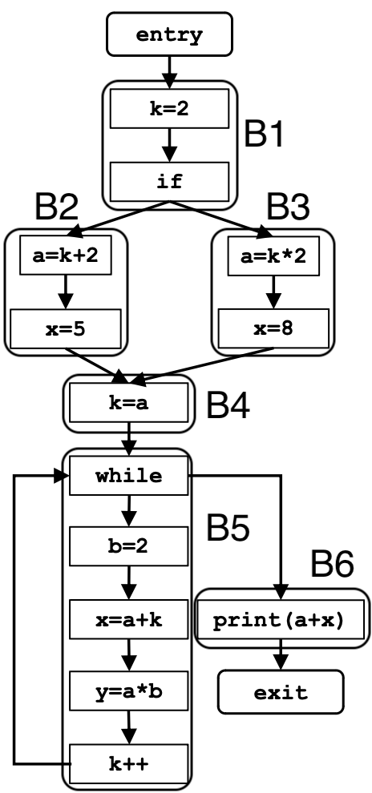

# Data Flow analysis: Constant Propagation

### Problem Definition:

- Determine at which points in the program the variables have a constant value
<<<<<<< HEAD
- Calculate for each node of the CFG a set $\<var, constant\_{value}\>$
=======
- Calculate for each node of the CFG a set $\space\lt var, const \gt$
>>>>>>> 4b82b3c (change in latec expressions parsing)

### Motivation:

- allows the compiler to replace variables with constant values throughout the program, thus potentially eliminating redundant operations, leading to improved performance.

<br>

**_Note:_** The constant propagation analysis can determine the constant value of binary expressions where one or both operands of the RHS are known.

<br><br>

# Formalizzazione:

|                           |                        **Constant Propagation**                        |
| :-----------------------: | :--------------------------------------------------------------------: |
|          Domain           |                      set of $\lt var, const \gt$                       |
|         Direction         | Forward:<br>$out[B]=f_B(in[B])$ <br> $in[B]=\wedge\space out[pred(B)]$ |
|     Transfer Function     |               $f_B(in[B])=gen[B] \cup (in[B] - kill[B])$               |
| Meet Operation $(\wedge)$ |                  $\cap\space\rightarrow$ Intersezione                  |
|    Boundary Conditions    |                        $out[ENTRY] = \emptyset$                        |
|  Initial Interior Points  |                    $boh$ or $out[B_i] = \emptyset$                     |

<br><br>

# Iterative Algorithm:

```python
input = CFG(N,E,ENTRY,EXIT)

# Boundary Condition:
out[ENTRY] = ∅

# Init Steps:
for each BB except ENTRY:
    out[B] = ∅

# Iteration:
while(changes to ant out[] occur):
    for each BB except ENTRY:
        in[B] = ∩(out[p]) for all predecessors p of B
        out[B] = gen[B] U (in[B] - kill[B]) # transfer function

# If reached = Convergence
```

<br>

# Example:



<br>

---

<br>

### Boundary Condition :

|  Flow point  | Data representation |
| :----------: | :-----------------: |
| $out[ENTRY]$ |     $\emptyset$     |
|   $in[B1]$   |          -          |
|  $out[B1]$   |          -          |
|   $in[B2]$   |          -          |
|  $out[B2]$   |          -          |
|   $in[B3]$   |          -          |
|  $out[B3]$   |          -          |
|   $in[B4]$   |          -          |
|  $out[B4]$   |          -          |
|   $in[B5]$   |          -          |
|  $out[B5]$   |          -          |
|   $in[B6]$   |          -          |
|  $out[B6]$   |          -          |
|  $in[EXIT]$  |          -          |

<br>

### First Iteration:

|  Flow point  |                                         Data representation                                          |
| :----------: | :--------------------------------------------------------------------------------------------------: |
| $out[ENTRY]$ |                                             $\emptyset$                                              |
|   $in[B1]$   |                        $in[B]=\wedge\space out[pred(B)]\rightarrow \emptyset$                        |
|  $out[B1]$   | $f_B(in[B])=gen[B] \cup (in[B] - kill[B]) \rightarrow \{(k,2)\}\cup (\emptyset - \{k\}) = \{(k,2)\}$ |
|   $in[B2]$   |                                             $\{(k,2)\}$                                              |
|  $out[B2]$   |                $\{(a,k + 2),(x,5)\} \cup (\{(k,2)\}- \{a,x\})=\{(a,4),(x,5),(k,2)\}$                 |
|   $in[B3]$   |                                             $\{(k,2)\}$                                              |
|  $out[B3]$   |                $\{(a,k*2),(x,8)\}\cup (\{(k,2)\} - \{a,x\} = \{(a,4),(x,8),(k,2)\})$                 |
|   $in[B4]$   |                               $out[B_2]\cap out[B_3]= \{(a,4),(k,2)\}$                               |
|  $out[B4]$   |                     $\{(k,a)\}\cup (\{(a,4),(k,2) - \{k\}\}) = \{(k,4),(a,4)\}$                      |
|   $in[B5]$   |                              $\{(k,4),(a,4)\}\cap sm = \{(k,4),(a,2)\}$                              |
|  $out[B5]$   |                                                  $$                                                  |
|   $in[B6]$   |                                 $\{(a,4),(b,2),(x,8),(y,8),(k,5)\}$                                  |
|  $out[B6]$   |                                 $\{(a,4),(b,2),(x,8),(y,8),(k,5)\}$                                  |
|  $in[EXIT]$  |                                 $\{(a,4),(b,2),(x,8),(y,8),(k,5)\}$                                  |

<br>

### Second Iteration:

|  Flow point  |   Data representation   |
| :----------: | :---------------------: |
| $out[ENTRY]$ |       $\emptyset$       |
|   $in[B1]$   |       $\emptyset$       |
|  $out[B1]$   |       $\{(k,2)\}$       |
|   $in[B2]$   |       $\{(k,2)\}$       |
|  $out[B2]$   | $\{(a,4),(x,5),(k,2)\}$ |
|   $in[B3]$   |       $\{(k,2)\}$       |
|  $out[B3]$   | \{(a,4),(x,8),(k,2)\}$  |
|   $in[B4]$   |    \{(a,4),(k,2)\}$     |
|  $out[B4]$   |    \{(a,4),(k,4)\}$     |
|   $in[B5]$   |            -            |
|  $out[B5]$   |            -            |
|   $in[B6]$   | $\{(a,4),(b,2),(y,8)\}$ |
|  $out[B6]$   | $\{(a,4),(b,2),(y,8)\}$ |
|  $in[EXIT]$  | $\{(a,4),(b,2),(y,8)\}$ |

<br>

### Third Iteration:

|  Flow point  |   Data representation   |
| :----------: | :---------------------: |
| $out[ENTRY]$ |       $\emptyset$       |
|   $in[B1]$   |       $\emptyset$       |
|  $out[B1]$   |       $\{(k,2)\}$       |
|   $in[B2]$   |       $\{(k,2)\}$       |
|  $out[B2]$   | $\{(a,4),(x,5),(k,2)\}$ |
|   $in[B3]$   |       $\{(k,2)\}$       |
|  $out[B3]$   | $\{(a,4),(x,8),(k,2)\}$ |
|   $in[B4]$   |    $\{(a,4),(k,2)\}$    |
|  $out[B4]$   |    $\{(a,4),(k,4)\}$    |
|   $in[B5]$   |       $\{(a,4)\}$       |
|  $out[B5]$   | $\{(a,4),(b,2),(y,8)\}$ |
|   $in[B6]$   | $\{(a,4),(b,2),(y,8)\}$ |
|  $out[B6]$   | $\{(a,4),(b,2),(y,8)\}$ |
|  $in[EXIT]$  | $\{(a,4),(b,2),(y,8)\}$ |

No changes occurred on the third iteration $\rightarrow$ we reached convergence and terminate the algorithm
