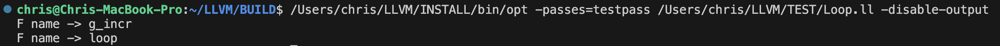

# Primo Laboratorio: Scrivere un passo LLVM

# Test Pass

Aggiungiamo un passo alla toolchain che stampi tutte le funzioni locali al file analizzato!

Abbiamo due file sorgente scritti in C (serve trasformarli in IR), iniziamo dal file `Loop.c`

```bash
clang -O2 -emit-llvm -S -c TEST/Loop.c -o TEST/Loop.ll
```

_nota_: Alcuni percorsi potrebbero essere referenziati senza due directory padre, presupporre sempre che ci siano nel percorso.  
Es:

```bash
llvm/include/Transforms/Utils

# in realtà è:

$ROOT/SRC/llvm/include/Transforms/Utils
```

## Scrittura del passo:

1. Avere il codice IR a disposzione
2. Preparare lo scheletro (la build) per un nuovo passo

## 2. Preparare lo scheletro

Creiamo un file e inseriamo il codice relativo al passo che vogliamo inserire in:

```bash
llvm/lib/Transforms/Utils/TestPass.cpp
```

Una volta creato aggiungiamo il nome di tale passo al file `CmakeLists.txt`:

```bash
llvm/lib/Transforms/utils/CmakeLists.txt
```

Ora che la build è settata per un nuovo passo non ci resta che scrivere il codice relativo al passo!

## Scrittura del codice per il passo:

Ricordiamo che il passo si compone di un file .cpp (creato nello step precedente) e dal corrispettivo file header .h
Creiamo il file header nella directory:

```bash
$ROOT/SRC/llvm/Transforms/Utils/TestPass.h
```

Il file header dovrà contenere il seguente codice boilerplate:

```c++
#ifndef LLVM_TRANSFORMS_TESTPASS_H
#define LLVM_TRANSFORMS_TESTPASS_H

#include "llvm/IR/PassManager.h"
namespace llvm{
class TestPass: public PassInfoMixin<TestPass>{
    public:
        PreservedAnalyses run(Function &F, FunctionAnalysisManager &AM);
};
} // namespace llvm

#endif // LLVM_TRANSFORMS_TESTPASS_H
```

Questo file header crea la classe per il passo e dichiara il metodo `run()`, ereditato da `PassInfoMixin< - >` che setta altro boilerplate neccessario per il funzionamento del nostro passo. Questo passo è **obbligatorio**, ogni passo deve esistere come classe ed ereditare dal PassInfoMixin.

Ora possiamo scrivere il codice vero e proprio nel file che abbiamo creato in precedenza, e includiamo il file header e il namespace definiti nel precedente step:

```c++
// llvm/lib/Transforms/Utils/TestPass.cpp

#include "llvm/Transforms/Utils/TestPass.h"
using namespace llvm;

//definiamo run()
PreservedAnalyses TestPass::run(Function &F, FunctionAnalysisManager &AM) {
    errs()<< F.getName() << "\n";
    return PreservedAnalyses::all();
}
```

_nota_: `Function &F` è il Handle al nodo IR di tipo `Function`

Questo conclude la scrittura del codice relativa alla creazione del passo

_note_: Notiamo che il nostro passo non modifica in alcun modo la funzione, semplicemente fa una stampa e lascia invariate le analisi precedenti

```c++
return PreservedAnalyses::all()
```

## Registrare il passo:

Ora che abbiamo un nuovo passo con i relativi file, dobbiamo registrarlo tra i passi llvm e per fare ciò seguiamo questi step:

1. Inserirlo in `PassRegistry.def`: Questo è il file che contiene tutti i passi disponibili nel framework llvm. Quando si invoca un passo lo si cerca in questo file.
2. Aggiungere l'inclusione del file header in `PassBuilder.cpp`: File responsabile della creazione e configurazione dei passi, nonostante includa PassRegistry.def serve anche l'inclusione del file header del passo che vogliamo aggiungere in quanto PassBuilder deve conoscere la definizione per poter invocare il passo correttamente.s

```bash
# llvm/lib/Passes/PassRegistry.def
FUNCTION_PASS("testpass", TestPass())
```

```c++
// $ llvm/lib/Passes/PassBuilder.cpp
#include "llvm/Transforms/Utils/TestPass.h"
```

Ora il passo risulterà correttamente registrato, non ci resta che compilarlo e usarlo!

## Test del passo con `opt`

Ora che abbiamo il passo possiamo usare `opt` e del codice IR per poterlo testare.

```bash
cd $ROOT/BUILD
make opt

# Lo installiamo:
make install
```

_nota_: Dopo aver eseguito questi comandi, troveremo `opt` in:

```bash
$ROOT/INSTALL/bin/opt
```

Si potrebbe creare un alias o una var di ambiente per semplificare l'invocazione, per semplicità, tale comando verrà referenziato semplicemente da `opt`.

proviamo infine il nostro passo:

```bash
opt -passes=testpass TEST/Loop.ll -o TEST/LoopTestPass.ll
# Oppure
opt -passes=testpass TEST/Loop.ll -disable-output

```

Se fatto tutto correttamente dovremmo ottenere un ouptut di questo tipo:



# Esercizio 2:

Estendere il passo `TestPass` di modo che analizzi la IR e stampi alcune informazioni utili per ciascuna delle funzioni che compaiono nel programma di test, in particolare:

1. Nome:

```c++
F.getName()
```

2. Numero di argomenti

```c++
.isVarArg() //returns true if func in vararg
```

3. Numero di chiamate a funzione dello stesso modulo

```c++

```

4. Numero di basic blocks (BB)

```c++

```

5. Numero di istruzioni

```c++

```
