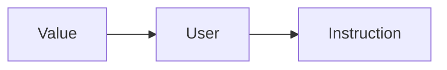

# Lab 2: Introduzione ai passi di trasformazione

Ricordiamo il fatto che il _middle end_ sia organizzato come una sequenza di passi, in particolare passi di analisi e di trasformazione.  
In questo laboratorio ci concentreremo nei passi di **trasformazione**.

## IR llvm

La IR llvm segue canonicamente la forma **SSA** (single static assigment) che prevede che una variabile non possa essere definita più di una volta.

## User - Use - Value

Le istruzioni `Instruction` llvm ereditano dalla classe `Value` e dalla classe `User`.
Quindi possiamo dire che `Instruction` giocano entrambi i ruoli, sia da **User** che da **Usee**.

### Gerarchia delle classi LLVM



## Istruzioni come User

Ogni Istruzione è istanza di `User` e ogni User ha una lista di valori che sta utilizzando, che corrispondono agli operandi dell'istruzione (oggetti di tipo `Value`)

Consideriamo:

```llvm
%2 = add %1, 0
```

Usando un passo:

```c++
User &Inst = ...
for(Auto Iter = Inst.op_begin(); Iter != Inst.op_end(); ++iter){
    Value *Operand = *Iter;
}

// Restituisce i seguenti operandi:
// %1 ; 0 -> i Value che l'istruzione usa !
```

## Instruction come Usee

Ogni oggetto instruction è anche un Usee (un 'utilizzato'), infatti avendo:

```llvm
%2 = add %1,0
```

Dobbiamo interpretare `%2` come la rappresentazione `Value` dell'istruzione **NON** come il risultato numerico assegnato dall'istruzione.

Es:

```llvm
%2 = add %1,0           ;identità algebrica
%3 = mul %2, 2
```

Sia `Inst` una referenza alla prima istruzione:

```c++
//Usato Inst come User:
for (auto Iter = Inst.op_begin(); Iter != Inst.op_end(); ++Iter) {
    Value *Operand = *Iter;
}

// Output -> Operand %1, 0

//-----------------------------------------------

//Usato Inst come Usee (Value):
for (auto Iter = Inst.user_begin(); Iter != Inst.user_end(); ++Iter){
    User *InstUser = *Iter;
}

// Output -> Instruction mul %2, 2 (or -> Value %3)
```

_nota:_ `.user_begin()` è un metodo ereditato dalla classe `Value` che fornisce una lista di `Users` che usano l'istanza da cui si invoca il metodo come `Value` nel codice sorgente analizzato.
