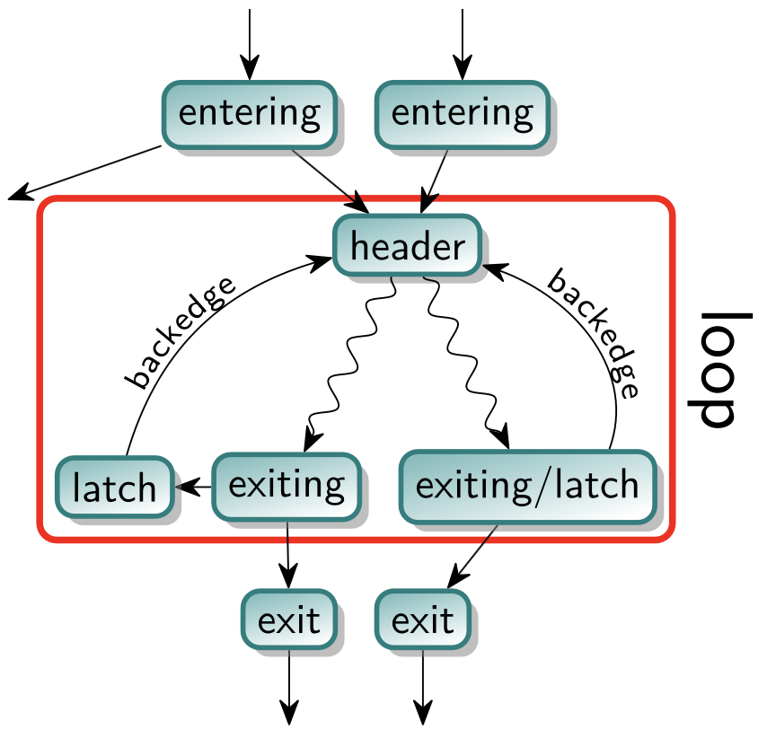

# Assignment 4: Loop Fusion 

## Loops Overviews e Defiinizioni:

Per definizione un Loop llvm è un insieme di nodi del CFG con le seguenti proprietà:
1. Il sottografo che modella il loop è fortemente connesso (tutti i nodi raggiungibili da tutti i nodi)
2. Tutti i nodi esterni al loop che puntano al loop puntano allo stesso `BasicBlock`, che prende il nome di `header`. Il hader quindi domina tutti i nodi del loop. 

### Terminologia di loop aggiuntiva:
- Con `EnteringBlock` o `predecessor` ci si riferisce a un blocco non appartenente al loop che punta al header del loop, se esiste un singolo EnteringBlock ci si riferisce ad esso come `PreHeader` $\rightarrow$ per definizione il preheader dominerà tutti i nodi del loop. 
- Un `latch` è un nodo del loop che ha un arco verso il header del loop
- Un `BackEdge` è l'arco del latch che lo collega con il header
- Un `Exiting Edge` è l'arco che sposta il control flow al di fuori del loop.  
    - Il blocco che lo genera è detto `ExitingBlock` e il suo target è un `ExitBlock`
- Il `LoopGuard` è un blocco che considera la condizione di controllo del ciclo e determina se esso deve essere eseguito o meno, il `LoopGuard` ha un arco che punta al header e all'exiting block per gestire questo controllo.
- `LoopTripCount` rappresenta il numero di volte che un ciclo esegue

--- 

