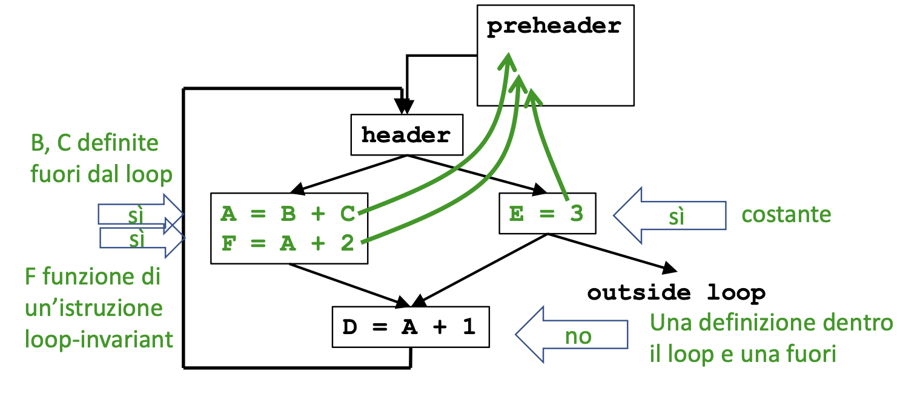
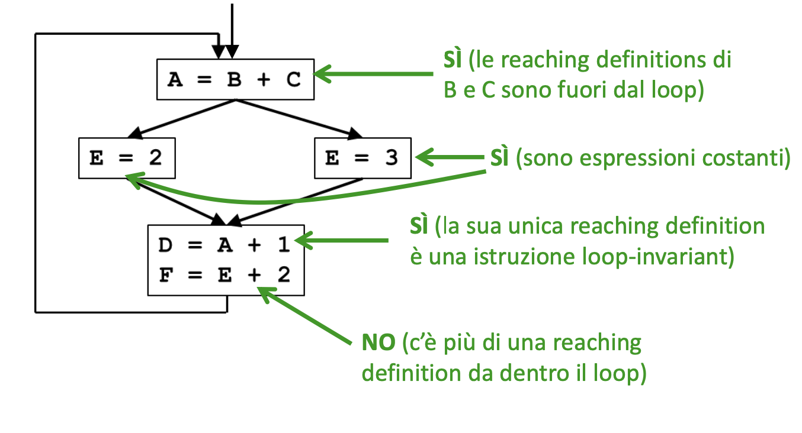
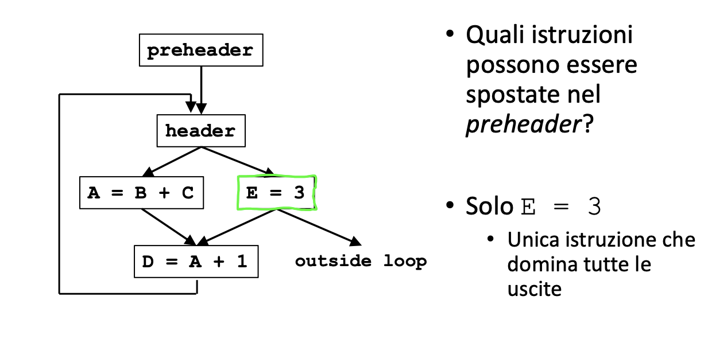

# Loop Invariant Code Motion:

Un passo che implementa questa ottimizzazione permette di spostare le istruzione che non dipendono dal control flow del loop fuori dal loop stesso, in modo da evitare di ricalcolare ridondantemente la stessa istruzione.  
Essendo il grosso della computazione di un programma contenuta nei loop, questo passo permette di fare miglioramenti di performance significativi.

````c++
int a = ...;
int b = ...;
for(int i = 0; i<100;i++){
    f(a*b);
}

// spostiamo 'a*b' fuori dal ciclo per calcolarlo una singola volta.

c = a*b;
for(int i = 0; i<100;i++){
    f(c); // mettiamo c al posto di a*b !
}
```i

Per poter implementare questo passo bisogna identifiacare quali istruzioni sono **Loop-Independant** $\rightarrow$ **Istruzioni il cui valore non cambia fintanto che il controllo rimane dentro il loop**.

## Code Motion:

Consiste nello spostamento delle istruzioni _loop-invariant_ dentro il blocco preheader che precede l'entry point di un ciclo.



Non tutte le istruzioni _loop-invariant_ possono essere spostate nel blocco preheader, definiamo un modo per determinare quali istruzioni siano spostabili e quali no:

1. Calcoliamo le **Reaching Definitions**
2. Per ogni istruzione che usi operandi, marcare tale istruzione come _loop-invariant_ se:
   - Tutte le definizioni dei suoi operandi si trovano fuori dal loop.
   - **(oppure)** se esiste esattamente **una** reaching definition per i suoi operandi e si tratta di un istruzione del loop marcata come _loop-invariant_; OCCHIO: se invece di essere una sola reaching definition se ne hanno due allora questa condizione non vale più e l'istruzione non è da considerarsi loop-invariant.

Es:



### Condizioni per la Code Motion:

- **Correttezza:** Lo spostamento del codice non altera la semantica del programma.
- **Performance:** L'esecuzione del codice non è rallentata

## Algoritmo per la Code Motion:

1.  Calcolare le reaching definitions
2.  Trovare le istruzioni _loop-invariant_
3.  Calcolare i dominatori $\rightarrow$ _DominanceTree_
4.  Trovare le **uscite** del loop (successori fuori dal loop)

Quindi in conclusione possiamo dire che <u>**_le istruzioni candidate alle code motion:_**</u>

- Sono Loop Invariant
- Si trovano in blocchi che **dominano** _tutte_ le uscite del loop **oppure** la variabile definita dall'istruzione candidata è `dead-code` all'uscita dal loop.
- Definiscono variabili non assegnate altrove nel loop
- Si trovano in blocchi che dominano **tutti** i blocchi nel loop che usano la variabile a cui sta assegnado un valore l'istruzione candidata.



### Assignment 3:

A partire dal codice della precedente esercitazione implementare un passo di **Loop Invariant COde Motion (LICM)**

Vecchio codice:

```c++

#include "llvm/Transforms/Utils/LoopPasses.h"
#include "llvm/IR/InstrTypes.h"
#include "llvm/IR/Instructions.h"
#include <llvm/IR/Constants.h>

using namespace llvm;

PreservedAnalyses LoopPasses::run(Loop &L, LoopAnalysisManager &LAM,
                                  LoopStandardAnalysisResults &LAR,
                                  LPMUpdater &LU) {

  outs() << "Starting loop programm: \n\n";

  if (!L.isLoopSimplifyForm()) {
    outs() << "\n il Loop non è in forma normale \n";
    return PreservedAnalyses::all();
  }

  outs() << "\n Il loop è in forma Normale si può continuare "
            "nell'ottimizazione... \n";
  BasicBlock *head = L.getHeader();

  // recuperiamo l'handle alla funzione che contiene il Loop
  Function *F = head->getParent();

  // stampo il CFG
  outs() << "-----CFG------ \n";
  int cont = 0;
  for (auto iter = F->begin(); iter != F->end(); ++iter) {
    outs() << "Basic Block(" << cont++ << ") : " << "\n";
    BasicBlock &BB = *iter;
    outs() << BB << "\n";
  }

  outs() << " ---- fine ----- ";

  // Stampo il Loop
  outs() << "\n\n  ---- IL LOOP ------  \n";
  cont = 0;

  for (auto BI = L.block_begin(); BI != L.block_end(); ++BI) {

    outs() << "Basic Block(" << cont++ << ") : " << "\n";
    BasicBlock *BB = *BI;
    outs() << *BB << "\n";
    return PreservedAnalyses::all();
  }
}


````
