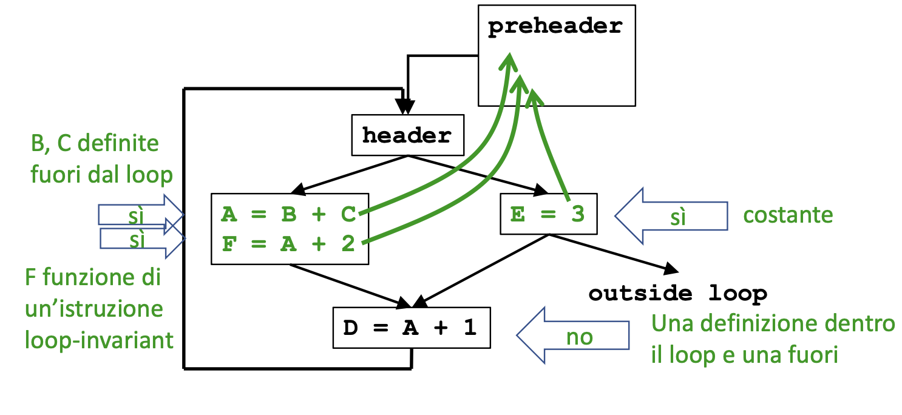

# Teoria Terzo Assignment

# Loop Invariant Code Motion:

Un passo che implementa questa ottimizzazione permette di spostarel e istruzione che non dipendono dal control flow del loop fuori dal loop stesso, in modo da evitare di ricalcolare ridondantemente la stessa istruzione.  
Essendo il grosso della computazione di un programma contenuta nei loop, questo passo permette di fare miglioramenti di performance significativi.

```c++
int a = ...;
int b = ...;
for(int i = 0; i<100;i++){
    f(a*b);
}

// spostiamo 'a*b' fuori dal ciclo per calcolarlo una singola volta.

c = a*b;
for(int i = 0; i<100;i++){
    f(c); // mettiamo c al posto di a*b !
}
```

Per poter implementare questo passo bisogna identifiacare quali istruzioni sono **Loop-Independant** $\rightarrow$ **Istruzioni il cui valore non cambia fintanto che il controllo rimane dentro il loop**.

Esempio:



