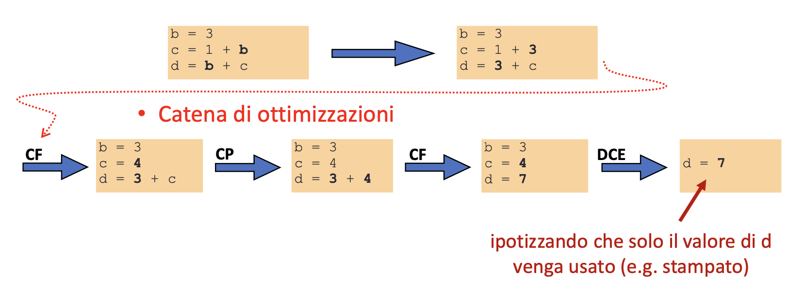
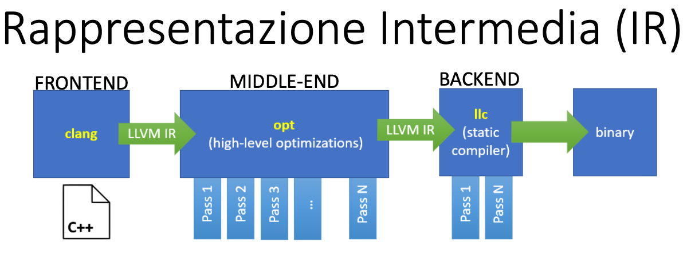
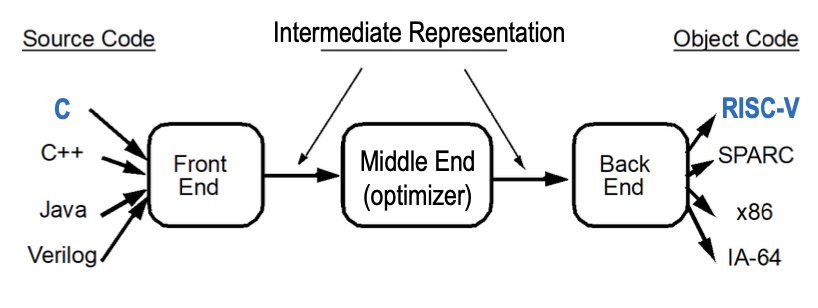

# Anatomia di un Compilatore

## Compilatori:

La funzione più nota di un compilatore è quella di trasformare il codice da un linguaggio ad alto livello in un linguaggio vicino alla macchina come `Assembly RISC-V`.  
Ma la loro funzione **PRINCIPALE** è quella di **OTTIMIZZARE** il codice affinche:

- Esegua il più velocemente possibile
- Occupi meno spazio
- Abbia una migiliore efficienza energetica
- Sfrutti determinate caratteristiche architetturali (es: cache)

Reminder: Intorno ai primi anni 2000 cambia il focus nella produzione di CPU, si passa da un paradigma _singlecore_ che puntava sempre a freq maggiori verso un paradigma **_Multicore_** che punta a un maggiore parallelismo e a una moderazione delle frequenze per singola unità di calcolo.  
_L'incremento di performance_ è dato dalla parallelizzazione, e i compilatori giocano un ruolo fondamentale in questo aspetto.

## Ottimizzazioni:

Ricordiamo le due metriche fondamentali per la misura della performance:

$$
Performance = \frac{1}{Execution\space Time}
$$

$$
Execution \space Time = \frac{Instruction\space Count \space\times\space CPI}{Frequency}
$$

1. $Instruction Count$ è un parametro di **programma** -> migliorabile dal compilatore
2. $CPI$ e $Frequency$ sono parametri **Architetturali** -> migliorabili solo tramite Hardware

# Tipi di Ottimizzazioni.

## Algebraic Semplifications (AS):

Sfrutta proprietà algebriche per semplificare le espressioni:

```c++
-(-i) -> i
b or (true) -> true
```

## Constant Folding (CF):

Valuta ed espande le espressioni costanti a tempo di compilazione:

```c++
c = 1 + 3 --> c = 4
(100 < 0) --> false
```

## Strength Reduction (SR):

Sostituisce operazioni costose con operazioni più leggere
Es: MUL (muticiclo) rimpiazzate da ADD/SHIFT (ciclo singolo)

```c++
y = x * 2  --> y = x + x
y = x * 17 --> y = (x<<4) + x // <<4 equivale a moltiplicare per 16

for (i=0;i<100;i++){
	a[i] = i*100;
}

// --> Diventa:

 t = 0
for(; t<10000; t+=100){
	 *a = t;
	 a = a+ 4;
}
```

## Common Subexpression Elimination (CSE):

Consiste nell'eliminazione di calcoli ridondanti di una stessa espressioni usata in più istruzioni

```c++
y = b * c + 4
z = b * c - 1

// --> Diventa:

x = b * c
y = x + 4
z = x - 1
```

## Dead code Elimination (DCE):

Rimuove codice che non svolge lavoro (variabili assegnate e mai lette/usate)

## Copy Propagation (CP):

Per statement del tipo `x=y` sostituisce gli usi futuri di `x` con `y` se nel frattempo le due variabili non sono cambiate.

```c++
x = y
c = 1 + x
d = y + c

//  --> Diventa:
x = y
c = 1 + y
d = y + c

// E con la DCE diventa:
c = 1 + y
d = y + c
```

Fare la **CP** è _propedeutico_ per poter effettuare la **DCE**, ne concludiamo che in realtà il compilatore fa una <span style="color:red;">Catena di Ottimizzazioni</span> sul codice fino a produrre il codice finale:



## Loop Invariant Code Motion (LICM):

Sposta istruzioni _indipendenti_ dal loop fuori da esso in modo da eseguirle una singola volta, evita calcoli ridondanti.

```c++
while(i<100){
	*p = x/y+i;
	i = i+1;
}
// --> Diventa:

t = x/y
while(i<100){
	*p = t+i;
	i = i+1;
}
```

**note:** I loop sono un target per le ottimizzazioni e sono al centro del paradigma del parallelismo, in quanto un generico programma spende la maggior parte del suo tempo in uno o più cicli.

# Anatomia di un Compilatore: Rappresentazione Intermedia (IR)

Un Compilatore deve svolgere almeno i seguenti due compiti:

1. Analisi del codice sorgente (FE)
2. Sintesi di un programma in linguaggio macchina target (ME e BE)

Per poter operare più liberamente e con maggiore facilità, il compilatore opera su una <span style="color:red;">Rappresentazione Intermedia **(IR)**</span> (prodotta dal FE). La pipeline ha questa struttura:

- Il blocco FE produce la IR
- Il blocco ME trasofrma la IR attraverso vari passi in una versione più ottimizzata della stessa
- Il blocco BE prende la IR ottimizzata e la trasforma nel codice target



## Importanza della IR:

La IR segue fortemente il principio di _ingegneria del software_ spezzando il compilatore in moduli più semplici e inoltre:

- Semplifica il **Retargeting ad una nuova ISA**
- Semplifica il supporto a linguaggi diversi (diversi linguaggi condividono ME e BE)

Il <span style="color:red;">Middle End</span> è l'ottimizzatore ed è la componente più robusta

- Per supportare un nuovo linguaggio basta scrivere un nuovo FE che produca la IR
- Per supportare una nuova ISA basta scrivere un nuovo BE che la supporti


