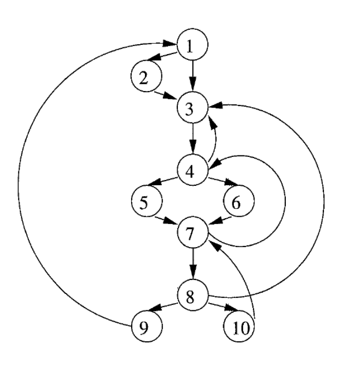
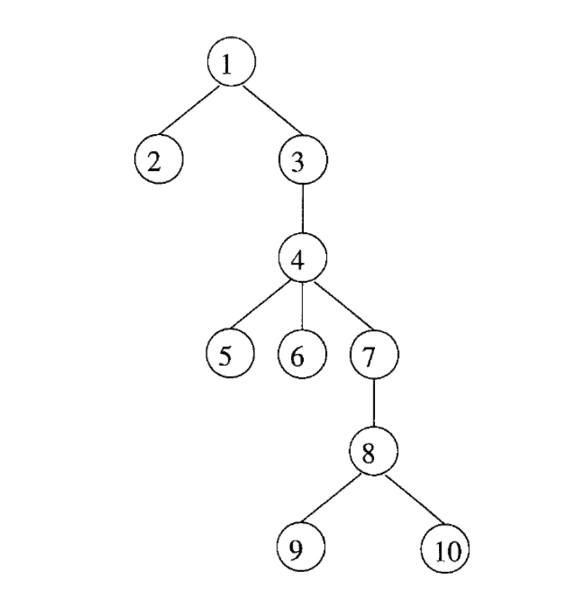
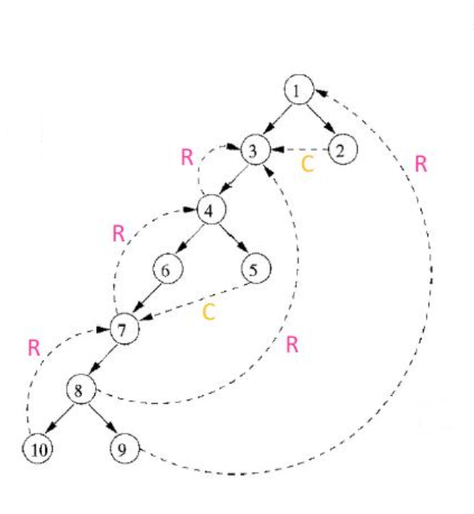

# Loops e UD-DU Chains:

Ricordiamo che i `Loop` sono fondamentali pre i passi di ottimizzazione MiddleEnd in quanto i programmi spendono la maggior parte del loro tempo dentro ad essi.

**Obiettivo:** $\rightarrow$ Definire un Loop in termini di `GraphTheory` (CFG)

## Definizione di Loop:

Singolo ENTRY Point e gli archi devono formare almeno un ciclo

### Formalmente:

- **Dominator:**
  Un nodo $d$ domina un nodo $n$ in un grafo $(d\space dom\space n)$ se **ogni** percorso dall'ENTRY node a $n$ passa per $d$.

- **Dominator Tree:**
  Possiamo rappresentare i _Dominators_ con un albero:
  - $a\rightarrow b$ nel dominator tree se $a$ domina **immediatamente** $b$
  - Il nodo ENTRY è `root` e ogni nodo $d$ domina solamente i suoi discendenti nell'albero.
  - **Immediate Dominator:** L'ultimo **dominator** di $n$ su _qualsiasi_ percorso da ENTRY ad $n$

### CFG:

### Dominator Tree risultante:

# Loop Naturali:

Costrutto di Loop che si verifica naturalemente nel codice sorgente e che può essere **identificato** attraverso le proprietà strutturali del CFG.
Un Loop naturale ha le seguenti caratteristiche:

- **Singolo Entry Point (Header):**
  Ogni loop naturale ha un unico punto di ingresso, chiamato **_Header_**, da cui il controllo inzia ed entra nel loop.
- **Dominanza dell'Header:**
  L'Header del loop domina **tutti** i nodi interni, significa che per ogni cammino nel CFG che passa per un nodo interno del loop, deve per forza passare prima dall'Header.
- **BackEdge:**
  Un BackEdge è un arco che collega un nodo all'interno del loop (o `tail`) con il Header, rappresenta il ritorno del controllo dall'interno del loop al Header.
  Diremo quindi che un BackEdge è un arco la cui testa domina la propria coda: $tail(t)\rightarrow head(h)$ con $h$ che domina $t$

## Identificare i Loop naturali:

1. **Trovare le relazioni di **dominanza** nel CFG:**
   Un nodo $d$ domina un nodo $n$ in un CFG se **ogni** percorso dall'ENTRY node a $n$ passa per $d$.  
   In termini di DFA diremo $\rightarrow out[B]=\{b\}\cup (\cap_{p=pre}(B)out[p])$

2. **Identificare i **BackEdges**:**
   Usiamo una visita **DFS** (_depth first search_) ricorsiva e creiamo un **DFST (Depth First Spanning Tree)** dal quale categorizziamo gli archi seguendo questo modello:

   - **Advancing(A) edges:** archi che vanno dall'antenato al discendente
   - **Retreating(R) edges:** archi che vanno dal disendente all'antenato
   - **Cross(C) edges:** archi che collegano due nodi che non condividono relazioni di parentela (sono 'siblings')

   Una volta fatto ciò eseguiamo un algoritmo tale per cui si controlla ogni RetreatingEdge (R) e lo si marca come BackEdge se:

   - $\forall$ _RetreatingEdge_ $t\rightarrow h\space$, $h$ è nella lista dei dominatori di $t$

3. **Trovare il loop naturale associato al BackEdge:**
   Il loop naturale di un BackEdge è il piu piccolo insieme di nodi che include _head_ e _tail_ del BackEdge.

### Archi Individuati:

**(A):** Archi diretti
**(C):** Archi gialli (C)
**(R):** Archi rosa (R)

### PreHeader:

Le ottimizzazioni sui loop prevedono che venga eseguito del codice prima di entrare nel loop, a questo scopo si crea un blocco _PreHeader_ per ogni loop.

## UD-DU Chains:

- **UD-Chain(Use - Definition):** È il collegamento di una **Definizione** con i suoi **usi**.

- **DU-Chain(Definition - Use):** Collegano un **uso** alla sua definizione $\rightarrow$ dato un uso (es., operando) grazie alla forma SSA è facile trovare la sua _reaching definition_
