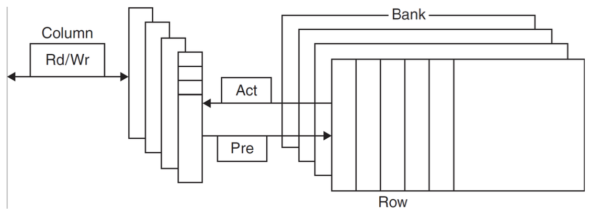

# Ottimizzazioni sulla Memoria:

### Overview:

**Tecnologia DRAM (Dynamic RAM):**
Conserva i dati in binario sotto forma di carica in un condensatore, l'accesso ai dati avviene tramite un singolo transistor, deve essere periodicamente refreshata, pena la perdita di dati (dovuta alla dissipazione della carica).

La RAM è strutturata come una matrice, e gli accessi aidati avvengono su intere righe per compensare la latenza di accesso.  
Le prestazioni della RAM sono migliorate nel tempo, grazie anche a nuove tecniche di trasferimento dati (DDR - double data rate; QDR - quad data rate, dove con data rate si intendono i fronti di clock).

**Tecnologia SRAM(Static RAM):**
È una memoria composta da celle elementari di transistor MOS formando un flip-flop, la memoria SRAM è satbile finchè alimentata e di solito è la memoria che troviamo integrata nelle CPU.
È veloce quasi quanto una CPU, quindi ordini di grandezza sopra la DRAM, ma è anche estremamente costosa e densa, quindi molto limitante e rara.

