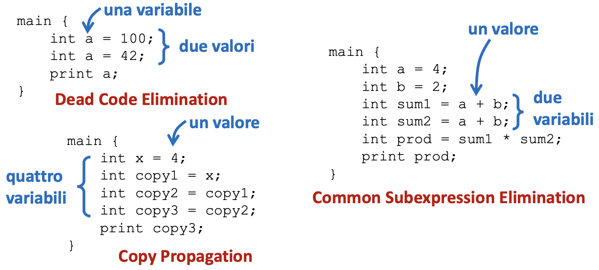
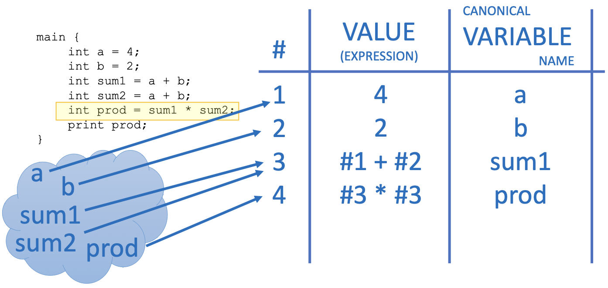

# Ottimizzazione Locale e Local Value Numbering

## Scope dell'Ottimizzazione :

1. Ottimizzazione Locale:
   Lavora entro un singolo BB e non si preoccupa del flusso di controllo

2. Ottimizzazione Globale:
   Lavora all'interno dell'intero CFG (Control Flow Graph)

3. Ottimizzazione interprocedurale:
   Lavora a livello del call graph e lavora sul CFG di più funzioni.

### Dead code Elimination:

Cominciamo col ragionare su **ottimizzazioni locali**, e prendiamo come primo esempio la DeadCode Elimination.  
_Reminder:_ Consideriamo come deadcode le istruzioni prive di **side effects** che definiscono una variabile senza mai usarla.

```c++
main(){
    int a = 4;
    int b = 2;
    int c = 1; // DeadCode - NON ha side effects
    int d = a + b;
    printf(d); // Not deadcode - ha side effects
}
```

Dopo ogni istruzione teniamo traccia delle variabili che sono state definite, ma non usate $\rightarrow$ se vediamo un altro assegnamento della stessa var prima do aver raggounto la fine del blocco sappiamo che l'istruzione precedente che contiene tale var può essere eliminata.

```python
last_def = {}

for instr in BB:
   # check uses
   last_def -= instr.args()

   if instr.dest in last_def:
      delete last_def[instr.dest]
   last_def[instr.dest] = instr
```

Per assicurare un output corretto da questo algoritmo dobbiamo ripeterlo iterativamente fino a raggiungere la convergenza $\rightarrow$ fino a che non ci sono più cambiamenti in un BB.

## Local Value Numbering (LVN) :

Estendiamo il nostro esempio a diverse forme di ottimizzazione locale, cosa hanno in comune i problemi ?



Quelle sopra sono 3 diverse forme di ridondanza e la causa di tale è proprio il fatto che la computazione si focalizzi sulle **variabili** e non sui **valori**. Se ci focalizziamo su quest'ultimo la rimozione di tali ridondanze diventa automatica.

Il **_Local Value Numbering_** è una tecnica che ci permette di approcciare problemi di ottimizzazione con un focus sui **valori** piuttosto che sulle variabili.

Si parte costruendo una struttura dati di tipo tabella che ci aiuta a riscrviere le istruzioni in funzione di valori precedentemente osservati.


Una volta completata la tabella del LVN basterà leggere la tabella per ricostruire le istruzioni del programma ottimzzate.

_attenzione:_ Prestare attenzioni a casi come la proprietà commutativa dell'addizione, che potrebbe rompere l'algoritmo se non canonicalizzato.
