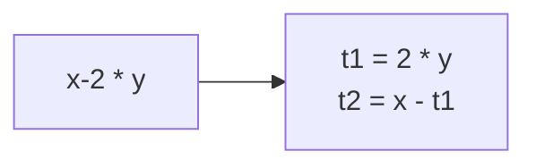
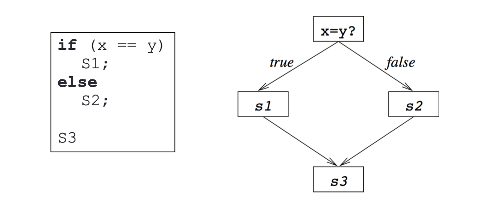

# Rappresentazione Intermedia

Ricordiamo che il middleEnd è costituito da una sequenza di passi, in particolare:

- Passi di **Analisi**:
  - Consumano la `IR`
- Passi di **Trasformazione**:
  - Producono una nuova `IR` ottimizzata

Per analizzare il codice e trasformarlo occorre una IR espressiva in grado di mantenere le informazione importanti e trasmetterle da un passo all'altro.

## Tipi di IR:

In un compilatore possono essere utilizzate diversi tip di `IR`, le principali sono:

1. Abstract Syntax Tree (AST)
2. Directed Acyclic Graphs (DAG)
3. **_3-Address Code (3AC)_**
4. **_Static Single Assignment (SSA)_**
5. **_Control Flow Graphs (CFG)_**
6. Call Graph (CG)
7. Program Dependence Graphs (PDG)

### Scelta della IR:

Occorre scegliere la giusta IR a seconda del compito da svolgere, tenendo a mente i costi legati alla manipolazione dei vari formati.  
Non esiste un unica IR perfetta per tutti gli scopi, tipicamente ne seve più di una o una **_Ibrida_** (CFG con 3-AC).

## Principali IR per il MiddleEnd:

### 3-Address Code (3AC):

Le istruzioni hanno la forma: `x = y <op> z` (un unico operatore e massimo tre operandi).

#### Pro:

- Espressioni complesse vengono spezzate
- Forma compatta e simile all'assembly
- Introdotti valori temporanei per i risultati intermedi
  Contro:
- Il codice in forma 3AC non garantisce certezze relative alla propagazione delle costanti senza **prima** un'analisi dell'eveoluzione temporale dei valori.

### Static Single Assignment (SSA):

Consiste in un evoluzione della 3-AC che semplifica le ottimizzazioni riguardanti la propagazione dei valori costanti.  
Ogni variabile è definita (assegnata) una singola volta, definizioni multiple della stessa variabile sono tradotte in multiple versioni della variabile!

Pro:

- Ogni definizione ha associata una lista di tutti i suoi usi
- Semplifica ulteriormente l'anali e la trasformazione del codice
- Consente di fare la CP immediatamente e porta grandi vantaggi per altre ottimizzazioni.

### Control Flow Graph (CFG):

Necessaria per rappresentare le istruzioni di salto (branch).  
Consiste in una IR in grado di rappresentare il flusso di controllo del programma (_control flow_).

