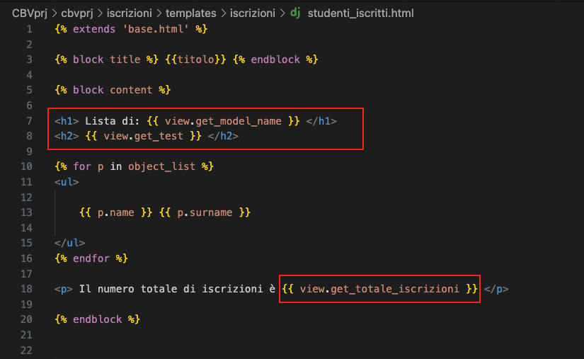

# Django CBV

Abbiamo visto l'intero design pattern di Django:
- Models (DB relazionale tramite ORM + migrations)
- Views (Funzioni che regolano la logica della webapp)
- Templates (per il lato presentazione)


## Policy DRY in Django

Django rimane fedele alla policy DRY (don't repeat yourself), sappiamo che non è sempre comodo sviluppare accesso al DB tramite FV (codice ripetuto).  
Per rispondere a una richiesta del client Django permette anche di usare le **Classi (Class Based View)** con le loro caratteristiche (minimizzazione riutilizzo di codice sfruttando relazioni di ereditarietà e polimorfismo).  

**In breve** $\rightarrow$ In alcune situazione usare una Class Based view è la cosa migliore, in altre conviene invece usare una Function View, sono quindi da intendersi come due meccanismi complementari e non esclusivi.  


### Metodi CRUD sul DB:

I metodi CRUD rappresentano le operazioni base con cui operare sui DB, vedremo come fare tali operazioni tramite CBV.  


## Django Views

Django mette a disposizione delle `View` sotto forma di classi $\rightarrow$ appartengono ai moduli `django.views.generic.*`  

Per sfruttarle quindi si usa una classe che estende dalle View di Django  
Esiste una View per ogni operazione CRUD:
- `ListView`: Elenca le entry delle tabelle
- `UpdateView`: Permette di modificare una entry di una tabella 
- `CreateView`: Permette di creare una entry in una tabella
- `DeleteView`: Rimuove una entry da una tabella
- `DetailView`: Permette di leggere gli attributi di una specifica entry di una tabella

Nella nostra classe CBV si specifica:
- Il **Model** al quale ci si riferisce 
- Il **Template** per renderizzare in HTML/DTL

Nota $\rightarrow$ Nel caso in cui si creino delle CBV risulta necessario specificarlo in urls.py, in quanto di default la funzione `path` si aspetta una funzione e noi stiamo passando una classe!  
Il metodo `as_view()` trasforma questa classe nell'equivalente di una funzione e permette il corretto display della nostra view, la 'funzione' quindi apparirà cosi: `views.NomeClassView.as_view()`


Es: [ProgettoCBV - guardare su git per maggiori dettagli]

```python
#In iscrizione/views.py

from django.views.generic.list import ListView
from .models import *

class ListaStudentiView(ListView):
    model = Studente
    template = 'iscrizioni/lista_studenti.html'
```

Per rendere accessibile la view e far si che risponda alle richieste del client: 

```python
#In root/urls.py
urlpatterns = [
    path('admin/', admin.site.urls),
    path('iscrizioni/', include('iscrizioni.urls')),
]
```

```python
#In iscrizioni/urls.py

from django.urls import path
from . import views

app_name = 'iscrizioni'

urlpatterns = [
    path('listastudenti/', views.ListaStudentiView.as_view(), name='listastudenti')
]
```

### Variabile di contesto: object_list

E il template sarà così strutturato:

```python
#In iscrizioni/templates/iscrizioni


 Dump DB 


 # object_list (!!!!!)
<ul>
    {{ p }}
</ul>



```

Poniamo la nostra attenzione sulla variabile di contesto (ottenuta 'gratis') che si chiama **`object_list`**:  
object_list è una variabile di contesto che viene automaticamente fornita da Django quando si utilizza una classe basata su una delle generiche viste, come `ListView` (il nostro caso specifico in questo esempio), questa variabile contiene un `QuerySet` che rappresenta l'insieme di oggetti del modello specificato nella definizione della classe CBV.  
**In breve** $\rightarrow$ Django esegue una Query sul modello specificato e la mette nella variabile di contesto object_list, questa variabile è accessibile direttamente da template 


## QuerySet:

Un QuerySet in Django è una collezione di oggetti provenienti dal database. È il modo in cui Django rappresenta una query al database. Un QuerySet può essere filtrato, ordinato e manipolato in vari modi per ottenere i dati desiderati.

<br><br>


# Metodi fondamentali delle CBV:

Queti metodi sono ereditati da `View`, il capostipite di tutte le view preconfezionate di Django.  
Consistono in metodi che django utilizza di default, e che quindi possono essere sovrascritti per essere modellati secodo le nostre necessità.  

- `get_queyset` $\rightarrow$ permette di fare operazioni sul queryset indicato dall'attributo model definito dentro la classe.    
- `get_context_data` $\rightarrow$ permette di aggiungere varaibili di contesto utili al template.  


Es: [Elenca studenti iscritti almeno ad un corso]

```python
class ListaInsegnamentiAttivi(ListView):
    model = Insegnamento 
    template_name = 'iscrizioni/insegnamenti_attivi.html'

    #uso dei metodi delle CBV 

    def get_queryset(self):
        return self.model.objects.exclude(studenti__isnull=True)

    def get_context_data(self,**kwargs):
        context = super().get_context_data(**kwargs)
        context['titolo'] = 'Insegnamenti Attivi'
        return context
```


### Contesto Ereditato:

Notiamo che in get_context_data() viene chiamata in primis il metodo dalla classe padre per ottenere il contesto di default, e una volta ottenuto lo modifichiamo inserendo i dati che vogliamo, salvandolo in una variabile locale.  

```python
context = super().get_context_data(**kwargs)
print(context.keys())

#output:
dict_keys(['paginator', 'page_obj', 'is_paginated', 'object_list', 'insegnamento_list', 'view'])
```

Notiamo che nel contesto ereditato abbiamo una key **`view`** che ci permette di acceder a metodi e attributi della nostra classe deerivata da ListView $\rightarrow$ Ci consente di definire ulteriori logiche abitrarie e di chiamarle direttamente dal template.  


Es: [Fare una CVB che elenca studenti e restituisca il numero di iscrizioni totali]  

```python
class ListaStudentiIscritti(ListView):
    model = Studente 
    template_name = 'iscrizioni/studenti_iscritti.html'

    def get_model_name(self):
        return self.model._meta.verbose_name_plural

    def get_test():
        return "Test!"

    def get_context_data(self, **kwargs):
        ctx = super().get_context_data(**kwargs)
        ctx['titolo'] = 'Lista Studenti Iscritti:'
        return ctx
    
    def get_totale_iscrizioni(self):
        count = 0
        for i in Insegnamento.objects.all():
            count += i.studenti.all().count()
        return count
```

Sotto riportato il _template:_  


  
Notiamo come nel template grazie alla variabile `view` possiamo accedere direttamente a metodi definiti nella classe trasparentemente (ricordare che serve avere il contesto e quindi get_context_data() è fondamentale!).  


--- 
---

<br><br><br>

# CreateView:

Per creare nuove entry alle tabelle del nostro DB partiamo ancora una volta da una `View` ereditata dal solito package Django.  
Per creare una CreateView specificheremo:
- **Modello** $\rightarrow$ tramite attributo `model`
- **Template** $\rightarrow$ tramite attributo `template_name`
- **Attributo `__fields__`** $\rightarrow$ indica quali attributi si voglia permettere al client di impostare  
- **Attributo `success_url`** $\rightarrow$ indica l'url di redirezionamento in caso di sccrittura sul DB avvenuta a buon fine.  


### reverse & reverse_lazy:
Queste funzioni eseguono un 'reverse lookup' che permettono di usare un alias del nostro url pattern al posto di specificare un url hardcoded.  
È composto secondo questa struttura `app_name:url_name`.  
**Differnze:**  
- `reverse` $\rightarrow$ si usa nei metodi e nelle funzioni, restituisce una stringa  
- `reverse_lazy` $\rightarrow$ si usa quando si vuole assegnare l'url di redirezione a una variabile o un attributo, restituisce un oggetto.   
Come suggerito dal nome, la versione lazy fa il lookup tardivamente, per compensare al modo in cui python gestisce la direttiva import.  

Confondere i due metodi potrebbe causare errore del tipo reverse not found, quindi fare attenzione al contesto e alla situazione at hand.  


Es: [Creazione di uno studente via client request]

In views.py e urls.py inseriamo:

```python
#in iscrizioni/views.py
class CreateStudenteView(CreateView):
    model = Studente
    template_name = 'iscrizioni/crea_studente.html'
    fields = '__all__'
    success_url = reverse_lazy('iscrizioni:listastudenti')


# in iscrizioni/urls.py 
app_name = 'iscrizioni'
url_patterns = [
    ...,
    path('createstudente/', views.CreateStudenteView.as_view(), name= 'creastudente')
]
```
Il template sarà invece il seguente:

```python

 Crea Studente  


<h1> Crea Studente </h1>

<form method="post"> 
    {{form.as_p}}
    <input type='submit' value='Save'> 
</form>


```

Notiamo che i campi della tabella che sto cercando di modificare sono inclusi in una variabile chiamata `form` $\rightarrow$ che **deve** essere compreso all'intero dei tag HTML `<form> ... </form>`.  
Inoltre bisogna specificare che la sottomissione avviene tramite richiesta `POST` e bisogna includere il CSRF token per questioni di sicurezza.  
 
### La variabile `form`:

la variabile form espicita i campi da noi definiti nel modello, rendendoli accessibili direttamente nel template.  
Formalmente rappresenta un Django Form baato sul modello che vogliamo manipolare.  


Similmente a quanto visto per il passaggio di parametri tramite URL, nel caso di request di tipo `POST`avremo i parametri nel `request.POST['param_name']`.  

---
---

<br><br><br>


# Detail View:

La **DetailView** ci permette di fare **query** ad una tabella partendo dalla sua PrimaryKey (pk), ciò ci permette di avere un contesto in cui esiste la variabile 'object', attraverso la quale andremo a scegliere quali campi visualizzare e come all'intero del template.   
Come nei precedenti  casi consiste in una classe base di Django importabile (`django.views.generic.detail`).  

Per fare una DetailView specifichiam:
- Il modello $\rightarrow$ nella cbv
- Il template $\rightarrow$ nella cbv
- La PrimaryKey $\rightarrow$ direttamente nell'url  

```python
#In iscrizione/views.py

class DetailInsegnamentoView(DetailView):
    model = Insegnamento
    template_name = 'iscrizioni/insegnamento.html'

#In iscrizioni/urls.py

path('insegnamento/<pk>/', views.DetailInsegnamentoView.as_view(), name='insegnamento')
```

---
---

<br><br><br>

# UpdateView

**Accessibilità** simili a DetailView, la PK per ottenere una entry di una tabella va passata in egual modo, ossia tramite url.  
**Modifica** simile a CreateView, stesso metodo per restituire un form lato template e sottomissione valori modificati tramite richiesta POST protetto con CSRF token.  

Attributi richieste:
- model
- template_name
- success_url
- fields 

```python
class UpdateInsegnamentoView(UpdateView):
    model = Insegnamento 
    template_name = 'iscrizioni/edit_insegnamento.html'
    fields = '__all__'

    def get_success_url(self):
        pk = self.get_context_data()['object'].pk
        return reverse('iscrizioni:insegnamento',kwargs={'pk':pk})
```

### Spiegazione del flusso di update:

1. Utente fa una richiesta GET alla pagina di modifica specificando la PK tramite l'url
    - La `UpdateView` carica l'oggetto dal database usando il metodo `get_object` ereditato da `SingleObjectMixin`
2. L'oggetto viene incluso nel dizionario di contesto con chiave `object`, il tutto gestito automaticamente da `UpdateView`
3. Il form viene reso nel template 
4. Quando il client manda il form viene mandata una richiesta POST per aggiornare l'oggetto nel database e il CSRF token
5. Per determinare **l'url di successo** per il redirect abbiamo bisogno della pk dell'insegnamento che abbiamo modificato:
    - carichiamo con `self.get_context_data()` il contesto **aggiornato**
    - otteniamo la pk accedendo all'elemento tramite la key `'object'`
    - la mandiamo tra i parametri di reverse ( metodo per reverselookkup)


---
---

<br><br><br>

# DeleteView

Meccanismo simile a `CreateView`e `UpdateView` per ottnere la primary key (pk) dell'elemento da cancellare, inoltre occorre avere un form di conferma all'intero del template associato alla View.  

Essendo le due entità nel nostro caso (Studente e Insegnamento), si può creare una classe per cancellare un entità generica e gestire i casi a seconda del modello che si voglia cancellare.  

Attributi richiesti:
- model 
- template_name 
- success_url 

### Workflow di cancellazione:

1. Richiesta GET client side:
    - L'utente accede alla pagia di coancellazione tramite URL specificando la `pk` dell'oggetto da cancellare.  
    - Django carica l'oggetto e lo include nel contesto con la chiave `object`  
    - Viene fatto il rendering del template con il contesto 
2. Richiesta POST client side:  
    - L'utente conferma la cancellazione inviando il form
    - Django esegue la `delete` dell'oggetto specificato, rimuovendolo dal DB
    - il metodo `get_success_url` determina l'URL di reindirizzamento
    - l'utente viene reindirizzato a tale pagina di successo

**Note:** Il vero responsabile della cancellazione è la classe che eredita da `DeleteView`, dopo aver verificato la validità della richiesta POST, la classe chiama 'invisibilmente' il metodo `delete` e lo rimuove.  

---
---

<br><br><br>


# Combinazioni di Views con input arbitrari passati tramite url

Es. [ricerca studenti per cognome]

```python
#In insegnamenti/urls.py

path('studente/<str:surname>/', view.ListStudenteBySurname.as_view(), name='studente')

#In insegnamenti/views.py

class ListStudenteBySurname(ListaStudentiView):
    #da ListaStudentiView ereditiamo il model e il template_name

    #si fa un override del metodo per modellarlo secondo le nostre esigenze
    def get_queryset(self):
        arg = self.kwargs['surname'] # leggiamo  l'argomento passato 
        qs = self.model.objects.filter(surname__iexact=arg)
        return qs
```
**Nota (IMPORTANTE):** Nell'esempio sopra notiamo una principale differenza tra FBV e CBV, nelle CBV i parametri passati tramite URL risiedono nel dizionario `self.kwargs`, nell'esempio sopra notiamo infatti come si faccia la fetch del valore 'surname' scelto dal client chimando il dizionario conl'opportuna key.  

---

<br>

### Es complesso: 
```
Creare un URL che porti a una pagina tramite "/cercastudente" in cui compare un form in cui l'utente può fare una ricerca per studente tramite nome E/O cognome. Al click del pulsante "ricerca" i dati vanno spediti tramite metodo POST.  
Si operi una redirezione su una ListView degli studenti che soddisfano i criteri di ricerca e visualizzare anche i corsi a cui sono iscritti.  
```


### Soluzione:

```python
def cerca_studenti(request):
    if request.method == 'GET':
        return render(request, template_name='iscrizioni/cerca_studenti.html')
    else:
        # validazione parametro name
        if len(request.POST['name']) < 1:
            nome = 'null'
        else: nome = request.POST['name']

        # validazione parametro surname 
        if len(request.POST['surname']) < 1:
            cognome = 'null'
        else: cognome = request.POST['surname']

        return redirect('iscrizioni:studentecercato', name=nome, surname=cognome)


class ListStudentByNameAndSurname(ListView):
    model = Studente 
    template_name = 'iscrizioni/listastudenteinsegnamento.html'

    def get_queryset(self):

        # fetch nome 
        try:
            arg = self.kwargs['name']
            qs_name = self.model.objects.filter(name__iexact=arg)
        except:
            qs_name = self.model.objects.none()

        # fetch cognome
        try:
            arg = self.kwargs['surname']
            qs_surname = self.model.objects.filter(surname__iexact=arg)
        except:
            qs_surname = self.model.objects.none()
        
        return (qs_name | qs_surname)


    def get_context_data(self, **kwargs):
        context = super().get_context_data(**kwargs)
        context['titolo'] = 'Studenti e loro insegnamenti'
        ls = set()

        for s in self.get_queryset():
            for i in Insegnamento.objects.all():
                if s in i.studenti.all():
                    ls.add(i)
        context['set_ins'] = ls
        return context
```

Per guardare i template -> git 


### Spiegazione: 


