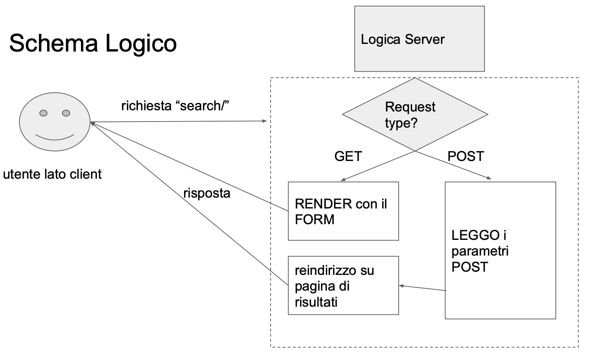

# Django Forms

Generalmente parlando non possiamo affidarci alla variabile `form` data in regalo da Django nelle CVB di base per esplicitare condizioni e vincoli aggiuntivi per entry nella mia tabella.  

Per sopperire a questa evenienza Django permette di definire tramite classi python un Form personale customizzato.  


### Forms in Django 

Per creare un Form personalizzato basta estendere la classe base `forms` raggiungibile da `from django import forms` e definire due cose importanti:
1. Campi editabili personalizzati 
2. Aggiungere condizioni di validazione aggiuntiva a tali campi  

Essendo una  classe segue le regole delle CBV in ottica di riutilizzo ed estendibilità.  


---

<br>

**Es didattico $\rightarrow$** nel git in django/mysite_frameCBV/...  

Creiamo i modelli `Question` e `Choice` e popoliamo il DB

### Prime CBV:

1. Dalla home di polls/ una ListView deve visualizzare le 20 più recenti domande
2. da polls/pk/detail una DetailView visualizza le info sulla domanda  

```python
class IndexViewList(ListView):
    model = Question 
    template_name = 'polls/index.html'

    def get_queryset(self):
        return self.model.objects.order_by('-pub_date')[:20] #slice alle prime 20

class DetailQuestionView(DetailView):
    model = Question 
    template_name = 'polls/detail.html'

# Relativi URLS:

ulrpatterns = [
    path('',IndexViewList.as_view(), name = 'index'),
    path('<int:pk>/detail/', DetailQuestion.as_view(), name = 'datail')
]
```

**Attenzione: Uso di FK tra modelli**  

Ricordiamo che il modello Choice definisce una FK a Question in questo modo: `question = models.ForeignKey(Question, on_delete=models.CASCADE, related_name="choices")`.  
Questo crea un attributo invisibile in Question chiamato `choices` (definito nella firma di question da `related_name`) tramite il quale possiamo accedere alle Choice legate (tramite pk) a una specifica Question.  

Nel template infatti, nonostante passiamo come modello una Question, siamo in grado di visualizzare le Choice legate ad esso in questo modo:

```python
<h1>{{ object.question_text }}</h1> 
<ul>
 # Qui viene usato il related_name !!
    <li>{{ choice.choice_text }} {{ choice.votes}} votes </li> 

</ul>

```

Per il resto fino a qui nulla di nuovo.  


## Form di ricerca: 

Vogliamo fare una ricerca per argomento per ottenere le domande che hanno a che fare con l'argomento specificato, per fare ciò ci servirà: 
- Una Search String per la **Keyword**
- Specificare dove cercarla (se tra `Question` o tra `Choice`)  

### Implementiamo il form di ricerca: 

Si crea un file apposito che raccoglie i `Form` personalizzati della mia applicazione $\rightarrow$ `appname/forms.py`  
Deve estendere la classe `django.forms.Form` e nei suoi attributi andremo a definire i campi editabili che il client userà dal browser.  
Sono presenti tanti campi editabili per popolare un form, la lista intera si trova sulla documentazione di [django](https://docs.djangoproject.com/en/4.0/ref/forms/fields/), nel nostro caso useremo un:  
- **CharField** per cercare la keyword 
- **ChoiceField** per scegliere dove cercare
 


```python
#polls/forms.py

from django import forms

class SearchForm(forms.Form):
    CHOICE_LIST = [('Questions', 'Search in Questions'),
    ('Choices', 'Search in Choices')]

    search_string = forms.CharField(label='Search String', max_length=100,
    min_length=3, required=True)

    search_where = forms.ChoiceField(label='Search Where?', required=True,
    choices=CHOICE_LIST)
```

Creiamo una FunctionView per arrivare a tale form, per raggiungerla per la prima volta l'utente andrà su `search/` tramite richiesta GET, assumendo invece che i dati rimepiti dal cliente tramite il form vengano spediti con una request POST possiamo reindirizzare sul secondo URL (gestito da una CBV) mandando i parametri corretti:

```python
# in polls/urls.py

path('search/', search, name='search'),
path('searchresult/<str:sstring>/<str:where>/', SearchResultList.as_view(), name='sarchresult')

```

La Function View sarà cosi strutturata:

```python
def search(request):
    
    if request.method == 'POST':
        form = SearchForm(request.POST)
        if form.is_valid():
            sstring = form.cleaned_data.get('search_string')
            where = form.cleaned_data.get('search_where')
            return redirect('polls:searchresults', sstring, where)
    else:
        form = SearchForm()
    
    return render(request, template_name='polls/searchpage.html', context={'form': form})
```

  
Il template sarà cosi definito:  

```python
(...)

<h1>Search Page</h1>
<form action="" method="POST"> 
    {{form.as_p}}
<input type="submit" value="Search"> </form>

```

### Osservazioni Importanti:

- Se la richiesta è GET semplicemente si inizializza senza parametri un oggetto SearchForm da passaer al template come variabile di contesto.  
- La variabile `form` è nostra (non regalata da django), segue comunque le regole di formattazione che abbiamo precedentemente definito 
- Per ogni elemento creato nel `form` personalizzato:
    - È associata una label che verrà creata come elemento HTML aggiuntivo
    - Appare in `forms.py` come una variabile, tale variabile riempie il campo `name` del rispettivo elemento HTML, ottenibile poi tramite POST
    - Hanno ulteriori parametri (max_length) che vengono tradotti in attributi di elementi HTML.  
- Quando raggiungiamo la function view cerca tramite request POST notiamo che: 
    - Nel dizionario request.POST abbiamo tutti i dati che ci servono **MA** invece di accedere ai dati, creiamo un `SearchForm` e passiamo come parametro il dizionario request.POST.  
    - Il sistema legge i dati passati e li valida in modo da mettere a disposizioni istruzioni come `form.cleaned_data.get('...')` che ci permettono di avere un input sanitizzato.  
- Cona la `redirect` siamo in grado di dirottare i campi letti verso un url a nostra scelta, in questo caso viene mandato con due parametri verso l'url che ha la CBV `SearchResultList` collegata, leggendo i parametri questa CBV farà la query adeguata per ottenere l'output  desiderato.   




## Integrazione tra Models e Forms

Possiamo associare un `Form` ad una particolare tabella, se essa è stata definita come oggetto tra i nostri modelli, permettendoci di:
1. Creare campi di scelta in funzione di `queryset`
2. Creare dei `ModelForm`, ossia Form legati a deli modelli (a cui possiamo passare widget per il rendering e sulle regole di validazione)  


### ModelChoiceField

```
Si faccia una view che permetta di votare e quindi di ripondere a una Question
```

La Question è selezionata tramite `pk`, il voto della domanda avviene tramite `Form` che deve avere un campo a scelta multipla in cui l'utente seleziona una delle quattro possibili risposte.  
Al submit del form il sistema redireziona in una DetailView la quale:
- Informa se l'utente ha risposto correttamente o meno 
- Incrementa il campo `votes` della risposta

### Il Form:

```python
# in polls/forms.py

class VoteForm(form.Form):
    answer = forms.ModelChoiceField(queryset=None, required=True, label='Select your answer!')

    def __init__(self,pk,*args,**kwargs):
        super().__init__(*args,**kwargs)
        q = get_object_or_404(Question,pk=pk)
        self.field['answer'].queryset = q.choices.all()
```

Osseriviamo che il campo `answer` somiglia al `ChoiceField` visto in precedenza, con la differenza che questa volta è legato ad un modello, difatti le possibili scelte sono prese da un queryset ossia da un **modello**, alla sua dichiarazione tale campo è a None.  
Per riempire l'attributo abbiamo fatto `Override` del metodo \_\_init\_\_ il quale prende in ingresso la `pk` della Question a cui vogliamo rispondere.  


### La View di voto:

```python
def vote(request,pk):
    if requested.method == 'POST':
        form = VoteForm(data=request.POST, pk=pk)
        if form.is_valid():
            answer = form.cleaned_data.get('answer')
            return redirect('polls:votecasted', pk, answer.choice_text)
    else:
        q = get_object_or_404(Question,pk=pk)
        form = VoteForm(pk=pk)
        return render(request,
                template_name='polls/vote.html',
                context={'form':form,'question':q})
```

### Osservazioni:
Rispetto all'esercizio precedente abbiamo una sostanziale differenza, ossia il modo in cui abbiamo instanziato `VoteForm` nei due casi (GET e POST).  
In entrambi i casi abbiamo specificato la `pk` che serve per riempire le scelte del nostro `ModelChoiceField`.  
Per il resto facciamo la solita redirezione verso una CBV di tipo `DetailView` che userà il parametro `pk`per mettere nella variabile di contesto `object` la Question corrispondente (su questa View faremo override di `get_context_data` per aggiungere le informazioni richieste).  


```python
class VoteCastedDetail(DetailView):
    model = Question
    template_name = 'polls/votecasted.html'

    def get_contextdata(self,**kwargs):
        ctx = super().get_contextdata(**kwargs)
        answer = self.request.resolver_match.kwargs['answer']
        ctx['answer'] = answer
        correct = ctx['object'].choices.all().get(is_correct=True)
        if answer in correct.choice_text:
            ctx['message'] = 'Rigth Answer'
        else:
            ctx['message'] = 'Wrong Answer! The right answer was ' + \
                str(correct.choice_text)
        
        try:
            c = ctx['object'].choices.all().get(choice_text=answer)
            c.votes += 1
            c.save()
        except Exception as E:
            print("impossible to update vote values" + str(E))
        
        return ctx
```