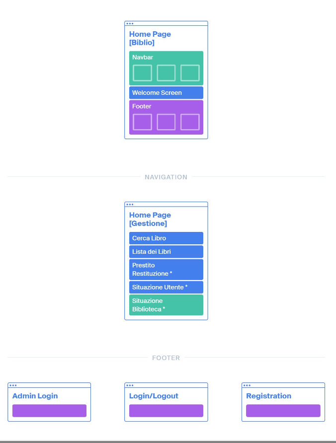

# Django Users and Auth

Ricordiamo che tramite Form, FBV e CBV gli utenti possono interagire ed aggiornare il DB della nostra webapp, sorge qundi la necessità di gestire gli utenti e i permessi, per questi motivi Django disponde degli strumenti `auth`.  
In `settings.py` troveremo in `INSTALLED_APPS` e `MIDDLEWARE` i vari default per questa situazione (django.contrib.auth).  

Quando si fa una migrazione, viene creata sempre una tabella `User` dentro il DB, il primo user a popolare la tabella sarà Admin.  

## Accedere agli utenti:

Per accedere agli utenti $\rightarrow$ attributo della `request`

```python
def function_view(request,...):
    request.user.username/etc....

def CBView([Create/List/Update/Delete]View):
    self.request.user.(...)

# da template:
user.<attrib>
```

### request.user
- Restituisce `Anonymous` nel caso l'utente non sia loggato 
- Restituisce l'utente con i suoi attributi se loggato 
- Restituisce `Admin` se facciamo login da domain:8000/admin/

## Creazione di Utenti

Se vogliamo creare un utente staff lo possiamo fare dal pannello admin.   
Nel caso volessimo lasciare la possibilità ai client di registrarsi dobbiamo poter creare utenti da **FBV** e **CBV**  

La tabella User è fondamentale in quanto ci permette di subordinare l'accesso alle risorse della nostra app a logiche legate ai permessi.  

## Biblio3 - Auth 
es: git -> django/biblio3auth/... + bootstrap 

```
La biblioteca è composta da un certo numero di Libri associato a N copie, ogni copia può esser in prestito o meno. Il prestito è operato da un utente registrato
```

## Funzionalità specifiche:
1. Chiunque può accedere alla biblioteca 
    - Visualizzare quanti libri ci sono e sapere se sono disponibili 
    - Fare una ricerca per titolo o per autore 
    - Registrarsi come lettore (user)
2. Il lettore (user registrato) può interagire con le copie
    - Prestito
    - Restituzione 
    - Situazione prestiti 
3. Il bibliotecario (staff) può interagire con i libri e copie 
    - Aggiunta libro alla biblioteca 
    - Aggiunta di una copia di un libro 
    - Visualizzare situazione biblioteca 
    - Prestito/restituzione
4. L'Admin
    - Registrare i bibliotecari 
    - Dispone di tutte le funzione dei bibliotecari 
    - Ha pieno controllo su **tutto**

**Schema di navigazioe:**  
 

Creiamo i modelli, applichiamo le migrazioni e creiamo le prime views e templates per la home e e la ricerca (per dettagli consultare il git).  

Tornando al punto **1** delle funzionalità specifiche creiamo la logica per la registrazione di un utente come Lettore.  

## Registrazione Utente 

In Django possiamo sfruttare un sistema di **registrazione/login/logout** quasi completamente implementato (assume solamente che l'utente si possa registrare sulla tabella User, la quale è accessibile a tutte le app del progetto).  

```python

from django.contrib.auth import view as auth_views

urlpatterns = [
    (...)
    path('register/', UserCreateView.as_view(), name='register'),
    path('login/', auth_views.LoginView.as_view(), name='login'),
    path('logout/', auth_views.LogouView.as_view(), name='logout')
]
```

La CBV in `views.py` sarà così definita:

```python
class UserCreateView(createView):
    form_class = UserCreationForm
    template_name = 'user_create.html'
    success_url = reverse_lazy('login')
```
Consiste in una CreateView che aggiunge una entry alla tabella User, useremo per questa operazione un `ModelForm` particolare dato gratis da Django chiamato `UserCreateForm`.  

**Attenzione:** Lo UserCreateForm non usa il crispy helper, dovremo farlo noi manualmente, inoltre dovremo inserire manualmente anche l'elemento input/submit e chiudere il form, che apparirà così:

```python

<form method="post"> 

    {{form | crispy}}
    <input type="submit" class="btn btn-success" value="Registrati ora!">
    </form>


```

Di default il sistema non porta a termine la registrazione completa, difatti in seguito alla registrazione l'utente viene redirezionato ad un URL che deve essere specificato nella variabile `success_url` verso una view di Login.  

## Login (LoginView)

È una view la cui logica è completamente costruita e data in regalo da Django, quindi non dovremo aggiungere nulla a `views.py`, dovremo solo fornire il template giusto!   

**Osservazioni:** Non abbiamo scritto la view e quindi non abbiamo specificato il template e neanche il success URL!  
**MA** siccome è tutto fornito da Django potremo farlo (e dovremo) nel seguente modo:  
- Il Template deve chiamarsi `login.html` e deve trovarsi in `root/templates/registration`  
- Il success url deve essere **hardcodato** in una variabile chiamata `LOGIN_REDIRECT_URL` in `settings.py`  
    - In settigs.py inseriamo:
    ```python
    LOGIN_REDIRECT_URL = '/?login=ok' #redirezione a home con parametro GET
    ```
    Questo ci sonsente di distinguere quando l'utente approda sulla homepage da utente registrato oppure come anonymous.  
    - Nel template della home avremo quindi:

    ```html
    
    
    (...)

    <script>
        $(document).ready(function)(){
            $('#modal').modal('show');
        });
    </script>
    ```

## LogOut (LogoutView)

Anche in questo caso la view di logout è interamente costruita e fornita da Django (sempre dal modulo django.contrib.auth), quindi non dovremo aggiungere nulla al nostro `views.py`.  
Dovremo quindi in questo caso dare noi il **Template** che dovrà essere anch'esso nello stesso folder di quello di login e con specifico nome `logged_out.html` (Il template è un semplice messaggio di greet).  


---

<br>

## Interazione con le copie (Protezione view con permessi)

Siamo ora al punto **2** delle Funzionalità Specifiche, ossia alla gestione dell'interazione dell'utente con le copie della biblioteca, si presuppone che l'utente sia **registrato e loggato**, queste funzionalità non devono essere accessibili da Anonymous.  


Vogliamo quindi nascondere certe risorse a utenti non registrati o che non hanno i permessi per visualizzarle, per fare ciò nel modo più comodo sfruttiamo i decoratori che mette a disposizione Django.  
Dobbiamo fae un operazione di preprocessing su ogni view da proteggere e sapendo che i decoratori in py restituiscono una funzione pre/post processata andremo a usare $\rightarrow$ `django auth decorators`  

```python
from django.contrib.auth.decorators import login_required

@logim_required
def my_situation(request):
    user = get_object_or_404(User, pk=request.user.pk)
    copie = user.copie_in_prestito.all()
    ctx = {'listacopie': copie}
    return render(request, 'gestione/sitaution.hmtl', ctx)
```

In questo modo solo un utenet registratò potrà visualizzare questa pagina! Cosa succede se l'utente non è loggato?  

Viene redirezionato ad un url specificato in `settings.py`, nella variabile chiamata `LOGIN_URL='/login/?auth=notok'` $\rightarrow$ Passiamo anche il parametro tramite richiesta GET che ci permette di distinguere quando l'utente approda alla pagina di login per scelta o perch ha tentato di accedere ad una pagina protetta dal decoratore.  


### Implementare una function view che gestisca il prestito di una copia, direttamente dall'app gestione.  

- raggiungibile da: `path('prestito/<pk>/', prestito, name='prestito')`  
- protetta da decoratori di login 
- raggiungibile dopo la ricerca di un libro 
- libro deve essere prestabile (almeno una copia non in  prestito)
- la tabella del DB deve aggiornarsi coerentemente

### LogIn required per le CBV:
Abbiamo visto come proteggere con i decoratori le nostre FunctionView, per farlo con le CBV usiamo il meccanismo di protezione offerto da Django chiamato `access mixin`, che si basa sul concetto di ereditarietà multipla **(fare molta attenzione all'ordine di ereditarietà!!)**    
La classe da cui eredita sarà `LoginRequiredMixin` ed è la responsabile di aggiungere il decoratore `@loginrequired` ai metodi ereditati da dalla view che vogliamo creare (es: DetailView, ListView, ...)  

Funziona in questo modo (applicato allo specifico esercizio):

```python
# in gestione/urls.py 
path('restituzione/<pk>', RestituisciView.as_view(), name='restituzione')

# in gestione/views.py
from django.contrib.auth.mixins import LoginRequiredMixin

class RestituisciView(LoginRequiredMixin, DetailView):
    model = Copia 
    template_name = 'gestione/restituzioni.html'
    errore = "NO_ERRORS"

    def get_context_data(self, **kwargs):
        ctx = super().get_context_data(**kwargs)
        c = ctx['object']

        if c.data_prestito != None:
            if c.utente.pk != self.request.user.pk:
                self.errore = "Non puoi restituire un libro non tuo!"
        else:
            self.errore = 'Libro attualmente non in prestito'
        
        if self.errore == 'No_ERRORS':
            try:
                c.data_prestito = None
                c.utente = None
                c.save()
            except Exception as E:
                print("Errore " + str(E))
                self.errore = "Errore nell'operazione di restituzione"
        return ctx
```

--- 

<br>

## Creazione di gruppi (per gestire permessi comodamente)  

Dalle specifiche di questo progetto (e molti progetti) si evince che abbiamo bisogno di **diverse tipologie di utenti**  

- registrati:  
    - admin, bibliotecari, lettori (utenti normali)

- non registrari
    - anonymous

### Gruppo Django:  
Un gruppo in Django è un **raccoglitore di permessi**, gli users della nostra app possono essere associati a nessuno, uno o più gruppi.  

I permessi appaiono come **regole (o vincoli)**, in quanto i permessi e gruppi sono da specificare e creare in fase di progettazione possiamo comodamente crearli dal portale Admin.  

Non ha invece senso spostare gli Users singolarmente e manualmente nei loro opportuni gruppi, bisogna farlo in modo automatico, in particolare con la `createUsersView`.  

```python
# In root/views.py
class UserCreateView(CreateView):
    #form_class = UserCreationForm -> precedente creazione utente generico
    form_class = CreaUtenteLettore # crea utente appartenene a un gruppo 
    template_name = 'user_create.html'
    success_url = reverse_lazy('login')

# In root/forms.py 
from django.contrib.auth.models import Group # <- fondamentale
from django.contrib.auth.froms import UserCreationForm

class CreaUtenteLettore(UserCreationForm):
    def save(self, commit=True):
        user = super().save(commit)
        g = Group.objects.get(name='Lettori')
        g.user_set.add(user)
        return user
```

### Spiegazione:

Ricordiamo che Django mette a disposizione Form pronti per la creazione di un utente, quando però vogliamo assegnare un utente a un gruppo diventa opportuno definire un Form personalizzato per gestire questa casistica che però erediti da quelli predefiniti di Django.  

Il form CreaUtenteLettore eredità da UserCreationForm che gestisce in automatico la creazione e validazione di input al momento della creazione dell'utente, a fare ciò in particolare è il metodo `save()`.  
Per fare il nostro Form che eredita da UserCreationForm basterà quindi fare un `override` di questo metodo, e specificare tramite il parametro `commit=T|F` se vogliamo salvarlo nel DB o meno.  

Nel nostro form chiamiamo il metodo padre con `super().save(commit)` e lo associamo alla variabile `user` per avere un riferimento all'user appena creato, una volta che abbiamo il nostro riferimento all'utente possiamo comodamente aggiungerlo a un gruppo una volta ottenuto il riferimento al gruppo in questione $\rightarrow$ `g.user_set.add(user)` e una volta finito restituiamo l'user con la return (notare che la funzione save() restituisce un User, per questo motivo possiamo prendere il riferimento all'user che stiamo creando dal form chiamando il metodo padre!) 

**Creazione di User Bibliotecario** $\rightarrow$ banalmente faremo la stessa cosa con un Form dedicato che aggiunge l'utente creato al gruppo `Bibliotecari`  
Logicamente però solo un utente privilegiato può iscrivere un bibliotecario, quindi per assicurarci di ciò e proteggere la nostra CreateView useremo da Django il mixin `permission_required` che ci permette di specificare la condizione e i permessi necessari!  
Dovremo importare `PermissionRequiredMixin`:  
```python
from django.contrib.auth.mixins import PermissionRequiredMixin

class BiblioCreateView(PermissionRequiredMixin, UserCreateView):
    permission_required = 'is_staff'
    form_class = CreaUtenteBibliotecario #qui stiamo facendo override dell'attributo form_class di UserCreateView !
    # possibile grazie all'ereditarietà: classe padre UserCreateView
```

## Protezione di Views con criterio di appartenenza a Gruppi: 

Ora che abbiamo diversi gruppi di utenti possiamo usare dei decoratori per controllare che l'utente che richiede una certa funzionalità abbia l'autorizzazione necessaria.  


