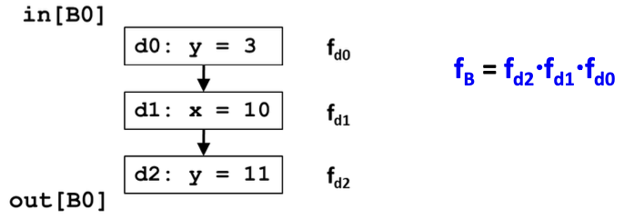

# DataFlow Analysis:

# Table of Contents:

1. [Data Flow Analysis](#data-flow-analysis-dfa)
2. [Reaching Definitions](#reaching-definitions)
3. [Liveness Analysis](#liveness-analysis)
4. [Available Expressions](#available-expressions)

# Tipi di Analisi:

Esistono diversi tipi di analisi:

### Analisi Locale (es: Local Value Numbering):

Analizza l'effetto di ogni **istruzione** e compone l'effetto delle istruzioni per derivare informazione dall'inizio del _BasicBlock_ ad ogni istruzione.

### Analisi Globale: $\rightarrow$ Data Flow Analysis

1. Analizza l'effetto di ogni _BasicBlock_
2. Compone l'effetto dei vari _BasicBlock_ per derivare informazione ai confini (IN e OUT) dei _BasicBLock_ stessi.

**Note:** Dai confini dei _BasicBlocks_ si possono applicare tecniche (descritte sotto) per generare informazioni sulle istruzioni.

# Data Flow Analysis (DFA)

La DFA permette per ogni variabile `x` di un programm di derivare informazioni come: valore di `x` ? ; quale definizione definisce `x`; quale definizione di `x` è ancora valida? ...

## Effetti di: { Istruzioni e Basic Block }:

### Effetti Istruzioni:

Un istruzione può avere i seguenti effetti:
es: `a = b + c `

- **Usa** delle variabili $\rightarrow$ `b,c` (Uses)
- **Uccide** una precedente definizione $\rightarrow$ `a` (Kills)
- **Definisce** una variabile $\rightarrow$ `a` (Defines)

### Effetti Basic Blocks:

Facendo una composizione degli effetti delle istruzioni che costituiscono un BB si derivano gli effetti del Basic Block stesso.

- **Locally Exposed Use:** Consiste nell'uso di una variabile che non è stata precedentemente definita nel BB stesso.
- **Kills:** Ogni nuova definizione di una variabile nel BB uccide tutte le precedenti definizioni della stessa variabile che raggiungono tale BB.
- **Locally Available Definition:** Una definizione localmente disponibile consiste **nell'ultima** definizione di una variabile nel BB.

ES:

```c++
t1 = r1+r2;      // Usi localmente esposti: r1, r2
r2 = t1;         // Definzioni uccise: r2
t2 = r2+r1;
r1 = t2;         // Definzioni uccise: r1
t3 = r1*r1;
r2 = t3;         // Definizione localmente disponibili
if r2>100 goto L1;
```

<br>

# Reaching Definitions:

Per comprendere meglio questo concetto definiamo le seguenti **regole**:

- Ogni istruzione di _assegnamento_ è una **Definzione**
- Una Definizione $d$ raggiunge (reaches) un punto $p$ se **esiste** un percorso $d \rightarrow p$ tale per cui $d$ **non è uccisa** (killed) lungo quel percoso.

### Definzione del problema:

Per ogni punto del programma determinare se ogni definizione nel programma raggiunge quel punto $\rightarrow$ usiamo un _bit vector_ per ogni istruzione dove len(vector) == numero di definizioni nel programma.

_Es:_


```python \\\\\\
-d1 raggiunge d5 ? # SI
    d1 definisce x e fino a d5 x non viene ridefinita
-d0 raggiunge d5 ? # NO
    d0 definisce y che però viene ridefinita in d2! d2 uccide d0
-d1 raggiunge la fine programma ? # NO
    indipendentemente dal percorso d3 e d5 uccidono d1
-d2 raggiunge la fine programma ? # SI
    d2 viene uccisa da d4 nel BB2, ma passando da B3 non viene uccisa,
    quindi diremo che raggiunge la fine in quanto esiste almeno
    un percorso da d2 a fine lungo il quale d2 non viene ucciso.
```

## Flow Graph:


Per fare uno schema della Data Flow Analysis usiamo un **Flow Graph:**

- Aggiungiamo un entry BB e un exit BB (single entry ed exit point)
- Definiamo un insieme di **equazioni** per tutti i basic blocks $b$:
  - **funzioni di ingresso e uscita** $\rightarrow$ $in[b]$ e $out[b]$
  - **funzioni di trasferimento** $\rightarrow$ $f_b$:  
    Correla un $in[b]$ e $out[b]$ di uno specifico bb per determinare l'effetto del codice in tale BB.
  - **funzione controllo flusso** $\rightarrow$ $out[b]$ con $in[b]$:  
    Determina l'effetto che causa il controllo di flusso nel programma e quindi correla $out[b_1]$ con $in[b_2]$ se $b_1$ e $b_2$ sono adiacenti (retroattivo).

## Effetti di uno statement e Formule:

Dato uno statement $s$ $\rightarrow$ `d: x = y + z`

### Funzione di Trasferimento di uno Statement: $out[s]$

$$out[s] = f_s(in[s]) = Gen[s] \cup (in[s]-Kill[s])$$

- **Definizioni Generate**: $Gen[s] = \{d\}$
- **Definizioni Propagate**: $in[s] - Kill[s]$, dove:
  - $Kill[s]$ sono le altre definizioni di `x` nel resto dell'intero programma, incluse anche quelle future.

### Funzione di trasferimento di un Basic Block: $out[B]$

La funzione di trasferimento di un BB è la **composizione** delle funzioni di trasferimento di **tutti** gli statement in $B$.
Prendiamo come esempio questo BB:


$$
out[B] = f_B(in[B]) = f_{d2}\cdot f_{d1}\cdot f_{d0}(in[B]) =
$$

$$
Gen[d_2] \cup (Gen[d_1] \cup (Gen[d_0] \cup (in[B] - Kill[d_0]))-Kill[d_1]) - Kill[d_2]
$$

$$
Gen[d_2] \cup (Gen[d_1] \cup (Gen[d_0]-Kill[d_1])- Kill[d_2])\cup in[B] -(Kill[d_0] \cup Kill[d_1] \cup Kill[d_2])
$$

$$
= Gen[B] \cup (in[B] - Kill[B])
$$

### In particolare avremo:

$Gen[B]$ conterrà le definzioni **localmente disponibili** (@ fine di BB).  
$Kill[B]$ conterrà l'insieme delle **definzioni uccise** da B (in tutto il programma )

---

### Grafi Aciclici:

**Nodo di Unione**: Un nodo con predecessori multipli:

- Operatore di **meet**:
  $in[B] = out[p_1] \cup out[p_2] \cup ... \cup out[p_n]$ .  
  Dove $p_1, ..., p_n$ sono tutti i **predecessori** di $B$

### Grafi Ciclici


In questo caso le equazioni valgono ancora:

- $out[B] = f_B(in[B])$
- $in[B] = out[p_1] \cup out[p_2] \cup ... \cup out[p_n]$

<u>**Attenzione:</u>** I _backedges_ possono **cambiare** le equazioni di $out[B]$, per questo motivo di itera fino a raggiungere la convergenza.

## Reaching Definitions: Algoritmo Iteraivo

```python
Input -> CFG = (N, E, Entry, Exit)

out[Entry] = None

for all nodes i:
    out[i] = /
# Worlist -> contiene variabili che devono essere ancora processate
ChangedNodes = None

# iterate


while ChangedNodes != None:         # Quando la worklist termina usciamo
    i = ChangedNodes.pop()
    In[i] = U (out[p]) # for all predecessors p of i
    oldOut = f_i(In[i])
    if(oldOut != out[i]):
        for all successors 's' of i:
            ChangedNodes.append('s')

# Quando raggiungiamo questo punto:
Convergenza raggiunta!
```

# Liveness Analysis:

### Definizione:

Una variabile `v`è viva **(live)** in un punto $p$ del programma se:

- Il valore di `v` è usata lungo _qualche_ percorso del FlowGraph a partire da $p$.

Altrimenti la variabile è da considerarsi come morta **(dead)**

### Motivazione:

Essenziale per la **Register Allocation**

## Funzione di Trasferimento:

La funzione di trasferimento traccia gli usi **all'indietro** fino alle definizioni, e diremo:

Un Basic Block $B$ può:

- **generare variabili vive**: $use[B]$
- **propagare variabili vive**: $out[B] - def[B]$
  - dove $def[B]$ è l'insieme delle variabili definite in $B$

**Funzione di Trasferimento** $\rightarrow$ $in[B] = use[B] \cup (out[B]- def[B])$

- dove: $f_B\rightarrow use[B] \cup (out[B]-def[B])$

---

### Altre definizioni:

**Join Node:** Consiste in un nodo con _successori multipli_.  
**Meet Operator:** $out[B] = in[s_1] \cup in[s_2] \cup ... \cup in[s_n]$, dove $s_n$ sono successori di $B$.


## Liveness: Algoritmo Iterativo:

```python
# Boundary Condition
in[Exit] = O

# Initialization fro iterative algorithm
for each BasicBlock B other than Exit
  in[B] = O

# Iterative part
while(Changes to any in[] occur):
  for each BB B other than Exit:
    out[B] = U (in[s]) # for all successors s of B
    in[B] = f_b(out[B])

Convergenza raggiunta!
```

## Framework

|                         |                         **Reaching Definitions**                         |                              **Live Variables**                               |
| :---------------------: | :----------------------------------------------------------------------: | :---------------------------------------------------------------------------: |
|         Domain          |                           Sets of definitions                            |                               Sets of variables                               |
|        Direction        | Forward: <br> $out[b]=f_b(in[b])$ <br> $in[b]=\wedge\space out[pred(b)]$ | Backward: <br> $in[b] = f_b(out[b])$ <br> $out[b] = \wedge\space in[succ(b)]$ |
|    Transfer Function    |                 $f_b(in[b])=gen_b \cup (in[b]-kill[b])$                  |                   $f_b(out[b])=Use_b \cup (out[b]-def[b])$                    |
|     Meet Operation      |                                $\cup$                                  |                                    $\cup$                                     |
|   Boundary Conditions   |                         $out[entry] =\emptyset$                          |                            $in[exit] = \emptyset$                             |
| Initial Interior Points |                           $out[b] = \emptyset$                           |                              $in[b] = \emptyset$                              |

<br><br><br>

# Available Expressions:

Direzione dell'analisi $\rightarrow$ **In Avanti (Forward)**
Le Available Expressions ci permettono di ragionare in modo rigoroso sul problema legato alla **ridondanza**.
Nel DataFlow delle available expressions ci interessano tutte e sole le espressioni binarie di tipo $\rightarrow$ $e = x\bigoplus y$.

## Terminologia:

- Un'espressione $x\bigoplus y$ è **available** in un punto $p$ del programma se **_ogni_** percorso che parte dal blocco ENTRY e arriva al punto $p$ valuta l'espressione $x\bigoplus y$
- Un blocco genera l'espressione $x\bigoplus y$ se valuta $x\bigoplus y$ e non ridefinisce in seguto $x$ o $y$
- Un blocco uccide l'espressione $x\bigoplus y$ se assegna un valore a $x$ o $y$ e non ricalcola successivamente $x\bigoplus y$

Es:

```python
x = y + 1   # Generates 'y+1'
y = m + n   # Generates 'm+n' and Kills 'y+1'
```

### Equazioni e Transfer Function :

$$
f_B = gen_B \cup (x-kill_B)
$$

Equazione **OUT** $\rightarrow$ $out[B] = f_B(in[B])$

Equazione **IN** $\rightarrow$ $in[B] = \wedge_{p\in pred(B)}(out[p])$

- dove l'operatore di meet è $\rightarrow \cap$
  <br><br>

### Punti importanti per l'algoritmo:

**Boundary Condition:** $\rightarrow out[ENTRY] = \emptyset$

**Initial Interior Points:** $\rightarrow out[B_i] = U\space\space$ (dove $U\rightarrow$ Universal Set)

|                           |                    **Available Expressions**                     |
| :-----------------------: | :--------------------------------------------------------------: |
|          Domain           |                       Sets of Expressions                        |
|         Direction         | Forward:<br> $out[B]=f_b(in[B])$ <br>$in[B]=\wedge out[pred(B)]$ |
|     Transfer Function     |            $f_b(in[b]) = gen[B] \cup (in[b]-kill[B])$            |
| Meet Operation $(\wedge)$ |                              $\cap$                              |
|    Boundary Conditions    |                     $out[ENTRY] = \emptyset$                     |
|  Initial Interior Points  |                   $out[B] = U$ (universal set)                   |

```c++

int a = 5;

```
