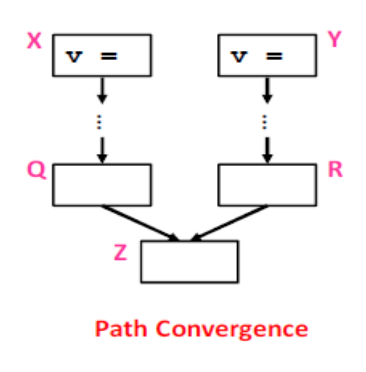
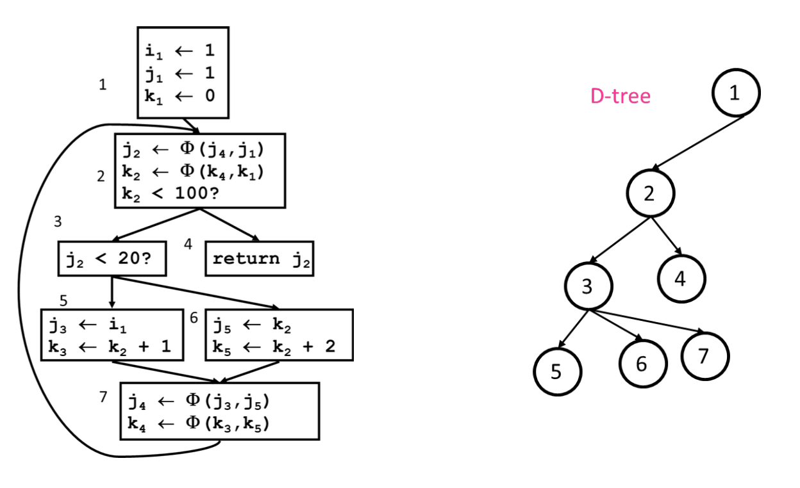

# Static Single Assignment (SSA)

La forma Static Single Assignment (SSA) è un tipo di IR dove ad ogi variabile viene assegnato un una volta sola.

Consiste in un processo facilmente ottenibile all'interno di un BasicBlock:

- Visita ongi istruzione nel BB:
  - LHS: assegna ad una nuova versione di quella variabile
  - RHS: usa la versione piu recente di tale variabile


Fare la SSA nei punti di `join` e `branch` diventa però una questione più delicata, diventa neccessario sapere a quale assegnamento ci si sta riferendo in un certo percorso del CFG.

Per superare questo limite si usa la funzione $\Phi$

## Funzione $\Phi$

$\Phi$ essenzialmente fonde multiple definizioni derivanti da multipli percorsi in una singola definizione.  
Per una BasicBlock con $p$ predecessori ci sono $p$ argomenti nella funzione $\Phi$:

- `xnew` $\leftarrow \Phi (x_1, x_2,..., x_p)$

La forma **SSA Minimale** vuole che venga aggiunta una funzione $\Phi$ ad ogni punto di `join` per tutte le variabili live con definizioni multiple.



## Dove inseriamo le funzioni $\Phi$:

Inseriamo una funzione $\Phi$ per una variabile `a` nel blocco $Z$ se:

- `a` è stata definita più di una volta (es., `a` definita in $X$ e $Y$ e $X \ne Y$)
- Esistono due percorsi da $X \rightarrow Z$ e da $Y\rightarrow Z$ tali che:
  - $X \rightarrow Z \space\cap\space Y \rightarrow Z = \{Z\}$.  
    $Z$ è l'unico blocco in comune tra i due percorsi
  - Almeno un percorso raggiunge $Z$ per la prima volta.

_Nota:_ $v=\Phi (...)$ è una definizione di `v`

## Dominance Frontiere:

Definiamo come dominance frontiere di un nodo $X$ l'insieme di nodi che hanno $X$ tra i dominatori dei suoi predecessori e che non sono strettamente dominati da $X$ stesso.

<center>

### Formalmente:

</center>

$$
domF(X) = W \space\| \space X\in dom(pred(W)) \space\&! \space (X \in sdom(W))
$$

La dominance frontiere ci permette di inserire il numero minimo di funzioni $\Phi()$, sotto l'algoritmo per calcolare iterativamente la domF di un CFG:

```
foreach node N{
    foreach variable v defined in N{
        orig[N] U= {v}
        defsites[v] U= {N}
    }
}

foreach variable v {
    W = defsites{v} // restituisce set di Nodi (BB)
    while W not empty{
        N = W.pop() // prende un nodo dal set
        foreach y in DomF[N] // ogni DomF di N
        if y !in PHI[v]{
            insert "v <- PHI(v,v,...)" at top of y
            PHI[v] = PHI[v] U {y}
            if v !in orig[y]: W = W U {y}
        }
    }
}
```

### Esempio:


### Diventa:


