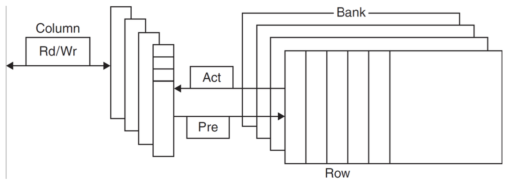

# Ottimizzazioni sulla Memoria:

### Overview:

**Tecnologia DRAM (Dynamic RAM):**
Conserva i dati in binario sotto forma di carica in un condensatore, l'accesso ai dati avviene tramite un singolo transistor, deve essere periodicamente refreshata, pena la perdita di dati (dovuta alla dissipazione della carica).

La RAM è strutturata come una matrice, e gli accessi ai dati avvengono su intere righe per compensare la latenza di accesso.  
Le prestazioni della RAM sono migliorate nel tempo, grazie anche a nuove tecniche di trasferimento dati (DDR - double data rate; QDR - quad data rate, dove con data rate si intendono i fronti di clock).

**Tecnologia SRAM(Static RAM):**
È una memoria composta da celle elementari di transistor MOS formando un flip-flop, la memoria SRAM è stabile finchè alimentata e di solito è la memoria che troviamo integrata nelle CPU.
È veloce quasi quanto una CPU, quindi ordini di grandezza sopra la DRAM, ma è anche estremamente costosa e densa, quindi molto limitante e rara.

## Gerarchie di Memoria:

La gerarchia di memoria è una struttura organizzative che include diversi livelli di memoria con caratteristiche e **prestazioni** differenti. L'idea alla base è che le memorie più veloci e costose (cache) siano più vicine al processore mentre quele più lente ed economiche (RAM e storage) siano più lontane.  

lo schema di livelli tipicamente seguito è: 
1. **Registri del processore:** È la memoria più veloce, direttamente all'interno della CPU, capacità molto limitata ma estremamente veloce.  
2. **Cache (L1,L2,L3):** Sono memorie piccole e intermedie che che servono a ridurre i tempi di accesso ai dati usati con maggiore frequenza, sono poste tra la CPU e la RAM.
3. **Main Memory - RAM:** Memoria volatile con capaictà maggiori rispetto alla cache ma con tempi di accesso maggiori
4. **Storage (SSD/HDD):** Memoria non volatile utilizzata per l'archiviazione permanente dei dati, capacità molto elevata ma tempi di accesso estremamente più lunghi rispetto alla RAM.  

 

# Principio di Località:
  
È il principio che descrive il comportamento degli accessi alla memoria dei programmi:
- **Località Temporale:**   
    Se un dato è stato recentemente acceduto, è probabile che venga acceduto di nuovo nel prossimo futuro $\rightarrow$ giustifica l'uso delle cache.  
- **Località Spaziale:**   
    Se un dato è stato recentemente acceduto, è probabile che i dati a lui vicini vengano acceduti a breve $\rightarrow$ le cache sfruttano questo principio caricando dalla RAM blocchi di dati contigui al posto di un singolo dato.  

## Cache

_revision:_   
Con il termine _`word`_ si intende l'unità di base che il processore di un computer può manipolare. La dimensione di una word cambia dall'architettura del computer, oggi giorno tipicamente ci riferiamo a word di 16 o 32 bit. Una word può contenere diversi tipi di oggetti, come ad esempio una variabile, un'istruzione, un puntatore, ecc...   

Le Cache sono piccoli blocchi di memoria veloce posti tra la CPU e la memoria principale per valocizzare l'accesso ai dati usati frequentemente, il processore richiede un dato e la prima memoria che consulterà sarà la L1 cache, che potrebbe contenere o meno il dato.   
Se il dato richiesto dal processore non è nella cache si ha una **cache miss**, ne esistono di 3 tipi:
1. **Compulsory Miss:** Accade quando la cache è fredda e deve essere inizializzata, non esistono ancora dati in cache!  
2. **Conflict Miss:** Si verifica quando due indirizzi diversi mappano sulla stessa linea di cache e competono per lo stesso spazio, questo dovuto al fatto che le dimensioni della cache siano ridotte rispetto a quelle della RAM e quindi più inidirizzi vengono mappati sulla stessa riga con la speranza che non vengano acceduti uno dietro l'altro.  
3. **Capacity Miss:** Avviene quando la cache esaurisce lo spazio a disposizione, forza l'evizione di alcuni dati per fare posto a nuovi dati.  

### Cache Summary:
- Cache Hit:    
    - Dato richiesto trovato in cache, cheap cost
- Cache Miss:  
    - Dato non in cache, costo expensive; cerca dato nei livelli inferiori  
- Cache Line:  
    - Numero di byte caricati insieme per entry  
- Cache Capacity:   
    - Quantità di dati che può essere contenuta simultaneamente in cache  
- Associativity:    
    - Direct mapped vs n-way associative  

  

# Ottimizzazioni del compilatore per la gerarchia di memoria: