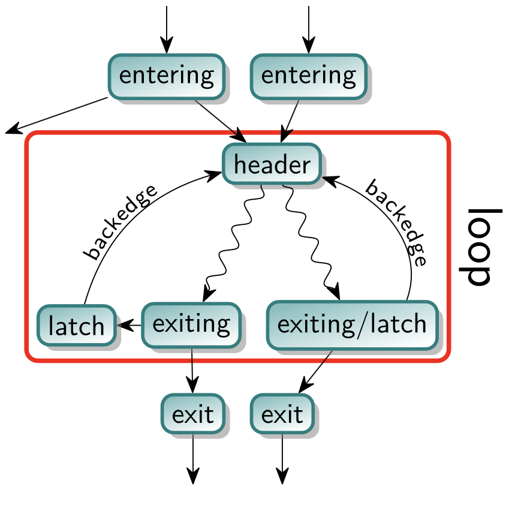

# Assignment 4: Loop Fusion 

## Loops Overviews e Defiinizioni:

Per definizione un Loop llvm è un insieme di nodi del CFG con le seguenti proprietà:
1. Il sottografo che modella il loop è fortemente connesso (tutti i nodi raggiungibili da tutti i nodi)
2. Tutti i nodi esterni al loop che puntano al loop puntano allo stesso `BasicBlock`, che prende il nome di `header`. Il hader quindi domina tutti i nodi del loop. 

### Terminologia di loop aggiuntiva:
- Con `EnteringBlock` o `predecessor` ci si riferisce a un blocco non appartenente al loop che punta al header del loop, se esiste un singolo EnteringBlock ci si riferisce ad esso come `PreHeader` $\rightarrow$ per definizione il preheader dominerà tutti i nodi del loop. 
- Un `latch` è un nodo del loop che ha un arco verso il header del loop
- Un `BackEdge` è l'arco del latch che lo collega con il header
- Un `Exiting Edge` è l'arco che sposta il control flow al di fuori del loop.  
    - Il blocco che lo genera è detto `ExitingBlock` e il suo target è un `ExitBlock`
- Il `LoopGuard` è un blocco che considera la condizione di controllo del ciclo e determina se esso deve essere eseguito o meno, il `LoopGuard` ha un arco che punta al header e all'exiting block per gestire questo controllo.
- `LoopTripCount` rappresenta il numero di volte che un ciclo esegue



<br> <br>
--- 

# Struttura del passo $\rightarrow$ Loop Fusion:

Per poter eseguire il passo di loop fusion due loop devono soddisfare le seguenti condizioni:
1. $L_j$ e $L_k$ devono essere **adiacenti**:  
    Due Loop $L_j$ e $L_k$ si dicono adiacenti se non ci sono blocchi aggiuntivi nel CFG tra l'uscita di $L_j$ e l'entry di $L_k$.  
    Se i loop sono **guarded** il successore non loop del guard branch di $L_j$ deve essere l'entry block di $L_k$.  
    Se i loop **non** sono guarded, l'exiting block di $L_j$ deve essere il preheader di $L_k$

2. $L_j$ e $L_k$ devono avere lo stesso numero di iterazioni:  
    Questa condizione richiede che di determini il `trip count` dei loop, il passo di analisi che determina queste informazioni è la ScalarEvolution.  

3. $L_j$ e $L_k$ devono essere **control flow _equivalent_**:  
    Due loop $L_j$ e $L_k$ si dicono _control flow equivalent_ se quando esegue uno è garantito che esegua anche l'altro.  
    Per determinare la control flow equivalenza servono le informazioni di dominanza e postdominanza $\rightarrow$ se $L_j$ domina $L_k$ e $L_k$ postdomina $L_j$ allora sono control flow equivalenti.  
    (Se un loop L0 domina un altro loop L1, significa che ogni percorso che raggiunge L1 deve passare attraverso L0. Se L1 postdomina L0, significa che ogni percorso che esce da L0 deve passare attraverso L1. Quindi, se L0 domina e L1 postdomina, allora ogni volta che L0 viene eseguito, L1 deve essere eseguito anche)
    ```c++
    #include "llvm/IR/Dominators.h"
    #include "llvm/Analysis/PostDominators.h"
    PreservedAnalyses LoopFusePass::run(Function &F, FunctionAnalysisManager &AM) {
        DominatorTree &DT = AM.getResult<DominatorTreeAnalysis>(F);
        PostDominatorTree &PDT = AM.getResult<PostDominatorTreeAnalysis>(F);
        ... 
        }

    ```

4. Non ci possono essere dipendenze di distanza negativa tra i due loop $L_j$ e $L_k$:  
    Si parla di dipendenza di distanza negativa tra due loop quando un loop dipende dai risultati di un'iterazione futura di un altro loop. Questa condizione è fondamentale perchè la fusione di due loop con questa dipendenza altererebbe l'ordine di esecuzione e la semantica del programma.

    ``` c++ 
    for(int i=0; i<n; i++) {
        a[i] = a[i] + b[i];
    }

    for(int i=0; i<n; i++) {
        b[i] = a[i+1] + c[i];
    }

    // il secondo ciclo dipende dai valori di a[] calcolati dal primo ciclo, non possiamo fonderli


    // Dependence Analysis:
    #include "llvm/Analysis/DependenceAnalysis.h"

    PreservedAnalyses LoopFusePass::run(Function &F, FunctionAnalysisManager &AM) {
        DependenceInfo &DI = AM.getResult<DependenceAnalysis>(F);
        ...
        auto dep = DI.depends(&I0, &I1, true);
            if (!DepResult) // not dependent
        }
    ```

<br>

## Trasformazione del codice:

Una volta verificate tutte le condizioni sopra elencate posso passare alla vera e propria Loop Fusion e alla trasformazione del codice, che avviene in due step:  
1. Modificare gli usi della induction variable nel body del loop2 con quelli della induction variable del loop1, considerando che in forma `SSA` sono sempre due variabili diverse (le induction variables sono quelle variabili che cambiano ad ogni iterazione in modo prevedibile, come l'incremento dell'iteratore).  
2. Modificare il CFG affinchè il body del loop2 sia agganciato a seguito del body del loop1 (nel loop1).  


## Note importanti:

Differenza tra loop unrolling e loop fusion!!!!
- main takeaway:
    il loop unrolling non migliora l'overhead di controllo ma in particolare non migliora la località spaziale dei dati.  

per questa ragione non basta collegare il latch1 con il header2 e il latch2 con il header1, bisogna proprio spostare i basic block e farli adiacenti.  

- nota 2:
    Dopo la fusione dei loop, il latch del loop fuso (cioè il blocco che ha il backedge al header del loop fuso) sarà il latch del primo loop. Questo perché, come hai detto, hai sostituito le variabili di induzione del secondo loop con quelle del primo loop, quindi l'incremento della variabile di induzione avviene nel latch del primo loop.

    Rimuovere il latch del secondo loop è un passaggio necessario per completare la fusione dei loop. Tuttavia, devi fare attenzione a due cose:

    Prima di rimuovere il latch del secondo loop, devi assicurarti che tutte le istruzioni nel latch del secondo loop che non sono legate all'incremento della variabile di induzione siano state correttamente spostate in un altro posto nel loop fuso.

    Dopo aver rimosso il latch del secondo loop, devi aggiornare tutte le strutture dati che potrebbero aver fatto riferimento a esso, come il DominatorTree e il LoopInfo.

    Se segui questi passaggi, la rimozione del latch del secondo loop non dovrebbe creare effetti indesiderati