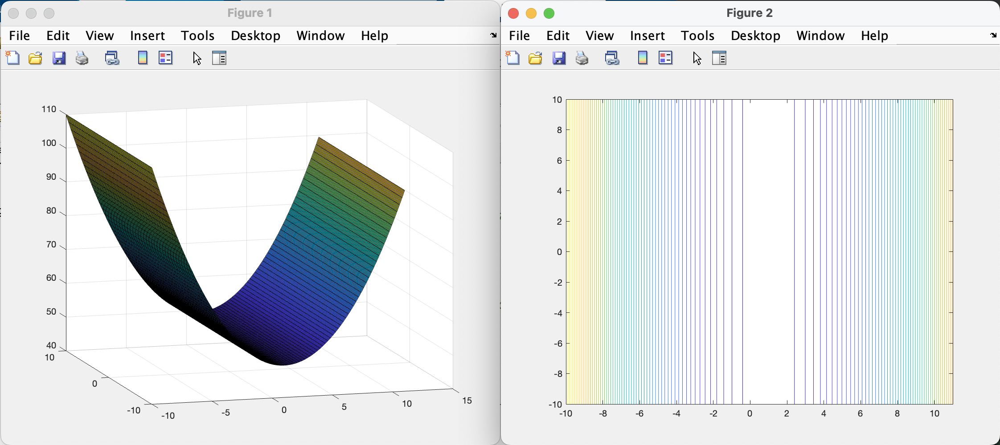
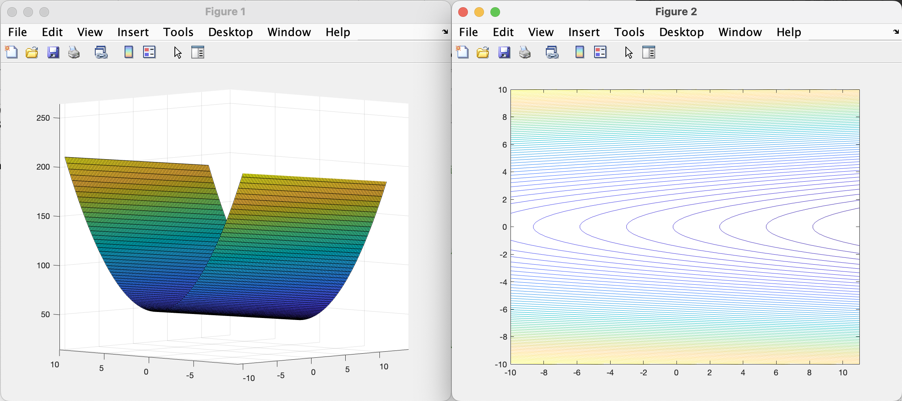
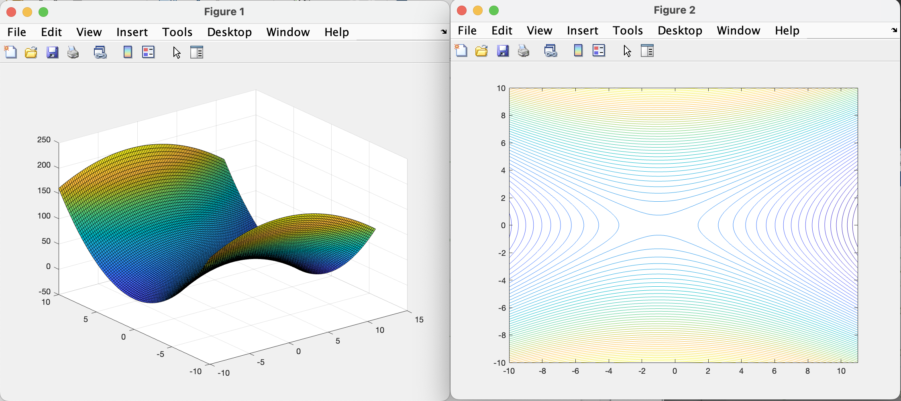
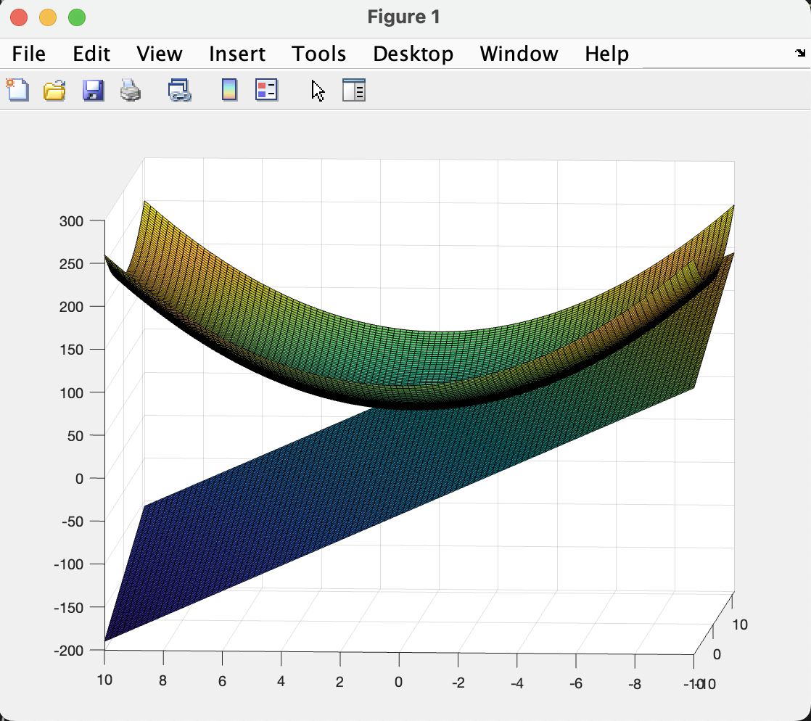

# Esercizi grafica Matlab 

Recall: Esistono varie opzioni per cambiare la colorbar delle figure:
- summer, autumn, winter, pink $\rightarrow$ altre opzioni 

`countour(X,Y,Z)` $\rightarrow$ Crea curve di livello, servono le informazioni sui punti della griglia (X,Y) e i valori che la funzione assume su tali punti (Y)  

`[c,h] = countour(X,Y,Z); clabel(c,h);` $\rightarrow$ permette di associare i valori delle costanti che la funzione assume sulle curve di livello.  

 

--- 

 

## Convessità di funzioni 

 

### Es2: Funzione convessa non strettamente 

Con la perdita della stetta convessità si può perdere l'unicità della soluzione.  

$$
A = \begin{bmatrix}
1 & 0 \\
0 & 0
\end{bmatrix}, \quad
b = \begin{bmatrix}
-1 \\
0
\end{bmatrix}, \quad
c = 50
$$

La matrice $A$ è semidefinita positiva in quanto ha autovalori $\ge 0$, notiamo che in posizione $A_{22}$ abbiamo proprio un autovalore uguale a $0$

$$
z = 0.5*(x_1.^2) - x_1 + 50;
$$

In questo grafico possiamo notare che la funzione non è più strettamente convessa e ha infiniti punti di minimo in prossimità di $x1 = 1$ e $x2 = \inf$.  

Non esiste un unico punto di minimo, i punti di minimo sono in prossimità della $x1=1$ e dove $x2$ può assumere qualsiasi valore del dominio, questo è facilmente osservabile dal grafico delle curve di livello.  

 

### Es3: Funzione convessa non strettamente 2

La matrice $A$ in questo esempio ha autovalore $A_{11} = 0$, il resto dei parametri rimane uguale.  

$$
z = 0.5*( 3 * x_2.^2) - x_1 + 50;
$$

Anche questa funzione è assente di punto di minimo, tale funzione non è limitata dal basso $\rightarrow$ se $x1$ cresce la funzione decresce.  
Tale informazione è intuibile dalle curve di livello che assumono valori sempre più piccoli per $x1$ crescente.  

 

### Es4: Funzione con punto di sella 

In questo esempio si fissano gli autovalori a quantità con segno discorde.  

$$
A = \begin{bmatrix}
-1 & 0 \\
0 & 3
\end{bmatrix}, \quad
b = \begin{bmatrix}
-1 \\
0
\end{bmatrix}, \quad
c = 50
$$

$$
z = 0.5*(-x_1.^2 + 3*x_2.^2) - x_1 + 50
$$

Dal grafico della funzione si vede bene che ci sono direzioni lungo le quali si ha un punto di minimo e direzioni verso le quali lo stesso punto risulta un punto di massimo (lo si vede bene dalle curve di livello).  
Si hanno quindi punti stazionari dove il gradiente $\nabla f(x)=0$ ma che non sono ne punti di minimo ne di massimo globale.  

 

### Es5: Funzione convessa con piano tangente 

Ricordiamo la caratterizzazione delle funzioni convesse di classe $C^1$:  
$f$ è una funzione strettamente convessa sull'insieme $\Omega$ se e solo se $\forall z,y \in \Omega$ si ha:

$$f(z) \gt f(y) + \nabla(y)^T(z-y)$$

Cioè se la funzione valutata in $z$ assume valori maggiori dei valori assunti dal piango tangente alla $f$ in $y$ valutato nel punto $z$   

dove: $f(y) + \nabla(y)^T(z-y)$ = piano tangente.  

Quindi nell'espressione matlab devo mettere al posto di $z$ tutti i punti su cui voglio valutare il piano tangente;  

ricordiamo che $y$ rappresenta il punto in cui il piano risulta tangente.  

Nell'immagine il punto scelto per disegnare il piano tangente è stato [5 -5].  

Dall'immagine notiamo come il piano tangente sia sempre sotto la mia funzione convessa, rispettando la caratterizzazione delle funzioni convesse succitata.  