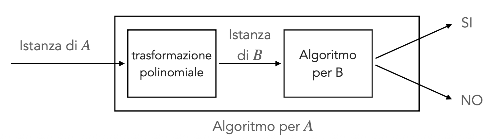

# Algoritmi Distribuiti - Teoria Complessità:  

Vogliamo classificare i problemi per i quali conosciamo algoritmi efficienti, si è scelto di raggruppare sotto un unico gruppo i problemi risolvibili in tempo polinomiale:

### Problemi $P$: 

$P$ è l'insieme di tutti i problemi decisionali (soluzione yes-no) $Z$ tali per cui esiste:
- un algoritmo $A$  
- un intero positivo $k$   

Che verificano:  $A$ risolve $Z$ in $O(n^k)$ passi   

Si sceglie di usare la formulazione decisionale del problema originale (es: invce di cercare il minimum spanning tree chiedo se esiste uno spanning tree di peso $j$) per convenzione tecnica. Permette di definire le classi di complessità in modo uniforme.  
Se si fosse usata la formulazione normale la definizione formale di classi (come la P) sarebbe stata più complessa e meno generalizzabile.  

## Riduzione Polinomiale: 

La riduzione polinomiale è una delle idee fondamentali nella teoria della complessità.  
Prendiamo due problemi decisionali $A$ e $B$, diremo che una riduzione polinomiale da $A\rightarrow B$ è un algoritmo $R$ che: 
- dato un input $x$ per $A$, produce in tempo polinomiale un input $R(x)$ valido per $B$ e la risposta di $A$ su $x$ sarà YES se e solo se la risposta di $B$ su $R(x)$ è a sua volta YES (o viceversa con NO).  

Questa proprietà consente di confrontare la **difficoltà** di problemi _diversi_: Se riusciamo a risolvere $B$ in tempo polinomiale **e se** $A$ è riducibile in $B$ in tempo polinomiale allora $A$ è risolvibile in tempo polinomiale.  

Le riduzioni permettono di mostrare che un problema è:
- **Semplice**: Se il problema si riduce a uno semplice
- **Difficile**: Se uno difficile si riduce a lui  

