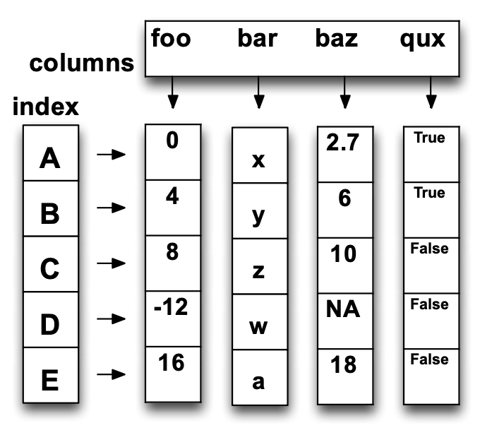

# Data Wrangling with Pandas 


### Ripasso concetti generali: 

**Tabella:** Ha una colonna speciale `ID` o `Key`, il resto delle colonne sono attributi o variabili; ogni riga sono osservazioni o instanze.  

**Operazioni su Tabelle:**
1. `Slicing`: Selezionare solo alcune delle colonne o delle righe
2. `Aggregate`: Permette di aggregare dati (sum, max, ...) su una colonna (farlo su una riga non avrebbe molto senso)  
3. `Map`: Applica una funzione ad ogni riga, possibilmente creando più righe o meno righe.  
4. `Group-By`: Permette di ragruppare tuple per colonna o dimensione; può essere combinato con una `aggregate` per fare aggregazioni sulle tuple che risultano dalla clausola di group-by.  
5. `Union-Intersection-Difference`: Operazioni che crano nuove tabelle solo se le due hanno stesso dominio (stesse righe e colonne)
6. `Merge - Join`: Combina righe / tuple attraverso diverse tabelle se hanno la stessa chiave

Per maggiori dettagli ed esempi grafici controllare il primo pacco di slide da pagina 1-23

<br>

## Introduction to Pandas: 

### Series:

È un array monodimensionale con indici, può avere qualsiasi tipo di contenuto nel field data.

```python
import pandas as pd 
s = pd.Series([5,6,12,-5,6.7], index= ['A','B','C','D','E'])
```

Si possono creare nei seguenti modi:  

```python
d = {'b':1,'a':0,'c':2}
s = pd.Series(d)
s2 = pd.Series(5.,index=['a','b','c','d','e'])

# --- Res: 

b 0 
a 0 
c 2 
```

Le serie sono manipolabili come array o dizionari $\rightarrow$ `s[0]` o `s['a']` per accedere agli elementi a partire dagli indici.  

Per maggiori dettagli consultare la [documentazione Series](https://pandas.pydata.org/docs/reference/api/pandas.Series.html)


### Data Frame:  

È una struttura con label a due dimensione, stile matrice dove ogni colonna può avere un tipo diverso di dato con indice diverso.  

```python
DataFrame(data,index=index,column=column)

ds = pd.DataFrame({'foo':[0.,4.,8.,-12.,16], 'bar':['x','y','z','w','a'],...}, index=['A','B','C','D','E'])
```
Il risultato ha questa struttura: 



Può anche questo essere creato da un dizionario di serie nel seguente modo:

```python
d = {'one' : pd.Series([1., 2., 3.], index=['a', 'b', 'c']), \
    'two' : pd.Series([1., 2., 3., 4.], index=['a', 'b', 'c', 'd'])}

#--- Res
    'one'   'two'
a    1.0     1.0
b    2.0     2.0
c    3.0     3.0
d    NaN     4.0

```

Quando mancano dei dati il sistema fa automaticamente padding e inserisce dei `NaN` (not a number) in corrispondenza dei valori non definiti.  

Possiamo crearlo anche da un dizionario di dizionari


```python 
ds=pd.DataFrame({'foo':{'a':1,'b':1},'fee':{'a':1,'b':2}})

#--- Res
    'foo'   'fee'
a    1        1
b    1        2
```

Consultare la documentazione per gli altri metodi di creazione.  


### Lettura e Manipolazione di dati con pandas

Pandas è in grado di leggere dati in diverso formato, rifarsi alla [documentazione](https://pandas.pydata.org/pandas-docs/stable/user_guide/io.html) per maggiori dettagli.  


Possiamo esplorare il DataFrame importato :

```python
df = pd.read_csv("....")
# list first 5 records
df.head()
```

```python
# restituisce il tipo di dato a cui accediamo con la chiave specificata 
df['salary'].dtype

# restituisce il tipo di dato di tutte le colonne 
df.types 
```

Fare riferimento al ipynb per visualizzare i comandi interattivamente  

### Data Types:
- `Object`: Corrispode a `string` in python (assegnato di default se ha numeri e caratteri)
- `int64`: Corrisponde a `int`, allora 64b di memoria per questo intero
- `float64`: Analogo a sopra ma per i `float`
- `datetime64,timedelta[ns]`: Non esiste una corrispondenza in pyrhon ma simile al modulo `datetime`.   


## Uso di Filri sul DataFrame:

Possiamo usare filtrare la tabella per ottenere solo le informazioni che voglioamo, per fare ciò si usano i **Filtri Booleani**.  
Questi ritorneranno un T o F e selezioneremo solo gli elementi della tabella conformi al tipo di ritorno che vogliamo (T).  

```python
filtro = df['salary'] > 120000 # seleziono gli elementi da salary con valori > 120k

df[filtro] # per visualizzarli 
df[ df['salary'] > 120000 ] # stessa cosa ma inline

```

Si possono anche concatenare più filtri per ottenere un risultato più specifico con l'operatore `&`, racchiuedere le condizioni multiple tra parentesi tonde `()`:

```python
'female professors with salary over 120k'
df_fsalary_over120 = df[(df['salary'] > 120000) & (df['sex'] == 'Female')]
print(df_fsalary_over120.head()) #stampo prime 5 entry 
```

**Nota:** Quando si applicano filtri si vede l'intero DataFrame, se si vuole visualizzare solo una tabella la si può proiettare con l'operatore `[]`, se se ne vogliono visualizzare di più ricordati che devi annidare le `[]`

```python

# --- print() omessi

#visualizzare solo 'salary'
df[df['sex'] == 'Female']['salary'] 

# visualizzare colonne 'salary' e 'sex'
df[df['sex'] == 'Female'][['salary','sex']]

```

<br>

### loc vs iloc:


- `loc[i:j]`: Seleziona i dati in base alle etichette degli indici, gli estremi sono **_inclusi_** 

- `iloc[i:j]`: Seleziona i dati in base alla posizione (come se fosse un array), l'estremo superiore è **_escluso_** mentre quello inferiore è incluso.  


Esempio pratico 

```python
data = {'valore':[10,20,30,40,50,60]} 
df = pd.DataFrame(data, index=[1,2,5,9,12,19])  

# DataFrame Risultante: 

'''
    valore
1      10
2      20
5      30
9      40
12     50
19     60

'''

df.loc[0:5]

#Risultato: cerca di selezionare le righe con indice compreso tra 0 e 5
'''
   valore
1      10
2      20
5      30

'''

df.iloc[0:5]

#Risultato: Prende le righe dalla posizione 0 alla 4 indipendentemente dai loro indici (si guarda solo la posizione delle righe).  
'''
    valore
1      10  # posizione 0
2      20  # posizione 1
5      30  # posizione 2
9      40  # posizione 3
12     50  # posizione 4

'''
```

**In breve:**


| **Metodo** | **Basato su** | **Inclusione estremi** | **Esempio** |
|------------|-------------|-----------------|-----------|
| `.loc[]`  | **Indice** | Inclusi | `df.loc[1:5]` prende le righe con indice 1, 2 e 5 |
| `.iloc[]` | **Posizione** | Escluso superiore | `df.iloc[0:5]` prende le prime 5 righe |


### Common Functions:


| **Funzione** | **Descrizione** |
|-------------|---------------|
| `count()` | Numero di valori non NaN |
| `sum()` | Somma dei valori |
| `mean()` | Media dei valori |
| `mad()` | Deviazione assoluta media |
| `median()` | Mediana |
| `min()` | Minimo |
| `max()` | Massimo |
| `mode()` | Moda (valore più frequente) |
| `abs()` | Valore assoluto |
| `prod()` | Prodotto dei valori |
| `std()` | Deviazione standard |
| `var()` | Varianza |
| `sem()` | Errore standard della media |
| `skew()` | Asimmetria della distribuzione |
| `kurt()` | Curtosi (appiattimento della distribuzione) |
| `quantile()` | Quantile di un valore % |
| `cumsum()` | Somma cumulativa |
| `cumprod()` | Prodotto cumulativo |
| `cummax()` | Massimo cumulativo |
| `cummin()` | Minimo cumulativo |
