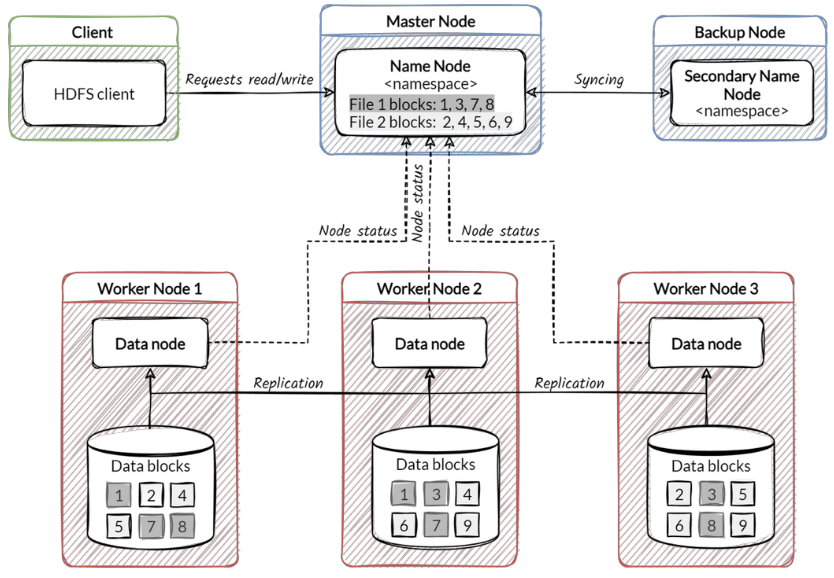

# Big Data Architectures


### Distributed Database Systems:  

Un sistema di database distribuito è composto da siti debolmente accoppiati che non condividono alcun componente fisico.  
- i db attivi in ogni site sono idipendenti l'uno dall'altro
- tutti i site hanno software identico 
- tutti i site sono consapevoli degli altri e si accordano a cooperare per processare richieste utente
- i site comunicano tra loro scambiandosi messaggi 
- una transazione potrebbe accedere a dati in uno o più site 
- la suddivisione in differenti site è invisibile al cliente che vede tutto come un singolo sistema.  


I due aspetti chiave di un sistema distribuito sono:

1. **Replication:**  
    Il sistema mantiene molteplici copie dei dati, salvati in site differenti, per recuperarli (retrieval) velocemente e per esssere fault tolerant

2. **Fragmentation:**  
    I dati sono partizionati in fragmenti che vengono salvati in site differenti 

Questi due principi si possono combinare $\rightarrow$ i dati sono partizionati in fragmenti e il sistema mantiene molteplici copie identiche di questi fragmenti in site differenti.  

<br>

## CAP Theorem: 

Esistono 3 proprietà desiderabili da ogni sistema distribuito (che condivide dati), e queste sono:

1. **Consistency:** tutte le copie hanno gli stessi valori e tutti i nodi restituiscono sempre la stessa risposta.  
2. **Availability:** le read e le write devono avere sempre successo, i nodi devono rispondere sempre alle query e accettare updates.  
3. **Partition-Tolerance:** le proprietà del sistema devono essere garantite anche quando ci sono fallimenti nella network che impediscono ad alcune macchine di comunicare con altre.  


_nota:_ Nel contesto del CAP theorem, con partizione si intende un guasto nella rete che isola gruppi di nodi, di fronte a questo problema il sistema deve decidere tra consistenza e disponibilità finchè la partizione persiste.  

Il CAP theorem dice che per ogni sistema con dati condivisi è **impossibile** garantire simultaneamente tutte e 3 le proprietà, si possono avere al massimo due di queste.  

Per scalare orizzontalemente bisogna effettuare la partizione dei dati (proprietà P), il che lascia scoperti solo la proprietà C(consistency) e la A(availability) [i RDBMS preferiscono la proprietà C rispetto alla A e la P]. Nella maggior parte dei casi si preferisce comunque scegliere A(availability) al posto di C(consistency).  

### Conseguenze del CAP theorem: 
Il CAP theorem limita cosa possiamo e non possiamo garantire, non è un vincolo stretto su cosa possiamo o non possiamo fare (garantire vs fare).  
- Es: assumiamo avere un database CP, fino a quando c'è una partizione il sistema è fully available ! se un link crasha e compaiono due partizioni allora ci sarà un certo grado di availability (write bloccate, read concesse).  


Il bisogno di tolleranza alle partizioni apre il discorso sul tradeoff tra availability e consistency, notiamo che le partizioni sono eventi rari, quindi non ha senso perdere da design la availability e la consistency 

**BASE:**   
- Basically Available: le operazioni basiche di R e W sono disponibili il più possibile ma senza garanzie di consistenza
- Soft state: Senza garanzie di consistenza, dopo un periodo di tempo abbiamo solo una probabilità di sapere lo stato in quanto potrebbe non essere ancora arrivato a convergenza  
- Eventually consistent: Se il sistema sta funzionando correttamente e aspettiamo un periodo di tempo ragionevole dopo una serie di input, saremo eventualmente in grado di sapere lo stato del DB, e quindi ogni successiva read sarà consistente con le nostre aspettative 


**Caratteristiche di sistema distribuito di MongoDB:**  
- Si ha una primary copy, secondary copies e un arbitrer 
- Il developer deve implementare ottimizzazioni 
- Tutte le write sono applicate alla copia primaria che le propaga alle secondarie; se una primary fallisce si sospendono tutte le write fino a quando non si seleziona una nuova primary copy dalle secondarie
- Sulle write si effettuano i **two phase commit** per assicurare atomicità e consistenza, si ha un transaction coordinator che comunica con le shard facendo una request, e quando riceve la risposta (OK! dalla shard) effettua il commit.  


**Cassandra:**  
- Funziona con un'architettura peer-to-peer alla base, ogni istanza Cassandra è un nodo e ogni nodo è collegato a tutti gli altri nodi 
- Ogni nodo nel sistema è responsabile di tenere in memoria una copia di column families definite dalla chiave di partizione
- Un cluster Cassandra (Cassandra ring) non ha per costruzione un SPOF, ogni nodo potrebbe fare da master (coordinator node)
- Quando un cliente si collega a un nodo questo agisce da coordinator 
- Il nodo coordinator sarà il responsabile di fare le giuste R e W dai/verso i nodi che hanno le specifiche chiavi di partizione per l'operazione che si vuole fare.  
- Utilizza un protocollo Gossip per scambiare messaggi peer-to-peer, ogni messaggio gossip informa gli altri nodi sullo stato degli altri nodi
- Ha un livello di consistenza tunable, il developer può sceglierlo
- per fare le operazioni di write, il coordinator deve:
    1. controllare i nodi a cui appartengono i dati per quella chiave di partizione
    2. inviare i dati ai nodi che hanno quella chiave di partizione 
    3. aspettare che il numero di nodi definiti dal livello di consistenza rispondano prima che il coordinator risponda positivamente al cliente.  


<br>

## Hadoop 

Hadoop è una piattaforma per archiviare e processare grandi dataset distribuiti su un cluster di commodity machines.  

Ha due componenti principali:
1. **HDFS (hadoop distributed file system)**: Un file system distribuito progettato per allocare efficientemente i dati attraverso molteplici commodity machines, prevede meccanismi di self-healing quando una di queste va giù.  

2. **Map/Reduce**: Un efficiente framework di programmazione per processare problemi parallelizzabili su grandi dataset usando un grande numero di commodity machine  
    Sfrutta i principi di Divite et Impera:
    - Divide: Partiziona i dataset in porzioni più piccole e indipendenti da essere procesate in parallelo (map)
    - Impera: Combina, unisce o aggrea i risultati dallo step precedenet (reduce)

    Il developer deve implementare le funzioni di `map()` e `reduce()` e le librerie di supporto faranno il resto del lavoro (parallelizzazione, fault tolerance, load balancing, data distribution).  
    Gli input della map e reduce sono coppie di valori `<k:v>`

<br>

Es: WorldCount $\rightarrow$ in: 1000000 documenti; out: contare il numero di occorrenze per ogni parola nei documenti   

Ogni **Map** produce `<word,1>`per la propria task assegnata

```python
def map(name:str, document:str ):
    # name: nome del documento
    # document: contenuto del documento 
    for word in document:
        yield((word,1))
```
```py
document1: "a dog ran into a cat" 
map: {
    a:1,
    dog:1,
    ran:1,
    into:1,
    a:1,
    cat:1
}
```

Ogni **Reduce** aggrega `<word,[wc1,wc1,...,wcn]>` per la propria task assegnata

```python
def reduce(word:str, partialCounts:iter):
    # word: parola
    # partialCounts: lista di conteggi parziali 
    sum = 0
    for pc in partialCounts[word]:
        sum += pc
    yield((word,sum))
```

diventa: 

```py
partialCounts = {
    a:[1,1,1,1],
    dog:[1,1,1],
    ran:[1],
    into:[1],
    cat:[1],
    ...
}

reducer_output = {
    a:4,
    cat:1,
    dog:3,
    into:1,
    ...
}
```


### Architettura Hadoop:

Dalla versione 2 di Hadoop viene introdotto **YARN (yet another resource negotiatior)** che consiste in un modulo per la gestione delle risorse separato dal motore di calcolo, è un layer che sta sopra il motore di calcolo.  
Prima MapReduce gestiva anche le risorse di sistema (memoria, cpu, ...) ora grazie a YARN questo compito è centralizzato permettendo l'uso di Hadoop anche con altri framework (come spark).  
Vantaggioso anche per progetti che vologliono usare solo HDFS senza essere obbligati a interfacciarsi con map/reduce.  


### Architettura di Hadoop

Segue una architettura master/worker, dove il master coordina tutte le operazioni e i nodi worker fanno il lavoro concreto.  

**Componenti principali di Spark:** 
1. **Master Node**:  
    Nodo coordinatore di tutte le operazioni di Hadoop

2. **Resource Manager**:  
    Vive nel nodo master e gestisce le allocazioni globali delle risorse (RAM, CPU) su _tutto_ il cluster; decide quale nodo eseguirà cosa.  

3. **Node Manager(NM)**:  
    Viene creato un NM per ogni nodo worker,  il responsabile di avviare e monitorare i processi locali nel container - comunica costantemente con il resource manager

4. **Container**:  
    È un insieme di risorse (RAM+CPU) su un nodo worker, ogni task viene eseguita su un container (consiste nell'unità fondamentale in YANR), ogni nodo worker può avere e crea più container in base all'operazione che deve fare.   

5. **Application Master**:  
    Vive dentro un worker node e gestisce una singola applicazione (es: un job map/reduce), questo viene avviato in un container ed ha il compito di: richiedere altri container per la task, monitorare il processo e gestire eventuali errori


**Esecuzuone di un Job in Hadoop V2**:  
Il cliente lancia il job e si connette al Resource Manager $\rightarrow$ Il RM alloca un container per eseguire dentro un worker node l'Application Master (AM) $\rightarrow$ L'AM richiede al RM ulteriori container per eseguire i singoli taks di map o reduce cercando di seguire la data locality (sugli altri worker node del cluster) $\rightarrow$ i task vengono eseguiti nei container che vengono rilasciati una volta che i task finiscono $\rightarrow$ quando tutti i task sono completi, anche l'AM termina e rilascia il suo container $\rightarrow$ una volta finita l'operazione tutti i container e l'AM vengono rilasciati e si torna allo stato iniziale in cui esiste solo il RM dentro il master node e i NM dentro i worker node.  


Hadoop può essere eseguito in 3 modalità, utili in contesi diversi:
1. Local/Standalone: tutto gira su una singola macchina virtuale JVM
2. Pseudo-distribuito: simula un cluster su una singola macchina 
3. Distribuito: Un vero e proprio cluster con più nodi


_nota:_ Dopo la task i container che eseguono le task e quello che conteine l'AM vengono terminati.  

### HDFS - Hadoop Distributed File System
HDFS è il file system distribuito progettato specificamente per Hadoop.  

Caratteristiche chiave:
- È un file system scalabile e distribuito scritto in Java per Hadoop
- Progettato per lavorare su migliaia di cluster economici 
- scrittura e lettura avvengono via rete, bisonga tenere conto di tutte le complicazioni della programmazione su network, i file system distribuiti su rete sono più complessi dei file system su disco.  
- Ha come obiettivo evitare la perdita dei dati: (che diventa più difficile in quanto avviene via rete)
    - attraverso replicazione o erasure coding (nella V3)  
- Ha al centro il concetto di Data Locality $\rightarrow$ i calcoli si eseguono dove si trovano i dati, non si spostano i dati 

**Principi di progettazione del HDFS**  
- Pensato per lavorare su file molto grandi: HDFS lavora con file di enormi dimensioni, funziona particolarmente per per pattern di accesso sequenziali.  
- Accesso ai dati: Implementa un pattern write-once, read many; non è pensato per modifiche multiple a un file 
- Alto throughput: punta a massimizzare il throughput, cioè l'efficienza nel trasferimento di dati massicci, non è ottimizzato per basse latenze (velocità di una singola query).  
    1. throughput $\rightarrow$ quantità di dati elaborati nell'unità di tempo (es. 5TB/h)
    2. latenza $\rightarrow$ tempo necessario per completare una singola operazione, misura la reattività del sistema (es. 200ms per una query)  
    Hadoop può leggere/scrivere petabyte di dati in modo efficiente ma una singola query potrebbe impiegare minuti, ricordiamo che hadoop è pensato per analisi in batch dove è _fondamentale_ processare _TUTTI_ i dati e meno importante ottenere risultati in tempo reale.  

### Componenti Principali di HDFS: 

Funziona con un paradigma master/worker model

1. NameNode:  
    Tiene traccia della struttura delle directory e della posizione dei blocchi dei file  
    Non salva i blocchi dei dati, solo la mappa (metadati)

2. Secondary NameNode: Non è un backup, serve per allegerire il NameNode creando snapshot dei metadati
3. DataNode: Sono i veri e propri lavoratori, salvano fisicamente i blocchi dei file e mandano sengnali heartbeat regolari al NameNode per comunicare il loro stato interno   




HDFS **NON** è pensato per: 
- accedere a file con basse latenze 
- accedere a file di piccole dimensioni 
- effettuare (molteplici) write concorrenti o modifiche arbitrarie  


**Blocco HDFS**:  
Un blocco HDFS è l'unità minima di scrittura e lettura, nei file system tradizionali si parla di blocchi piccoli (512byte), in HDFS i blocchi sono intenzionalmente molto grandi (64 o 128MB) per minimizzare il tempo di seek e facilitare l'elaborazione distribuita.  

Possiamo dividere file enormi in blochi separati, anche su nodi diversi per favorire la scalabilità e la data locality. Per garantire fault tolerance e availability si effettua replication, ogni blocco viene replicato in 3 diversi nodi (nella V3 si usa erasure coding).  

Hadoop semplifica il big data procesing ma ha uno stile di programmazione poco maneggevole ed è inefficiente per applicazioni che condividono dati per step come {algoritmi iterativi, modelli a grafo, query interattive, ecc...}  


## Apache Spark: 

Spark nasce per risolvere i limiti di Hadoop, il quale funziona molto bene, ma ogni singolo step legge e scrive su disco (HDFS), e siccome l'IO del disco è molto più lento della RAM, si hanno grandi latenze quando si lavora su algoritmi iterativi, query interattive e streaming.  
Tutte le letture su disco per ogni passaggio rallenta enormemente l'esecuzione.  


**Spark** è un motore di elaborazione dati / calcolo che lavora principalmente in memoria (RAM) il che lo rende estremamente più veloce di hadoop.  
_Non è un file system_ o sistema di archiviazione dati, infatti si appoggia a sistemi com HDFS o NoSQL per accedere ai dati.  


### Obiettivo di Spark 

Spark vuole mantenere le qualità di Hadoop, ossia:
1. Fault Tolerance
2. Scalabilità
3. Data Locality

Ma offrendo prestazioni molto migliori grazie a una nuova astrazione fondamentale $\rightarrow$ **RDD** (Resilient distributed dataset).  
Offre anche molte più operazioni rispetto a MapReduce, rendendo la scrittura del codice molto più semplice e consisa.  


**RDD**:  
Gli RDD sono l'anima di Spark, sono strutture dati distribuite, fault tolerant, chevivono in RAM e possono essere elaborate in parallelo.  


Si possono creare da file (HDFS) o da altri RDD (tramite trasformazioni).  


**Operazioni su RDD**:  
1. **Transformations** $\rightarrow$ non eseguono immediatamente, sono lazy operations (map, filter, groupBy, join,....)
2. **Actions** $\rightarrow$ eseguono nel momento in cui vengono invocate (count, collect, save, reduce), il risultato di questa operazione torna al drivere o viene scritto su file.  


### Struttura di un programma Spark:

Un programma Spark è suddiviso in due componenti principali: 
1. **Driver:** È il programma principale, coordina tutto ed è scritto dal programmatore
2. **Workers:** Sono i nodi del cluster che eseguono i task paralleli.  

I dati RDD sono distribuiti tra i nodi e spark manda task ai worker per processarli.  
