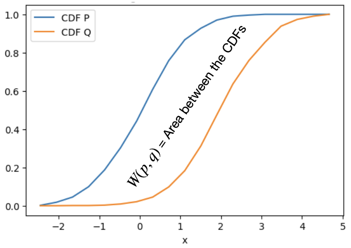

# Data Similarity

### Table of Contents:

1. [Dissimilarità per i vari tipi di attributi](#dipendenza-dal-tipo-di-dati)
2. [Kullback Leiber KL-Divergence](#divergenza-di-kullback-leibler-kl-divergence)
3. [Jensen Shannon JS-Divergence](#jensen-shannon-divergence)
4. [Wasserstein-Kantrovich Distance](#distanza-di-wasserstein---kantorovich)

### Similarità e Dissimilarità:

- **Similarità**:Misura quanto due oggetti siano simili in un intervallo [0,1], un valore alto indica maggiore somiglianza (1 indica identità e 0 differenza completa).  
- **Dissimilarità**: Misura quanto due oggetti siano diversi in un intervallo [0,1], un valore alto indica maggiore differenza (1 indica differenza completa e 0 identità).  

Es: un valore 0.333 indica una dissimilarità moderata, non è ne troppo alto ne troppo basso, suggerendo che ci sono alcune differenze ma anche somiglianze tra i vari oggetti.   

### Dipendenza dal tipo di dati: 

La similarità tra dati non è universale, dipende dal tipo di **attributi** (nominali o numerici) e dal **contesto** (es: due colori possono essere considerati simili in base a specifici criteri).  

**Matrice dei Dati:**   
Formato tabellare dove le righe = oggetti e le colonne = attributi 

**Matrice di Dissimilarità:**   
Matrice Simmetrica oggetto x oggetto con valori $d(i,j)$ dove:  
- $d(i,j)=0$ se $i=j$ (diagonale principale con tutti zeri)
- $d(i,j)=d(i,j)$ (simmetria)  

La simmilarità si ottiene $\rightarrow \text{sim}(i,j) = 1 - d(i,j)$  

Es: [inserire matrice di similarità e dissimilarità]  

 

### Attributi Nominali: Misura di Dissimilarità:

Gli attributi nominali sono categorie **senza un ordine implicito** (es: colore blu, trattamento medico 'CS' o 'CFR',...) e la dissimilarità tra due record $i,j$ può essere espressa come:  

$$
d(i,j) = \frac{p-m}{p}
$$

$$
\text{dove } m=\sum_{l=1}^{p} \delta_{i_lj_l} \space\space\text{  e con: } \space\space\delta_{i_lj_l}=1 \space\text{se}\space i_l=j_l \space\space\text{o 0 altrimenti}
$$

- $m$ è il numero di attributi uguali tra $i$ e $j$ (i record confrontati)
- $p$ è il numero totale di attributi nominali 

  

Esempio Matrice Similarità e Dissimilarità:  

| Pz/index | Condition | Treatment |
|---|---|---|
| 1    | A    | CS    |
| 2    | B    | CFR    |
| 3    | C    | CFR    |
| 4    | A    | CS    |

 

Es celle notevoli:
- $d(1,4) = \frac{2-2}{2}=0$, dove $m=2$ in quanto Cond(1) e Treatment(1) sono uguali al paziente 4
- $d(2,3)=\frac{2-1}{2}=0.5$, dove $m=1$ in quanto Treatment(2) = Treatment(3) ma condizioni diverse.  
- ...

 

|    | 1   | 2   | 3   | 4   |
|---|---|---|---|---|
| 1  | 0   | 1   | 1   | 0   |
| 2  | 1   | 0   | 0.5 | 1   |
| 3  | 1   | 0.5 | 0   | 1   |
| 4  | 0   | 1   | 1   | 0   |

 

---

### Attributi Binari:  

Gli attributi binari possono assumere solo due valori e la loro analisi dipende dal contesto:  
- Simmetrici:  Entrambi i valori hanno uguale importanza (es: maschio/femmina). 
- Asimmetrici: Un valore (tipicamente 1) è più significativo dell'altro.  

**Matrice di Contingenza e Simmilarità _Simmetrica_:**    

Per due oggetti con $p$ attributi binari, si costruisce una matrice di contingenza, se si hanno più di 2 oggetti si dovranno creare matrici separate per ogni possibile coppia di oggetti.  

| $i/j$ | 1 | 0 |
|---|---|---|
| 1    |  $q$   | $r$    |
| 0    |  $s$   | $t$    |

- $q$ attributi con 1 in entrambi gli oggetti 
- $r$ attributi con 1 nel primo oggetto e 0 nel secondo
- $s$ attributi con 0 nel primo oggetto e 1 nel secondo 
- $t$ attributi con 0 in entrambi

$$
d(i,j) = \frac{r+s}{q+r+s+t}
$$  

**Attributi Asimmetrici e Coefficiente di Jaccard:**  
Negli attributi asimmetrici le corrispondenze 0-0 sono irrilevanti di natura, la dissimilarità in questi casi si calcola come:  

$$
d(i,j) = \frac{r+s}{q+r+s}
$$

**Coefficiente di Jaccard:**  

$$
J(i,j) = 1-d(i,j)= \frac{q}{q+r+s}
$$

 

---

### Attributi  Numerici:  

Gli attributi numerici (es. età, reddito, temperatura) richiedono metriche di distanza per quantificare la dissimilarità tra oggetti.  

Le principali sono:  

$$
\text{Distanza Euclidea:}\space\space\space\space d(i,j) = \sqrt{\sum_{\alpha=1}^{p} (x_{i\alpha} - x_{j\alpha})^2}  
$$

$$
\text{Distanza Manhattan:}\space\space\space\space d(i,j) = \sum_{\alpha=1}^{p} |x_{i\alpha} - x_{j\alpha}|  
$$

$$
\text{Distanza Chebyshev:}\space\space\space\space d(i,j) = \max_{\alpha} |x_{i\alpha} - x_{j\alpha}|  
$$

$$
\text{Distanza Minkowski}\space\space\space\space d(i,j) = \left( \sum_{\alpha=1}^{p} (x_{i\alpha} - x_{j\alpha})^{h} \right)^{1/h}  
$$

$$
d(i,j) \geq 0  \space
d(i,i) = 0  \space 
d(i,j) = d(j,i)  \space
d(i,j) \leq d(i,k) + d(k,j)  
$$

 

---

### Attributi Ordinali:  

Gli attributi ordinali rappresentano categoire con un **ordine intrinseco** ma non hanno una misura numerica diretta $\rightarrow$  {freddo,moderato,caldo}.  
Per poter utlizzare attributi ordinali in data science bisogna convertirli in valori numerici e normalizzarli.  

**Conversione in Ranghi Numerici:**  
- Ogni categoria viene mappata a un numero intero, preservando l'ordine
- Attributi diversi (colonne del df) possono avere un numero di categorie diverse ($M_\alpha$), per questo motivo si riscala ogni attributo per garantire comparabilità.  

$$
r_{i\alpha} = \text{rank}(x_{i\alpha})  
$$

$$
z_{i\alpha} = \frac{r_{i\alpha} - 1}{M_\alpha - 1}  
$$

Es:  
Temperatura $\rightarrow$ {Freddo:1, Moderato:2, Caldo:3}  
Normalizzazione $\rightarrow$ {Freddo: (1-1/3-1 = **0.0**), Moderato: (2-1/3-1=**0.5**),...}

Dopo la conversione e la normalizzazione, si usano le stesse matriche degli attributi _numerici_.   

 

--- 

### Attributi Misti:   

In molti dataset reali, gli oggetti sono descritti da attributi di diverso tipo, per calcolare la dissimilarità si combina il contributo di ogni attributo, normalizzandolo.  

Formula generale: 

$$
d(i,j) = \frac{\sum_{\alpha=1}^{p} \delta_{ij}^{(\alpha)} \cdot d_{ij}^{(\alpha)}}{\sum_{\alpha=1}^{p} \delta_{ij}^{(\alpha)}}  
$$  

Ricordiamo i termini chiave:   

- $i$ e $j$ sono due record/oggetti nel dataset (due righe di una tabella)  
- $\alpha$ indice che rappresenta un indice specifico (es: Eta, Temperatura, ...)  
- $x_{i\alpha}$ valore del record $i$ per l'attributo $\alpha$
- $x_{j\alpha}$ valore del record $j$ per l'attributo $\alpha$

Significato della formula:  

- $\delta_{ij}^{(\alpha)}$ :
    - $0$ se uno dei due valori $x_{ia}$ o $x_{ja}$ è mancante o se l'attributo $\alpha$ è binario asimmetrico ed entrambi i valori sono $0$
    - $1$ altrimenti   
- $d_{ij}^{(\alpha)}$ è la dissimilarità normalizzata per l'attributo $\alpha$ e varia dal tipo attributo.  
    - Binari/Nominali: $d_{ij} = 0 \space\space\text{se}\space\space x_{ia}=x_{ja}$ o $0$ altrimenti.   
    - Numerici: $d_{ij}^{(\alpha)} = \frac{|x_{ia}-x_{ja}|}{\text{max}(\alpha)-\text{min}(\alpha)}$  
    - Ordinali: $d_{ij}^{(\alpha)} = |x_{ia}-x_{ja}|$  

 

---

### Similarità Coseno:  

Misura la similarità tra de vettori in base all'angolo $\theta$ tra essi (valori bound tra -1 e 1).  

$$
S_C(\vec{i}, \vec{j}) = \text{cos}(\theta_{ij}) =\frac{\vec{i} \cdot \vec{j}}{\|\vec{i}\| \|\vec{j}\|}  
$$

- $S_C = 1$ vettori nella stessa direzione (massima simlarità)
- $S_C = 0$ vettori ortogonali (nessuna correlazione tra essi)
- $S_C = -1$ vettori in direzioni opposte
  

Se i vettori sono normalizzati, esiste questa relazione con la distanza euclidea  

$$
\|\vec{i} - \vec{j}\| = \sqrt{2(1 - S_C(\vec{i}, \vec{j}))}  
$$

 

---

 

## Similarità tra Distribuzioni:  

Capire come i dati sono distribuiti in un dataset è fondamentale, si confrontano distribuzioni per: 
- valutare similarità: capire se due campioni provengono dalla stessa popolazione 
- ottimizzare modelli: misurare quanto un modello approssima i dati reali 
- analizzare cambiamenti: studiare variazioni temporali o geografiche (vendite in anni diversi,...)  

Un concetto importante quando valutiamo l'analisi delle distribuzioni di probabilità è quello di **Entropia**.  
L'Entropia è una misura di **incertezza** o della **casualità** di una distribuzione, essa misura quanto è imprevedibile una distribuzione:
    - Più è alto il valore di entropia $\rightarrow$ maggiore è l'incertezza associata alla distribuzione.  

 

### Divergenza di Kullback-Leibler (KL-Divergence):   

Misura quanto una distribuzione $q(x)$ diverge da una distribuzione di riferimento $p(x)$   
- $p(x)$ distribuzione 'vera' (es:dati reali)
- $q(x)$ distribuzione 'approssimata' (es:modello statistico)  

 

La KL Divergence $D_{KL}(p \| q)$ misura quanto $q(x)$ **è sbagliata rispetto a** $p(x)$

$$
\text{Caso discreto:}\space\space\space\space\space D_{KL}(p \| q) = \sum_{x \in X} p(x) \ln\left(\frac{p(x)}{q(x)}\right)  
$$

$$
\text{Caso continuo:}\space\space\space\space\space D_{KL}(p \| q) = \int_{-\infty}^{\infty} p(x) \ln\left(\frac{p(x)}{q(x)}\right) dx  
$$

- $D_{KL}=0$ distribuzioni identiche
- $D_{KL} \lt 0.1$ distribuzioni simili 
- $D_{KL}\approx 0.5$ distribuzioni notevolmente diverse
- $D_{KL} > 1$ distribuzioni incompatibili

**Nota:** Se il modello $q$ assegna probabilità zero a un evento che nella realtà $p$ (o nella distribuzione di riferimento) è possibile, la KL Divergence esplode e tende a $\infty$.  

 

---

### Jensen-Shannon Divergence  

Misura la similarità tra distribuzioni, ed è:
- Simmetrica: $D_{JS}(p \| q) = D_{JS}(q \| p)$ Utile quando l'ordine delle distribuzioni non è importante.  
- Limitata: Valori compresi tra 0 e $ln(2) \approx 0.69$
- Smooth: Più liscia e meno sensibili a piccoli cambiamenti nelle distribuzioni  

Particolarmente usata quando si confrontano due distribuzioni senza che una sia quella di riferimento (tipo una distribuzione sperimentale confrontata con quella reale).  

$$
D_{JS}(p \| q) = \frac{1}{2}D_{KL}(p \| \frac{p+q}{2}) + \frac{1}{2} D_{KL}(q \| \frac{p+q}{2})
$$

Essendo limitata è più facile capire se due distribuzioni si assomigliano o meno, inoltre è più robusta per applicazioni pratiche in quanto non esplode verso $\infty$.  
In breve: 
- KL-Divergence: Misura quanto un modello $q$ si discosta dai dati del modello di riferimento $p$ - misura la perdita di informazioni quando $q$ approssima $p$   
- Jensen-Shannon Divergence: Versione simmetrica e limitata della KL, serve per confrontare distribuzioni generiche tra di loro, misura la distanza media tra tra $p$ e $q$.  

 

---

### Distanza di Wasserstein - Kantorovich 

La distanzadi Wasserstein (Earth Mover's Distance) misura il minimo sforzo necessario per spostare la distribuzione $p$ nella distribuzione $q$, ossia quanto "lavoro" è necessario per trasformare una distribuzione in un'altra.  

$$
W_m(p, q) = \left( \inf_{\gamma \in \Gamma(p, q)} \mathbb{E}_{(x, x') \sim \gamma} \left[ d(x, x')^m \right] \right)^{1/m}
$$

- $\Gamma(p,q)$ è l'insieme di tutti gli accoppiamenti (o trasporti) $\gamma$ tra $p$ e $q$, dove per accoppiamento si intende una distribuzione congiunta tale che le marginali siano $p$ e $q$.  
- $d(x,x')$ è la distanza tra due punti $x$ (di $p$) e $x'$ (di $q$)
- $m$ è un parametro che penalizza gli spostsamenti, per $m=1$ il costo è la distanza semplcie, mentre per $m=2$ la distanza è quadratica (penalizzando spostamenti lunghi)  
- $W_m(p, q)$ cerca il trasporto ottimale $\gamma$ che minimizza il costo medio per trasformare la distribuzione di probabilita $p$ nella distribuzione $q$.   

 

Es: nel caso unidimensionale la distanza di Wasserstein ha una formula esplicita

$$
W(p, q) = \int_{-\infty}^{\infty} \left| \text{CDF}_p(x) - \text{CDF}_q(x) \right| dx
$$

- $\text{CDF}_p(x) = \int_{-\infty}^x p(z) dz$
- $\text{CDF}_q(x)$ è la CDF di $q$
- In 1D il trasporto ottimale mappa ogni quantile di $p$ al corrispondente quantile di $q$
- La differenza tra le CDF rappresenta quanta massa deve essere spostata per allineare $p$ a $q$

[Formulazione matematica a pg30]  