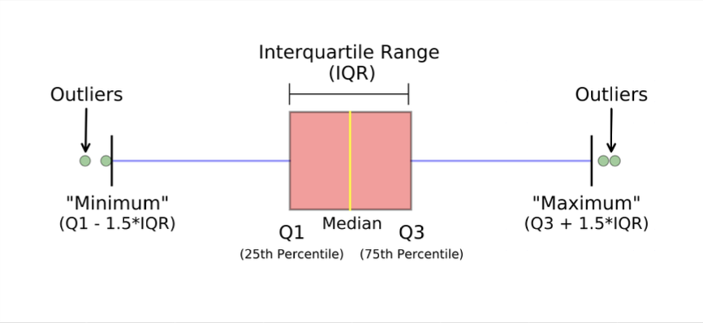

# Exploratry Data Analysis

### Table of Contents:

1. [Data Types](#data-types)
2. [Central Tendency](#central-tendency)
3. [TBD]()

   

## Data Types  

1. ### Qualitative Data: 
    - **Attributi Categorici (nomimali)**: Rappresentano nomi e categorie.  
    es: cane $\gt$ gatto $\rightarrow$ non ha senso
    - **Attributi Ordinali**: Si hanno con classi che hanno un ordine implcito.  
    es: basso, medio, alto $\rightarrow$ ordine chiaro ma non quantificabile il singolo elemento della classe.   

2. ### Quantitative Data:
    - **Attributi su scala a intervalli**: Sono misurati su una scala composta da unità di uguali dimensione.  
    Il **Ranking** e la **differenza** tra i valori sono significativi mentre la **moltiplicazione e rapporti** non lo sono, poichè manca un vero punto zero $\rightarrow$ temperatura in $C$
    - **Attributi su scala a rapporti**: Sono attributi numerici con un punto zero intrinseco.  
    Il **Ranking, differenza, moltiplicazioni e rapporti** sono tutti significativi.  
    Es: denaro, velocità, temperatura in Kelvin($K$).  

 

## Central Tendency:  

Consideriamo un attributo $X$ e un set $\{x_i\}_{i=1,...,N}$ come insieme di $N$ valori osservati.  

### Media Aritmetica: 

$$
\bar{x} = \frac{1}{N} \sum_{i=1}^{N}x_i  
$$  

Nel caso non tutti i valori siano ugualmente significativi, si può definire un set di pesi $\{w_i\}_{i=1,..,N}$ per ogni valore e calcolare: 

### Media aritmetica pesata:  

$$
\bar{x} = \frac{1}{N} \sum_{i=1}^{N}w_i x_i  
$$

### Mediana 

Se ordiniamo i valori osservati in ordine crescente $\{\bar{x_i}\}_{i=1,...,N} \space\space\space\space \bar{x_i} \lt \bar{x_{i+1}}$  

$$
x_{50} = \begin{cases}
1. & \bar{x_{(N+1)/2}} \space\space\space\space N\text{dispari}\\
2. & \frac{x_{N/2} + x_{(N+1)}}{2} \space\space\space\space N\text{pari}
\end{cases}  
$$

 

La mediana è robusta rispetto agli **outlier**, ma può essere costosa da calcolare per grandi valori di $N\rightarrow$ serve ordinamento.  

**Outlier:** Sono valori anomali o estremi che si discostano significativamente dagli altri dati in un insieme. Ad esempio, in un insieme di dati come [1, 2, 3, 1000], il numero 1000 è un outlier.  

Per grandi valori di $N$ (cioè quando il numero di dati è molto elevato), calcolare la mediana esatta può essere computazionalmente costoso. Per questo motivo, si utilizza un'approssimazione basata sulla funzione di distribuzione cumulativa (CDF).

$$  
x_{50} = L_{50} + \left( 0.5 - CD(L_{50}) \right) \cdot \frac{U_{50} - L_{50}}{CD(U_{50}) - CD(L_{50})}  \space\space\space\space\space\space CD(y) = \frac{1}{N} \sum_{i=1}^{N} \delta_{x_i < y}  
$$  

- $x_{50}$ è la mediana approssimata
- $L_{50}$ limite inferiore dell'intervallo contenente la mediana 
- $U_{50}$ limite superiore dell'intervallo 
- $CD(y)$ funzione di distribuzione comulativa

### Moda:  

La moda è il valore $x$ dove la PMF (Probability Mass Function) di $X$ prende il valore massimo - nel caso di variabili aleatorie discrete.  
Nel caso di variabili aleatorie continue la moda è quel valore che massimizza la PDF $f(x)$, in altre parole:
$$
\text{Moda} = \text{arg}\space\space {max}_x f(x)  
$$

### Relazioni:

Può essere dimostrato che per una distribuzione unimodale si ha questo comportamento: 

$$
|\bar{X} - X_{50}| \leq 0.77\sigma  
$$

$$
|\text{mode}(X) - X_{50}| \leq 1.73\sigma  
$$

Queste formule indicano che la media tende a essere più influenzata da valori estremi (outlier) rispetto alla mediana e alla moda.

 

**Recall: Deviazione Standard**  

$$
\sigma = \sqrt{\frac{1}{N}\sum_{i=1}^{N}(x_i - \bar{X})^2}   
$$

La deviazione standard $\sigma$ misura la dispersione dei dati, se $\sigma$ è grande significa che i dati sono molti dispersi, va usata con cautela, in particolare solo nei casi in cui la media sia un osservazione significativa.    

### Misura della Dispersione dei dati:  

Oltre ad usare metriche per misurare i dati più caratteristici bisogna **quantificare** la diffusione dei dati:
- **Range**: $\text{max}(\{x\}) - \text{min}(\{x\})$
- **Q-quantili**: Valori che dividono i dati ordinati in parti uguali, sono utili per comprendere la dispersione dei dati.  
    - 2-Quantile: Divide i dait in due (ottiene la mediana)  
    - 4-Quantile | Quartile: Introduce 3 punti chiave per suddividere i dati in 4: $Q_1, Q_2=x_{50}, Q_3$ creando 4 intervalli.  
    - **Range Interquartile**: Un ulteriore misura di dispersione, corrisponde a $IQR=Q_3-Q_1$  
    - 100-Quantile | Percentile: Usati normalmente come 'percuentuali' da 1 a 100.  

### Boxplot:  

Consiste in una rappresentazione grafica che sintetizza la distribuzione di un insieme di dati attraverso cinque valori chiave:  
1. Il minimo 
2. Il primo quartile $Q_1$
3. La mediana $Q_2$
4. Il terzo quartile $Q_3$
5. Il massimo

$$
[\text{min}(\{x\}), Q_1,x_{50}, Q_3, \text{max}(\{x\})]  
$$  

Il minimo e massimo sono i baffi; il Box sono $Q_1$ e $Q_2$ e la linea dentro al box è la mediana $x_{50}$.  
Se lasciato così le estremità del boxplot sono suscettibili alla presenza di outlier, si possono sostituire gli estremi con:

$\text{min}(\{x\})\rightarrow \text{max}(\text{min}(\{x\}),Q_1-1.5 IQR)$  
$\text{max}(\{x\})\rightarrow \text{min}(\text{max}(\{x\}),Q_3-1.5 IQR)$ 

---

### Covarianza:

La Covarianza misura quanto due variabili si muovono insieme: 
- se aumentano o diminuiscono contemporaneamente $\rightarrow$ coverianza positiva
- se una aumenta ma l'altra diminuisce $\rightarrow$ covarianza negativa
- se non c'è evidente relazione $\rightarrow$ covarianza vicina a zero

Formula Covarianza:  
Date due variabili $A$ e $B$ con osservazioni $(a_i,b_i)$ per $i=1,..,N$  

$$  
\text{Cov}(A, B) = \mathbb{E} \left[ (A - \bar{A})(B - \bar{B}) \right] = \frac{1}{N} \sum_{i=1}^{N} (a_i - \bar{A})(b_i - \bar{B}) = \left( \frac{1}{N} \sum_{i=1}^{N} a_i b_i \right) - \bar{A} \bar{B}  
$$  

**Limiti della covarianza:**   
1. Dipende fortemente dall'unità di misura: in base alle unità di misura usate la covarianza cambia drasticamente (m vs cm).    
2. Assenza di un range fisso: Non si sa se un valore di covarianza paria a $10$ sia alto o basso, perchè dipende dalla scala delle variabili.   

La correlazione di Pearson sistema questi due problemi.  

 
 

### Correlazione di Pearson: 

È una versione **standarizzata** della covarianza, in particolare va da $-1$ a $1$ e non dipende dall'unità di misura (che attiva il confronto tra correlazioni diverse).     
Pearson può solo funzionare con variabili numeriche e con un vero zero assoluto.    

$$  
r_{A,B} = \frac{1}{N \sigma_A \sigma_B} \sum_{i=1}^{N} (a_i - \bar{A})(b_i - \bar{B}) \space\space\space\space \text{values bounded to} -1 \leq r_{A,B} \leq 1  
$$  

Person misura quanto due variabili seguono una retta, e il segno della correlazione ci dice se entrambe le variabili crescono insieme o se vanno in direzioni opposte.  
Pearson cattura **solo** relazioni lineari ed è importante distinguere _correlazione_ da _causazione_.  

### Correlazione 

---

### Correlazione $\chi^2$ di Pearson: 

$$
\chi^2 = \sum_{i=1}^{\alpha}\sum_{j=1}^{\beta} \frac{(M_{ij}-E_{ij})^2}{E_{ij}}  
$$

