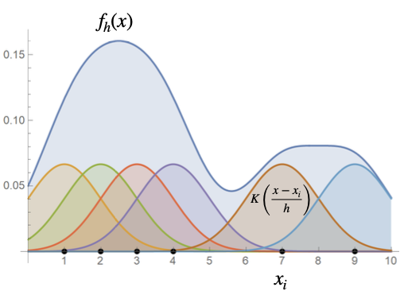
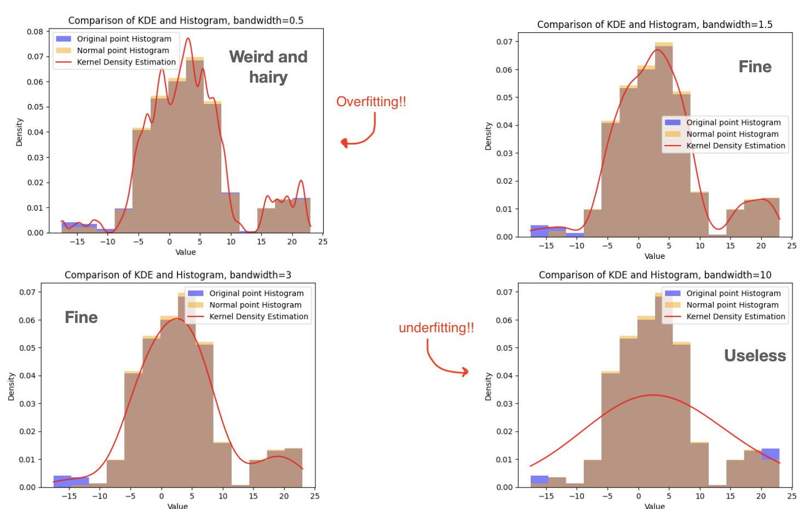
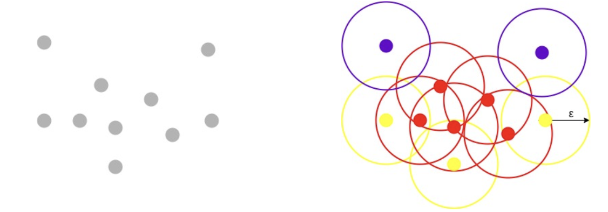

# Outlier detection and Feature Engineering


### Table of contents 


<br><br>

## Outlier Detection 

Un outlier è un data object che devia significativamente dal resto degli oggetti, come se fosse generato da un altro meccanismo.  
Punti che non seguono la stessa distribuzione degli altri oggetti sono chiamati **outliers** e si distingue un outlier da dati rumorosi in quanto non sono legati a errori casuali o alta varianza.  
Per questo motivo è fondamentale _**giustificare**_ gli outlier e il meccanismo che li genera, questo si ottiene facendo varie assunzioni sul resto dei dati e mostrando che gli outlier violano queste assunzioni mentre gli altri dati li rispettano.  

Gli effetti negativi degli outlier sono:
1. **Misure statistiche distorte:** Gli outlier distorgono/alternano (skew) le medie, aumentano gli errori di varianza e riducono la potenza statistica
2. **Identificazione di pattern falsi:** Gli outlier creano trend apparenti o correlazioni che in realtà non esistono, portando conseguentemente a inferenze errate 
3. **Degradazione delle performance di un modello:** Modelli di ML potrebbero overfittare sui dati in reazione agli outlier, compromettono la loro proprietà di generalizzazione.  
4. **Errori di decision making:** Decisioni di Business o Ricerca influenzati dalla presenza di outlier portano a errori costosi e pericolosi. 


### Tipi di Outlier: 

**1. Global Outlier**  
Sono punti che deviano significativamente dal resto del dataset, possono essere viste come 'anomalie' e sono il tipo di outlier più semplice.  
Per identificare global outlier bisogna trovare una misura di deviazione appropriata rispetto all'applicazione in questione.  

**2. Local Outlier**  
Sono oggetti nel dataset la cui densità devia significativamente da quella dell'area locale in cui compaiono

  

**3. Contextual Outlier**  
Data points che deviano significativamente rispetto al contesto specifico degli oggetti, sono conosciuti anche come **conditional outliers** in quanto sono condizionali al contesto selezionato.  
Nel problema di individuazione di outlier di contesto bisogna **specificare il contesto** come parte della definizione del problema; richiede informazioni di background.  
Es: temperatura oggi è 30 gradi -> outlier ? -> dipende dal contesto: (orario e location); se è inverno in Aosta allora si, 30 gradi sarebbe un outlier.  

**4. Collective Outlier**  
Un sottoinsieme di data objects formano un collective outlier se gli oggetti deviano significativamente dall'intero dataset.  
A differenza del rilevamento di outlier locali o globali, quando si vogliono individuare outlier collettivi bisogna considerare non solo il comportamento dei singoli dati ma quello di un gruppo di dati.  
Per rilevarli avremo bisogno delle relazioni tra data objects come la distanza o la similarità tra oggetti.   
Es: A stock transaction between two parties is considered normal, but a large set of transactions of the same stock among a small party in a short period are collective outliers because that may be evidence of some people manipulating the market.


## Metodi per rilevare Outlier 

- **Supervised methods:** Sappiamo che il nostro dataset è labeled, la detection di outlier può essere modellata come un problema di classificazione, l'obiettivo è trainare un modello in grado di rilevare outlier.  
- **Unsupervised methods:** Non abbiamo label e non sappiamo quali siano gli oggetti normali e quali gli outlier, questi metodi fanno un assunzione implcita, ossia assumono che gli oggetti normali siano in un qualche modo raggruppati (clustered) e che seguano un pattern rispetto agli outlier.  
Gli oggetti normali possono formare molteplici gruppi, dove ogni gruppo ha feature distinte, ci si aspetta di individuare outlier lontani da questi gruppi formati da oggetti normali nello spazio delle feature.  
- **Statistical methods (model-based methods):** Sono metodi unsupervised che assumono la normalità dei dati. Si assume che i dati normali siano generati da un modello statistico stocastico e che i dati che non seguono tale modello siano outlier.  
- **Proximity-Based methods:** Metodi unsupervised che assumono un outlier quando tale oggetto è lontano dai suoi vicini (nearest neighbors) nello spazio delle feature; quindi quando un oggetto devia significativamente dalla prossimita al suo vicino rispetto alla maggior parte degli oggetti dai loro vicini. L'efficienza di questo metodo dipende fortemente dalla misura di prossimità utilizzata.  


<br>


## Statistical Methods: Parametric methods

I metodi parametrici assumono che i dati normali siano generati da una distribuzione parametrica con un numero finito di parametri.  

<br>

**Univariate outliers basati su distribuzione normale:** Consideriamo un sample di una variabile scalare stocastica $x$ compatibile con una distribuzione normale, possiamo impostare i punti che sono a più di $3\sigma$ dalla media come outlier (sappiamo infatti dalla teoria che la regione $\mu\pm 3\sigma$ contiene circa il 99.7% dei dati)


```python
from scipy.stats import zscores
z_values = zscore(df[col],axis=1,nan_policy='omit')
outliers = (np.abs(z_values) > 3) # boolean outlier mask
```


<br>

---

**Multivariate outliers basati sulla normality assumption in $R^d$**:  

L'analisi multivariata è fondamentale perchè le variabili potrebbero essere **correlate** tra loro - un valore potrebbe non sembrare un outlier se analizzato da solo, ma potrebbe esserlo se analizzato nel contesto delle altre variabili.  

Si generalizza il concetto precedente al caso multivariato in $R^d$, sappiamo che per una variabile $x \in R^d$ che segue una distribuzione multivariata gaussiana vale la seguente regola:

$$
\sum_{i=1}^d z_i^2 \sim \chi^2(d) \space\space\text{dove}\space\space z = \Sigma^{-\frac{1}{2}}(x-\mu) \space\space \text{e}\space\space x \sim N(\mu,\Sigma)
$$  


dove:
- $x\in R^d$ è un vettore di $d$ variabili (un punto nello spazio delle feature a $d$ dimensioni)
- $x \sim \mathcal{N}(\mu,\Sigma)$ dice che $x$ segue una distribuzione normale multivariata dove:
    - $\mu$ è il vettore delle medie (dimensione $d\times 1$)
    - $\Sigma$ è la matrice di covarianza (dimensione $d\times d$) - misura quanto ogni coppia di variaibili varia insieme.  
- $z = \Sigma^{-\frac{1}{2}}(x-\mu)$ effettua una normalizzazione multivariata, $z$ è quindi una trasformazione di $x$ che segue una normale standard multivariata $z \sim \mathcal{N}(0,I)$
- $\sum_{i=1}^d z_i^2 \sim \chi^2(d)\rightarrow$ Se $z \in R^d$ segue una normale multivariata standard **allora** la somma dei quadrati dei suoi componenti segue una distribuzione _Chi quadro_ con $d$ gradi di libertà.  

L'ultimo punto (il fatto che $\sum_{i=1}^d z_i^2$ segua una distribuzione Chi quadrato) è **fondamentale** per rilevare outlier nel caso multivariato


**Uso della distanza di Mahalanobis:**  
Notiamo che il calcolo del quadrato delle componenti standardizzate è proprio la distanza di **Mahalanobis** al quadrato, infatti:

$$
MD^2(x) = (x-\mu)^T\Sigma^{-1}(x-\mu) = ||\Sigma^{-\frac{1}{2}}(x-\mu)||^2 = \sum_{i=1}^d z_i^2
$$

Alla luce di ciò possiamo usare direttamente la distanza di Mahalanobis per non dover calcolare esplicitamente $z$, risparmiando passaggi 

<center>

**Passaggi da Seguire:**  

</center>


Il metodo consiste dei seguenti passaggi:  
1. Si calcola la stima della distribuzione, ottenendo la media $\hat{\mu}$ e la matrice di covarianza $\hat{\Sigma}$ dai dati 
2. Per ogni punto $x_i$ si calcola la distanza di Mahalanobis al quadrato
    $$
        MD^2(x_i) = (x_i - \hat{\mu})^T\hat{\Sigma^{-1}}(x_i-\hat{\mu})
    $$  

3. Si fissa un intervallo di significatività $\alpha$, tipicamente 0.05, ossia confidenza del 95%, e questo serve a determinare la soglia oltre la quale considerare un punto un outlier.  

4. Calcola la soglia critica (quantile della distribuzione $\chi^2$ con $d$ gradi di libertà):
    $$
        \text{Soglia Critica} = \chi^2_{d,1-\alpha}
    $$  
    La notazione $\chi^2_{d,1-\alpha}$ indica il quantile $1-\alpha$ (cioè il percentile) della distribuzione $\chi^2$ con $d$ gradi di libertà

5. Confronta $MD^2(x_i)$ con la soglia:
    - Se $MD^2(x_i) \gt \chi^2_{d,1-\alpha}$ allora $x_i$ è un outlier multivariato  

Es: Se abbiamo $d=3$ variabili e $\alpha=0.05$ allora stiamo usando il quantile del 95% della distribuzione $\chi^2$ con 3 gradi di libertà. Questo valore è circa 7.81   
$\rightarrow$ quindi se $MD^2(x_i) \gt 7.81$ il punto è considerato un **outlier**

Questo metodo generalizza la regola di $3\sigma$ al caso multivariato.  


### Calcolo della distanza di Mahalanobis in modo robusto con Python  

L'approccio classico non è robusto, in presenza di outlier nel dataset si potrebbero falsare la media e la covarianza stimata, si introduce allora un metodo robusto:
- **Minimum Covariance Determinant (MCD)**:  
    Cerca il sottoinsieme di osservazioni per cui il determinante della matrice di covarianza è minima $\rightarrow$ in questo modo si escludono gli outlier (che causerebbero una forte varianza) e si rappresenta il nucleo pulito dei dati.  
    Questo metodo produce una stima robusta della media $\hat{\mu}_{MCD}$ e una stima robusta della covarianza $\hat{\Sigma}_{MCD}$.  
    Queste due stime vengono usate per calcolare la distanza di Mahalanobis con la formula classica e una volta calcolata la distanza per ogni punto saremo in grado di identificare gli outlier impostsando una soglia critica.  

```python
from sklearn.covariance import MinCovDet 
from scipy.stats import chi2


# il metodo fit() calcola sia la media che la covarianza robusta 
robust_cov = MinCovDet().fit(df[cols])
mahalanobis_squared = robust_cov.mahalanobis(df[cols])

# ppf -> percent-point function
# df -> degrees of freedom 
# restituisce la soglia critica sopra la quale solo il 5% dei punti dovrebbe cadere, se un punto è sopra tale soglia allora è un outlier
bool_outliers = mahalanobis_squared > chi2.ppf(0.95,df=len(cols))

```

---

### **Non Parametric Methods: BoxPlot Method**
I metodi non parametrici non assumano a priori un modello statistico parametrico, essi cercano di determinare il modello a partire dai dati in input.  
Un metodo comune di questa natura per individuare outlier è il **Boxplot Method**  

Dato un campione (sample) per una variabile $x$, possiamo impostare come outlier tutti i punti che cadono al di fuori da questo range:  

$$
Q_1 - 1.5IQR \lt x \lt Q_3 + 1.5IQR
$$

Ricordiamo che con sample/campione stiamo indicando l'insieme dei valori osservati per quella specifica variabile nel nostro dataset, se abbiamo una colonna 'età' con 100 valori, il campione della variabile età è l'insieme di quei 100 punti.  

Es: Abbiamo una colonna età con dati: {25,30,33,55,28}
- Prendiamo tutti i valori della colonna età {25,30,22,55,28}
- Calcoliamo Q1, Q3, e IQR per questi valori di età
- I valori di età che cadono fuori da questo range (nell'esempio sarebbe '55') sono **outlier**

<br>

---

### **Kernel Density Estimate (KDE)**

La KDE è un metodo non parametrico per stimare la **densità di probabilità** di una variabile _**continua**_.  
Diversamente da un istogramma la KDE fornisce una curva continua e più liscia.  

Un punto in uno spazio delle feature è _più probabile_ (cioè ha maggiore densità) se si trova in una regione con tanti altri punti vicini. La KDE quantifica questa densità usando funzioni kernel.  

Es: prendiamo una colonna dati 'altezza' = [165, 168, 170, 171, 172, 173, 173, 174, 175, 175, 176, 178, 180, 181, 182, 183, 185]  

Prendiamo due valori A=173 e B=160.  
Notiamo che A=173 è più vicino ad altri dati (172,173,174,175) e che B=160 è lontano da tutti gli altri (nessuno è vicino a 160), allora possiamo dire che A si trova in una regione più densa e quindi più probabile mentre B si trova in una regione di bassa densità e con probabilità bassa.  


$$
\int^{\infty}_{-\infty} K(u)du=1; \space\space\space\space\space K(-u) = K(u)
$$
  
- $K(u)$ è simmetrica e normalizzata $\rightarrow K(-u) = K(u)$ e l'integrale è uguale a 1


<br>

I metodi standard usano un **Kernel Gaussiano**:

$$
K(\frac{x-x_i}{h}) = \frac{1}{2\pi h}exp(- \frac{(x-x_i)^2}{2h^2})
$$

- $x$ è il punto dove si valuta la densità
- $x_i$ è il dato osservato
- $h$ è la bandwidth $\rightarrow$ controlla la 'larghezza' del Kernel, ossia quanto sarà liscia la curva finale (valori bassi - curva spezzettata ,valori alti - curva liscia)  

### Stima KDE - Media dei Kernel:

La stima della densità kernel per una $x$ diventa:

$$
f_h(x)=\frac{1}{nh}\sum_{i=1}^n K(\frac{x-x_i}{h}) \space\space\space\space \text{h=bandwidth}
$$

Per identificare **outliers** allora seguiamo il seguente procedimento:

0. Scegliere una bandwidth $h$ adeguata (estremamente importante)
1. Per ogni punto $x_i$ relativo alla variabile che stiamo valutando viene creato un Kernel gaussiano con la campana centrata proprio su $x_i$ e con ampiezza fissata, otterremmo un insieme di campane gaussiane centrate sui vari $x_i$ della variabile.  
2. Calcolo la media dei kernel con la funzione $f_h(x)$ che mi serve per stimare la densità, è come se sommassi tutte le varie campane ottenute al passo precedente, questo introduce il concetto di peso intrinseco, siccome in prossimità di più dati ravvicinati la campana sarà maggiormente alta (più densa) in quanto sommo varie campane vicine. 
3. Identifico come **outlier** i punti $x_i$ per cui la la funzione $f_h(x_i)$ restituisce valori bassi (densità bassa) 


<center>



</center>


Notiamo le varie campane Kernel create al primo passo, e che sono centrate sui vari valori che assume la $x_i$.  
Infine la campana grande blu è $f_h(x)$ ossia la somma media di tutte le varie campane precedenti, notiamo che tale campana sarà maggiormente alta in presenza di più $x_i$ vicini e bassa quando abbiamo valori di $x_i$ più isolati.

Si presti particolare attenzione al valore del parametro di **bandwidth $h$** in quanto determiana il successo del metodo.  

<center>



</center>


**Codice Python:**  

```python
from sklearn.neighbors import KernelDensity

# defaul kernel is gaussian, bandwidth is passed as parameter 
kern_dens = KernelDensity(bandwidth=1.0)
kern_dens.fit(X)
# returns log likelihood of the points 
scores = kern_dens.score_samples(X)
# assume we expect 2% of pooints to be outliers
threshold = np.quantile(scores, .02)
# boolean mask identifying outliers
outliers = scores <= threshold 
```


## Unsupervised/Proximity-based Methods:  

### Density-Based Spatial Clustering of Applications with Noise (DBSCAN): 

Questo metodo di detection assume che
- i punti **normali** siano racchiusi in regioni dense nello spazio delle feature e che siano separati da regioni di densità più bassa.    
- gli **outlier** siano punti non aventi abbastanza vicini a una distanza predefinita.  

DBSCAN richiede solamente due parametri: 
1. $\varepsilon\rightarrow$ è il raggio della ipersfera che si crea attorno ad ogni data point per controllare la sua densità.  
    Può esser ottenuto dal kNN-distance graph, il punto di massima curvatura ci dice il valore che deve assumere $\varepsilon$ (nota: prima di calcolare la kNN bisogna scalare gli attributi per evitare distorsioni dei dati).    
    
2. $m\rightarrow$ è il numero minimo di vicini che devono essere compresi nella ipersfera per clasificare quel punto come normale.   
    Il valore di $m$ deve essere maggiore di $d+1$, dove $d$ è la dimensione dei punti, tipicamente si imposta $m=2d$.  

Si classificano i punti in: {core points, border points, outliers}.  


Nell'immagine di esempio identifichiamo in rosso i core points, in giallo i border points e in viola gli outlier!  



<br>


--- 


### Local Outlier Factor (LOF):

LOF individua outlier basandosi sulla densità dei NN dei data points e funziona particolarmente bene quando lo spread (densità) del dataset non è uniforme.  
Confronta la densità attorno a un punto con la densità dei duoi NN; l'idea chiave è che la densità attorno ad un outlier è _significativamente diversa_ dalla densità attorno ai suoi vicini. 
Ha due iperparametri:
1. $k$ è il numero di NN che prendiamo in considerazione per ogni punto
2. $c$ è il fattore di contaminazione, ossia la percentuale di outliers che ci aspettiamo di avere dentro il dataset.   

Step della LOF:  

1. Per ogni $x_i$ identifichiamo i suoi k-NN e definiamo: 
    - $N_k(x_i)$ il set dei $k$ NN (nearest neighbors) del punto $x_i$
    - $d_k(x_i)$ il raggio minimo della sfera centrata in $x_i$ che contiene tutti i $k$ vicini  

<br>

2. Definiamo la **Reachability Distance** ossia una variabile proxy per misurare la _densità locale_ (non misura direttamente la densità ma la stima usando le distanze, la reachability distance serve come surrogato della densità locale - se è alta: densità bassa).

    $$
    rd_k(x\leftarrow x') = \text{max}\{d_k(x'),d(x,x')\}
    $$

    - $d(x,x')$ è la distanza tra $x$ e $x'$
    - non è simmetrica: $rd_k(x\leftarrow x') \ne rd_k(x' \leftarrow x)$

3. Calcoliamo la **local reachability density** per ogni $x_i$: 

    $$
    l\rho_k(x_i) = \frac{|N_k(x_i)|}{\sum_{x' \in N_k(x_i)}rd_k(x\leftarrow x')}
    $$


4. Caloliamo il Local Outlier Factor (LOF): 

$$
\text{LOF}_k(x_i) = \frac{1}{|N_k(x_i)|}\sum_{x' \in N_k(x_i)} \frac{l\rho_k(x')}{l\rho_k(x_i)}
$$

5. Individuiamo come outlier la frazione $c$ di punti che hanno un fattore LOF maggiore, infatti i punti normali solitamente hanno un valore $\text{LOF}\sim 1$ mentre gli outliers hanno $\text{LOF} \gt 1$


**Nota:** Bisogna prestare particolare attenzione quando si applicano metodi per la detection di outlier, in quanto usare il metodo sbagliato può compromettere la fase di detection.  
- Se usiamo metodi globali consideriamo solo quanto è lontano un punto, questa discriminazione sarebbe sbagliata per punti che sono in code naturali di una distribuzione (tipo una esponenziale).  

In conclusione i metodi globali possono fallire in presenza di distribuzioni sbilanciate, mentre i metodi locali come LOF guardano il contesto di ogni punto per fare la discriminazione e sono idonei in dataset complessi e reali.  
I metodi locali come LOF sono computazionalmente più pesanti.  


<br><br>


## Feature Engineering 


domande:
differenze tra data points, data objects, e objects  


