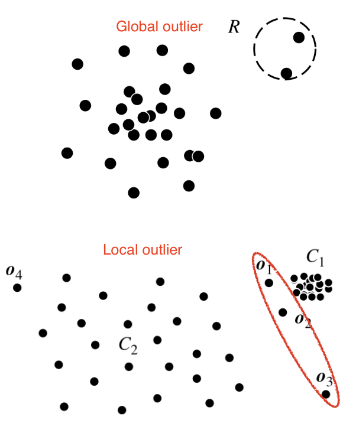

# Outlier detection and Feature Engineering

### Table of contents 

  

## Outlier Detection 

Un outlier è un data object che devia significativamente dal resto degli oggetti, come se fosse generato da un altro meccanismo.  
Ppunti che non seguono la stessa distribuzione degli altri oggetti sono chiamati ***outliers** e si distingue un outlier da dati rumorosi in quanto non sono legati a errori casuali o alta varianza.  
Per questo motivo è fondamentale _**giustificare**_ gli outlier e il meccanismo che li genera, questo si ottiene facendo varie assunzioni sul resto dei dati e mostrando che gli outlier violano queste assunzioni mentre gli altri dati li rispettano.  

Gli effetti negativi degli outlier sono:
1. **Misure statistiche distorte:** Gli outlier distorgono/alternano (skew) le medie, aumentano gli errori di varianza e riducono la potenza statistica
2. **Identificazione di pattern falsi:** Gli outlier creano trend apparenti o correlazioni che in realtà non esistono, portando conseguentemente a inferenze errate 
3. **Degradazione delle performance di un modello:** Modelli di ML potrebbero overfittare sui dati in reazione agli outlier, compromettono la loro proprietà di generalizzazione.  
4. **Errori di decision making:** Decisioni di Business o Ricerca influenzati dalla presenza di outlier portano a errori costosi e pericolosi. 

### Tipi di Outlier: 

**1. Global Outlier**  
Sono punti che deviano significativamente dal resto del dataset, possono essere viste come 'anomalie' e sono il tipo di outlier più semplice.  
Per identificare global outlier bisogna trovare una misura di deviazione appropriata rispetto all'applicazione in questione.  

**2. Local Outlier**  
Sono oggetti nel dataset la cui densità devia significativamente da quella dell'area locale in cui compaiono

  

**3. Contextual Outlier**  
Data points che deviano significativamente rispetto al contesto specifico degli oggetti, sono conosciuti anche come **conditional outliers** in quanto sono condizionali al contesto selezionato.  
Per nel problema di individuazione di outlier di contesto bisogna **specificare il contesto** come parte della definizione del problema; richiede informazioni di background.  
Es: temperatura oggi è 30 gradi -> outlier ? -> dipende dal contesto: (orario e location); se è inverno in Aosta allora si, 30 gradi sarebbe un outlier.  

**4. Collective Outlier**  
Un sottoinsieme di data objects formano un collective outlier se gli oggetti deviano significativamente dall'intero dataset.  
A differenza del rilevamento di outlier locali o globali, quando si vogliono individuare outlier collettivi bisogna considerare non solo il comportamento dei singoli dati ma quello di un gruppo di dati.  
Per rilevarli avremo bisogno delle relazioni tra data objects come la distanza o la similarità tra oggetti. 
Es: A stock transaction between two parties is considered normal, but a large set of transactions of the same stock among a small party in a short period are collective outliers because that may be evidence of some people manipulating the market.

## Metodi per rilevare Outlier 

- **Supervised methods:** 
- **Unsupervised methods:**
- **Statistical methods:**
- **Proximity-Based methods:**

 

---

domande:
differenze tra data points, data objects, e objects  

