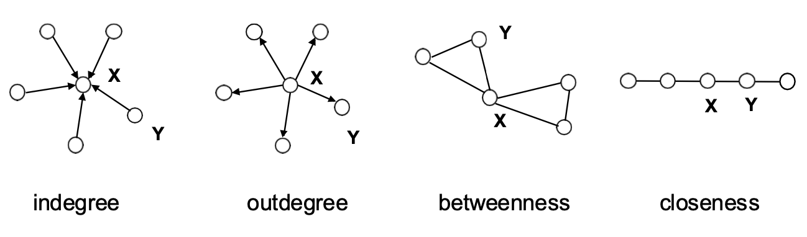
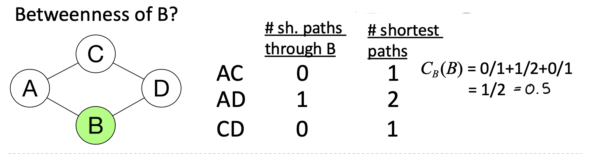
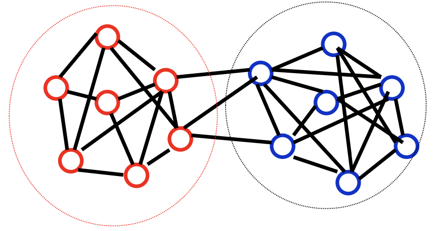
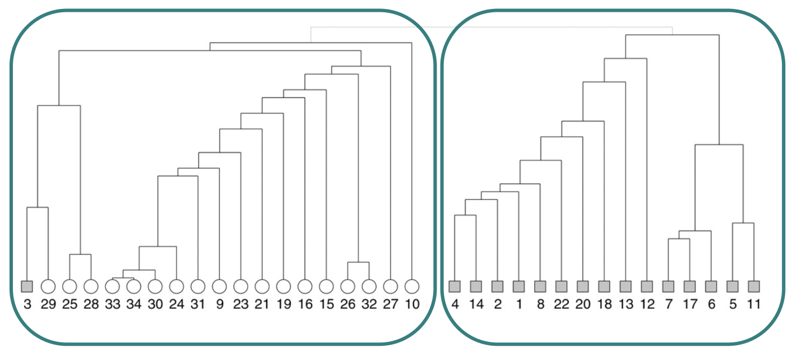
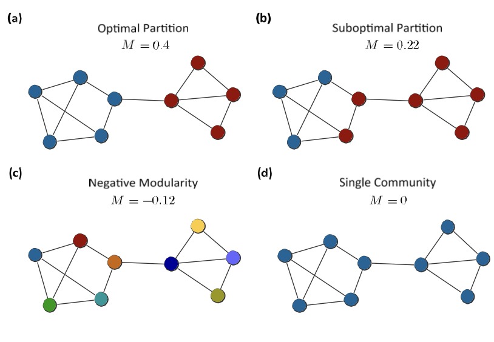
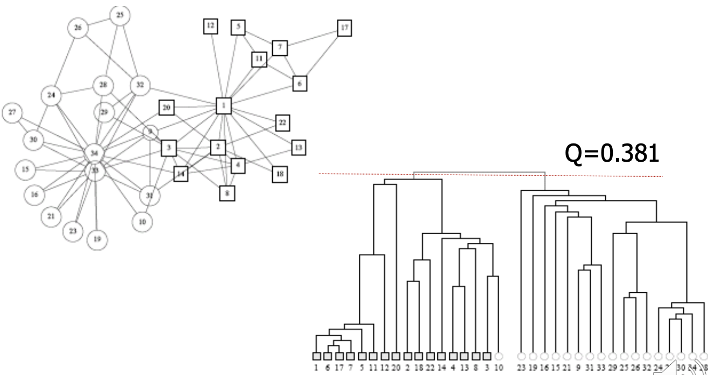
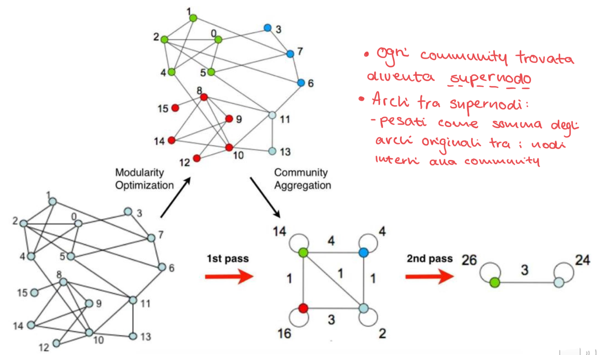

# Graph Analytics Tasks, Tools and Algorithms

Graph Definition: 

Un grafo è un set di insiemi $(V,E)$
- $V\rightarrow$ insieme di oggetti arbitrari che chiamiamo nodi o vertici
- $E\rightarrow$ insieme di coppie di vertici che chiamiamo archi o edges  
- Un grafo è _sparso_ se $|E| = \mathcal{O} (|V|)$ (numero di archi lineare al numero di nodi); un grafo è invece _denso_ se $|E| = \mathcal{O}(|V|^2)$; inoltre diremo che se ogni coppia di nodi è collegato allora il grafo è _completo_.  

I grafi sono usati per modellare relazioni 'pairwise' tra persone, oggetti o entità in una network.  

Tipi di graph analytics:   
- **Path Analysis**: Può essere sfruttata per trovare il cammino minimo tra due nodi in un grafo
- **Connectivity Analysis**: Può essere sfruttato per identificare debolezze in network, come una rete elettrcia 
- **Community Analysis**: Analisi che si basa sul concetto di densità e distanza - permette di individuare gruppi di persone interagenti in un social network
- **Centrality Analysis**: Permette di identificare rilevanza (relevancy) dalla struttura del grafo - permette di identificare le persone più influenti o le webpage con maggiori accessi.  

Nel ML:  
- Similarity Algorithms: Usato per trovare nodi simili in una network basato sulla topologia del grafo o sulle loro proprietà.
- Link Prediction: Usato per fare predizioni su nuovi possibili link (archi) nel grafo 
- Graph Embedding: L'embedding di grafi produce rappresentazioni vettoriali latenti per i grafi, che possono essere input per modelli di machine learning e deep learning.  

 

## Path Analysis:  

### 1. Shortest Path:  
L'algoritmo di shortest path calcola il cammino minimo (pesato) tra una coppia di nodi, l'algoritmo più noto per questa operazione è quello di **Dijkstra**.  

### 2. Single Soure Shortes Path (SSSP):  
L'algoritmo di SSSP calcola il cammino minimo (pesato) da un nodo sorgente a **tutti** gli altri nodi del grafo.  
Possiamo usare anche in questo caso Dijkstra $\rightarrow$ un esempio d'uso è nel protocollo di routing per le reti IP (OSPF - open shortest path first)

### 3. All Pairs Shortest Path (APSP):  
L'algoritmo APSP calcola il cammino minimo (pesato) tra tutti i nodi del grafo, questo algoiritmo è ottimizzato per renderlo più efficiente dal lanciare lo SSSP da ogni nodo del grafo.  
Utilzzato in problemi di servizio urbano come determinare il carico di traffico atteso in diversi segmenti della rete di trasporti.  

### 4. Minimum Weight Spanning Tree:  

**Spanning tree** $\rightarrow$ è un albero con $V-1$ archi che collega tutti i nodi del grafo, il costo di uno spanning tree è $(T) = \sum_{e\in T} W(e)$  
L'algoritmo maggiormente collaudato per questa operazione è quello di **Prim**.  
Può essere usato ad esempio per calcolare il percorso ottimale per un piano di turismo lowcost che vuole visitare svariate mete diverse.  

 

## Connectivity Analysis:  

Serve per analizzare la forma/struttura della rete  

### Global Connectivity:  

1. **Diametro e Diametro Effettivo:**  
    Chiamiamo **Diametro** il più lungo dei cammini minimi tra due nodi, corrisponde a fare una SSSP e prendere il valore più alto.  
    $\text{diam}(G)=\text{max}_{(n,n')\in N\times N}\sigma (n,n')$   
    Il **Diametro effettivo** corrisponde al 90% del diametro. 

2. **Componenti fortemente connesse (SCC):**  
    In un grafo diretto, una componente fortemente connessa è un sottografo massimale tale che per ogni coppia di nodi $u$, $v$ in esso, esiste un cammino da $u$ a $v$ e un cammino da $v$ a $u$. Tutti i nodi all'interno di una SCC sono reciprocamente raggiungibili.

3. **Componenti debolmente connesse (WCC):**  
    In un grafo diretto, una componente debolmente connessa è un sottografo massimale tale che per ogni coppia di nodi $u$, $v$ in esso, esiste un cammino tra $u$ e $v$ se si ignorano le direzioni degli archi (cioè, considerando il grafo non diretto sottostante).

Un grafo fortemente connesso è sempre anche debolmente connesso. Il contrario non è necessariamente vero.  

### Local Connectivity:  

Analizza la connessione tra sottogruppi di nodi o dal punto di vista di un singolo nodo.

1.  **Local Connectivity / Distance Distribution (Distribuzione delle Distanze):**  
    Questa analisi si concentra sulla struttura di connettività locale attorno a un nodo specifico (chiamato nodo sorgente).
    -   Si calcolano i cammini minimi (spesso utilizzando un algoritmo SSSP come Dijkstra) dal nodo sorgente a tutti gli altri nodi raggiungibili.
    -   La "_distance distribution_" è quindi l'istogramma o la frequenza dei nodi trovati a ciascuna distanza specifica dal nodo sorgente.
    -   Ad esempio, se dal nodo A, 2 nodi sono a distanza 50, 1 nodo a distanza 90, ecc., questa è la sua distribuzione delle distanze.
    -   Fornisce un profilo di quanti nodi si trovano a diversi "salti" o costi di distanza dal nodo di partenza, aiutando a comprendere la sua portata locale e la struttura del suo vicinato.

2. **Node Degree**:  
    Indica il numero di archi incideni ad un nodo, può essere {indegree, outdegree}.  
    
3. **Comparing distributions**:  
    Per confrontare due distribuzioni (ad esempio, dei gradi o delle distanze) si normalizzano i conteggi in frequenze relative (PDF). Le distanze più comuni sono:
    - **Distanza Euclidea**: misura la differenza quadratica tra le due distribuzioni: $D_E[P, P_e] = \sum_i (p_i - p_{i,e})^2$
    - **Divergenza di Kullback-Leibler (KL)**: misura quanto una distribuzione si discosta da un'altra in termini di informazione: $D_{KL}[P, P_e] = \sum_i p_i \log \frac{p_i}{p_{i,e}}$.  
La Distanza Euclidea è intuitiva e facile da calcolare. È una buona misura generale di "dissimilarità".
La KL Divergence è più legata alla teoria dell'informazione, misura quanta "informazione" perdi quando usi la distribuzione $P_e$ per approssimare la distribuzione $P$.  

4. **Triangle Count:**  
    Il triangle count serve a determinare quanti triangoli ci sono nel grafo.  
    Definiamo come triangolo un sottinisieme di 3 nodi in cui ongi nodo è collegato agli altri due, ossia sono presenti 3 archi che li collegano

  

È un indice che indica quanto una rete tenda a formare gruppi chiusi, ed è anche la base per il calcolo di altri indici di rete come il clustering coefficient.  

5. **Clustering Coefficient:**  

    È una misura che indica la tendenza complessiva dei nodi del grafo a formare gruppi chiusi.  
    Nel caso _globale_ $\rightarrow$ tendenza analizzata su tutti i nodi  
    Nel caso _locale_ $\rightarrow$ si concentra su un nodo specifico e misura quanto i suoi vicini siano propensi a formare un gruppo chiuso.  

    La formula è la seguente:   
    $C = \frac{3 \times \text{numero di triangoli}}{\text{numero di triplette connesse}} = \frac{\text{numero di triplette chiuse}}{\text{numero di triplette connesse}}$  

    - _tripletta (connessa)_: È un sottoinsieme di 3 nodi collegati da almeno 2 archi; diventa tripletta chiusa quando i tre nodi formano un triangolo.  
    - ogni triangolo contiene 3 triplette chiuse, da cui il fattore $3$ nella formula.  
    - un valore vicino a $1$ indica un alto clustering, mentre un valore vicino a zero indica il concetto di grafo sparso.  

 

## Centrality Analysis   
Identificare il nodo più centrale ad un grafo è un informazione importante che potrebbe aiutare a {spargere più velocemente informazioni nel grafo, fermare epidemie, proteggere la rete}.  

 

1. **Degree Centrality - nood**  

    $$
    C_{Dg}(v)=\frac{\text{deg}(v)}{|V|-1}
    $$  

    La degree centrality si calcola tramite la formula succitata e può essere interpretato come il rischio immediato di un nodo di catturare l'informazione che sta attraversando il grafo.  
    La degree centrality è una importante componente di ogni tentativo di analizzare l'influenza in una rete, come i collegamenti tra persone in un social network.  

     

2. **Network Centrality - grafo**   

    $$
    C_{Dg} = \frac{\sum_{i=1}^{|V|}[\text{deg}(v^*)-\text{deg}(i)]}{[(|V|-1)(|V-2|)]}
    $$  

    La network centrality calcola il valore di centralità dell'intera rete (grafo), è una misura che mi dice quanto la rete è _sbilanciata o dominata_ da pochi nodi centrali rispetto ad altri.  
    - se la rete è molto _eterogenea_ (cioè un nodo molto più centrali rispetto agli altri, come in una stella), la network centrality sarà alta (valori vicino a 1).  
    - se la rete è _eterogenea_ (cioè i nodi hanno più o meno lo stesso grado), la network centrality sarà bassa (valori vicini a 0)

    Nota: la formula usa la node degree per calcolare la network centrality (non usa le node centrality!!)  

     

3. **Betweenness Centrality - nodo**  

    La betweenness centrality misura quante volte un nodo si trova in mezzo ai cammini minimi tra tutte le possibili coppie di nodi del grafo.  
    Un nodo con alta betweenness mi indica un nodo attraverso il quale devono passare tanti cammini, in una influence network rappresenta un choke-point per l'informazione, se questo nodo si rompe rappresenta un grande problema per l'intera rete.  

    $$
    C_B(I) = \sum_{j\ne k} \frac{g_{jk}(i)}{g_{jk}}
    $$  

    - $g_{jk}(i)$ = numero di cammini minimi $\sigma (j,k)$ che passano attraverso $i$
    - $g_{jk}$ = numero totale di cammini minimi 

    È spesso normalizzato da $\bar{C_B}(i)=\frac{C_B(i)}{\frac{[(n-1)(n-2)]}{2}}$  

    

    

     

4. **Closeness Centrality - nodo**   

    La closeness centrality misura quanto un nodo è vicino a tutti gli altri nodi del grafo, cioè quanto velocemente può raggiungere tutti gli altri nodi.  
    Non conta solamente il numero di nodi diretti **ma** quanto sono corti i cammini minimi che collegano il nodo agli altri:
    - Un nodo con closeness centrality alta può raggiungere tutti gli altri nodi rapidamente (pochi salti).  
    - un nodo con closeness centrality bassa è lontano dal resto della rete e servono molti passaggi per raggiungere il resto dei nodi.  

    $$
    C_c(v) = [\sum_{i=1}^{|V|}\sigma (v,i)]^{-1} \space\space\space\space\space\space\space\space C_c' = [\frac{\sum_{i=1}^{|V|}\sigma (v,i)}{N-1}]^{-1}
    $$

    La closeness centrality si calcola considerando la lunghezza media dei cammini minimi che collegano un nodo a tutti gli altri nodi del grafo.    
    In sintesi, la closeness centrality è utile per capire quali nodi sono "al centro" della rete e possono diffondere informazioni più rapidamente.   

     

## Community Analysis:  

In un grafo possiamo avere comunità/gruppi, dentro le quali i collegamenti tra i nodi sono densi e fuori dai quali i collegamenti sono sparsi
- Archi _Intragruppo_ $\rightarrow$ alta densità interna a un gruppo
- Archi _Intergruppo_ $\rightarrow$ bassa densità tra due gruppi
L'obiettivo è trovare una buona divisione del grafo in modo che le connessioni dentro ogni gruppo siano molte e le conessioni tra gruppi diversi siano poche.  

Ci sono due modi per individuare gruppi all'interno di un grafo:
1. **Metodi gerarchici**  
    Costruiscono i gruppi seguendo un approccio {topdown, bottomup}
2. **Metodi di partizione del grafo**  
    Costruiscono i gruppi cercando di ottimizzare una misura quantitativa come la _modularity,conductance,expansion,etc..._.   

 

### Algoritmo di Girvan-Newman: (Metodo Gerarchico)

L'idea chiave è che se nel grafo ci sono comunità debolmente collegate tra loro allora gli archi che connettono comunità diverse sono pochi ma molto importanti in quanto su di essi passano molti cammini minimi, procederemo a eliminaer gli archi con betweenness più alta e questo romperà il grafo nelle sue comunità naturali.  

**Betweennes di un arco:** È il numero di cammini minimi tra coppie di nodi che passano per quell'arco

 

**Algoritmo - $\mathcal{O}(m^2n)$**  
1. Calcola la betweenness per ogni arco
2. Rimuovi l'arco con la betweenness più alta
3. Ricalcola la betweenness per gli archi rimasti (in quanto la rete è cambiata)
4. Ripeti i passi 2 e 3 fino a quando il grafo non sarà completamente frammentato (fino a quando non rimangono più archi).  
Questo processo crea una gerarchia di divisioni: si parte da una rete unica, poi da due community, poi tre, ecc...

L'esecuzione dell'algoritmo produce un **dendogramma** ad albero che mostra la struttura gerarchica delle partizioni del grafo:
- Le foglie (in basso) sono i singoli nodi 
- I rami (verso l'alto) rappresentano l'unione progressiva dei nodi in community 
- Tagliare orizzontalmente il dendogramma corrisponde a scegliere una partizione delle community 

L'algoritmo di Girvan-newman frammenta il grafo fino alle foglie eliminando gli archi, usiamo il dendogramma e la misura di **modularità** più alta per trovare la miglior partiziona di communità all'interno del grafo.  

**Modularità:** È una misura quantitativa che esprime quanto bene una network (un grafo) è divisibile in communità, si usa la seguente formula: 

$$
Q \sim \sum(\sharp\text{ archi interni alla communita } s - \sharp\text{ archi attesi interni alla communita } s ) \space\space\space\space\space\space\space s \in S 
$$

in formula:  

$$
Q = \frac{1}{4m}\sum_{i,j}(A_{ij} - \frac{k_ik_j}{2m})\delta(c_i,c_j)
$$

- $A_{ij}$ è un elemento della matrice di adiacenza del grafo, vale 1 se esiste un arco tra $i$ e $j$, e 0 altrimenti
- $\frac{k_ik_j}{2m}$ è il numero atetso di archi tra i nodi $i$ e $j$ in un grafo casuale / di riferimento.  
- $c_i,c_j$ è la comunità a cui è assegnato il nodo $i$/$j$

Per stimare il numero di archi attesi abbiamo bisogno di un _reference graph_  
**Reference Graph:** Un grafo $G'$ con lo stesso numero di nodi $n$, stesso numero di archi $m$ e la stessa degree distribution **ma** con collegamenti random.  

La modularità di un grafo confronta la densità degli archi interni alle comunità rispetto ad un modello casuale.  
- Valori positivi indicano una buona divisione (da 0.3) mentre valori negativi o vicini a zero indicano che non esistono vere community dentro al grafo (range di $Q = [-1,1]$)

Lo stesso grafo può avere valori diversi di modularità a seconda di come viene partizionato, la partizione migliore è quella che massimizza il valore di modilarità $Q$.  

 

La modularità $Q$ è una misura **globale**, cioè dipende _dall'intera partizione del grafo_. Trovare la partizione che massimizza assolutamente $Q$ è un problema computazionalmente molto difficile (_NP-hard_).   
Non è possibile, per grafi di dimensioni realistiche, enumerare tutte le possibili partizioni e calcolare $Q$ per ognuna tenendo solo la partizione migliore!!  
Per questo motivo si usano algoritmi euristici che cercano buone approssimazioni della partizione ottimale.   
Girvan-Newman, ad esempio, non "ottimizza" $Q$ nel senso di esplorare lo spazio di tutte le partizioni, ma genera una sequenza gerarchica di partizioni, e poi si sceglie quella con $Q$ massimo all'interno di quella sequenza.

 

### Newman Fast Algorithm (Greedy)
Questo algoritmo cerca direttamente di massimizzare la modularità, senza usare la betweenness degli archi.  

1. Inizia con ogni nodo in una sua propria community 
2. Fonde i gruppi a coppie, scegliendo quelli con aumentano di più la modularity $Q$
3. Ripete fino a quando tutte le community non sono unite
4. Si sceglie la partizione finale corrispondente al valore massimo di modularity $Q$ raggiunto durante il processo.  

 

### Algoritmo di Louvain:
Questo algoritmo vuole trovare una partizione del grafo in comunità massimizzando la modularity $Q$, lo fa in modo veloce ed efficienete anche su grafi di grandi dimensioni (considerato come uno degli algoritmi di community detection più scalabili di sempre).  
Segue una strategia **greedy** cercando in ogni momento il migliore guadagno locale in modularity, funziona in due fasi che si ripetono in cicli successivi finchè la modularity non migliora più.  

1. _Fase 1:_  
    - Inizia assegnando ad ogni nodo una community diversa, se ho $n$ nodi avrò $n$ community.  
    - Per ogni nodo $i$ si valutano tutti i suoi vicini $j$, e per ogni vicino $j$ si calcola quanto migliorerebbe la modularity se $i$ passasse nella community di $j$.  
    - Si sposta $i$ nella community che produce il maggior incremento della modularity
    - Si continua ripetutaemente per tutti i nodi finchè nessun altro spostamento migliora la modularity
    - La prima fase termina quanso si raggiunge un massimo locale.  

2. _Fase 2: Costruzone di un Super-Grafo_  
    - Ogni community individuata diventa un super-nodo
    - Gli archi tra i super-nodi sono pesati come somma degli archi originali tra i nodi interni alle community (si comprime il grafo mantenendo la struttura tra gruppii).  

Dopo aver calcolato il super-grafo si ripete la fase 1 con gli stessi criteri, e poi di nuovo la fase 2 creando un nuovo super-grafo ancora più compresso.  
Questo ciclo si ripete fino a quando la modularity non migliora ulteriormente.  

Alla fine si ottiene una partizione del grafo in community, un valore di $Q$ elevato e ottenuto con un algoritmo veloce (anche su grandi dataset, in quanto evita di calcolare la betweenness degli archi).  

