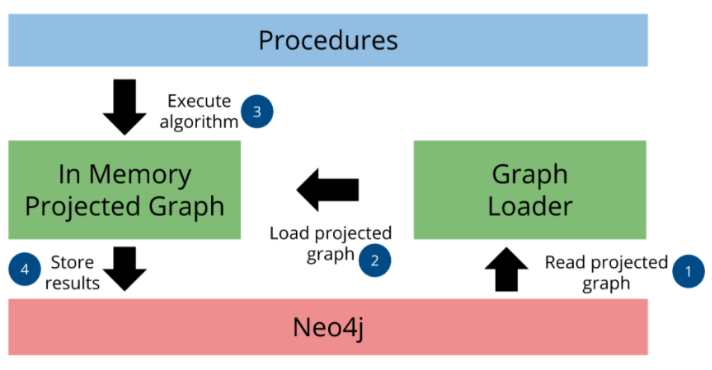

# Graph Analytics in Neo4j

Neo4J implementa versioni parallellizzate degli algoritmi più utili e comuni per grafi  
- Esposti come procedure Neo4j
- Invocabili direttamente usando la sintassi di Neo4j

Per runnare gli algoritmi nel modo più efficiente la libreria usa un  **in-memory graph** come formato per rappresentare i dati del grafo.  
- Bisogna quindi caricare i dati necessari dal db in un **named graph** (o _projected graph_).  
- Un Named Graph viene salvato nel **In-memory Graph Catalog**, e la quantit di dati caricati nel catalog può essere controllata da **proiezioni**.  


Workflow per l'uso di algoritmi appropriati:
1. Configurare il sistema
2. Definire le proiezioni sul grafo 
3. Selezionare gli algoritmi 
4. Fare una memory estimation per configurare adeguatamente il sistema per gestire la quantità di dati che deve essere processata 

Si può riassumere nei seguenti **step implementativi**:
1. Creare il Named Graph e salvarlo nel Graph Catalog (con le proiezioni, creare nomi diversi per ogni proiezione per poter lanciare algorimti us ogni proiezione)
2. Eseguire uno o più algoritmi dul Named Graph 
3. Consumare i risultati

<center>



</center>

<br>


## Graph Catalog:  

Esistono diverse Graph Catalog operations per gestire i Named Graph, ossia {Creazione, Modifica, Ricerca} di Named Graph.  

I Named Graph possono essere creati tramite:
- **Native Projection:**  
    Il grafo proiettato si crea specificando solamente le label, gli archi di interesse e le proprietà che vogliamo caricare, non permette di costruire dati derivati (es: creare nuovi archi).   
    _Pro_: Alte performance

- **Cypher Projection:**  
    Permette di modificare il grafo che abbiamo creando nuovi archi a piacimento, è più versatile grazie alla ricchezzadi linguaggio che offre la sintassi  di Cypher.  
    _Contro_: È meno performante in quanto la proiezione è **dinamica** $\rightarrow$ ogni volta che si vuole usare la proiezione viene eseguito il codice (si crea il grafo dai dati che esistono solo at query time).  


<br>


## Tipi di proiezioni:  


### Native Projection:  

```python
CALL gds.graph.project(
  graphName: String,                            // Nome che vuoi dare al grafo proiettato in memoria
  nodeProjection: String, List or Map,          // Come proiettare i nodi
  relationshipProjection: String, List or Map,  // Come proiettare le relazioni
  [configuration: Map (opzionale) ]             // Parametri di configurazione aggiuntivi
)
YIELD graphName, nodeCount, relationshipCount, projectMillis // Output della procedura
```
Il parametro di configuration è opzionale, la mappa in configuration può assumere uno parametri quali:
- `readConcurrency`  
    Tipo: Integer  - Default: 4  
    Specifica il numero di thread paralleli da utilizzare per legger i dati dal db durante la creazione della proiezione.  
- `nodeProperties`  
    Tipo: String, List o Map - Default: empty map  
    Specifica quali proprietàdei nodi devono essere caricata nella proiezione in memoria, utile se gli algoritmi necessitano di accedere a valori specifici delle proprietà dei nodi.  
- `relationshipProperties`  
    Tipo: String, List o Map - Default: empty map   
    Come quello prima ma per le proprietà delle relazioni, carica le proprietà specificate delle relazioni nel grafo in memoria.  
- `validateRelationships`  
    Tipo: Bool - Default: False  
    Gestisce il trattamento degli archi _dangling_ (archi che puntano a un nodo che non viene proiettato), per la maggior parte dei casi questo parametro è da lasciare su False pena il caricamento di un grafo incompleto.  


Esempi: 

```python 
MERGE (p1:Person {name: 'Alice'})
MERGE (p2:Person {name: 'Bob'})
MERGE (p3:Person {name: 'Charles'})

MERGE (p1)-[:KNOWS {since: 2021}]->(p2)            // Alice conosce Bob
MERGE (p2)-[:WORKS_WITH {project: 'Alpha'}]->(p3)  // Bob lavora con Charles
MERGE (p1)-[:KNOWS {since: 2022}]->(p3)            // Alice conosce Charles
```

- **Caricamento delle relazioni con `*`**:  
    ```python
    CALL gds.graph.project(
    'myGraphStar',  // Nome del grafo proiettato
    'Person',       // Proietta tutti i nodi con etichetta 'Person' (Alice, Bob, Charles)
    '*'             // Proietta TUTTE le relazioni che esistono TRA i nodi 'Person' proiettati
    )
    YIELD graphName, nodeCount, relationshipCount;
    ```

    Il grafo `myGraphStar` avrà 3 nodi e 3 relazioni, tuttavia al suo interno gli archi saranno strutturalmente indistinguibili per tipo, saranno dei semplici archi generici.  
    Se eseguissimo un algoritmo su `myGraphStar`, questo tratterebbe allo stesso modo tutti gli archi perchè l'operazione con `*` non permette di distinguere l'arco che era `KNOWS` da quello `WORKS_WITH`, saranno tutti dello stesso tipo.  

    <br>

- **Caricamento verboso con sintassi map**: 

    ```python
    CALL gds.graph.project(
    'myGraphMap',                    // Nome del grafo proiettato
    { Person: { label: 'Person' } }, // Proietta i nodi 'Person'
    {
        // Definiamo un gruppo di relazioni per 'KNOWS'
        GRAPH_KNOWS: {
        type: 'KNOWS',              // Specifichiamo il tipo di relazione originale
        orientation: 'NATURAL',     // Specifichiamo l orientamento
        properties: 'since'         // Decidiamo di caricare la proprietà 'since'
        },
        // Definiamo un gruppo di relazioni per 'WORKS_WITH'
        GRAPH_WORKS_WITH: {
        type: 'WORKS_WITH',
        orientation: 'NATURAL',
        properties: 'project'       // Decidiamo di caricare la proprietà 'project'
        }
    }
    )
    YIELD graphName, nodeCount, relationshipCount;
    ```

    In `myGraphMap` gli archi non sono generici, avremo due categorie distinte di archi: `GRAPH_KNOWS` e `GRAPH_WORKS_WITH`; in questo modo gli algoritmi GDS potranno distinguere e trattare questi archi in modo diverso, infatti avremo: 

    - Una relazione tra Alice e Bob, che nel grafo proiettato è del tipo GRAPH_KNOWS (e ha la proprietà since: 2021).
    - Una relazione tra Bob e Charles, che nel grafo proiettato è del tipo GRAPH_WORKS_WITH (e ha la proprietà project: 'Alpha').
    - Una relazione tra Alice e Charles, che nel grafo proiettato è del tipo GRAPH_KNOWS (e ha la proprietà since: 2022).  

    Nota: Per gestire le relazione _parallele_ (ossia relazioni dello stesso tipo e nelle stessa direzione tra la stessa coppia di nodi) si usa il parametro `aggregation` all'interno della configurazione di un tipo di relazione nella sintassi con mappa.  

    Nota2: Nel named graph che andiamo a creare possiamo derivare più relazioni da una singola relazione adattando la direzione degli archi:  
    ```python 
    call gds.graph.project(
        'my-graph',
        'Person',
        {
            KNOWS: {type:'KNOWS', orientation: 'NATURAL'},
            KNOWN_BY: {type:'KNOWS', orientation: 'REVERSED'},
            FRIEND_OF: {type:'KNOWS', orientation: 'UNDIRECTED'}
        }
    )
    ```  
    In questo esempio da una singola relazione `KNOWS` ne andiamo a creare 3 sfruttando le direzioni degli archi dal grafo di partenza, otterremo: {KNOWS,KNOWN_BY,FRIEND_OF}.  


<br><br>

## Cypher Projection: 

Usiamo questo tipo di proiezione quando selezionare le label dei nodi e le loro relazioni non è sufficientemente selettivo per descrivere il sottografo su cui vogliamo runnare l'algoritmo.  

Le Cypher Projection operano secondo un processo sequenziale, riga per riga 
- La query Cypher viene eseguita per prima, essa produce un flusso di risultati che vengono salvati in una tabella. Ogni riga di questa tabella rappresenta una soluzione o una corrispondenza trovata dalla query nel database.  
- La GDS non processa la tabella in un colpo singolo, essa consuma la tabella riga per riga e su ciascuna singola riga gds esegue la sua logica di proiezione 
- gds è un costruttore incrementale, per ogni riga che processa (e da cui crea una proiezione) aggiunge informazioni al grafo finale, in modalità append, è da vederlo come un processo aggregativo dove ogni riga contribuisce aggiungendo nodi o arhchi al grafo in costruzione, al termine del processo avremo il nostro grafo finale.  


Una Cypher Projection si costruisce in due step:

1. Una o più clausole in sintassi Cypher (query) per costruire il set di nodi o le coppie di nodi **source-target**
2. Una chiamata alla funzione `gds.graph.project` che opera su ogni riga prodotta dalla query Cypher, prendendo i nodi sorgente-destinazione per costruire gli archi del grafo proiettato, usa la seguente sintassi:
    ```python
    RETURN gds.graph.project(
        graphName: String,
        sourceNode: Node or Integer,
        [targetNode: Node or Integer,]
        [dataConfig: Map,]
        [configuration: Map]
        )
    ```

Es:  

```python
MATCH (source:Person)-[r:KNOWS]->(target:Person)       // 1. Trova tutte le relazioni :KNOWS tra nodi :Person
WITH gds.graph.project('persons', source, target) AS g // 2. Per ogni relazione trovata, passala a gds.graph.project
                                                       //    'persons' è il nome del grafo proiettato
                                                       //    source è il nodo di partenza della relazione
                                                       //    target è il nodo di arrivo della relazione
RETURN                                                 // 3. Restituisci informazioni sul grafo creato
    g.graphName AS graph,
    g.nodeCount AS nodes,
    g.relationshipCount AS rels
```

- la clausola `WITH` chiama `gds.graph.project` per ogni riga prodotta dal `MATCH`. 
- `source` e `target` sono i nodi identificati dal `MATCH`, la `gds.graph.project` userà questi per creare un arco nel grafo `persons`.  
- La clausola return mostra le informazioni aggregate sul grafo `persons` una volta che tutte le righe sono state processate  


```python
MATCH (source:Person)                                  // 1. Seleziona tutti i nodi :Person
OPTIONAL MATCH (source)-[r:KNOWS]->(target:Person)     // 2. POI, opzionalmente, cerca relazioni :KNOWS da questi nodi
WITH gds.graph.project('persons', source, target) AS g // 3. Passa source e (opzionalmente) target a gds.graph.project
RETURN
    g.graphName AS graph,
    g.nodeCount AS nodes,
    g.relationshipCount AS rels
```
- La clausola `OPTIONAL` tenta di trovare una relazione, se un source non ha la relazione che cerchiamo uscente, allora r e target saranno `null` per quella riga.  
    - Se target non è null, gds crea un arco tra source e target nel grafo 
    - se target è null, gds aggiungerà comunque source come nodo isolato al grafo (sconnesso).  
- Questo approccio assicura che tutti i nodi Person vengano inclusi nel grafo proiettato.  


### Cypher projection parameters: 
- graphName: nome con cui salvo il grafo nel catalogo
- sourceNode: nodo sorgente della relazione, ogni arco nel grafo deve avere un nodo sorgente  
- targetNode: nodo destinazione, può essere nullo (come nel caso di optional match, in tal caso il nodo sorgente sarà proiettato sconnesso)  
- dataConfig: Configurazione delle proprietà e delle label per i nodi sorgente e destinazione.  
    È una mappa al cui interno possiamo specificare:  
    - sourceNodeLabels: label (o lista di labels) da assegnare ai nodi sorgente nel grafo proiettato
    - targetNodeLabels: uguale a sopra ma per i nodi destinazione 
    - sourceNodeProperties: Specifica le proprietà del nodo sorgente originale da caricare
    - targetNodeProperties: uguale a sopra ma per i nodi destinazione
    - relationshipType: tipo delle realazioni create nel grafo proiettato
    - relationshipProperties: quali proprietà della relazione originale caricare sulla relazione proiettata
- configuration: parametri aggiuntivi per configurare la proiezione 

Nota: Bisogna prestare molta attenzione a distinguere tra **source** e **target** nodes, la logica di Cypher si basa su questo concetto e deve chiaramente poterli distinguere.  


**NOTA IMPORTANTISSIMA: Valutazione Dinamica delle Funzioni (es. `labels()`, `type()`):**
-   Quando si utilizzano funzioni Cypher come `labels(sourceNode)` o `type(relationship)` all'interno della configurazione di `gds.graph.project` (ad esempio, nel parametro `dataConfig`), queste non rappresentano valori statici.
-   Sono funzioni che vengono eseguite dinamicamente, a runtime, per **ogni singola riga** che `gds.graph.project` sta elaborando.
-   Il risultato di `labels(sourceNode)` sarà l'elenco effettivo delle etichette del `sourceNode` specifico di *quella riga corrente*. Analogamente per `type(relationship)`.
-   Questo permette a GDS di assegnare le corrette etichette e tipi a nodi e relazioni man mano che vengono processati dal flusso di dati della query Cypher, garantendo che il grafo proiettato rifletta accuratamente le caratteristiche di ogni elemento specifico identificato dalla query.


