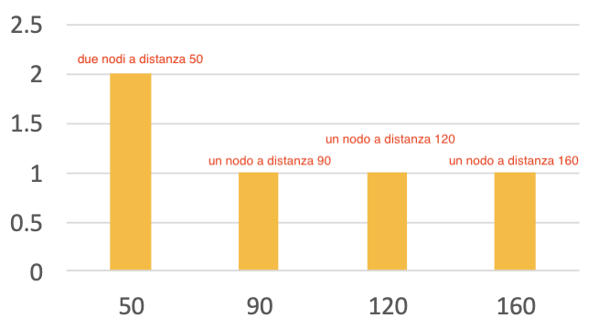
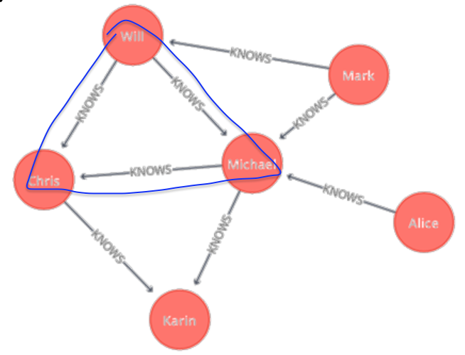

# Graph Analytics Tasks, Tools and Algorithms

Graph Definition: 

Un grafo è un set di insiemi $(V,E)$
- $V\rightarrow$ insieme di oggetti arbitrari che chiamiamo nodi o vertici
- $E\rightarrow$ insieme di coppie di vertici che chiamiamo archi o edges  
- Un grafo è _sparso_ se $|E| = \mathcal{O} (|V|)$ (numero di archi lineare al numero di nodi); un grafo è invece _denso_ se $|E| = \mathcal{O}(|V|^2)$; inoltre diremo che se ogni coppia di nodi è collegato allora il grafo è _completo_.  

I grafi sono usati per modellare relazioni 'pairwise' tra persone, oggetti o entità in una network.  

Tipi di graph analytics:   
- **Path Analysis**: Può essere sfruttata per trovare il cammino minimo tra due nodi in un grafo
- **Connectivity Analysis**: Può essere sfruttato per identificare debolezze in network, come una rete elettrcia 
- **Community Analysis**: Analisi che si basa sul concetto di densità e distanza - permette di individuare gruppi di persone interagenti in un social network
- **Centrality Analysis**: Permette di identificare rilevanza (relevancy) dalla struttura del grafo - permette di identificare le persone più influenti o le webpage con maggiori accessi.  

Nel ML:  
- Similarity Algorithms: Usato per trovare nodi simili in una network basato sulla topologia del grafo o sulle loro proprietà.
- Link Prediction: Usato per fare predizioni su nuovi possibili link (archi) nel grafo 
- Graph Embedding: L'embedding di grafi produce rappresentazioni vettoriali latenti per i grafi, che possono essere input per modelli di machine learning e deep learning.  

 

## Path Analysis:  

### 1. Shortest Path:  
L'algoritmo di shortest path calcola il cammino minimo (pesato) tra una coppia di nodi, l'algoritmo più noto per questa operazione è quello di **Dijkstra**.  

### 2. Single Soure Shortes Path (SSSP):  
L'algoritmo di SSSP calcola il cammino minimo (pesato) da un nodo sorgente a **tutti** gli altri nodi del grafo.  
Possiamo usare anche in questo caso Dijkstra $\rightarrow$ un esempio d'uso è nel protocollo di routing per le reti IP (OSPF - open shortest path first)

### 3. All Pairs Shortest Path (APSP):  
L'algoritmo APSP calcola il cammino minimo (pesato) tra tutti i nodi del grafo, questo algoiritmo è ottimizzato per renderlo più efficiente dal lanciare lo SSSP da ogni nodo del grafo.  
Utilzzato in problemi di servizio urbano come determinare il carico di traffico atteso in diversi segmenti della rete di trasporti.  

### 4. Minimum Weight Spanning Tree:  

**Spanning tree** $\rightarrow$ è un albero con $V-1$ archi che collega tutti i nodi del grafo, il costo di uno spanning tree è $(T) = \sum_{e\in T} W(e)$  
L'algoritmo maggiormente collaudato per questa operazione è quello di **Prim**.  
Può essere usato ad esempio per calcolare il percorso ottimale per un piano di turismo lowcost che vuole visitare svariate mete diverse.  

 

## Connectivity Analysis:  

Serve per analizzare la forma/struttura della rete  

### Global Connectivity:  

1. **Diametro e Diametro Effettivo:**  
    Chiamiamo **Diametro** il più lungo dei cammini minimi tra due nodi, corrisponde a fare una SSSP e prendere il valore più alto.  
    $\text{diam}(G)=\text{max}_{(n,n')\in N\times N}\sigma (n,n')$ 
    Il **Diametro effettivo** corrisponde al 90% del diametro. 

2. **Componenti fortemente connesse (SCC):**  
    In un grafo diretto, una componente fortemente connessa è un sottografo massimale tale che per ogni coppia di nodi $u$, $v$ in esso, esiste un cammino da $u$ a $v$ e un cammino da $v$ a $u$. Tutti i nodi all'interno di una SCC sono reciprocamente raggiungibili.

3. **Componenti debolmente connesse (WCC):**  
    In un grafo diretto, una componente debolmente connessa è un sottografo massimale tale che per ogni coppia di nodi $u$, $v$ in esso, esiste un cammino tra $u$ e $v$ se si ignorano le direzioni degli archi (cioè, considerando il grafo non diretto sottostante).

Un grafo fortemente connesso è sempre anche debolmente connesso. Il contrario non è necessariamente vero.  

### Local Connectivity:  

Analizza la connessione tra sottogruppi di nodi o dal punto di vista di un singolo nodo.

1.  **Local Connectivity / Distance Distribution (Distribuzione delle Distanze):**
    Questa analisi si concentra sulla struttura di connettività locale attorno a un nodo specifico (chiamato nodo sorgente).
    -   Si calcolano i cammini minimi (spesso utilizzando un algoritmo SSSP come Dijkstra) dal nodo sorgente a tutti gli altri nodi raggiungibili.
    -   La "_distance distribution_" è quindi l'istogramma o la frequenza dei nodi trovati a ciascuna distanza specifica dal nodo sorgente.
    -   Ad esempio, se dal nodo A, 2 nodi sono a distanza 50, 1 nodo a distanza 90, ecc., questa è la sua distribuzione delle distanze.
    -   Fornisce un profilo di quanti nodi si trovano a diversi "salti" o costi di distanza dal nodo di partenza, aiutando a comprendere la sua portata locale e la struttura del suo vicinato.

2. **Node Degree**:  
    Indica il numero di archi incideni ad un nodo, può essere {indegree, outdegree}.  
    
3. **Comparing distributions**:  
    Per confrontare due distribuzioni (ad esempio, dei gradi o delle distanze) si normalizzano i conteggi in frequenze relative (PDF). Le distanze più comuni sono:
    - **Distanza Euclidea**: misura la differenza quadratica tra le due distribuzioni: $D_E[P, P_e] = \sum_i (p_i - p_{i,e})^2$
    - **Divergenza di Kullback-Leibler (KL)**: misura quanto una distribuzione si discosta da un'altra in termini di informazione: $D_{KL}[P, P_e] = \sum_i p_i \log \frac{p_i}{p_{i,e}}$.  
La Distanza Euclidea è intuitiva e facile da calcolare. È una buona misura generale di "dissimilarità".
La KL Divergence è più legata alla teoria dell'informazione, misura quanta "informazione" perdi quando usi la distribuzione $P_e$ per approssimare la distribuzione $P$.  

4. **Triangle Count:**  
    Il triangle count serve a determinare quanti triangoli ci sono nel grafo.  
    Definiamo come triangolo un sottinisieme di 3 nodi in cui ongi nodo è collegato agli altri due, ossia sono presenti 3 archi che li collegano

  

È un indice che indica quanto una rete tenda a formare gruppi chiusi, ed è anche la base per il calcolo di altri indici di rete come il clustering coefficient.  

5. **Clustering Coefficient:**  

    È una misura che indica la tendenza complessiva dei nodi del grafo a formare gruppi chiusi.  
    Nel caso _globale_ $\rightarrow$ tendenza analizzata su tutti i nodi  
    Nel caso _locale_ $\rightarrow$ si concentra su un nodo specifico e misura quanto i suoi vicini siano propensi a formare un gruppo chiuso.  

    La formula è la seguente:   
    $C = \frac{3 \times \text{numero di triangoli}}{\text{numero di triplette connesse}} = \frac{\text{numero di triplette chiuse}}{\text{numero di triplette connesse}}$  

    - _tripletta (connessa)_: È un sottoinsieme di 3 nodi collegati da almeno 2 archi; diventa tripletta chiusa quando i tre nodi formano un triangolo.  
    - ogni triangolo contiene 3 triplette chiuse, da cui il fattore $3$ nella formula.  
    - un valore vicino a $1$ indica un alto clustering, mentre un valore vicino a zero indica il concetto di grafo sparso.  

 

## Centrality Analysis 

