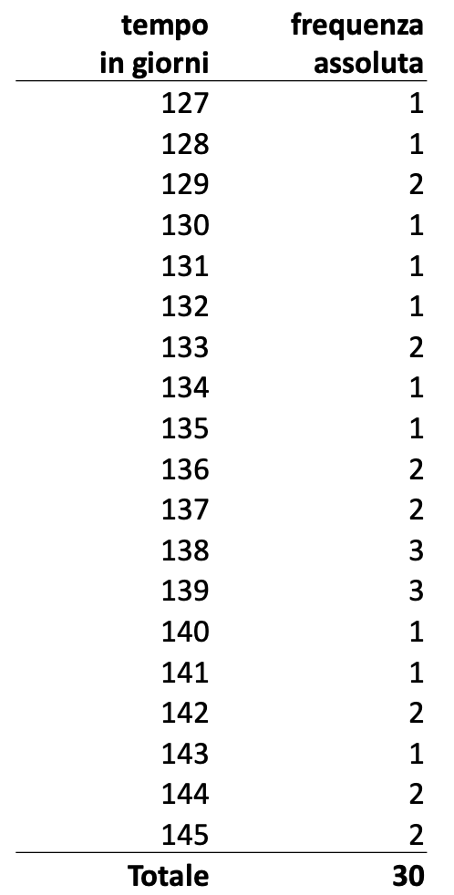

# Seconda Parte

### Revisione Medie

- Media Aritmetica per distribuzione Unitaria: 

    $$
    \bar{x}_a = \frac{1}{n}\sum_{j=1}^n x_j
    $$

    $$\bar{x}_a = \frac{(127+131+129+128+129+130+...+142)}{30}=\frac{1404}{30} = 136,8$$
 
- Media Aritmetica per distribuzioni di Frequenza:  
    $$
    \bar{x}_a = \frac{1}{n}\sum_{j=1}^K x_j n_j
    $$
    
    - $K$ è il numero delle modalità del carattere $X$ _quantitativo_
    - $n_j$ è la frequenza assolita della $j$-esima modalità

    

    

    

    $$
    \bar{x}_a = \frac{(127\times 1) + (128 \times 1) + (129 \times 2)+ ...}{30} = 136,8
    $$

- Media di una distribuzione divisa in classi: 

    In una distribuzione di frequenza abbiamo una variabile quantitativa suddivisa in classi, per calcolare il valore centrale di una classe useremo il valore centrale della classe.  

    $$
    \bar{x}_a = \frac{1}{n}\sum_{j=1}^K c_j n_j
    $$

    - $c_j$ è il valore centrale della classe, si calcola seguendo $c_j =[\text{estremo superiore} + \text{estremo inferiore} \text{diviso 2 }]$

    

    

    

    $$
    \bar{x}_a = \frac{(130\times 7 + 136\times 11 + 142\times 12)}{30} = \frac{4110}{30} = 137
    $$

- Media Ponderata: 
    Quando si vuole dare una importanza diversa alle osservazioni della variabile $X$ si attribuisce a ciascuna modalit $x_j$ un _peso_ non negativo $p_j$.  

    $$
    \bar{x}_a = \frac{x_1 p_1 + x_2 p_2 + ... + x_n p_n}{p_1+p_2+...+p_n} = \frac{\sum_{j=1}^k x_j p_j}{\sum_{j=1}^k p_j}
    $$  

    

    

    

    - Se calcolassimo la media aritmetica semplice dei tempi di produzione:
    $$
    \bar{x}_a = \frac{1}{3}(45 + 15 + 18) = \frac{78}{3} = 26 \, \text{minuti}
    $$

    - Se invece calcoliamo la media ponderata, usando come pesi il numero di pezzi prodotti:
    $$
    \bar{x}_a = \frac{45 \times 400 + 15 \times 2500 + 18 \times 1500}{400 + 2500 + 1500} = \frac{18000 + 37500 + 27000}{4400} = \frac{82500}{4400} \approx 18,75 \, \text{minuti}
    $$

    **La media ponderata è più rappresentativa:**

    La media aritmetica semplice (26 minuti) considera ogni tipo di prodotto allo stesso modo, senza tener conto della quantità effettivamente prodotta di ciascun tipo. Questo può portare a una visione distorta della realtà produttiva.

    La media ponderata (18,75 minuti), invece, tiene conto del fatto che la maggior parte dei pezzi prodotti richiede meno tempo (ad esempio, il tipo B con 2.500 pezzi e solo 15 minuti ciascuno). In questo modo, il valore medio riflette meglio il tempo realmente impiegato per produrre un pezzo, considerando l'effettiva distribuzione della produzione.

    In sintesi, la media ponderata fornisce una misura più realistica e utile per analizzare l'efficienza produttiva, soprattutto quando le quantità prodotte sono molto diverse tra loro. 

 

- Media aritmetica troncata (Trimmed mean):  
    La media aritmetica troncata è calcolata su una fissata percentuale di valori centrali, serve ad eliminare l'influenza dei valori anomali - outliers.  
    Ad esempio, nella media troncata al 50% si escludono il 25% dei valori più piccoli e il 25% dei valori più grandi.  
    ES: supponiamo che (2, 3, 3, 5, 5, 6, 8, 8, 9, 150) siano i valori che può assumere una variabile, la media aritmetica sarebbe: 19,9
    - la media troncata al 80% esclude il 10% dei valori più piccoli (=2) e il 10% dei valori più grandi (=150) $\rightarrow$ otteniamo $\frac{3+3+5+5+6+8+8+9}{8}=5,9$ 

 

- Media Geometrica:  
    La media aritmetica è una media utilizzata **solamente ed esclusivamente** quando i valori sono **positivi** e generati da rapporti.  

    $$
    \bar{x}_g = \sqrt[n]{\prod_{j=1}^n x_j}
    $$

    - la $n$ in apice alla produttoria ($\prod$) è il numero di osservazioni (es: se avessimo (5,2,46,68,9,34) $\rightarrow n=6$)
    - la produttoria calcola i prodotti di tutte le osservazioni 
    - otteniamo il valore facendo la radice $n$-esima di questo prodotto 

 

---

### Moda 

Si definisce _moda_ la modalità che presenta la massima frequenza, può essere calcolata su variabili quantitative e qualitative.  

- Moda per variabili quantitative divise in intervalli: 
    In questo dovremmo calcolare la _classe modale_, ossia la classe che si presenta il maggior numero di volte.  

    Distinguiamo due casi:  
    1. **Classi con uguale ampiezza**: Questo è il caso semplice, la classe modale corrisponde alla classe con frequenza maggiore, non dobbiamo fare nessuna operazione particolare.

    2. **Classi con ampiezza diversa**: Bisogna ricorrere al concetto di densità di frequenza della classe, ed andando a selezionare la classe modale come quella con densità media più alta.   
        Ricordiamo che la densità di frequenza è il rapporto tra la frequenza assoluta e l'ampiezza della classe $\rightarrow h_j = \frac{n_j}{a_j}$.  
        Nell'esempio sottostante, notiamo che le classi hanno ampiezze diverse (prima riga ha ampiezza 20, seconda riga ha ampiezza 10), in questo caso:  
        - $n_j$ = numero di reparti
        - $a_j$ = ampiezza della classe 

    

    

    

Se esiste una sola modalità più frequente abbiamo una distribuzione _unimodale_, parleremo invece di distribuzioni bimodali nei casi in cui la distribuzione ha due picchi distinti.  
Generalmente questo tipo di distribuzioni si hanno quando esiste un fenomeno sottostante non osservato le cui modalità del carattere osservato sono disomogenee.  

 

---

### Mediana

La **mediana** è il valore che occupa la posizione centrale in una distribuzione ordinata di dati.  
È una misura di tendenza centrale particolarmente robusta, perché non è influenzata dai valori estremi (outlier).

#### Definizione generale

Si definisce mediana $M_e$ di un insieme di unità ordinate (carattere quantitativo o qualitativo ordinabile) la modalità presentata dall'unità centrale, dove per unità centrale si intende l'unità che divide l'insieme in due sottogruppi di uguale numerosità: uno con modalità di ordine più basso e l'altro con modalità di ordine più alto.

---

#### Calcolo della mediana per distribuzioni unitarie

**Procedura:**
- Si ordinano i dati in senso crescente (o non decrescente).
- Si individua la posizione centrale:
  - Se il numero di dati $n$ è dispari, la posizione centrale è $\frac{n+1}{2}$.
  - Se $n$ è pari, la mediana è la media dei valori nelle posizioni $\frac{n}{2}$ e $\frac{n}{2} + 1$.

**Formule:**
- Se $n$ è dispari:
  $$
  M_e = x_{\frac{n+1}{2}}
  $$
- Se $n$ è pari:
  $$
  M_e = \frac{1}{2} \left( x_{\frac{n}{2}} + x_{\frac{n}{2}+1} \right)
  $$

**Esempio:**
Supponiamo di avere i dati: 6, 11, 15, 18, 27  
$n = 5$ (dispari), posizione centrale: $(5+1)/2 = 3$ → mediana = 15  
Se aggiungiamo un valore (es. 28): 6, 11, 15, 18, 27, 28  
$n = 6$ (pari), posizioni centrali: 3 e 4 → mediana = $(15+18)/2 = 16,5$

---

#### Mediana per distribuzioni di frequenza

Quando i dati sono raggruppati in modalità con frequenze, si calcola la posizione centrale sommando le frequenze fino a raggiungere o superare la metà del totale.

- Si calcola la **frequenza cumulata**.
- La mediana è la modalità corrispondente alla posizione centrale.

**Esempio:**  
Se la somma delle frequenze è 10, la posizione centrale è 5,5.  
Si individua la modalità che contiene la posizione 5,5 nella frequenza cumulata.

#### Mediana per dati raggruppati in classi

Quando i dati sono suddivisi in classi (intervalli), non si può individuare un valore preciso, ma si può stimare la mediana tramite la **classe mediana** (quella in cui la frequenza cumulata supera il 50%).

**Formula della mediana per dati in classi:**
$$
M_e \approx I_m + \left( \frac{0,5N - F_{m-1}}{F_m - F_{m-1}} \right) \Delta_m
$$

Dove:
- $I_m$: estremo inferiore della classe mediana
- $N$: numero totale di osservazioni
- $F_{m-1}$: frequenza cumulata fino alla classe precedente quella mediana
- $F_m$: frequenza cumulata della classe mediana
- $\Delta_m$ (o $a_m$): ampiezza della classe mediana

**Spiegazione:**  
La formula interpola all'interno della classe mediana, assumendo che i dati siano distribuiti uniformemente nella classe.

  

# Variabilità 

Ricordiamo una quantità fondamentale $\rightarrow$ **gli scarti**  
Si definisce scarto di una osservazione (dalla media) la differenza tra l'osservazione e la media delle osservazioni $\rightarrow$ ($x_j - \bar{x}_a$).  

Avevamo definito queste uguaglianze, grazie alle proprietà della media:

$$
\sum_{j=1}^n (x_j - \bar{x}_a) = 0
$$

$$
\sum_{i=1}^n (x_i-c)^2 = \text{min} \space\space\space\space\space\space\text{se}\space\space\space\space\space\space c=\bar{x}_a
$$  

 

Gli indici di variabilità permettono di analizzare meglio le proprietà della distribuzione e superare le limitazioni della media (che è fortemente sensibili ad outlier).    
Infatti se le unità della popolazione non sono 'vicine' alla media, essa da sola non è idonea a rappresentare la sintesi distribuzione $\rightarrow$ distribuzioni molto diverse possono avere valori medi uguali, bisogna evidenziare altre tipicità descrittive.  

La **variabilità** di una distribuzione esprime la tendenza delle unità di un collettivo ad assumere diverse modalità del carattere, per un carattere quantitativo la diversità è valutata in termini di scostamenti al quadrato.   
Un indice di variabilità deve soddisfare due proprietà:  
1. Deve assumere il valore _minimo_ se e solo se tutte le unità della distribuzione presentano uguale modalità del carattere (distribuzione dove ogni unità ha lo stesso valore)
2. Deve _aumentare_  all'aumentare della diversità tra le modalità assunte delle varie unità.  

 

---

### Devianza  
La devianza di $n$ valori $x_1,x_2,...,x_n$ di una variabile $X$ con media aritmetica $\bar{x}_a$ è data dalla somma del quadrato degli scarti dalla media aritmetica.  

$$
\text{Dev} = \sum_{i=1}^n (x_i - \bar{x}_a)^2
$$
  
L'elevazione al quadrato degli scarti serve principalmente per due motivi:
1. Evitare che gli scarti positivi e negativi si annullino: ricordiamo che la somma degli scarti semplici è sempre 0 per definizione di media, quindi non darebbe nessuna informazione sulla dispersione dei dati. Elevando al quadrato tutti gli scarti diventano positivi permettendo di valutare e quantificare la variabilità.  
2. Dare _maggiore_ peso agli scarti grandi: scarti maggiori influiscono di più quando vengono elevati al quadrato, rendendo la misura di variabilità più attinente a valori anomali (limite della media).  

In breve, il quadrato enfatizza le distanze grandi e garantisce che tutti gli scarti contribuiscano positivamente alla misura di dispersione.  

La devianza per una **distribuzione di frequenza** con media $\bar{x}_a$ si calcola:

$$
\text{Dev} = \sum_{j=1}^K (x_j - \bar{x}_a)^2 n_j
$$

- dove $n_j$ sono le frequenze assolute della modalità $j$-esima.  

La devianza per una **distribuzione di frequenza in classi** con media $\bar{x}_a$ si calcola:  

$$
\text{Dev} = \sum_{j=1}^K (c_j - \bar{x}_a)^2 n_j
$$

- dove $c_j$ sono i valori centrali della classe $j$-esima  

La devianza assume valore nullo (0) se e solo se tutte le unità della distribuzione presentano lo stesso valore del carattere.
Tuttavia non possiede la stessa unità di misura dei valori della distribuzione in quanto i valori vengono elevati al quadrato e aumenta notevolmente all'aumentare della numeristà del collettivo.  

per sopperire a questa evenienza introduciamo due misure di devianza: la varianza e la devianza standard 

 

---

### Varianza

La varianza è anch'essa un indice di scostamento dalla media aritmetica e si calcola come devianza diviso il numero di osservazioni, è quindi la _media al quadrato  degli scarti dalla media_: 

$$
\sigma^2 = \frac{\text{Dev}}{n}
$$

$$
\sigma^2 = \frac{1}{n}\sum_{i=1}^n (x_i - \bar{x}_a)^2
$$

Va in contro al problema dell'aumento del fattore di devianza con l'aumentare della numerosità del collettivo normalizzando la misura rispetto alla numerosità $N$.  
L'aumento del valore di devianza con la numerosità della popolazione è un grande limite in quanto se raddoppiamo il numero di osservazioni mantenendo la stessa variabilità, la devianza raddoppia, in quanto somma più scarti!!
- questo è problematico perchè una misura di dispersione dovrebbe riflettere quanto i dati variano, NON quanto è grande il dataset. 
    - es: Collettivo A: 5 valori con devianza = 10;  
         Collettivo B: 10 valori identici ad A $\rightarrow$ devianza = 20 (ma la variabilità è la stessa!!).  

Per calcolare la varianza di una distribuzione di frequenza basterà aggiungere alla formula il valore delle frequenze assolute delle varie modalità, ossia $n_j$.  
Per una distribuzione suddivisa in classi, avremo la stessa formula dove al posto della $x_i$ avremo il valore centrale $c_i$ della classe.  

Esiste una dimostrazione (omessa) che ci permette di **semplificare i calcoli**, questa dice che la varianza può essere calcolata ricorrendo al calcolo dei quadrati dei valori e della media.  

Per distribuzioni unitarie:  
$$
\sigma^2 = \frac{1}{n}\sum_{i=1}^n x_i^2 - \bar{x}_a^2 
$$

Per distribuzioni di frequenza: 
$$
\sigma^2 = \frac{1}{n}\sum_{i=1}^K x_i^2 n_j - \bar{x}_a^2 
$$

La varianza **non aumenta** all'aumentare della numerosità del collettivo **ma** non possiede la stessa unità di misura dei valori della distribuzione (in quanto abbiamo ancora il termine quadratico)  

 

--- 

### Deviazione Standard  

Si definisce deviazione standard la radice quadrata della varianza:

$$
\sigma = \sqrt{ \sigma^2}
$$  

La deviazione standard ha la stessa unità di misura delle variabili osservate **ma** è un indice assoluto, quindi non consente di confrontare variabili con differenti unità di misura o stessa unità di misura ma intensità o numerosità diversa.  

 

---

### Coefficiente di Variazione: 

Varianza e deviazione standard sono indici che risentono dell’unità di misura e dell’ordine di grandezza dei dati. Pertanto il confronto della variabilità tra collettivi diversi o variabili diverse non può essere fatto.  

A questo scopo si può utilizzare il _Coefficiente di variazione_ che è una misura data dal rapporto tra la deviazione standard e la media aritmetica moltiplicata per 100.  
_Nota:_ È calcolabile sono quando la media è positiva (>0) 

$$
\text{CV} = \frac{\sigma}{\bar{x}_a}\times 100
$$

La deviazione standard mantiene l'unità di misura originale dei dati, e questo la rende assoluta, ossia legata alla scala concreta del fenomeno, se volessimo confrontare la variabilità di variabili con unità di misura diverse o con la stessa unità ma ordini di grandezza molto diversi non potremmo con la deviazione standard, qui entra in gioco il coefficiente di varianza

Es:  
Vogliamo confrontare la variabilità di due fenomeni:
1. altezze: abbiamo media = 1.70m e deviazione std = 0.10m
2. peso: media = 65kg e deviazione std = 8kg

Se ci chiediamo dove esista più variabilità non ha senso confrontare 0.10m con 8kg  
Applicando il coefficiente di variazione otteniamo invece:

- CV altezze = $\frac{0.10}{1.70}\times 100 = 5.88$%
- CV pesi = $\frac{8}{65}\times 100 = 12.31$%
- Possiamo concludere che il _peso_ ha variabilità _maggiore_!!  

Il coefficiente di variazione dà indicazioni sulla variabilità del fenomeno , ma non ci dice se siamo lontani o vicini dalla condizione di massima variabilità.  

 

---

### Altre misure di variabilità:  

- **Campo di Variazione o Range:**  
    Si definisce Campo di Variazione o Range di una variabile $X$ lo scarto fra il valore minimo e il valore massimo dei valori ordinati della distribuzione:
    $$
    R = x_n - x_1
    $$

- **Scarto Interquartile (IQR):**  
    Si definise Scarto Interquartile di una variabile $X$ lo scarto (differenza) fra il terzo e il primo quartile di una distribuzione:
    $$
    IQR = Q_3 - Q_1 \space\space\space\space IQR \sim W
    $$  

    - $Q_1$ Valore sotto cui cade il 25% dei dati ordinati.
    - $Q_3$ Valore sotto cui cade il 75% dei dati ordinati.
    - $IQR$ L'ampiezza dell'intervallo che contiene il 50% centrale dei dati (dal 25° al 75° percentile).

    Lo scarto interquartile rappresenta il 50% centrale dei tuoi dati, ed è un intervallo che ti dice tra quali valori è concentrato il 50% dei dati.  
    Es: Disponi 100 persone in fila in ordine di altezza  
    - Le prime 25 ($Q_1$) sono le più basse.
    - Le ultime 25 (sopra $Q_3$) sono le più alte
    - Le 50 persone nel mezzo (tra $Q_1$ e $Q_3$) rappresentano il gruppo "centrale" né troppo basso né troppo alto.

 

---

### Nozioni Importanti:  

- **Standardizzazione:** 
    Si usa quando si vogliono confrontare due o più distribuzioni e consiste nel riportare, attraverso una trasformazione lineare, ogni distribuzione ad una avente media nulla e deviazione standard unitaria.  

    Si passa dalla variabile $X$ alla variabile $Y$ dove la modalità $y_i$ è data da:

    $$
    y_i = \frac{x_i-\bar{x}_a}{\sigma_x} \qquad \forall i=1,...,n
    $$

    La variabile $Y$ (trasformazione lineare di $X$) ha media nulla e varianza unitaria.  

    $$
    \bar{y}_a = 0 \qquad \sigma_y^2 = 1 \qquad \sigma =1  
    $$

    Es: prendiamo il caso delle 6 altezze di studenti  
    $x=(168,169,170,171,174,186) \qquad \bar{x}_a=173 \qquad \sigma_y^2 = 37,3 \qquad \sigma =6,1$

    Operiamo la trasformazione lineare:

    $$
    y_i = \frac{x_i - 173}{6,1} \qquad \forall i=1,...,n
    $$

    Questo ci permette di calcolare una nuova variabile $y$ che ha una sua _distribuzione_:  

    

    

    
  

    Se plottiamo i grafici di $X$ e di $Y$ noteremo che i punti sono in corrispondenza nelle stesse posizioni, ma l'asse delle ordinate avrà valori diversi per la distribuzione di $Y$, notiamo infatti che il valore medio è sullo 0.  

    

    

    
  

     

- **Simmetria:**  
    Una distribuzione si dice simmetrica se è possibile dividerla in due parti uguali, altrimenti si dice che è _asimmetrica_.  
    Esistono due tipi di asimmetrie:
    1. asimmetrica positiva: sono più frequenti le modalità grandi del carattere (coda a destra)
    2. asimmetrica negativa: sono più frequenti le modalità piccole del carattere (coda a sinistra)  

    Usiamo tre regole per valutare la simmetria di una distribuzione unimodale:
    - Se: Moda = $M_e$ = $\bar{x}_a\rightarrow$ Simmetrica
    - Se: Moda < $M_e$ < $\bar{x}_a\rightarrow$ Asimmetrica positiva 
    - Se: $\bar{x}_a$ < $M_e$ < Moda $\rightarrow$ Asimmetrica negativa

    

    

    
  

# Analisi dell'associazione tra due caratteri

Ricordiamo la forma della tabella a doppia entrata, che rappresenta una **distribuzione congiunta**, ossia una distribuzione dove sono stati rilevati contemporaneamente due caratteri:  

  

 

Se navighiamo lungo le righe $\rightarrow$ teniamo fermo il valore della $x_i$ e facciamo variare orizzontalmente i valori delle $y_i$.  
Se navighiamo lungo le colonne $\rightarrow$ teniamo fermo il valore della $y_i$ e facciamo variare verticalmente i valori delle $x_i$.  

Esempio analisi tabella:

 

- Qual'è la moda del colore degli occhi per gli individui con capelli castani ?  
    Fissiamo il valore della $x=\text{castani}$ e analizziamo i dati orizzontalmente, notiamo che il valore più frequente (moda) in quella riga è 75, concluderemo dicendo quindi che la moda per questo valore è colore degli occhi 'castani'.  

- Qual'è la moda del colore dei capelli per gli individui con occhi verdi ?  
    Procediamo analogamente a prima, questa volta fissiamo $y=\text{verdi}$ e analizzando verticalmente concluderemo che la moda è colore dei capelli 'castani'.  

- Moda del colore degli occhi? e del colore dei capelli?  
    Dobbiamo guardare la distribuzione marginale degli occhil ossia della $y$, e guardando l'ultima riga concuderemo dicendo che la moda è colore 'castani'  
    Per trovare la moda del colore dei capelli ossia della $x$ guardiamo la distribuzione marginale di questo carattere che si trova nell'ultima colonna della matrice, quindi concluderemo dicendo che la moda è colore 'castani'.  

