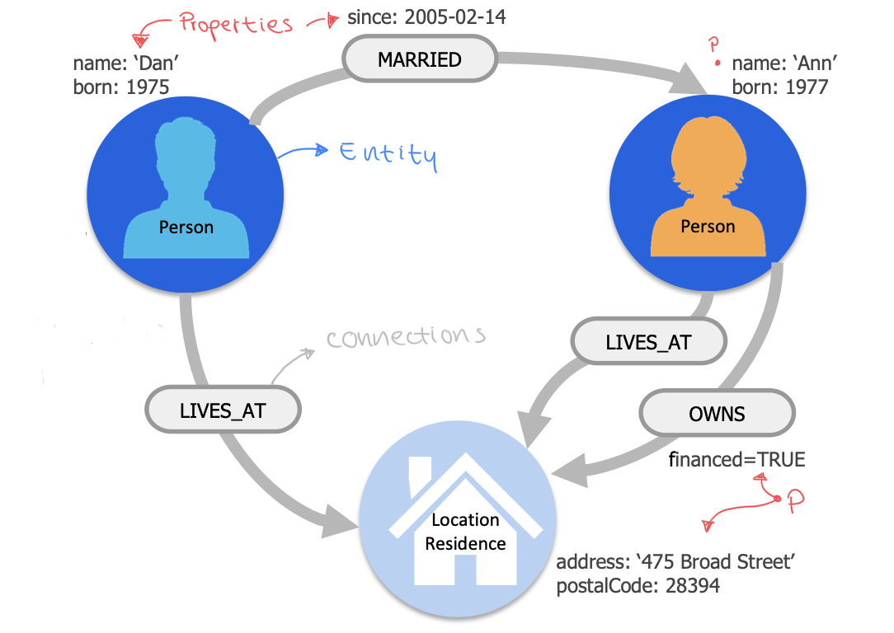
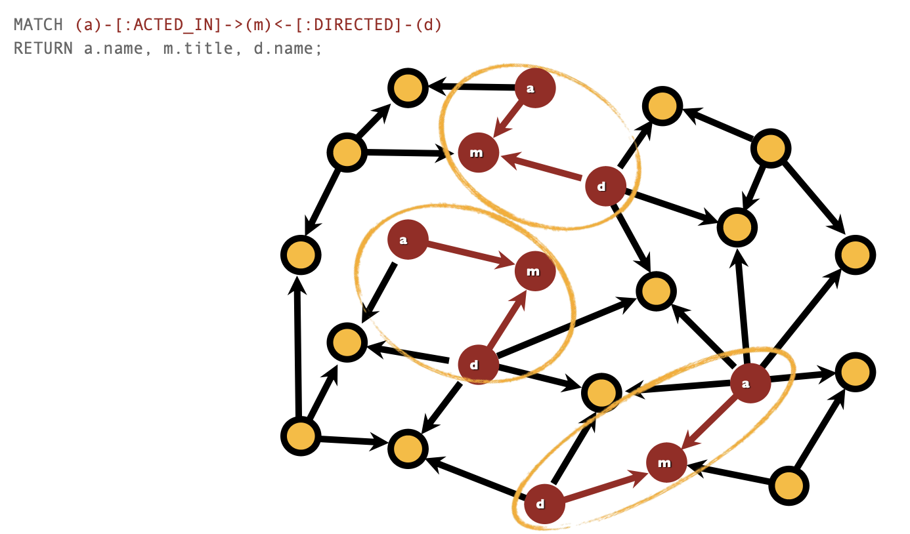
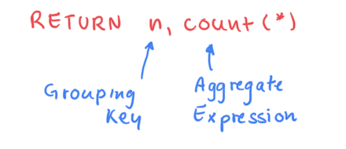
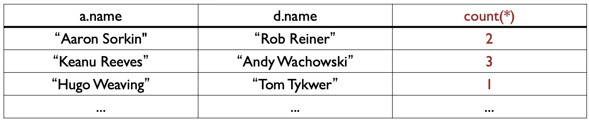

# Neo4J 


### Table of Contents:

1. [Graph Modeling](#graph-modeling)
2. [Property Graph Data Model](#property-graph-data-model)
3. [Cypher Basic](#cypher-basics)
4. [Selection Constraints](#selection-constraints)


# Graph Modeling 

Un grafo è un insieme discreto di oggetti, ognuno dei quali ha qualche inieme di relazioni con gli altri oggetti.   

Esso è composto da nodi ed archi:
- Node: Il principale DataElement
- Edge: Arco che esprime una relazione tra più nodi , può avere una direzione e metadati (es: label)  


Ci sono diversi modi di attraversare un grafo:
1. **Walk:**  Una sequenza alternata ordinata di nodi e relazioni, i nodi e archi possono ripetersi  
2. **Trail:**  Una Walk in cui nessun arco (relationships) è ripetuto   
3. **Path:**  Un Trail nel quale nessun nodo viene ripetuto.  

(un nodo da solo può esistere, un arco da solo non può esistere senza nodi).  


# Property Graph Data Model  

Le componenti di un nodo `Neo4j` includono:
- **Nodi (Entità):** 
    Rappresentano gli oggetti o le entità del grafo; possono avere un nome per rappresentare meglio il tipo di nodo o il ruolo di esso (persona, location, residenza,...).   
    I nodi vengono raggruppati dalle loro label per ottimizzare le query, ed essi possono avere nessuna label, una label o anche più label.  
- **Relazioni (Collegamenti tra Entità):**  
    Rappresentano i 'verbi' delle 'domande' del mio dominio, e corrispondono al **collegamento** tra due nodi del grafo.  
    Possono avere un tipo (MARRIED,LIVES_AT,OWNS,...)  
- **Attributi - Properties:**  
    Sono aggettivi per descrivere meglio i **nodi**, o avverbi per descrivre meglio le  **relazioni**.  
    Seguono la forma `key:value`, possono essere _opzionali_ o _requested_, e i valori possono essere _unique_ se lo di desidera.  




# Cypher Basics:  

Cypher è il linguaggio query usato per Neo4j, segue uno stile **pattern-matching Dichiarativo**, pensato per grafi ma con sintassi simile a SQL.  

Una Cypher-Query è composta da differenti clausole:   
- **Reading clause:** si leggono dati dal database  
     $\rightarrow$ `MATCH` - mi specifica i pattern di ricerca all'interno del database
- **Projecting clause:** definisce cosa ritornare nel set risultante  
     $\rightarrow$ `RETURN` - definisce cosa includere nella query risultante


### Graph Patterns: 

Sono espressi in Cypher sfruttando ASCII-art come sintassi

**Nodi:**
- Si specificano i nodi con le parentedi tonde $\rightarrow$ `()`
- Si può specificare il tipo del nodo $\rightarrow$ `(:Movie)`

**Relazioni - Archi:**
- Si definiscono le relazioni con le parentesi quadrate $\rightarrow$ `[]`
- Possiamo specificarne il tipo e la direzione $\rightarrow$   
    `(:Movie) <- [:LIKED] - (:User)`

Possiamo definire elementi del grafo con alias per poter riferirli con maggiore comodità:  
`(m:Movie) <- [l:LIKED] - (u:User)` $\rightarrow$ dopo possiamo accedere a questi elementi usando le  variabili `m,l,u`.  

<br>

## Esempi di Query:  

Seleziona tutti i nodi 'a' che hanno una relazione diretta con un altro nodo 'b' e li restituisce - trova tutte le coppie di nodi collegati da una relazione diretta, indipendentemente dal tipo di relazione.     

### 1:

```
# arco orientato: 
MATCH (a) --> (b)
RETURN a,b;

# arco non orientato
MATCH (a) -- (b)
RETURN a,b;

# nodi con un arco uscente
MATCH (a) --> ()
RETURN a;

# nodi con un arco incidente
MATCH (a) <-- ()
RETURN a;

```
primo caso:  
(a) --> (b)   

mentre la seconda:  
(a) --> (b) &   
(a) <-- (b)  

La terza ci restituisce i nodi che hanno almeno un arco uscente, la quarta quelli con un arco incidente.  
Le direzioni nella sintassi, ossia: `-`, `<-` o `->` sono importantissime per identificare il tipo di arco giusto.   


### 2:

```
# tipo di archi uscenti da nodi
MATCH (a) - [r] -> ()
RETURN a.name, type(r);

# uso esplicito del tipo di relazione direttamente nella query
MATCH (a) - [:ACTED_IN] -> (m)
RETURN a.name, m.title

# attore, ruolo e titolo film 
MATCH(a) - [r:ACTED_IN] -> (m)
RETURN a.name, r.roles, m.title;

```

**Nota:**  
La funzione `type(r)` in Cypher restituisce il tipo di una relazione `r`. Il tipo di una relazione è il nome che descrive la relazione, come ad esempio `LIKED`, `FOLLOWS`, `ACTED_IN`,...  
Questo nome può essere usato direttamente nella sintassi per specificare il tipo di relazione a cui siamo interessati.  


primo esempio:  
Si prendono tutti i nodi che hanno archi uscenti e di questi nodi si stampa l'attributo `name`, successivamente si stampa il tipo di relazione che descrive l'arco uscente matchato.  


terzo esempio:  
prende gli attori che hanno un arco uscente con etichetta 'ACTED_IN' verso un film, e stampa nome attore, ruolo nel film  e titolo del film.  

## Path in Neo4j

I **path** possono essere visti come simili ai join SQL, con la differenza che i path sono utilizzati per trovare e combinare nodi e relazioni basati su pattern di grafo.  

```
MATCH (a)-[:ACTED_IN]->(m)<-[:DIRECTED]-(d)
RETURN a.name, m.title, d.name;
```

Questa clausola `MATCH` cerca un pattern in cui: 
- un nodo `a` ha una relazione `ACTED_IN` con un nodo `m`
- lo stesso nodo `m` ha una relazione `DIRECTED` con un nodo `d`  


In Neo4j, un path è una sequenza di nodi e relazioni che rappresenta un percorso nel grafo. I path sono utilizzati per esprimere come i nodi sono collegati tra loro attraverso le relazioni.  
La sintassi di Cypher permette di specificare questi path in modo dichiarativo, utilizzando una notazione simile all'ASCII-art.



Le funzioni `nodes(p)` e `relationships(p)` sono utilizzate per estrarre i nodi e le relazioni da un path. 
- `nodes(p)` $\rightarrow$ restituisce tutti i nodi che fanno partedel path `p` 
- `return p` restituisce l'intero path - simile al formato JSON - includendo sia i nodi che le relazioni 
- `relationships(p)` restituisce una lista di relazioni che fanno parte del path `p`


<br>

# Selection Constraints

Si possono mettere vincoli per filtrare le query attraverso **constrains** sulle property dei nodi e degli archi.  

Si usa la clasusola `WHERE` e si possono concatenare più condizioni attraverso i classici operatori booleani quali `AND`, `NOT`, `XOR`,...  

**Nota importante:**  
Bisogna sapere il tipo di dato della property sulla quale stiamo filtrando:  

```
# Film in cui Keanu Reeves interpreta 'Neo' 

MATCH (a) - [r:ACTED_IN] -> (m)
WHERE a.name='Keanu Reeves'
AND 'Neo' in r.roles
RETURN DISTINCT movie.title;

```

Si può notare la particolarità nell'uso dell'operatore `IN` in quanto `r.roles` è una **lista**.  
Per controllare se un elemento è presente in una lista si usa `IN`, se avessimo usato `=` avremmo avuto un errore.  

Si può anche usare una sintassi compatta per clausole semplici:

```
MATCH (actor:Person {name:'Keanu Reeves'}) 
RETURN actor.born

# equivalente a:

MATCH (actor:Person)
WHERE actor.name = 'Keanu Reeves'
RETURN actor.born
```


## Aggregation - Sort and Limit

Funzioni di aggregazione (similmente a SQL): 
- `count(x)` $\rightarrow$ conta il numero di occorrenze 
- `min(x)` $\rightarrow$ ottiene il valore minore
- `max(x)` $\rightarrow$ ottiene il valore maggiore 
- `avg(x)` $\rightarrow$ ottiene la media di un valore numerico 
- `collect(x)` $\rightarrow$ inserisce (colleziona) tutte le occorrenze in un array  

Le funzioni di aggregazione prendono multipli valori come argomenti,  calcolano e ritornano un valore aggregato da essi.  
Possono esser calcolati:
- Sui sottografi che fanno match
- Su sottografi di tali sottografi usando `grouping keys`:  
    Le Grouping Keys sono espressioni usati per raggruppare i valori che vanno in pasto alle funzioni di aggregazione, per seguire un ordine flessibile
    - I sottografi che matchano sono divisi in diversi `buckets`
    - La funzione di aggregazione poi viene eseguita su questi buckets, calcolando un valore aggregato _per_ bucket.  
      

    - `count()`: può essere usata in due varianti  
        `count(*)`: restituisce il numero di matching rows  
        `count(expr)`: restituisce il numero di valori non-nulli ritornati dall'espressione.    
        es: la colonna count(*) conterrà il numero di film in cui un attore ha partecipato diretti dallo stesso direttore
        ```
        MATCH (a)-[:ACTED_IN]->(m)<-[:DIRECTED]-(d)
        RETURN a.name, d.name, count(*) 
        ```  
        


Funzioni di ordinamento (sorting):
- `ORDER BY`$\rightarrow$ ordina le query in base a filtri 

Funzioni limite:
- `LIMIT`$\rightarrow$ limita il numero di occorrenze che ritorna la query

