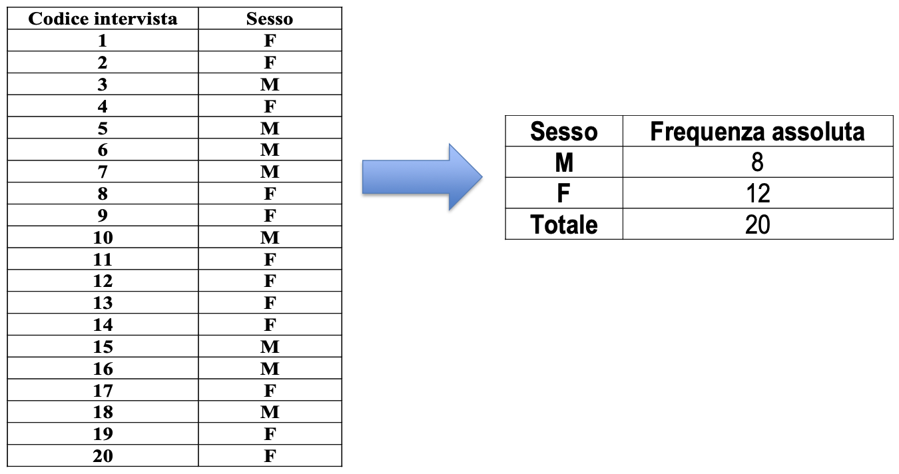
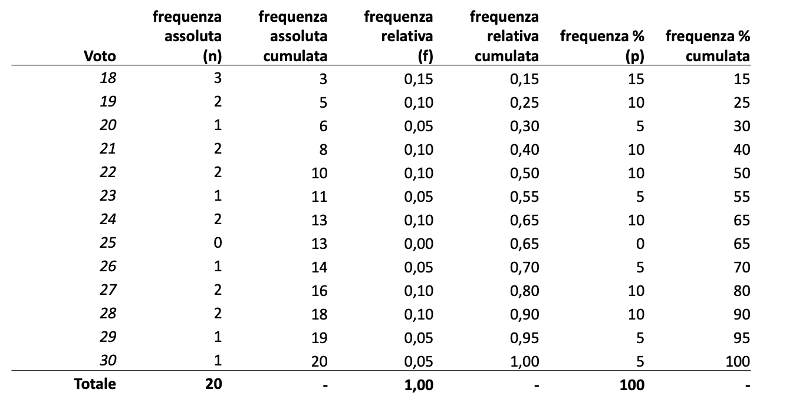

# Statistica Elli - Preparazione Esame

### Table of contents:
0. [Esame]()
1. [Caratteri Statistici]()

 

---

 

### Esame:
bla bla bla 

 

### Caratteri Statistici

Due tipi di caratteri possibili: {**Qualitativi, Quantitativi**}
- Qualitativi: 
    - Ordinabili: 
    - Non ordinabili (categorici o nominali):   
    Su scala nominale (posso solo dire != o =) o su scala ordinale (< o > ma non posso dire di quanto, non hanno unità di misura)

- Quantitativi:
    - Scala di intervalli: hanno unità di misura e un valore zero arbitrario per permettere additività 
    - Scala di rapporti: hanno unità di misura e uno zero assoluto, sono permesse oltre all'adizione la moltiplicazione e la divisione  
    Possono essere trasferibili (n dip, stipendio,...) o non trasferibili (altezza, peso,...)  

### Distribuzioni semplici

**Distribuzione statistica unitaria:** insieme delle osservazioni relative alle n unità del collettivo -> numero di osservazioni registrate per il carattere X.  
- distribuzione unitaria semplice: se si riferisce a un solo carattere (sesso)
- distribuzione unitaria multipla: se si riferisce a più di un carattere (sesso, età)

Classificazione dei dati $\rightarrow$ raggruppare i dati secondo le modalità dello stesso carattere.  
La tabulazione è l'operazione di riportare i dati in forma tabellare:
- se distribuzione statistica semplice diventa: tabella a due colonne (1: modalità ; 2: frequenze assolute {ossia quante unità statistiche possiedono quella modalità $\rightarrow$ numero di volte $n_i$ con cui si presenta la modalità $x_i$}) $\rightarrow$ prende il nome di distribuzione di frequenza.  

nota: nella distribuzione unitaria abbiamo un numero di righe pari al numero delle unità, nella distribuzione di frequenza abbiamo numero di righe pari al numero delle modalità.  

In presenza di caratteri quantitativi continui o alto numero di caratteri discreti si può effettuare una suddivisione in classi (a intervalli).  
- ampiezza della classe $\rightarrow$ differenza tra due estremi 
- valore centrale della classe $\rightarrow$ semisomma degli estremi
- densità di frequenza della classe $\rightarrow$ rapporto tra frequenza assoluta e ampiezza dell'intervallo

Si passa dalle distribuzioni unitarie alle distribuzioni di frequenza

**Distribuzioni di frequenza relative, cumulate e percentuali**  
- distribuzione di frequenza relativa $\rightarrow$ associa alle modalità che può assumere un carattere X quantitativo o qualitativo il **rapporto tra la frequenza assoluta ed il numero di unità osservate**.  
     la somma è sempre uguale a 1

$$
\text{distribuzione relativa} = \frac{\text{freq. assoluta}}{\text{numero unita osservate}}
$$  

   

- distribuzione di frequenza percentuale $\rightarrow$ come sopra ma moltiplicato per 100, la somma è sempre uguale a 100.  

- distribuzione di frequenza cumulata $\rightarrow$ associa alle modalità che può assumere un carattere X la somma delle frequenze _fino_ a quella modalità.  
La prima frequenza cumulata osservata è pari alla frequenza assoluta della prima modalità, mentre l'ultima frequenza cumulata osservata è sempre paria 1.  

  

