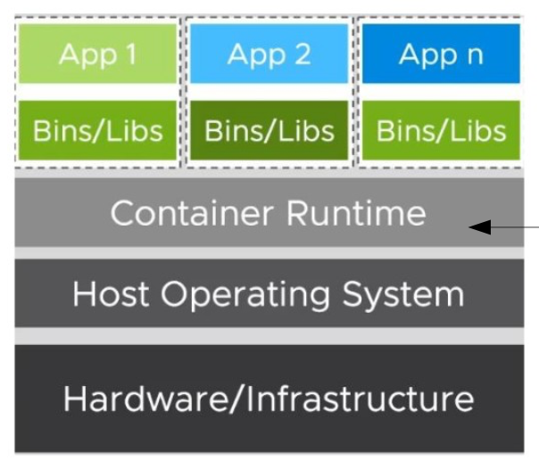
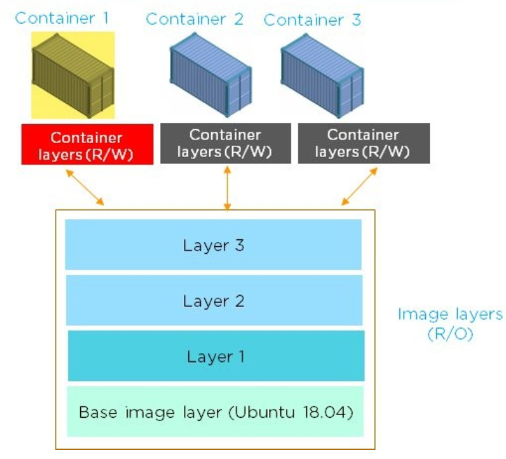

# Containers - Cloud and Edge Computing

## Motivations for software containers

Virtualization was the first huge step, but in terms of **scalability** the VM is complex and expesive  
Each VM includes the compexity of every OS: a full copy of the OS, device drivers, libraries and implementation of specific sw.  

**Containers** are a lightweight VM that has it's own process space and its own network interface $\rightarrow$ they are packages of sw that contain all the necessary elements to run in any environment.  
THey share the host machine's OS kernel (don't require the overhead of associating an OS for each application).  

### Containers

Containers are a standardized way to package an application, it's configuration and dependencies $\rightarrow$ single logical object. 
It appears as a set of visible processes on the host machine!

Container images include all the software $\rightarrow$ settings, libraries and dependencies needed to run and can guarantee: 
    - **Standard packing** 
    - **Isolation and efficiency** 
    - **Portability**

A container encapsulates an application as a single **executable** package with code and all its dependencies  

The Container Runtime is also called Container Engine

**Observations:**
1. Containers and OS: containers depend on the kernel of the host OS but being lightweight and portable they can be easily deployed and executed on different OS
2. Containers are more efficient than VMs specially in case of replicated instances of containers (less overhead).  
3. Containerizations allowa applications to be written once and run anywhere.   

## Docker

Docker is the company that built the opensource docker containerization platform.  

### Containers at run time 

From a computer POV a container is a process that accesses a single kernel and is: 
    - anchored to the definition of its **namespaces**: allows partitions of kernel resources such that a set of processes sees some resources and another set sees different ones.
    - controlled by **cgroups**: it's a feature of linux kernel that limits and isolates the usage of resources like CPU, RAM, Disk, Network I/O,... of a set of processes 

Namespaces provide isolation of system resources and cgroups allow fine grained control and enforcement of limits for those resources.  

### Docker Concepts: 

DockerFile $\rightarrow$ DockerImage $\rightarrow$ DockerContainer

**Docker Image:**
- read-only template 
- contains the instruction to create a container 
- the docker image is buit using a file called `DockerFile`
- the docker `build` command builds docker images from a Docker file
- the docker `run` command builds Docker containers from Docker images 

A docker image is comprised of multiple layers, it starts by default with a **base layer** (minimal linux distributions).  
Image Layers are created by executing each comand in the Docker File and are immutable (read-only).  

Whenever a user creates a container, a new layer is formed on top of the image layers $\rightarrow$ **Container Layer** which is writable.  

Each separate container has a separate `container layer` and any changes on the container are reflected upon the container layer alone.  

**Docker Container:**
- Runnable instance of an image: executable package of an application with its dependencies 
- supported operations: `Creation`, `Start/Stop`, `Delete`
- Runs an application in isolation and shares the OS kernel with other contaiers 

**Docker Engine:**

Includes all the Docker technologies, which are:  

- **Docker Daemon:** Server which interacts with the OS to perform the requested operations, runs with high priviledges.
- **REST API:** provides an interface to issue commands comunicate with the daemon via a CLI
- **Runtime Container** (handles the execution of containers)

The Docker Engine is the heart of docker and handles basically everything, its the part that really executes the commands and knows how to talk to the OS kernel, makes the system calls to create, operate and manage containers.  

**Comunication Flow:**

Docker Client (CLI) $\rightarrow$ Request via REST API $\rightarrow$ Docker Daemon $\rightarrow$ Execution of commands on host OS

## Benefits: 
- Portability: As long as the server settings are identical across different systems, an application container can run on any system and in any cloud without requesting code change.  
- Higher efficiency compared to VMs: Reduced resource footprint (memory, CPU,...)
- Lower costs: We can run more containers on the same machine compared to the number of VMs we could run.  
- Lower maintenance costs: The maintenance operations may be performed on a single system and not on multiple OSes as in the case of VMs.
- Isolated Environment: A container creates an isolated environment which also provides fault isolation. 
- Easy Troubleshooting: We can easily identify the faulty container and deduce the problem must be on a service running on that container.

