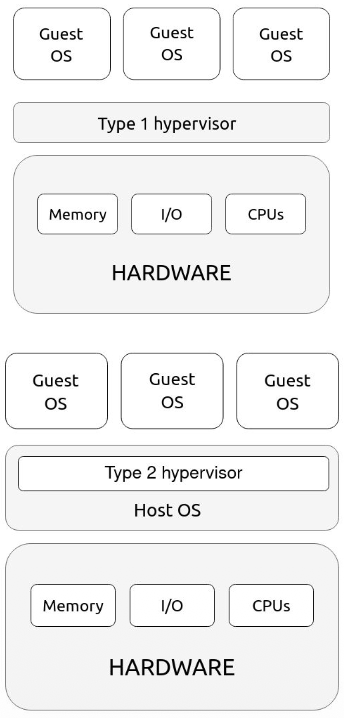
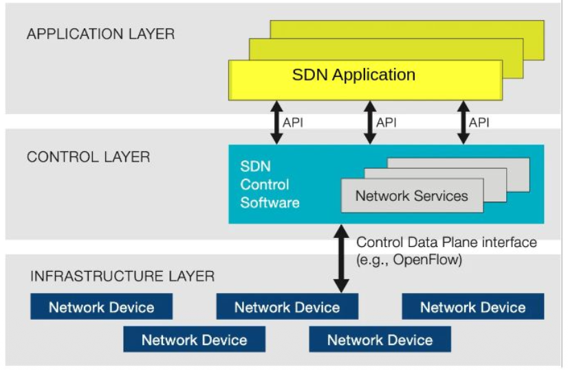
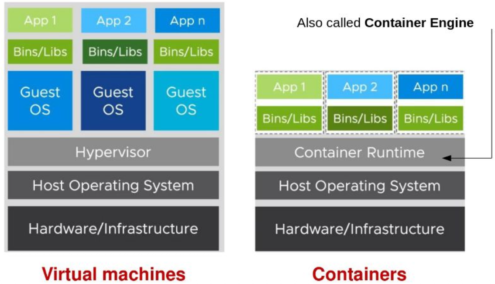

# Virtualization

La motivazione principale dietro l'invenzione della *Virtualizzazione* è che le capacità di un singolo server erano diventate così potenti che era impossibile (per la maggior parte dei workload) usarle tutte, e quindi si avevano delle inefficienze e sprechi di risorse.  

La virtualizzazione è la tecnologia che permette di sperare il **Sofware** dall'**Hardware**, permette di prendere un singolo server fisico (molto potente) e dividerlo facendogli credere di essere tanti piccoli server indipendenti.   
Questo permette di fare eseguire su un sistema più applicazioni indipendenti ed eterogenee nello stesso istante.  

In pratica, rimpiazza il sistema fisico con una versione virtuale di quella risorsa.    

### Componenti Principali:   

1. **Host**: È la macchina fisica vera e propria, contiene la RAM, le CPU e i dischi fisici
2. **Guest o VM**: È la macchina virtuale, ossia un computer fatto interamente di software, dal punto di vista delle app che girano in una VM, il guest sembra un computer fisico.  
3. **Hypervisor**: È il direttore d'orchestra, è il software che sta tra l'Host e i vari guest. Il suo compito è "ingannare" le varie VM, prendendo le risorse fisiche dell'Host e distribuendole ai guest in modo sicuro e isolato.  

Esistono due principali tipi di Hypervisor:  

1. **Hypervisor (bare-metal) di tipo 1**:  
    - Si installa direttamente sull'**hardware nudo** del server fisico e prende il posto del OS
    - Garantisce prestazioni altissim e pochissimi sprechi di risorse, è in assoluto la solzuione usata a livello enterprice e nei grandi datacenter.  

2. **Hypervisor (hosted) di tipo 2**:  
    - Si installa come un normal programma sopra un OS già esistente (Host OS)  
    - È **molto** più lento! se la macchina virtuale deve scrivere un file su disco, il comando deve passare dalla VM -> Hypervisor -> Host OS -> hardware fisico.  
    Troppi passaggi 
    - Usato per fare test o avere VM sul proprio PC (virtualBox, VMware, ...)   

   

### 3 Modi per fare Virtualizzazione:  

1. **Full Virtualization:** È il metodo classico (es. virtualbox o vmware) dove l'Hypervisor inganna completamente il guest OS, ricrea via software tutto l'hardware (schea madre virtuale, scheda di rete virtuale, ecc..), il guest non sa di essere virtualizzato.  

 

2. **Hardware Assisted Virtualization:** Si modifica il processore fisico del host per fare in modo che nativamente capisca che sta facendo girare macchine virtuali, gestisce comandi delicati in automatico e aumenta le prestazioni

 

3. **OS-level Virtualization:** Invece di usare un Hypervisor pesante, si prende un singolo OS (host) e si creano al suo interno degli spazi "**separati e recintati**".  
Le app dirano in questi spazi pensando di essere da sole, ma in realta condividono lo stesso Kernel del OS prinicipale.  

Caso Ibrido $\rightarrow$ **KVM** (Kernel Virtual Machine)   
Consiste in un modulo Linux che trasforma il Kernel in un Hypervisor   

### Immagini   

Nel cloud e in generale, non si installano gli OS da zero ma si usano **immagini (images)**  

Immagine $\rightarrow$ È un template pre-confezionato, un file che contiene già un sistema operativo configurato e software già installato.  
Quando chiediamo al cloud una risorsa lui clona quell'immagine creando una VM in pochi secondi.   

### Virtualizzazione dello Storage  

La virtualizzazione dello storage (SDS - Software defined storage) consiste nel prendere tutti i dischi fisici di memoria e unirli in un unico pool virtuale chiamato Storage Area Network (SAN).  

es: abbiamo 100 server, ognuno con 10 dischi fisici, allora la SDS prende tutti i 1000 dischi fisici e crea la SAN.  

Vantaggi:  
- Increase capacity: unendo i dischi virtualmente si possono creare finti dischi enromi.  
- Increase throughput: se un file è diviso in più dischi fisici, possiamo leggerlo e scriverlo usando la velocità di tutti i dischi in parallelo.  
- Increase Data Availability: i dati diventano ridondanti, se un disco fallisce non si perdono i dati perchè saranno replicati in un altro disco.  
- Reduce Costs: Si possono mettere i dati che vengono usati spesso in memorie costosissime e veloci come SSD e tenere i dati vecchi su dischi lenti ed economici.   

---

  

## Software Defined Networks (SDN)

Nelle reti tradizionali (composte da dispositivi fisici come Router, Switch, Firewall), ogni singolo apparecchio è un computer a se stante diviso in 3 piani:  
1. **Managment Plane:** È il modo per gestire il dispositivo, l'amministratore entra nel router con ssh in quetso piano
2. **Control Plane:** Consiste nel cervello, è il software interno al router che studia la mappa della rete, parla con gli altri router e decide il cammino per trasporatre i pacchetti
3. **Data Plane:** È il muscolo, la componente hardware fiica che prende i pacchetti dati in entrata e li inoltra verso la porta corretta seguendo gli ordini del cervello.  

---

ma al giorno d'oggi qualsiasi rete è configurata con SDN ? nel senso che nessuno configura piu una rete in modo diverso, che vorrebbe dire prendere tutti i router e apparecchi che compongono la rete per impostare a mano i layer di ogni router. si fa tutto con SDN?  

poi vorrei capire come mai potrebbero servire 500 router in un datacenter? e dopo questo datacenter è raggiungibile con un solo IP? o con 500 IP diversi ? come funziona questa cosa? e non si crea confusione se ci sono reti che sono configurate a mano e altre che sono configurate con SDN? sono compatibili tra di loro??  

---

Nelle reti tradizionali ogni router ha il suo cervello, muscolo e interfaccia, se abbiamo un datacenter con 500 router, andrebbero configurati tutti a mano, un lavoro troppo complicato e prono a errori umani.  

La soluzione a questo problema è stata ottenuta con la **SDN**, la cui idea è quella di **separare i piani**!   
l'SND rimuove l'intelligenza a tutti i router, firewall e switch fisici e le sposta in un **unico cervello centralizzato**!    
Questo cervello è un sw che gira su un server collegato a tutti i componenti che formano la rete usando una rete di cavi speciale chiamata "rete di managment".   

 

**L'architettura SDN è fatta a 3 livelli/layers:**     

1. **Application Layer**: Contiene la logica di business e l'intelligenza dinamica, non si hanno più regole statiche! si ha un programma creato da ingegneri di rete (py o java) che analizza il traffico e prende decisioni in base alle regole definite nell'app. (es.)

2. **Control Layer**: È l'SDN controller, non prende deisione di business, bensì si limita a ricevere ordini dall'Application layer per tradurle in linguaggio macchina per l'hardware (ossia le componenti della rete fisica)  

3. **Infrastructure Layer**: composto dagli switch 'stupidi' che eseguono materialmente il trasporto dei dati nella rete.  

La SDN rende la rete programmabile come un software, si può scrivere un codice (l'SDN app) che modifica l'intera topologia della rete.  

 

**L'architettura SDN comprende le seguenti componenti:**     

- **SDN Application**: il programma che comunica cosa desidera la rete 
- **SDN Controller**: il traduttore, prende la richiesta dell'app e la traduce in comandi per il data plane 
- **SDN Datapath**: è l'hardware (router/switch) che muove i pacchetti dati 
- **SDN API**: sono le due interfacce di comunicazione
    - tra controller e app $\rightarrow$ NBI (northbound interface) 
    - tra controller e hardware $\rightarrow$ CDPI (control data plane interface)  

 

### OpenFlow  

Per permettere la comunicazione tra i layer del SDN si usa un protocollo di comunicazione che si chiama **OpenFlow**.  
Tramte OpenFlow il controller invia agli switch delle **Flow Tables**, che sono delle regole base composte da:

1. Match set: come riconoscere il pacchetto (es. se IP è 192.168...)  
2. Action set: cosa fare con quel pacchetto (bloccarlo, inoltrarlo alla porta x, ...)
3. Priority: definisce quale regola vince se ce ne sono due in conflitto  

### Sicurezza ed AI  

La SDN separa la rete dai cavi fisici, la virtualizza.  
Ad esempio in un datacenter si possono creare intere reti scrivendo righe di codice, creare router virtuali, server virtuali e isolarli dal resto del mondo, il tutto senza toccare un singolo cavo fisico.  

- Security Isolation: SDN rende le reti virtuali strettamente isolate, se un datacenter ha due aziende che usano i suoi server virtuali e il traffico di uno di questi server impazzisce, l'isolamento dell'SDN garantisce che un servizio non possa impattare anche gli altri servizi anche se fisicsmente si trovano sullo stesso server di metallo.  

- Intent-Based Network e AI: L'SDN permette di raccogliere valanghe di dati (telemetria) su tutto ciò che passa nella rete. Usando sistemi di Smart Analytics e AI si può monitorare automaticamente la rete, risolvendo i problemi da solo e accertandosi che la sicurezza venga sempre rispettata.  

 
 

## Containers:   

Nel mondo software spostare un app dal computer dello sviluppatore al server di produzione era un disastro, i container semplificano questo processo creando una 'scatola' standardizzata che contiene il codice.  

Ricordiamo che un programma non è mai isolato, usa librerie esterne (es. libc o librerie grafiche), e quando compiliamo abbiamo due scelte:

1. Static Linking: prende tutte le librerie che servono e le incolla dentro il file eseguibile finale       
    - pro: funzionerà ovunque 
    - contro: il file diventa enorme, e se devo aggiornare la libreria per una qualche ragione (es. sicurezza) devo compilare tutto da zero

2. Dynamic Linking: si crea un eseguibile leggero che non contiene le librerie ma che si aspetta di trovarle già installate nel OS (file.so in linux o file.dll in windows)  
    - pro: file piccolissimo, e facile aggiorare le librerie del pc 
    - contro: incubo delle dipendeze!!   

**Il vero problema:**     
Lo sviluppatore crea la sua app usando la libreria X versione 2.0, poi manda l'app al server di produzione dove è però installata la libreria X versione 1.3    
L'app non parte neanche in questo caso per conflitto tra versioni diverse.   

Si risolve questo problema usando i **Container**:   
I container sono pacchi di software che contengono tutti gli elementi necessari per fare girare il software in qualsiasi environment (codice sorgente, librerie e le loro versioni, file di configurazione, ecc...).     

A differenza della macchina virtuale, il container **NON** contiene un intero OS, è leggero (*lightweight*) perchè usa il Kernel del host OS su cui sta girando.  

Layers (livelli condivisi):  
I container vengono costruiti a strati, se abbiamo 10 container che usano la stesa libreria, il container runtime scarica e salva quel "livello" sul disco del server una sola volta! In questo modo otteniamo l'isolamento del linking statico ma col risparmio di spazio del linking dinamico!    

**Container vs VM**:   

- Virtualizzazione:
    - Container: Avviene a livello del sistema operativo, i container condividono il kernel del server ospite
    - VM: L'Hypervisor virtualizza le componenti hardware (scheda madre, cpu, ecc...)  

- Run: 
    - Container: Si possono runnare più container nello stesso OS facendoli condividere la stessa base
    - VM: Si possono far girare più OS! es. runnare windows da mac os

- Memory Footprint: 
    - Container: Piccolo memory footprint, occupano pochissima RAM (non hanno un OS intero da far girare), overhead e sprechi quasi a zero
    - VM: Grande footprint e grande overhead, si ha uno spreco enorme di RAM e risorse

- Startup Time:
    - Container: Avviare un container è istsantaneo, startup time velocissimo 
    - VM: Ci mette minuti ad accendersi, ogni VM deve fare il boot dell'intero OS

 

I container sono efficienti quando devi replicare un'istanza, sono ampliamente usati anche per questo principio, se devo scalare un servizio, con un container mi basta replicare l'applicazione (che avviene istantaneamente!)   

**Container Runtime**:     
Il container runtime è il gestore dei layer e capisce cosa deve condividere e tra quali app.  
Quando si crea un container si parte da un file immagine, ossia un file statico salvato sul disco fisso.    
Il container runtime non salva l'immagine come un singolo blocco gigante ma la salva a layer, mantiene poi un registro interno con i codici hash di tutti i layer che ha salvato sul disco.  
Se devo scaricare una nuova app che usa un layer con lo stesso hash di uno che hai già sul disco, il runtime semplicemente non lo scarca e usa quello che c'è già sul disco (in quanto è lo stesso! il codice hash si genera dal binario dell'eseguibile)   

In breve $\rightarrow$ I layer stanno sul disco fisso e vengono gestiti dal container runtime. Quando i container sono in esecuzione consumano RAM normalmente per i loro calcoli (evitando di caricare in RAM 100 OS separati come farebbero el VM).  

