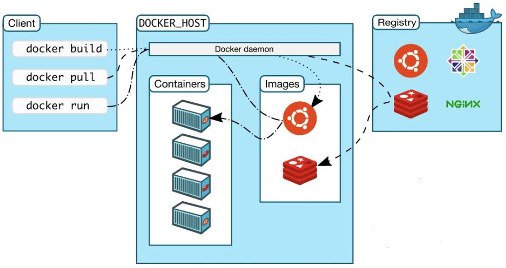

# Docker  

Il concetto fondamentale alla base è quello della virtualizzazione delle risorse, ossia pacchettizare CPU e RAM per allocarle dinamicamente. 
Esistono due tipi di virtualizzazione:

1. Hardware-level: virtualizza tutte le componenti hardware e ha bisogno di un hypervisor (che può essere di tipo1=hardware o tipo2=software). È lenta e spesso presenta un grande overhead.  

2. OS-level: Si affida al Kernel per isolare processi specifici dal resto del sistema, ogni processo è inserito in una Jail o Container dove ha un suo root file system privato e un suo namespace. Il processo dentro il container condivide il Kernel con il host OS ma NON può accedere a risorse o file fuori dal container, è isolato.   


Docker risolve il packaging standardizzato di software crendo i container:  

Un **Container** è un gruppo isolato di procesi che sono confinati all'interno di un root file-system privato e di un proprio namespace dei processi.  
I processi inseriti in un container condividono il Kernel e altrei servizi del Host OS ma NON possono accedere a file o risorse di sistema all'esterno del container.  

Per far funzionare docker serve il supporto del **Kernel**, le **Immagini** e **Network**       

Lato Kernel servono in particolare le seguenti feature:    
1. **namespaces**: necessari per isolare i servizi nel container dal resto del mondo 
2. **cgroups**: limitano l'uso delle risorse (es. containerA può usare solo 500MB di RAM)
3. **capabilities**: sono i permessi granulari del Kernel, docker toglie i permessi pericolosi (es. non possono spegnere il server fisico)
4. **seccomp**: filtra/restringe l'accesso alle chiamate di sistema (blocca i comandi strani verso il processore)


**Le Immagini**: sono un template per creare i container, contengono l'unione di molteplici filesystem che vengono organizzati per somigliare al root filesystem di una distribuzione linux. Docker aggiunge un layer R/W al container.    
L'immagine non è un unico grande file, ma è fatta di layer (== file-system separati).  
layer1: file base linux; layer2: installazione di python; layer3: il codice di un app.  
Docker usa **UnionFS (Union File System)** che prende questi 3 file-system separati e li schiaccia insieme, il container penserà di avere un unico file system ma sotto il cofano sono 3 diversi.  


**Network**: Si usano namespaces per la network e il OS Host fa da proxy (intermediario) per il traffico tra il mondo esterno e il container.  
Vuol dire che il container avrà un IP finto creato dal namespace di rete, e quindi il mondo esterno non potrà mai raggiungere quel finto IP.  
Per raggiungerlo deve collegarsi al vero IP del server fisico e il OS farà da proxy per inoltrare il messaggio sul container.  

Container is an isolated group of processes that are restricted to
a private root filesystem and process namespace. Conteinered
processes share kernel and other service from OS but by default
cannot access files or system resource outside container.


### Architettura Docker:  

Docker è composto da 3 parti e segue un'architettura Client-Server  

<center>




</center>


1. **`docker` (docker client)**: È il programma con il quale interagiamo tramite comandi (`docker build`, `docker pull`, `docker run`, ...). È quello che prende gli ordini.  

2. **`dockerd`**: È il **daemon** che gira sempre in background. Riceve gli ordini dal client tramite API o rete TCP ed è lui che materialemente costruisce, avvia o distrugge i container e gestisce le immagini sul disco.  

3. **`docker registry`**: È un server pubblico che conserva le immagini create dalla community.  

Nell'esempio dell'immagine sopra:    
Scriviamo `docker pull ubuntu` al client che manda l'ordine al daemon, quest'ultimo va nel registry e scarica l'immagine di ubuntu, la salva poi sul suo disco fisso.  
Poi scriviamo `docker run ubuntu` al client che manda l'ordine al daemon di avviare il container. Il daemon prende l'immagine di ubuntu dal suo disco, le attacca il layer R/W e la fa comparire tra i containers.  


### I tre Oggetti di Docker:   


1. **Images**: sono template di sola lettura, contengono le istruzioni per creare un container Docker, spesso un immagine parta dalla base di un altra (es. prende immagine di ubuntu e ci aggiungo sopra il mio codice python)   

2. **Containers**: Sono le istanze vive ed eseguibili dell'immagine

3. **Services**: Permette di scalare containers su molteplici daemon per farli lavorare insieme (Kubernetes)


<br>


--- 

<br>

## Docker Images

Un immagine Docker è un pacchetto software leggero, autonomo ed eseguibile che contiene tutto il necessario per far funzionare un pezzo di software (codice, runtime, librerie, strumenti di sistema)  

Le immagini si costruiscono a partire da un `Dockerfile` che definisce le istruzioni.  

Le principali operazioni possibili sono: `push`, `pull`, e `build`  

**Scaricare: docker image pull**        

Il seguente comando serve a scaricare un'immagine dal Docker Hub sul disco locale.  

```bash
docker image pull [OPTIONS] NAME[:TAG|@DIGEST]
```

- NAME: il nome (es. ubuntu, mysql, ...)
- [:TAG]:  la versione; se non viene incluso docker scarica la `:latest`. 
- [@DIGEST]: codice hash univoco e lungo, serve per questioni di sicurezza  

Opzioni principali: 
- `--all-tags, -a`: scarica tutte le versioni esistenti 
- `--disable-content-trust`: salta la verifica delle firme digitali (sconsigliato in produzione)
- `--platform`: serve a forzare l'architettura
- `--quiet, -q`: sopprime output verboso  


**Costruire: docker image build**       

Il seguente comando permette di creare una immagine personale!

```bash
docker image build [OPTIONS] PATH | URL | -
```

- PATH è la cartella del pc dove si trova il file di istruzioni (dockerfile), di solito si usa il punto `.`   

Opzioni principali:  
- `--file, -f`: Di default docker cerca un file chiamato esattamente `Dockerfile`, se l'abbiamo chiamato in altro modo usiamo questa opzione per dire a Docker dove trovare il file.   
- `--tag, -t`: serve per dare un nome e una versione alla nuova immagine! (docker image build -t mia_app_python:v1.0 .)    

<br>

### Dockerfile 

Il Dockerfile è un file di testo che contiene i passi per creare un'immagine Docker, il file usa una sintassi facile dove ogni istruzione (in maiuscolo )è seguita da argomenti (in minuscolo).    

```Dockerfile
# usa py runtime ufficiale come parent image
FROM python:3.8-slim

# imposta working directory ad /app 
# tutte le istruzioni successive avvengono qui dentro!  
WORKDIR /app 

# copia il contenuto della dir attuale nella directory /app del container 
COPY . /app

# installa packetti e librerie specificati 
RUN pip install -r requirements.txt

# rende la port 5000 raggiungibile al mondo 
# (da mappare con una porta del server tramite port forwarding)
EXPOSE 5000

# definisce var di ambiente
ENV FLASK_APP hello.py

# runna app.py appena il container viene lanciato
CMD ["flask", "run"]
```


- working directory: crea una cartella e si posiziona lì dentro, da quel momento in poi tutti i comandi verranno eseguiti dentro quella cartella del futuro container

Ogni istruzione nel Dockerfile crea un nuovo layer o aggiunge metadati, Docker mette in cache questi layer per ottimizzare il processo di build.    
Mettiamo caso che venga modificata una riga dell'app python, vuol dire che dobbiamo rifare docker build.  
Quando faremo docker build, Docker NON riscarica python e NON reinstalla le dipendenze! guarda in cache e scopre di avere già quei layer, e quindi li riusa.  
Alla fine genera solo il layer finale (quello dell'app) e crea l'immagine velocemente.  


Il sistema a layer permette un uso *efficiente* dello storage e la condivisione di layer comuni tra più immagini.  


Una volta creata la nostra immagine possiamo mandarla su un server o caricarla su docker hub con il comando `docker image push`.   


### Docker Network  

Docker ha un sistema di rete interno e offre 4 driver principali per far parlare i container.  

1. **Bridge**: crea un ponte sw dentro il PC, tutti i container collegati a questo ponte possono parlarsi tra loro e usano il PC come router per uscire su internet.  

2. **Host**: disabilita totalmente l'isolamento di rete (niente namespace NET), il container usa lo stesso indirizzo IP del server fisico.  

3. **Overlay**: permette a un container sul server A di parlare con un container sul server B come se fossero collegati allo stesso switch fisico. Crea un tunnel virtuale criptato tra due PC fisici diversi (importnate per K8s/Swarm).     

4. **IPvLAN o macvlan**: feature avanzate che permettono di dare un indirizzo mac ai container 


È buona norma creare una VLAN privata ed esclusiva per le nostre app sul container.  
Per creare una rete usiamo il comdando:  


```bash
docker network create [OPTIONS] NETWORK
```

Opzioni importanti:  
- `--driver, -d`: permette di scegliere la modalità (es. -d bridge) 
- `--ip-range`: permette di decidere quali IP assegnare 


### Docker Volume  

Ricordiamo che Docker crea un layer R/W per il container per evitare di modificare l'immagine.  
I container sono per natura **stateless** (senza stato/memoria) e **disposable** (usa e getta), di conseguenza se cancelliamo il container, il layer R/W viene cancellato e vengono persi tutti i dati.  

Esistono 3 modi per salvare i dati fuori dal layer R/W del container per non perderli:  

1. **Bind Mount**: Prende una cartella specifica del pc o server e la monta dentro il container, se il container scrive in quella cartella l'operazione è visibile anche dal pc.    

2. **Volume**: È il metodo consigliato, non scegliamo manualmente la cartella esatta. Diamo il potere a Docker di creare uno spazio sicuro nel disco fisso dell'Host e di gestire tale spazio. Docker lo nasconde in un area protetta.   

3. **tmpfs mount**: È il più raro. Salva i file direttamente nella RAM del host (utile per dati segreti che non devono mai toccare il disco rigido).  


ma la tmpfs mount potrebbe essere una fonte di situazioni di OOM killer ? nel senso che salvo i dati nella RAM, se inizio a fare molte W sulla ram posso esaurire velocemente la RAM che mi è stata allocata dai cgroups e quindi il container morirebbe no? e morendo perderei anche tutti i dati che sto salvando in quanto sono nella ram....

