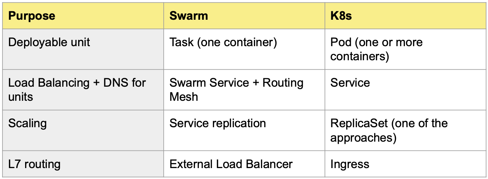
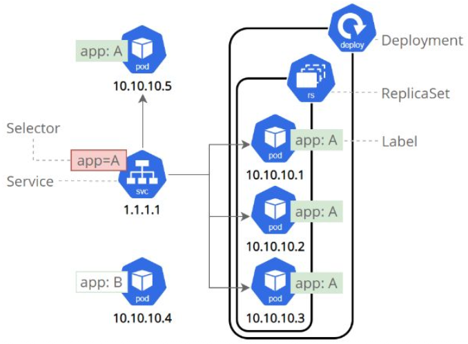
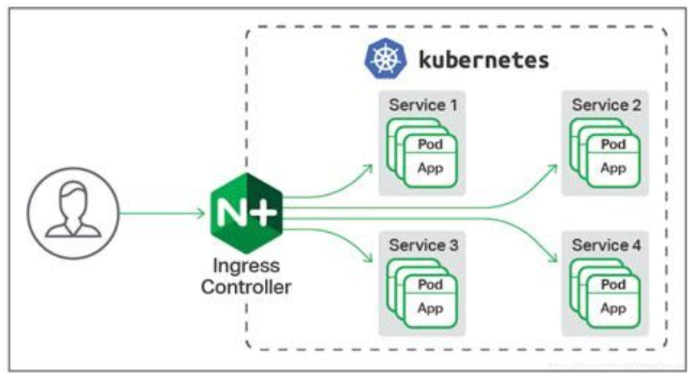

# Kubernetes (K8s)


Un Container Orchestrator è un sistema software distribuito progettato per automatizzare il deployment, la gestione, il networking, la scalabilità e la disponibilità (lifecycle) di applicazioni containerizzate su un cluster di macchine fisiche o virtuali.  

Le due implementazioni più famose sono Docker Swarm e Kubernetes (standard de-facto industriale)   
Kubernetes ha il 96% del mercato aziendale ma Swarm è perfetto per i cluster piccoli e statici o i cluster on-prem.    


**Approccio di orchestrazione**:      

- Mutabile: È l'approccio sbagliato e consiste nell'entrare con SSH nel container acceso e fare gli aggiornamenti a mano

- **Immutabile**: È l'approccio ideale, consiste nel costruire una infrastruttura usa e getta in quanto garantisce **riproducibilità** (c'è un bug, quindi costruiamo una nuova immagine, la pubblichiamo e l'orchestratore uccide il vecchio container rimpiazzandolo con il nuovo)  


### Declarative Configuration (IaC):  

Invece di usare linguaggio imperativo e comandi sequenziali si dichiara in un file YAML come deve essere il sistema.   
Si crea un file YAML per ogni oggetto (pod, service, deployment), è possibile anche dichiarare tutto in un unico file YAML separando ogni configurazione dalle altre da trattini (`---`).   


### Self-Healing  

L'orchestratore esegue un **Ciclo di Riconciliazione** all'infinito dove:
- Legge il *desiderd state* (es. voglio 5 container 'web' attivi)
- Legge l'*actual state* (es. un server si è rotto e quindi ce ne sono 4 attivi)
- Agisce: rischedula il container mancante su un server (nodo) sano  

In K8s ci sono svariati Controller specializzati per fare questo lavoro.  

---

<br>


### Dal Monolite verso i Microservizi e le nuove sfide 

Fino ad anni fa il paradigma domininante era il **Monolite**: un unica gigantesta appliczione (blocco di codice unico) che conteneva tutti i servizi (interfaccia web, databse e logica di business), se un servizio doveva scalare, bisognava clonare l'intero monolite sprecando risorse.  

Il paradigma moderno è l'**Architettura a Mircorservizi distribuita (Decoupling)**: Il monolite viene spezzato in tanti piccoli componenti indipendenti (i container!).  
Il vantaggio è che se si può scalare solo il servizio che è sotto stress (es. la pagina di pagamenti è intasata, si scala creando 10 container con solo il servizio di pagamento, lasciando a 1 container il servizio del carrello che è stabile per ora).  

La scomposizione comporta un problema teorico: se devo scalare un servizio creando 50 container, come fanno questi piccoli container sparsi su 10 server(nodi) fisicamente diversi a **trovarsi, parlarsi e bilanciare il carico**.  

L'Orchestrazione risolve il problema crando delle **Astrazioni di rete** tramite **SDN**: si crea una rete a livello software finta e intelligente sovrapposta alla rete reale fisica, si inseriscono i container all'interno di questa, ed essi penseranno di trovarsi tutti all'interno della stessa rete locale, come se fossero tutti dentro lo stesso server.     

Nelle architetture decoupled e distribuite ogni componente è separata dalle altre e comunicano tramite API (chiamate HTTP), per evitare che un servizio inondi un altro servizio si inseriscono in mezzo i **load balancer** che distribuiscono le richieste.   

I container non avendo il peso di un sistema operativo intero ed essendo quinid leggeri, sono il mezzo perfetto per inscatolare i microservizi e distribuirli a seconda delle necessità.  

Definizioni formali:  

- **Decoupling**: È la separazione logica e fisica dei componenti di un software, in modo che ogni pezzettino possa essere sviluppato, aggiornato e scalato in modo **indipendente** dagli altri! (spezzare il monolite)  

- **DNS Service Descovery**: È il meccanismo automatico tramite cui i componenti di un'architettura distribuita riescono a trovarsi su una rete, **usando nomi logici anzichè IP fisici** (che nel mondo dei container cambiano di continuo).  
    L'orchestratore avvia un servizio DNS all'interno del cluster, in questo modo invece di dover sapere che un servizio (es. database) ha IP finto `10.0.0.5`, il container che lo vuole raggiungere può fare una chiamata API all'indirizzo `http://database`. Sarà il DNS interno a tradurre il nome human readable nel IP corretto (in quanto gli IP cambiano continuamente in quanto i container sono effimeri).  

- **Routing Mesh**: È un'architettura di rete (specifica degli orchestratori) in cui il sistema è in grado di instradare una richiesta di rete in entrata verso **qualsiasi** nodo del cluster, facendola arrivare automaticamente al cluster **giusto**, indipendentemente da dove questo si trovi fisicamente.   


Il sistema di orchestrazione mette a disposizione due modi per definire la distribuzione dei container:  

1. **Replicated Services**: Dichiariamo all'orchestratore cosa vogliamo (es. 5 copie di un container) e l'orchestratore decide autonomamente e in modo ottimale su quali server fisici metterli (es. mette 2 container sul server A e 2 sul server B)

2. **Global Services**: Dichiariamo all'orchestratore che vogliamo esattaemente $n$ copie di un container per ogni server fisico del cluster. È fondamentale per i container "sentinella" (es. agenti antivirus o sw che raccolgono i log) che devono per fornza girare su ogni singola macchina per monitorarla.    


Swarm non mette a disposizione nuovi nodi come Kubernetes quando l'architettura fisica alla base esaurisce: se la RAM fisica finisce Swarm non crea altri container e si ferma.  
Kubernetes è invece un **Auto-Scaler** sul cloud, se nota che i server sono tutti pieni, può paralre tramite API con il provider cloud (AWS, Azure, GCP) per accendere un nuovo server fisico reale e unirlo al cluster per metterci poi sopra i container (tutto automatizzato).   


### Swarm vs Kubernetes:  



1. **Deployable Unit:**
    - Swarm: l'unità è il **Task** che equivale esattamente a un singolo container
    - K8s: l'unità base è il **Pod**, è un 'sacchetto' che può contenere 1 o più container che condividono lo stesso network namespace (stesso IP e porta `localhost`).  

2. **LoadBalancing + DNS:**
    - Swarm: Swarm usa le funzioni integrate del Service e della Rounting Mesh per far trovare i container e smistare il traffico  
    - K8s: Il carico di rete NON è gestito dal Pod ma da un oggetto *separato* chiamato **Service**  

3. **Scaling:** 
    - Swarm: si prende il service e lo si replica (service replication)
    - K8s: L'oggetto Service fa solo da load balancer, per lo scaling serve un altro oggetto chiamato **ReplicaSet**. K8s separa chi gestisce la rete da chi gestisce il carico dei container  

4. **L7 Routing:** (es. vogliamo che il traffico che arriva su cineca.it/api vada a un container, e quello che arriva su cineca.it/web vada su un altro container; smistamento di livello 7 OSI, livello applicativo)
    - Swarm: Non sa farlo nativamente, dobbiamo usare un proxy esterno (come Nginx)
    - K8s: Ha un oggetto logico nativo chiamato **Ingress**, progettato per smistare il traffico HTTP in ingresso verso i giusti servizi interni


---


<br>


## Kubernetes Details:  

- **API**: Un insieme di definizioni, protocolli e regole rigorose che consente a due sistemi software indipendenti di comunicare tra loro su una rete

- **Kubernetes API server (kube-apiserver)**: È il componente software primario del Control Plane (node master) di K8s. È l'unico componente del cluster autorizzato a ricevere richieste dall'esterno. Valida e processa le richieste HTTP in entrata e aggiorna lo stato del sistema.  

- **API Objects**: Sono le strutture e oggetti di Kubernetes, rappresentano le entità fisiche e logiche del cluster (es. Pod, Service, Ingress).  

- **`etcd`**: È un database key-value distribuito e ad alta disponibilità, funge da unica fonte di verità per il cluster K8s. Solamente l'API-Server ha il permesso di leggere e scrivere in questo database 

---


<br>


## Kubernetes Comands:  

Il paradigma che introduce Kubernetes (a differenza di Swarm) è quello della **Separation of Concern (SoC)**, implementato tramite un'architettura API-Driven.  

L'infrastruttura viene fatta a fette e in modo modulare; ogni funzionalità (esecuzione, rete, scalabilità, ...) diventa un oggetto API indipendente.  
Questi oggetti comunicano tra loro ma ognuno ha un solo computo e ignora i dettagli degli altri.    

Abbiamo due importanti aspetti: 

1. **Kubernetes API Objects**: Sono le strutture e oggetti di Kubernetes, rappresentano le entità fisiche e logiche del cluster (es. Pod, Service, Ingress).   

2. **kubectl (Kube-Control)**: E il client ufficiale a riga di comando (CLI) di Kubernetes. È lo strumento sw che traduce i comandi dell'operatore o i file YAML in chiamate HTTPS/RESTful inviate all'API Server centrale del cluster, il quale si occuperà di aggiornare il database `etcd`.    


Oggetti K8s:  

- **Pods**: un gruppo da 1 o più container, hanno il compito di far girare il codice (corrisponde all'unità minima).  
    Se dentro un pod mettiamo 2 o più container (es. container A web e container B cache), K8s dice al kernel di linux di metterli in due cgroups separati (ogni container ha il suo limite di RAM) ma di metterli negli **stessi Linux Namespaces di rete**, in questo modo i due container condividono lo stesso IP e la stessa porta `localhost` (il container web può parlare con il container cache chiamando `localhost:6379`).   

- **Service**: Definisce un set logico di Pod (raggruppati dal label selector), fornisce un indirizzo IP virtuale fisso e un nome DNS immutabile. Se nel nostro cluster abbiamo 5 microservizi allora avremo 5 oggetti API Service diversi! Ognuno di questi Service avrà il suo indirizzo IP finto e il load balancer interno privato.  


Fornisce Load Balancing e funge da DNS per risolvere gli indirizzi IP 

- **Replica Set**: Oggetto che si occupa dello scaling. Guarda i pod e si assicura che il numero reale corrisponda al numero desiderato  

- **Ingress**: Smista il traffico HTTP in ingresso verso i giusti servizi interni  


<br><br>

### Comandi `kubectl` comuni:  

- **Namespaces**: È un astrazione logica gestita dal database dell'API-Server (non ha niente a che fare con i Namespaces del kernel Linux). Crea un perimetro isolato ("cluster virtuale") all'interno dello stesso cluster fisico.  
    Fornisce uno scope per i nomi degli oggetti API (pod, service, ...), garantendo che due oggetti possano avere lo stesso nome solo se risiedono in due namespace diversi.  
    Permette di applicare anche limiti di risorse (resource quotas) e permessi di sicureza a livello di gruppo.  


- **Contexts**: È un paradigma di gestione dell'Autenticazione e Routing del client. Consiste in una tupla di configurazione che viene salvata localmente nel pc dell'operatore (in `kubeconfig`); raggruppa 3 parametri esatti:
    1. Cluster address: indirizzo di rete dell'API server remoto a cui inviare comandi 
    2. User: le credenziali di sicurezza con cui firmare le richieste API 
    3. Namespace: il namespace K8s in cui eseguire i comandi (se non specificato si fa nel default).   


- **Viewing Ojbects**:  
    - `kubectl get pods`: restituisce una lista ad alto livello (es. nome, età, status)
    - `kubectl describe pod <nome_pod>`: entra nel sistema, interroga l'API e restituisce informazioni low-level e la storia cronologica, è essenziale per il debugging.  


- `kubectl create -f obj.yaml`: Dice al cluster di creare ul'oggetto partendo dal file yaml specificato. Se l'oggetto esiste già il comando restituisce un errore e fallisce.  

- `kubectl apply -f obj.yaml`: Dice al server qual'è lo stato desiderato (specificato nel file obj.yaml), se l'oggetto non c'è allora lo crea, se esiste già alora lo aggiorna silenzisamente. 

- `--dry-run`: È un flag che manda un comando all'API server in modalità test, non applica i cambianti, guarda solo che il file non abbia conflitti.  

- `kubectl logs`: legge lo stdout del container
- `kubectl exec -it ... --bash`: apre un tunnel tramite l'API server che porta dentro ul terminare del container vivo
- `kubctl cp <pod-name>:/path/to/remote/file /path/to/local/file`: copia di un file dal pc al pod remoto o viceversa
- `kubectl port-forward`: apre un tunnel tra una porta del sever e la porta 80 del pod isolato nel cluster, permette di fare testing dal browser locale
- `kubectl get events`: mostrano il diario di bordo degli errori nel cluster e l'utilizzo in tempo reale di RAM/CPU (i cgroups in azione) 


<br>

### Pods Strategy e Pod Manifest  

Un pod è la singola entità atomica di scheduling e scalabilità, la regola impone che **container multipli devono coesistere dentro lo stesso pod SOLO se sono tightly coupled** (se un container può sopravvivere indipendentemente dall'altro, allora deve risidere in un pod separato)    
Es: inseriamo nello stesso pod la webapp e il database (sbagliatissimo). La CPU della webapp va sottostress, k8s decide di raddoppiare la potenza per sostenere il carico e quindi clonerà tutto il pod. La conseguenza è che ora abbiamo due database diversi non sincronizzati, avremo dati insonsistenti. Dovevamo creare un pod per la webapp e uno per il database!    

Il **Pod Manifest** incarna l'infrastructure as code (IaC), si scrive in YAML e contiene la dichiarazione formale dello "stato desiderato" di un **singolo specifico oggetto API**.  
Ricordiamo infatti che l'architettura di K8s si imposta in modo modulare, sarà successivamente il motore k8s ad applicare tutti i moduli insieme.  


```YML
apiVersion: v1 
kind: pod
metadata:
    name: nginx
    labels:
        name:nginx
spec:
    containers:
    - image: nginx
    name: nginx
```

- apiVersion e kind:pod definiscono a quale schema del database questo oggetto appartiene 
- metadata: da un nome al pod e gli attacca delle label (che sono il collante di k8s)
- spec: si dichiara lo stato desiderato


### K8s Labels and Annotations 

Nei sistemi tradizionali o monoliti, le relazioni tra i componenti sono rigide e cablate, il web server sa che il database so trova all'indirizzo IP `10.0.0.5`.  
Nel cloud native questo paradigma crolla.  

I Pod sono entità **effimere**: nascono, muoiono, scalano a 100 cope e si riducono a 2 nel giro di pochi minuti; Gli indirizzi IP dei pod cambiano continuamente, se usassimo il paradigma tradizionale dovremmo aggiornare i file di config ogni secondo.  

La soluzione è il passaggio a un **Routing e Controllo basato sui Metadati (Label-based decoupling)**  
Kubernetes usa un'architettura dati dove tutto è governato dall'assegnazione di etichette (tag). I componenti del cluster non si cercano per IP  o per posizione fisica ma interrogano il database centrale (`etcd`) dicendo: "mandami il traffico verso chiunque abbia etichetta $X$"  


- **Labels:** Coppie key:value assegnate agli oggetti K8s per scopi di identificazione e raggruppamento semantico. Sono usate dai Selectors per filtrare e instradare il traffico.  

- **Annotations:** Coppie key:value utilizzate per allargare metadati arbitrari non identificativi a un oggetto (data rilascio, email manutentore, config per tool esterni); Non possono essere usate per la selezione o il routing.  

- **ReplicaSet:** È l'oggetto API il cui scopo tassativo è mantenere in eseczione in qualsiasi momento un numero stabile e dichiarato di replice identiche di un Pod, usa le labels selectors per contarli nel Reconciliation Loop.   


<br><center>



</center>

Nell'esempio ci sono 5 Pod, ognuno con il suo IP effimero e con le loro label (label A e label B).  
L'oggetto Deployment e Replica Set puntano i Pod basandosi esclusivamente sull'etichetta app:A. Se l'IP di questi pod cambia al Deployment e ReplicaSet non interessa, continueranno a puntare a loro.    
L'oggetto Service (srv) al centro raccoglie il traffico in entrata e lo instrada **solamente** verso i Pod che rispondono al richiamo del selector app=A (i pod con app=B vengono ignorati).  

*regola d'oro*: se si ha un dubbio sul fatto se mettere una label o meno, conviene prima mettere un **annotation**, se poi ci si accorge che serve filtrare o selezionare i pod in base a quel dato, lo si provuome a Label.   


```bash
$ kubectl run nginx --image=nginx --labels="ver=2, env=prod" #1 
$ kubectl get pods --show-labels #2 
$ kubectl label pod nginx "canary=true" #3 
$ kubectl get pod -L canary #2
$ kubectl label pod nginx "canary-" #3
$ kubectl get pods --selector="env=prod" #4
```

1. crea un pod imperativamente e gli attacca due label (`ver=2` e `env=prod`)
2. comando di visualizzazione:
    - `--show-labels` fa comparire una colonna extra nel terminale 
    - `-L canary` crea una colonna specifica che mostra il valore di quella label 
3. aggiunta e rimozione a caldo:
    - `label pod nginx "canary=true"` gli attacca la label 
    - `label pod nginx "canary-"` rimuove la label
4. `--selector="env-prod"` estrae tutti i pod che appartengono a quella label, ignorando tutti gli altri


<br>

**Ingress**:    

L'oggetto Service Discovery lavora a livello TCP/UDP. vede un pacchetto IP e lo lancia verso un Pod, non guarda cosa c'è dentro (es. pagina web, comando SQL o un video).  

L'oggetto **Ingress** lavora a livello applicativo (HTTP/HTTPS) e guarda dentro la richiesta dell'utente.  


<br><center>



</center>

Nell'esempio l'utente si collega al domain `www.domain.it`. L'ingress controller (blocco verde N+) intercetta la richiesta e legge l'URL. Se l'URL è `/frontend` instrada il traffico verso il Service 1; se l'URL è `/database` lo instrada al service 3.  
È un **Reverse Proxy** avanzato.   

<br>

**Replica Set**:   

Il Replica Set fornisce: **Redundancy** (affidabilità), **Scale** (quantità) e **Sharding** (suddivisione).  
Usa il Reconciliation Loop che è il ciclo di controllo vitale usando lo stato desiderato e lo stato osservato (es. stato desiderato: 3 pod, stato osservato: 2 pod -> Il RS si accorge e crea un nuovo pod).   
Il Replica Set da **Adoption via Labels**: non ha figli naturali, adotta qualsiasi Pod nel cluster che abbia l'etichetta corrispondente al suo selettore, se ce ne sono troppi uccide quelli in eccesso, se ce ne sono pochi crea quanti servono (basandosi sempre esclusivamente sulle label).   

Trucco della quareantena: se abbiamo un pod che crea errori (es. va in loop) vorremmo poter fargli l'autopsia senza causare disservizi agli utenti.  
- cambiamo l'etichetta a caldo al pod problematico usando la CLI (da app:frontend passa a app:sick-frontend)
- il Replica Set si accorge che gli manca un pod e crea subito un pod sano per rimpiazzarlo 
- il pod malato non viene distrutto, rimano vivo nel cluster disassiociato e fuori dal traffico. Possiamo poi entrare con `kubectl exec` dentro tale pod, scaricare la RAMl leggere i log e capire perchè è andato in errore, senza fretta.   


**Manifesto del ReplicaSet (IaC)**:  

```YML
apiVersion: apps/v1
kind: ReplicaSet
metadata:   
    name: frontend
    labels:
        app:nginx
        tier: frontend
spec:
    replicas: 3 # stato desiderato
    selector:
        matchLabels:
            tier: frontend 
    template:
        metadata:
        labels:
            tier: frontend
        spec:
            container:
            - name: nginxreplicaset
            image: nginx
```

- `spec.replicas: 3`: lo stato desiderato 
- `spec.selector.matchLabels`: Dice al Replica Set cosa e come cercare (es. assicurarsi che i pod con label `tier: frontend` siano sempre 3) 
- `spec.template`: È il template che usa per replicare i pod. Se il Replia Set deve duplicare un pod guarda qui dentro e trova la ricetta per la creazione (notare che viene aggiunta proprio la label!)  


### Deployments:  

Il Deployment gestisce il Lifecycle delle versioni.  
Un **Deployment** è un oggetto API di K8s che fornisce aggiornamenti dichiarativi per Pods e Replica Sets.     
È lo **State Controller**: il suo compito è gestire i diversi ReplicaSet. Durante un aggiornamento il Deployment crea un nuovo Replica Set (per la nuova versione) e ne incrementa gradualmente il numero di repliche, riducendo contemporaneamente le repliche del vecchio Replica Set (la versione vecchia) fino alla completa sostituzione dell'infrastruttura.   

Ci sono due strategie per il deployment:  

1. **Recreate Strategy**: È l'approccio brutale, il Deplyment imposta a zero il vecchio Replica Set, aspetta che tutti i vecchi pod vengano distrutti e solo dopo avvia il nuovo Replica Set.  
    Pro: nessun conflitto di versioni nel DB    
    Contro: Genera un disservizio, un buco temporale in cui il servizio è completamente offline 


2. **Rolling Update Strategy**: È l'approccio preferito in quanto i Pod vengono ricreati gradualmente. Mentre un vecchio Pod viene spento un nuovo Pod viene acceso e inserito nel Load Balancer (si può fare fine tuning per specificare il numero di massima indisponibilità; es: garantire che durante l'aggiornamento non ci sia mai più di un Pod spento contemporaneamente).  


```YML
apiVersion: apps/v1
kind: Deployment
metadata:
    name: nginx-deployment
    labels:
        app: nginx
spec:
    replicas: 3
    selector:
        matchLabels:
            app: nginx
    template:
        metadata:
            labels:
                app: nginx
        spec:
            containers:
            - name: nginx
                image: nginx
                ports:
                - containerPort: 80
```

---


<br><br>


### Extra Stuff:  

**Proxy e Reverse Proxy**:  

Su internet il client e il server non si parlano mai direttamente per questioni di sicurezza e privacy.  

Proxy (o forward proxy): Un server intermediario che sta davanti al client. Protegge il client nascondendolo dalla rete. 

Reverse Proxy: Un server intermediario che sta davanti al server. Protegge l'infrastruttura aziendale nascondendola dalla rete; i clienti esterni credono di parlare con il server finale ma in realtà stanno parlando con il reverse proxy.  

Es:
- *Proxy*: Sei nell'aula informatica della tua scuola o nel wifi dell'ufficio. Provi ad andare su facebook.com  
    Il tuo PC non si collega a Facebook. Il tuo PC si collega al Proxy della scuola.
    Il Proxy guarda la tua richiesta e dice: "Le regole dicono che Facebook è bloccato. Ti blocco".
    Se cerchi google.com, il Proxy va su Google al posto tuo, prende la pagina e te la restituisce. Google non vedrà mai l'IP del tuo PC, vedrà solo l'IP della scuola.   


- *Reverse-Proxy*: Un utente vuole comprare su amazon va sul dominio, il cliente crede di essere collegato al server web di amazon ma in realtà è collegato al Reverse-Proxy di amazon. Il reverse proxy riceve la richiesta, dietro di lui, nascosti a internet, ci sono migliaia di server fragili.  
    Il Reverse Proxy apre le richiesta HTTPS, controlla che non siano malevole, decifra i cerificati di sicurezza e inoltra silenziosamente la richiesta al server corretto.   


--- 

### Ingress e Service 

Un utente fa una richiesta di rete al cluster di K8s, il primo ad agire è l'Ingress che legge la richiesta e capisce a quale servizio deve essere inoltrata.  
Una volta inoltrata al service giusto agisce il Service che fa Load Balancing e DNS discovery per inoltrare la richiesta al pod giusto (a seconda della situazione).  

