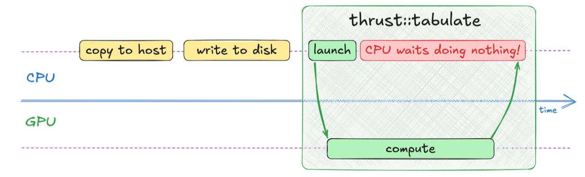
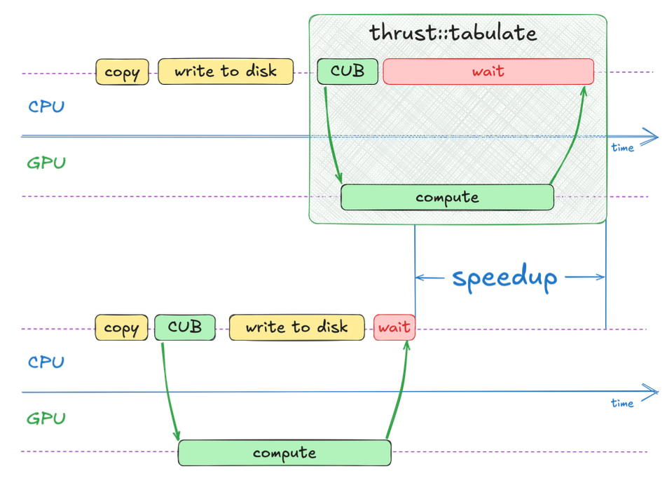
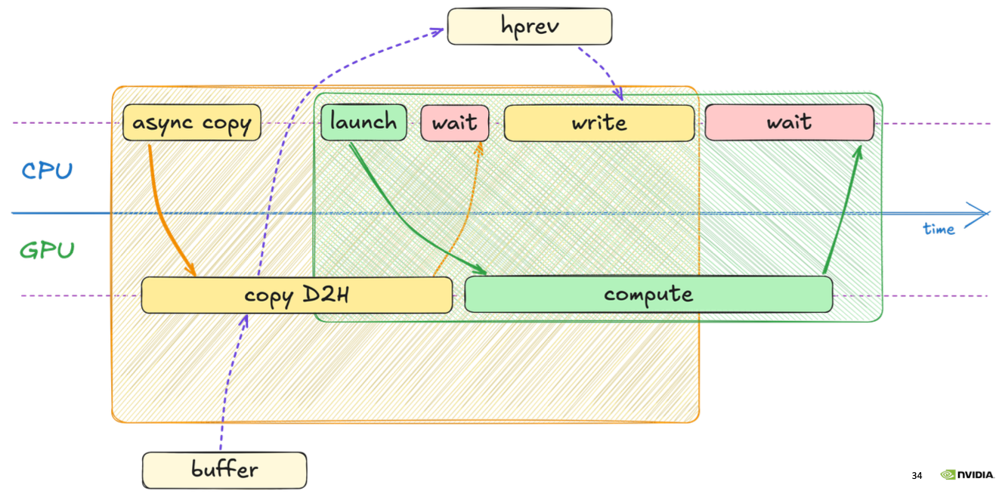
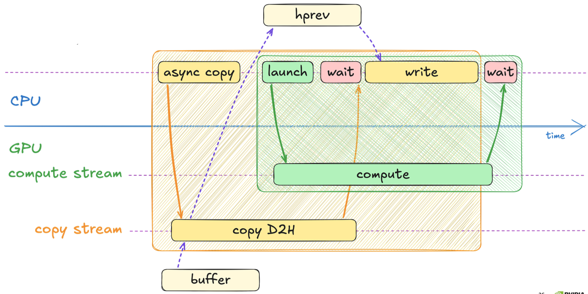

# Cuda Streams


### Problema: Risorse Inattive

Riprendiamo in mano l'esempio della simulazione di calore, abbiamo ottimizzato la computazione spostandola su GPU e facendola girare con thrust.  
Il nostro programma alimenta una simulazione grafica, ci servono i dati da inserire frame per frame, quindi ci servono tutti i dati di tutti i passaggi fino a quando la simulazione gira.  

Questo vuol dire che mentre la GPU fa i calcoli pesanti, deve passare ogni matrice che calcola alla CPU perchè li trasferisca su disco affinchè diventino valori leggibili nell'animazione grafica.   

Per come abbiamo impostato il codice, il codice a un passo generico si trova a fare questi passaggi in ordine 

 


### Stato precedente vs Stato attuale

Al passo generico $i$:
- la GPU ha appena finito di calcolare la matrice, chiamiamola $M_i$
- la GPU vuole calcolare $M_{i+1}$ ma deve anche mandare $M_i$ alla CPU

L'immagine sopra mostra il modo seriale di svolgere questo compito, vogliamo che avvenga in parallelo in quanto abbiamo **indipendenza dei dait!**. 

- per calocolare $M_{i+1}$ la GPU ha bisogno di leggere $M_i$ che è nella sua VRAM
- per salvare $M_i$ su disco la CPU ha bisogno di una copia di $M_i$ nella sua RAM
- Mentre la CPU sta leggendo $M_i$ per generare $M_{i+1}$ **non modifica** $M_i$ !  
    - si tratta quindi di due letture dello stesso dato! non genera nessun conflitto.  

Per poter sfruttare questa indipendenza usiamo il **doppio buffer**:

Avremo due vettori `dprev` e `dnext`  
- la GPU legge da `dprev` ($M_i$) e scrive su `dnext` ($M_{i+1}$)
- la CPU lavorerà con `dprev` e la salverà in memoria 

<br>


### CUB (cuda unbound)

Vorremmo poter avviare contemporaneamente la fase di scrittura su disco e il calcolo della nuova matrice per minimizzare l'idle time.  
Per farlo dobbiamo rompere la chiamata di a `thrust` per romperal in due parti: launch e wait

Otteniamo questo con CUB, una libreria di più basso livello che è il vero motore di thrust (thrust si appoggia a cub che a sua volta si appoggia a libcu++).  

### thrust vs CUB

- thrust è sincrono, quando invochiamo `thrust::tabulate` lui chiama internamente CUB per il calcolo e poi subito dopo chiama `cudaDeviceSynchronize()`, che blocca la CPU fino a quando la GPU non termina la sua computazione.

- cub è asincrono, appena viene lanciato il controllo torna alla CPU, prima ancora che la GPU abbia iniziato il lavoro, scegliamo noi dove mettere la `cudaDeviceSynchronize()`, serve sincronizzazione esplicita.  

<br>



Usando CUB possiamo tenere la CPU impegnata a scrivere i risultati in memoria mentre la GPU calcola la matrice successiva, risulta in un grande speedup delle performance.    


## CUDA streams

Riprendiamo l'immagine di prima:


Possiamo notare come `compute` aspetti inutilmente che la `copy` finisca, in quanto `thrust::copy` è sincrona $\rightarrow$ la CPU lancia la copy, aspetta che finisca e solo successivamente lancia il calcolo su GPU.   

Possiamo ottimizzare questo passaggio usando una copia asincrona, ossia una operazione "lancia e dimentica" $\rightarrow$ `cudaMemcpyAsync` ci fornisce questa funzionalità.  


```cpp
cudaError_t cudaMemcpyAsync{
    void* dst,       // destination mem address
    const void* src, // source mem address 
    size_t count,    // size in Bytes 
    cudaMemcpyKind  kind,
}
```

Prestare particolare attenzione agli errori, in quanto essendo nel paradigma async un errore può essere causato da una qualsiasi delle operazioni async precedenti.  


### Illusione dell'asincronia:

Anche se usiamo funzioni `async`, se le lanciamo e basta, la GPU le metterà comunque in coda una dietro l'altra, in modo sincrono.   
In questo modo non otteniamo nessuno speedup.  

### Cuda stream:

Un cuda stream è una sequenza di operazioni che vengono eseguite in ordine sulla GPU.  

Se non specifichiamo nulla, CUDA usa lo stream 0 che è sincrono rispetto a tutto il resto! quindi blocca gli altri stream e aspetta che tutto sia pulito prima di procedere.   




Nell'immagine notiamo che gli stream sono in realtà sequenziali, non si sovrappongono.  
Le istruzioni dentro uno stream hanno l'ordine di esecuzione garantito.  


Possiamo avere più stream nel nostro codice, e le operazioni su stream differenti possono essere eseguite in modo **concorrente**. 
Ci permette di fare l'overlappung vero e proprio.  

### Soluzione

Per risolvere il problema creiamo due stream: 
1. `computeStream`
2. `copyStream`
Poichè le operazioni appartengono a stream diversi l'hardware della GPU può eseguirle nello stesso istante.  

Operazioni su stream:
- **Costruzione**:   
    Si dichiara una variabile di tipo `cudaStream_t stream_variable` e creiamo lo stream con `cudaStreamCreate(&stream_varaible)`.  
- **Distruzione**: Fondamentale per evitare le memory leak!  
    `cudaStreamDestroy(stream_variable)`.  
- **Sincronizzazione:**       
    Si invoca `cudaStreamSynchronize(stream)`.  
    È molto più efficiente della cudaDeviceSynchronize() perchè quest'utlima ferma la CPU fino a quando la GPU lavora e la sblocca solamente quando tutta la GPU è ferma.  
    `cudaStreamSynchronize` invece ferma la CPU solo finchè lo stream specificato ha finito, se altri stream stanno ancora lavorando, la CPU può ripartire .  

In questo modo otteniamo:



Notiamo in questa immagine che lo stream di copy e compute eseguono in parallelo.  

l'immagine in codice potrebbe diventare:

_nota:_ 
- stiamo facendo una simulazione, composta da due loop:
    1. loop esterno (write step): decide quante 'foto' vuole della simulazione 
    2. loop interno (steps): tra una foto e l'altra facciamo girare la simulazione della fisica (es 1000 volte) per fare evolvere il calore in modo significativo.  

- il codice che viene mostrato si riferisce a una singola iterazione del loop esterno.  
- `store(write_step, height,width, hprev)` è una funzione che prende i dati dalla RAM (hprev) e li scrive fisicamente nel disco rigido. 


```cpp
cudaStream_t copy_stream, compute_stream;
cudaStreamCreate(&compute_stream);
cudaStreamCreate(&copy_stream);

//...

cudaMemcpyAsync(hprev_ptr,
            dprev_ptr,
            num_cells * sizeof(float),
            cudaMemcpyDeviceToHost,
            copy_stream);

for(int step=0; step < steps;step++)
{
    simulate(width, height, dprev, dnext, compute_stream);
    dprev.swap(dnext);
}

cudaStreamSynchronize(copy_stream);
store(write_step, height, width, hprev);
cudaStreamSynchronize(compute_stream);
```

_Spiegazione codice:_
- creiamo i due stream (copy_stream e compute_stream) 
- lanciamo copia asincrona dei dati, da dprev verso hprev usando il copy_stream. 
- eseguiamo la simulazione `simulate`, specificando compute_stream; ora la GPU sta facendo due cose, sta spostando i dati verso la CPU con lo stream di copia e sta eseguendo la simulazione fisica con lo stream di calcolo.  
- **momento di sincronizzazione**:
    - prima di chimare la `store` dobbiamo essere sicuri che la copia dei dati dalla GPU verso la CPU sia finita; lo otteniamo specificando la sincronizzazione sul copy_stream
    - alla fine del loop, prima di cominciare il passo successivo, dobbiamo assicurarci che il calcolo della GPU sia finito

**Errore: data race**    

Il codice sopra presenta una data race! analizziamolo nel dettaglio:  

- Facciamo la cudaMemcpy asincrona prima di entrare nel ciclo di simulazione, vogliamo copiare dprev (GPU) in hprev (CPU). 

- dentro il ciclo di simulazione facciamo le seguenti operazioni:
    - prendiamo i dati in input da dprev e li scriviamo in dnext, qundi dnext contine i miei dati nuovi. 
    - successivamente facciamo uno swap di dprev con dnext, questo perchè così i nuovi dati che servono per la simulazione nuova si trovano in dprev e li scriviamo in dnext che ora punta ai dati vecchi. risparmiamo memoria.  


- nasce qui la **data race**: mandiamo in copia su CPU dprev (operazione lenta) e intanto la simulate fa il suo lavoro in quanto asincrono.  Ci sarà lo scambio di puntatori e la dprev verrà usata per scrivere i valori nuovi! se dprev non ha ancora finito l'operazione di copia allora corrompiamo i dati aggiungendo anche quelli della nuova simulazione!!! errore.  

**Soluzione della data race: staging buffer**:     

Per sopperire a questa data race usiamo un buffer **2D2** - Device To Device (molto veloce), sul quale copiamo dprev e mandiamo in copia sulla CPU tale buffer di modo che le operazioni della simulate e lo swap non intralcino questa operazione.  

```cpp
thrust::copy(d_prev.begin(), d_prev.end(), d_buffer.begin());
cudaMemcopyAsync(hprev_ptr, 
            dbuffer_ptr, 
            num_bytes, 
            cudaMemcpyDeviceToHost, 
            copy_stream):

for(int step = 0; step < steps; step++)
{
    simulate(width, height, dprev, dnext, compute_stream);
    dprev.swap(dnext);
}
```

In questo modo evitiamo la data race!  


### Nota sull'esecuzione:  

Attenzione alla differenza tra asincrono e parallelo, non confonderli!  

**Asincrono** $\rightarrow$ non bloccante per la CPU.  

Uno stream è una coda FIFO, quando la CPU lancia 1000 simulate in uno stream la GPU le mette in fila.  
- la GPU vede l'ordine 1 e lo esegue
- solo quando ordine 1 è terminato allora guarda ordine 2 e lo esegue (l'ordine di operazioni in uno stream è conservato!). 
- l'asincronia serve a fare si che la CPU non debba stare ferma ad aspettare che la GPU finisca il lavoro. Infatti in questo modo la CPU schedula e dà l'ordine alle operazioni e poi va a fare altro (come scrivere su disco).  

```cpp
for(int step=0; step < 1000; step++)
{
    simulate(width, height, dprev, dnext, compute_stream);
    dprev.swap(dnext);
}

cudaStreamSynchronize(copy_stream);
store(write_step, height, width, hprev);
cudaStreamSynchronize(compute_stream);
```

Consideriamo dprev a `0xAAA` e dnext a `0xBBB`. 
- **iterazione 1**: La CPU lacncia l'ordine "GPU fai simulate usando 0xAAA come input e 0xBBB come output" e scrive tale ordine nella coda.  successivamente fa lo swap, quindi dprev diventa 0xBBB e dnext 0xAAA

- **iterazione 2**: La CPU lancia l'ordine "GPU fai simulate usando 0xBBB come input e 0xAAA come output" e tale ordine viene messo in coda dopo il primo.  

La CPU è velocissima e finisce di spartire ordini in millisecondi, la GPU non vede le variabili dprev e dnext ma vede indirizzi! la CPU ha fatto tutti gli swap e quindi ha preparato già gli indirizzi per la GPU!  

In questo modo la CPU esce dal loop di 1000 iterazioni quasi istantaneamente!  
Per questo serve il `cudaStreamSynchronize(copy_stream)`, che si assicura che l'operazione di copia su disco sia finita prima di poter far procedere la CPU.  
Infatti l'istruzione che segue è la store sulla memoria fisica non volatile del devie, dobbiamo avere il nostro dato copiato sulla CPU per poterla fare, la sincronizzazione è essenziale.  

la CPU inizia l'operazione di salvataggio su memoria una volta che la copy è terminata e sicuramente prima che i 1000 step di simulate siano terminati.  

È qui che avviene l'overlapping: mente la GPU sta facendo al simulate di 1000 step la CPU può fare il salvataggio su memoria del dato che abbiamo copiato all'inizio!  

Alla fine notiamo che c'è anche una `cudaStreamSynchronize(compute_stream)` in quanto la CPU potrebbe finire il salvataggio su memoria prima che la GPU finisca di fare la computazione.  se non lo mettiamo la CPU andrebbe all'iterazione successiva prima che la GPU finisca il lavoro e quindi avremmmo dati corrotti.   
Dobbiamo assicurarci per la correttezza semantica del nostro programma che la GPU lavori sempre su dati coerenti e che non si mischino tra iterazioni, per questo sincronizziamo.  


La soluzione finale che sfrutta l'overlapp e non contiene datarace (uso di stagin buffer) è la seguente:

```cpp
cudaStream_t copy_stream, compute_stream;
cudaStreamCreate(&compute_stream);
cudaStreamCreate(&copy_stream);

thrust::host_vector<float> hprev(height*width);

// facciamo copia D2D, mettiamo dprev in d_buffer 
thrust::copy(dprev.begin(), dprev.end(), dbuffer.begin());
/*
copiamo in dest: hprev (host prev vector)
copia da src: dbuffer (device buffer)
*/
cudaMemcpyAsync(thrust::raw_pointer_cast(hprev.data()),
            thrust::raw_pointer_cast(dbuffer.data()),
            num_cells * sizeof(float),
            cudaMemcpyDeviceToHost,
            copy_stream
            );

for(int step=0; step < steps;step++)
{
    simulate(width, height, dprev, dnext, compute_stream);
    dprev.swap(dnext);
}

cudaStreamSynchronize(copy_stream);
// facciamo store su CPU di hprev che contiene il buffer copiato!
store(write_step, height, width, hprev);

cudaStreamSynchronize(compute_stream);
```

<br>

--- 

### La Memoria Virtuale
Per capire il problema, dobbiamo guardare come la CPU gestisce la RAM.
*   **Pagine:** La memoria di sistema non è un blocco unico, ma è divisa in "pagine".
*   **Pageable Memory:** Di default, il sistema operativo può spostare queste pagine dalla RAM al Disco Rigido (operazione di *Swapping*) se ha bisogno di spazio. 
*   **Pinned Memory (Lucchetto):** Possiamo però istruire il sistema a "inchiodare" (pin) una pagina nella RAM. Una pagina "pinned" (o *page-locked*) ha la garanzia di restare sempre nella RAM fisica e di non finire mai sul disco.

### Il vincolo della GPU
Qui scopriamo una verità tecnica fondamentale:
*   **La GPU può leggere SOLO dalla Pinned Memory!**
*   **Il dilemma:** Se è vero che la GPU non può toccare la memoria normale (pageable), come ha fatto a funzionare il nostro `cudaMemcpyAsync` fino ad ora? 

### Il trucco del driver: (Staging Buffer)
Quando chiediamo di copiare dati da una memoria "normale" (pageable) alla GPU, il driver CUDA fa un lavoro extra e invisibile:
1.  Crea un **buffer temporaneo** in memoria Pinned (chiamato *Staging Buffer*).
2.  Copia i dati dalla tua memoria RAM normale al buffer Pinned (**Copia 1 - lenta**).
3.  Copia i dati dal buffer Pinned alla GPU (**Copia 2 - veloce**).

**Il problema delle prestazioni:**
*   Questa "doppia copia" nascosta rallenta tutto.
*   Ancora peggio: questa operazione **impedisce la vera asincronia**. Spesso la CPU deve aspettare che la "Copia 1" sia finita prima di poter fare altro, rompendo l'overlapping che abbiamo cercato di costruire con gli stream.

**La soluzione Thrust:**
Invece di usare `thrust::host_vector` (che è memoria normale), usiamo:
`thrust::universal_host_pinned_vector<T>`
Questo alloca memoria che è **già Pinned** fin dall'inizio. 

---

