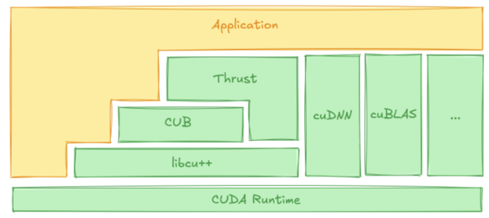
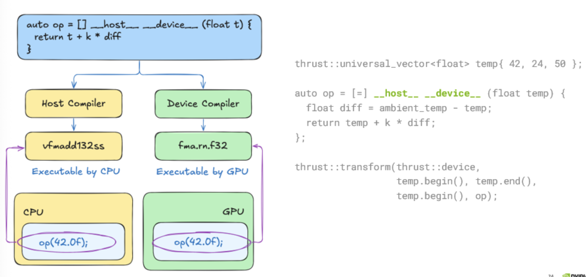
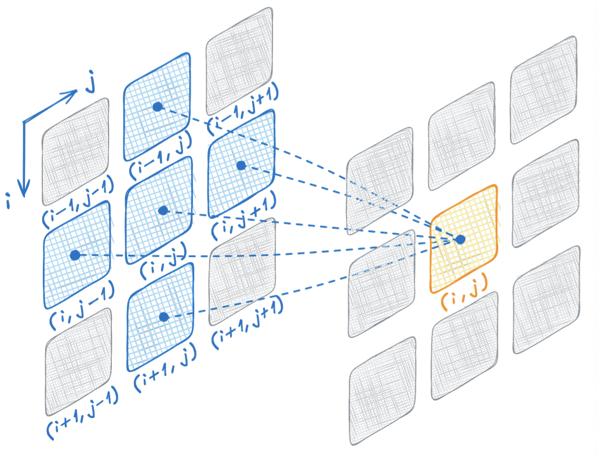
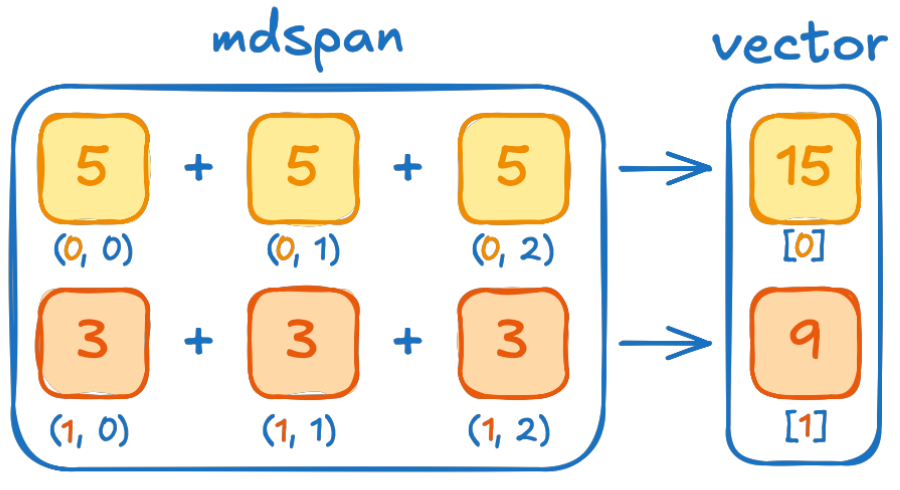

### Lambda Functions in C++:  

Piccola funzione anonima che non richiede di essere dichiarata esternamente  

**Sintassi:** `[capture] (parameters) { code }`   

- `[capture]`: cattura variabili , avviene al momento della definizione dell'oggetto lambda! Possiamo passare variabili separate da virgola (per valore o per riferimento).  
Se vogliamo tutto lo scope per valore usiamo `[=]` , se lo vogliamo per riferimento usiamo `[&]`.  
- `(parameters)`: i parametri in ingresso della lambda  
- `{ code }`: contiene il codice vero e proprio che fa la computazione

Es:

```c++
#include <iostream>

int main()
{
    int x = 10;
    auto lambda = [&x]()
    {
        x = 1;
    };
    auto lambda2 = [x]()
    {
        std::cout << "Valore di x: " << x << std::endl;
    };
    lambda();
    lambda2();
    std::cout << x << std::endl;
}
```

_note_:  
1. il valore di x viene catturato da lambda2 al momento della sua definizione, in questo istante vale 10 e il risultaot sarà quello, nonostante x valga 1 al momento della invocazione della lambda.  

2. modifichiamo x con lambda1 in quanto viene passato per riferimento

3. se avessimo passato x per valore a lambda1 avremmo avuto un errore in quanto i parametri catturati per valore sono _read only_.  


### Transform in C++ 

Implementa il concetto di map, prende una collezione di dati, applica una funzione a _ogni_ elemento e salva il risultato da qualche parte.  

**Sintassi**: `std::transform(inizio_input, fine_input, inizio_output, operazione)`    

- `inzio_input` e `fine_input` definiscono l'intervallo di dati su cui lavorare 
- `inizio_outpt` indica dove iniziare a scrivere il risultato, non serve specificare la fine dell'output in quanto viene dato per scontato che la dimensione sia pari a quella dell'input  
- `operazione` + la funzione che viene applicata.    

Applica a ogni elemento della collezione l'operazione definita, passando l'elemento attuale come parametro all'operazione!  

```c++ 
    float k = 0.5;
    float ambient_temp = 20;
    std::vector<float> temp = {42, 24, 50};

    auto op = [=](float t)
    {
        float diff = ambient_temp - t;
        return t + k * diff;
    };
    for (int step = 0; step < 3; step++)
    {
        std::transform(temp.begin(), temp.end(),
                       temp.begin(), op);
    }
```

_nota:_ in questo caso è fondamentale specificare il parametro `float t` nella firma della lambda, altrimenti op non sa con quale elemento operare.  


### Heterogeneous programming 

Possiamo compilare il codice C++ per farlo eseguire su CPU o GPU, il compilatore classico compila per CPU mentre `nvcc` compila per GPU.  

Di default tutte le funzioni sono compilate per CPU ma possiamo fare offloading di certe operazioni e funzioni su GPU, per farlo dovremo specificarlo esplicitamente nel codice.  

### Thrust 



Thrust ci permette di trasformare algoritmi che girano su CPU in algoritmi che girano su GPU.  
È un tool semplice che richiede minime modifiche al software per raggiungere il suo obiettivo. 
- dovremo usare thrust al posto di std 
- specificare il device sul quale vogliamo che il codice esegua, permette flessibilità e portabilità!  

 

1. Execution Policy: Dice dove thrust girerà l'algoritmo, funziona a runtime (non compila in automatico per quella location)
    - `trust::host`: esegue su CPU
    - `thrust::device`: esegue su GPU

2. Specifier: Indica dove il codice **può eseguire**, lo compila per la location specificata, non esegue il codie automaticamente lì (per questo serve la policy).  
    - `__host__`: cpu, dice a nvcc di usare il compilatore normale
    - `__device__`: gpu, dice a nvcc che la funzione deve essere compilata per GPU
    - Si possono usare entrambi


Es: Modificare il codice per eseguirlo su GPU (Algoritmo standard della `std`)

```c++
float median(thrust::universal_vector<float>& vec)
{
    std::sort(vec.begin(), vec.end());
    return vec[vec.size() / 2];
}
int main()
{
    for(int step=0; step < 3; step++ )
    {
        float median_temp = median(temp);
    }
}
```

**Codice trasformato:**      
 
```c++
float median(...)
{
    thrust::sort(thrust::device, vec.begin(), vec.end());
    return vec[vec.size() / 2];
}
int main()
{
    ...
}
```

_note:_   
- non serve mettere `__device__` davanti a `thrust::sort`, in quanto thrust::sort è una funzione che viene chiamata da CPU, è lei che internamente si occupa di lanciare i thread su GPU
- lo specifier `__device__` serve quando passiamo a thrust un algoritmo personalizzato (come una lambda), in quanto specifica che quell'algo deve essere eseguito su GPU. Nel caso di thrust::sort quella logica è già dentro thrust.  
- Tutto il codice esegue su CPU **TRANNE** la sort.  
    - la CPU invia il comando alla GPU che ordina i dati in parallelo, la CPU aspetta poi che la GPU finisca.  
    - la divisione (vec.size()/2) e l'accesso (vec[]) vengono fatte dalla CPU in quanto più efficiente.  
- **Come fa la CPU a leggere il valore se è sulla GPU?**
    - usiamo la **Unified Memory di NVIDIA**, che viene applicata con `thrust::universal_vector` 
    - Quando la GPU fa sort i dati vengono spostati automaticamente dal driver nella memoria video
    - Quando la CPU prova ad accedere al dato `vec[index]`, il driver CUDA si accorge che la CPU ha bisogno dei dati e riporta indietro quel valore dalla GPU alla RAM della CPU.  

### Unified Memory 

La unified memory usata nell'esepio precedente gestisce la memoria in blocchi chiamati **pages** che solitamente sono grandi 4KB.  
Quando scriviamo `return vec[vec.size() / 2]`:
- La CPU prova a leggere l'indirizzo che corrisponde a quell'indice, ma in quel momento i dati si trovano fisicamente nella GPU (che ha appena finito il sort) 
- Si verifica un **Page Fault**: l'hardware della CPU si accorge che quel dato non è in RAM
- Interviene il driver CUDA che guarda dove si trova la pagina di memoria che contiene quell'indice e la sposta dalla GPU alla CPU (tramite PCI-express o NVLink). 
- Una volta che la pagina arriva nella RAM della CPU, essa può finalmente leggere il valore e completare l'operazione.  

Non viene passato l'intero vettore! se il vettore fosse grande 4GB spostarlo tutto in RAM per leggere un float sarebbe uno spreco assurdo, per questo si usano le pages, spostando solo 4KB il sistema è molto più efficiente.  


### Extending Standard Algorithms

Non esiste un algoritmo `thrust::` per tutti i casi, a volte abbiamo algoritmi specifici non della libreria standard che vorremmo ottimizzare.  

Es: Calcolare la differenza massima tra due vettori:   

**Approccio Naive**:  

```c++
thrust::universal_vector<float>
unnecessarily_materialized_diff(a.size());
// compute abs differences
thrust::transform(
    thrust::device,
    a.begin(), a.end(), // first input sequence
    b.begin(),          // second input sequence

    unnecessarily_materialized_diff.begin(),

    []__host__ __device__(float x, float y) {
    return abs(x - y);
});

// compute max difference
return thrust::reduce(
    thrust::device,
    unnecessarily_materialized_diff.begin(),
    unnecessarily_materialized_diff.end(),
    0.0f, thrust::maximum<float>{});
```

Contiamo gli accessi in memoria di questo algoritmo:  
- legge 2$N$ elementi e fa $N$ differenze
- la reduce fa $N$ letture per restituire il risultato finale
- $\rightarrow$ 3$N$ letture e 1$N$ scritture 
- Soluzione subottimale!  

Se l'avessimo scritto in plain C++ avremmo fatto:  

```c++
float max = 0.0f;
for(int i=0; i<N; i++)
{
    float ar = a[i]; //r
    float br = b[i]; //r 
    float diff = abs(ar-br);
    max = diff > max ? 
        diff: max;
}
```

- Leggiamo 2$N$ elementi ed evitiamo di usare un array di appoggio (risparmiamo 1N scritture rispetto a prima). 
- $\rightarrow$ 2$N$ letture e 1 scrittura!  

Come possiamo ottenere questi vantaggi con gli algoritmi di thrust ? generalizzando i **Puntatori**.    

Ricordiamo che i puntatori sono elementi che contengono indirizzi della memoria fisica, e dereferenziandoli possiamo accedere a tali elementi.  

```c++
std::array<int, 3> a{0,1,2};
int *ptr = a.data();
std::printf("pointer[0]: %d\n", ptr[0]); //prints 0
std::printf("pointer[1]: %d\n", ptr[1]); //prints 1
```

Accediamo a elementi con l'operatore di `subscript` ossia `[]`.  
In C++ possiamo fare overloading di questo operatore per fare in modo che si comporti come desideriamo noi.  

Es: simple counting iterator 

```c++
struct counting_iterator
{
    int operator[](int i)
    {
        return i;
    }
};

counting_iterator it;
std::printf("it[0]: %d\n", it[0]); // prints 0
std::printf("it[1]: %d\n", it[1]); // prints 1
```

**Vantaggi degli iterators**: 
- forniscono una interfaccia come quella dei puntatori
- generalizzano i puntatori con l'overloading dell'operatore
- non sono vincolati dall'accesso raw in memoria (che è lento!) 
- riducono il memory footprint
- riducono il traffico di memoria che migliora le performance. 

Questo tipo di iteratori sono **fondamentali** per la programmazione su GPU, in quanto non esiste il costrutto di for classico.  
Il classico `for(int i=0,...)` è codice **seriale**, sulla GPU è tutto parallelo e usiamo algoritmi specifici come thrust::for_each o thrust::transform.  
Questi algoritmi pretendono degli iteratori per sapere su quale intervallo di dati lavorare.  

In breve:
- il ciclo for è un ordine impartito a un solo core della CPU.
- l counting_iterator accoppiato a un algoritmo Thrust è un ordine impartito a migliaia di core della GPU.


**Nested Iterators**    


```c++
struct zip_iterator
{
    int *a;
    int *b;

    std::tuple<int, int> operator[](int i)
    {
        return {a[i], b[i]};
    }
};

struct transform_iterator
{
    zip_iterator zip;
    
    int operator[](int i)
    {
        auto [a,b] = zip[i];
        return abs(a-b);
    }
};

std::array<int, 3> a{ 0, 1, 2 };
std::array<int, 3> b{ 5, 4, 2 };
zip_iterator zip{a.data(), b.data()};
transform_iterator it{zip};
std::printf("it[0]: %d\n", it[0]);
```

### Thrust Fancy Iterators

Thrust mette a disposizione funzioni di fabbrica per creare questi iteratori.  

- `thrust::make_counting_iterator(n)`
- `make_transform_iterator(iteratore, func)`
- `make_zip_iterator(iteratore1, iteratore2)`. 

Quando si invocano bisogna passare come parametro altri iteratori (che possono essere puntatori come vec.begin() o altri fancy iterators). 

Es di transform iterator:

```c++
thrust::universal_vector<int> vec = {1, 2, 3, ...};
auto begin = 
    thrust::make_transform_itertor(
        vec.begin() // iteratore iniziale -> puntatore

        [] __host__ __device__ (int val){
            return value * 2;
        }
    );
auto end = begin + 42;
thrust::for_each(thrust::device, begin, end, print);

// prints: 2 4 6 8 ... 84
```

_nota:_  
- quando facciamo `auto end = begin + 42;` usiamo l'aritmetica degli iteratori, in C++ un range è definito come [inizio, fine) 
    - `begin` punta al primo elemento della catena (corrisponde a vec[0])
    - `end` punta a 42 posizioni dopo 

### Soluzione al problema iniziale: 

```c++
auto zip_it = thrust::make_zip_iterator(a.begin(), b.begin());
auto transform_it = 
    thrust::make_transform_iterator(
        zip_it, 
        [] __host__ __device__ (thrust::tuple<float,float> t)
        {
            return abs(thrust::get<0>(t) - thrust::get<1>(t));
        });
```

   

Adesso la computazione avviene quando accediamo all'iteratore:
- zip_it[i] restituisce la tupla 
- transform_it[i] restituisce la differenza

<br>

### Simulazione di calore su griglia 2D

Entriamo nel vivo della simulazione fisca, effettueremo una simulazione di calore su una griglia 2D ottimizzata per girare in parallelo su GPU.  

Si usa il pattern _stencil_, per calcolare il nuovo valore della cella arancione, dobbiamo guardare le celle blu che la circondano.  

 

```c++
if (row > 0 && column > 0 && row < height - 1 && column < width - 1)
{
    float d2tdx2 = in_ptr[row * width + column - 1]
            - in_ptr[row * width + column] * 2
            + in_ptr[row * width + column + 1];

    float d2tdy2 = in_ptr[(row - 1) * width + column]
            - in_ptr[row * width + column] * 2
            + in_ptr[(row + 1) * width + column];

return in_ptr[row * width + column] + 0.2f * (d2tdx2 + d2tdy2);
}else{
    return in_ptr[row*width + column];
}
```

**Implementazione con thrust**:   

```c++
void simulate(int height, int width,
            const thrust::universal_vector<float> &in,
            const thrust::universal_vector<float> &out)
{
    // get raw pointer for perfomances
    const float *in_ptr = thrust::raw_pointer_cast(in.data());
    auto cell_indices = thrust::make_counting_iterator(0);

    thrust::transform(
        thrust::device, 
        cell_indices,
        cell_indices + in.size(),
        out.begin(),
        [in_ptr, height, width] __host__ __device__ (int id){
            int column = id % width; // convert flattened cell index in 2D
            int row = id / width;

            if (row > 0 && column > 0 && row < height - 1 && column < width - 1)
            {
                float d2tdx2 = in_ptr[row * width + column - 1]
                        - in_ptr[row * width + column] * 2
                        + in_ptr[row * width + column + 1];
                float d2tdy2 = in_ptr[(row - 1) * width + column]
                        - in_ptr[row * width + column] * 2
                        + in_ptr[(row + 1) * width + column];

            return in_ptr[row * width + column] + 0.2f * (d2tdx2 + d2tdy2);
            }else{
                return in_ptr[row*width + column];
            }

        }
    );
}
```

_note_:
- Nella lambda facciamo anche il boundary condition, le temperature sui bordi non cambiano.  
- `auto cell_indices = counting_iterator(0)`: usiamo un counting iterator per iterare sugli indici della matrice
- thrust::transform fa la computazione con la lambda, prendendo ogni elemento della matrice di input
- dentro la lambda convertiamo l'indice 1D degli elementi nelle coordinate 2D in righe,colonne per accedere ai dati della matrice.  
- **Importante:** gli iteratori `thrust` sono oggetti complessi, se facessimo .data() su di essi avremmo un `typed_iterator` in ritorno, e lavorare con questi su GPU cala le performance. Per questo motivo facciamo un casting con `thrust::raw_pointer_cast` per ottenere un puntatore C like che velocizza gli accessi in memoria ed è molto più efficiente.  


### Prima Ottimizzazione della simulazione di calore: `tabulate`

Abbiamo scritto il codice usando `transform` e un `counting_index`, questo è un pattern comune, così comune che è stata creata una funzione di thrust apposta $\rightarrow$ `tabulate`.  

`thrust::tabulate` è un algoritmo che applica l'operazione (la lambda o funzione che viene passata) ad ogni elemento indice per indice, e salva il risultato in tale indice!  
È l'equivalente di usare transform con counting_iterator.  
**Regola d'oro**: Quando esiste un algoritmo specializzato, come in questo caso, è sempre da preferire in quanto è maggiormente ottimizzato e migliora le performance.   

**Sintassi:** `thrust::tabulate(first, last, op)`     

Il codice con tabulte diventa:

```c++
...
thrust::tabulate(
    thrust::device,
    out.begin(),
    out.end(),
    [in_ptr, height, width] __host__ __device__ (int id) {
        ...
    }
    ...
);
```

- Non dobbiamo più creare il `counting_iterator`, tabulate a già che deve passare alla lambda i numeri da 0 a N-1 (definiti nel range della firma)
- Il codice è più compatto, e il codice dentro la lambda rimane lo stesso, prende l'indice `id` lo trasforma in row,col e calcola il calore.  

Possiamo fare un'altra ottimizzazione, notiamo che dentro la lambda abbiamo `id%width` e `id/width`, vorremmo fosse più leggibile e compatto, per migliorare la leggibilità e ridurre gli errori.  

Creeremo una funzione `row_col` che fa il lavoro per noi.  


```c++
__host__ __device__ 
cuda::std::pair<int, int> row_col(int id, int width)
{
    return cuda::std::make_pair(id/width, id%width);
}
thrust::tabulate(
    thrust::device,
    [in_ptr, heigth, width] __host__ __device__ (int id){
        auto row, col = row_col(id,width);
        ...
    }
)
```

<br>

**Attenzione:** Stiamo usando `cuda::std::make_pair` e non `std::make_pair`!  
- la soluzione naive sarebbe quella di usare solo std::pair in quanto ci serve quella struttura dati, ma se facessimo così avremmo un errore!
    - `std::make_pair` fa parte della libreria standard del C++ che è scritta per girare su CPU! se lasciassimo così il compilatore si bloccherebbe dicendo che non sa come eseguire make_pair sui core della GPU.   
    - Per risolvere il problema NVIDIA ha creato `libcu++`, che è una versione della libreria standard del C++ riscritta per poter funzionare perfettamente anche su GPU!


### Seconda Ottimizzazione: `mdspan`     

Fino ad ora nel codice si trasformavano le coordinate da 1D a 2D con furmule dirette:  

```c++
float d2tdx2 = in_ptr[row * width + column - 1]
                - in_ptr[row * width + column] * 2
                + in_ptr[row * width + column + 1];
float d2tdy2 = in_ptr[(row - 1) * width + column]
                - in_ptr[row * width + column] * 2
                + in_ptr[(row + 1) * width + column];
```

Questo è considerata una bad practice in quanto error prone e poco leggibile, e se avessimo strutture con più dimensioni i lati negativi aumenterebbero solo.  

Useremo `cuda::std::mdspan`   

**Sintassi:** `cuda::std::mdspan(ptr, dimensione1, dimensione2)`   

mdspan non è un contenitore ma una **vista**, non possiede dati ma guarda dati che esistono già altrove.  
Permette di usare la sintassi con parentesi (riga,colonna) invece della formula matematica error prone.  
Esegue un operazione di _coupling dimensions_: unisce i dati alle loro dimensioni!  


Es: abbiamo un vettore 1D `sd = {0,1,2,3,4,5}`, fisicamente in memoria sono celle contigue ma noi vogliamo interpretarli come una matrice $2\times 3$  
- eseguiamo `cuda::std::mdspan md(sd.data(), 2, 3)`
- possiamo accedere ai dati in questo modo `md(row,col)`:
    - `md(0,0)` $\rightarrow$ accede al primo elemento (0)
    - `md(1,2)` $\rightarrow$ accede all'ultimo elemento (5)
- possiamo ottenere le dimensioni della struttura dati a cui abbiamo applicato mdspan:
    - `md.size()` $\rightarrow$ restituisce 6 
- possiamo interrogare l'oggetto sulle sue dimensioni
    - `md.extent(0)`: dimensioni del primo rango (2)
    - `md.extent(1)`: dimensioni del secondo rango (3)   


<details>
<summary>Esercizio mdspan</summary>

Codice Iniziale:
  ```cpp
__host__ __device__
cuda::std::pair<int, int> row_col(int id, int width) 
{
    return cuda::std::make_pair(id / width, id % width);
}

void simulate(int height, int width,
              const thrust::universal_vector<float> &in,
                    thrust::universal_vector<float> &out)
{
  const float *in_ptr = thrust::raw_pointer_cast(in.data());

thrust::tabulate(
    thrust::device, out.begin(), out.end(), 
    [in_ptr, height, width] __host__ __device__(int id) {
        auto [row, column] = row_col(id, width);

        if (row > 0 && column > 0 && row < height - 1 && column < width -  1) 
        {
            float d2tdx2 = in_ptr[(row) * width + column - 1] - 2 * in_ptr[row * width + column] + in_ptr[(row) * width + column + 1];
            float d2tdy2 = in_ptr[(row - 1) * width + column] - 2 * in_ptr[row * width + column] + in_ptr[(row + 1) * width + column];

        return in_ptr[row * width + column] + 0.2f * (d2tdx2 + d2tdy2);
        } 
        else{
            return in_ptr[row * width + column];
        }
    });
}
```

---

<br>

Soluzione:


```c++
void simulate(int height, int width,
              const thrust::universal_vector<float> &in,
                    thrust::universal_vector<float> &out)
{
    // non serve più!
    const float *in_ptr = thrust::raw_pointer_cast(in.data());

    // mdspan view 
    cuda::std::mdspan grid(thrust::raw_pointer_cast(in.data()), height, width);

    thrust::tabulate(
    thrust::device, out.begin(), out.end(), 

    [grid] __host__ __device__(int id) {
        auto [row, column] = row_col(id, width);

        if (row > 0 && column > 0 && row < grid.extent(0) - 1 && column < grid.extent(1) - 1) {
        float d2tdx2 = grid(row,column-1)  - 2 * grid(row,column) + grid(row, column+1);
        float d2tdy2 = grid(row-1, column) - 2 * grid(row, column) + grid(row+1, column);

        return grid(row, column) + 0.2f * (d2tdx2 + d2tdy2);
        } else {
        return grid(row, column)
        }
    });
}
```
</details>


---

<br>

### Best Practices da tenere a mente

Quando abbiamo davanti a noi parti di codice lunghe boilerplate ed error prone conviene usare il **Type Aliasing**   

```c++
using temperature_grid_f = 
    cuda::std::mdspan<float, cuda::std::dextends<int,2>>;

using temperature_grid_d = 
    cuda::std::mdspan<double, cuda::std::dextends<int,2>>;

void simulate(...)
{
    temperature_grid_f temp(thrust::raw_pointer_cast(in.data()), height, width);
    thrust::tabulate(
        ...
    );
}
```

- Ha il vantaggio di rendere il codice più leggibile e portabile, se un domani decidiamo di passare da float a double basterà cambiare la riga dello using e il resto del codice continuerà a funzionare correttamente.  
- usare nomi chiari, nel codice temperature_grid_f fa capire subito che si tratta una griglia di temperatura a float.  
- _nota:_ `dextents<int,n>` è il dynamic extend
    - il 2 indica la dimensione (nell'es: griglia a 2 dimensioni)
    - è dinamico, il che significa che la larghezza e l'altezza (numero di righe e colonne) non è fissato a tempo di compilazione, ma possono cambiare ogni volta che lanciamo il programma! flessibilità!  


Un altra best practice è quella DRY, nel codice avevamo la lambda dentro la tabulate che eseguiva la logica dello stencil. Possiamo estrarla in una funzione esterna chiamata compute.  
- la chiamata a `thrust::tabulate` diventa pulitissima e leggibile

```c++
__host__ __device__
float compute(int cell_id, temperature_grid_f grid)
{
    int height = grid.extent(0):
    int width = grid.extent(1);
    int column = cell_id % width;
    int row = cell_id / width;

    ...
    if(...){
        return grid(row,column) + 0.2f * (d2tdx2 + d2tdy2)
    }else{
        return grid(row, column);
    }
}

temperature_grid_f temp(thrust::raw_pointer_cast(in.data(), height, width));

thrust::tabulate(
        thrust::device,
        out.begin(),
        out.end(),
        [=] __host__ __device__ (int d){
            return compute(id, in)
        });
```

<br>

---

<br>

### Serial vs Parallel 

Cambiamo problema e prendiamo un nuovo caso: vogliamo sommare le temperature di ogni riga.  

     

Abbiamo in input una matrice 2D e vogliamo in output un vettore dove ogni elemento è la somma di una riga.   


Soluzione naive:  

```c++
thrust::tabulate(
    thrust::device, 
    sums.begin(), sums.end(),
    [=] __host__ __device__ (int row_id){
        float sum = 0;
        for (int col = 0; col < width; col++)
        {
            sum += grid(row,col);
        }
    }
    return sum;
)
```