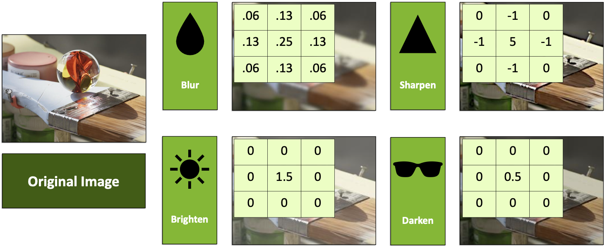
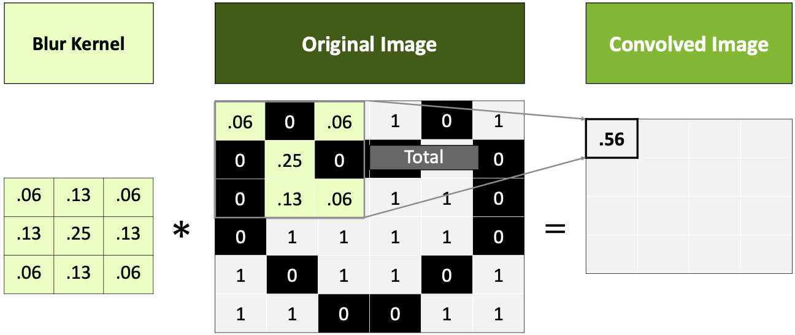
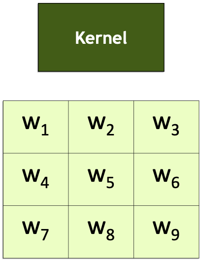
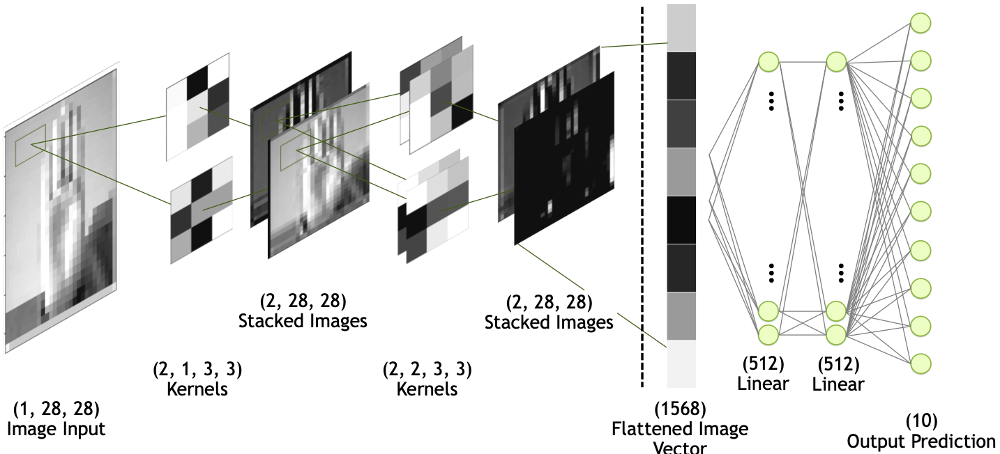
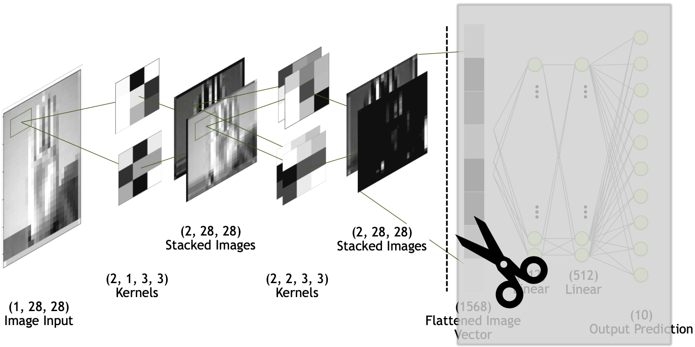
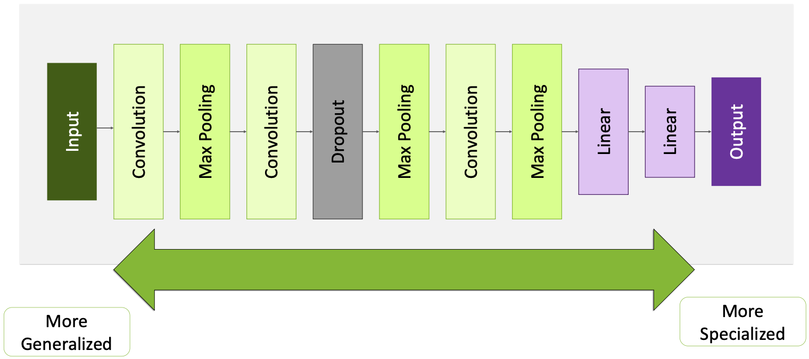

# Fundamentals of Deep Learning 

1. [Lab2: ASL](#lab-2-asl)
2. [CNN](#cnn)


Le reti neurali esistevano già dagli anni 50' ma sono esplose solo dopo il 2012 grazie alla convergenza di due fattori:

1. Data: I modelli di AI e le reti neurali richiedono enormi quantità di dati per essere addestrate. Con l'era di internet, IoT e dei social media abbiamo generato come società petabyte di dati etichettati, senza di questi il motore dell'AI non sarebbe stato in grado di girare.     

2. Computing Power: Non basta avere solo i dati, serve anche  potenza di calcolo enorme, che al giorno d'oggi esiste.    


Il Deep Learning capovolge il paradigma di programmazione tradizionale.  
Invece di fornire istruzioni specifiche, si forniscono esempi per fare in modo che il sistema trovi da solo pattern e impari a riconoscerli.   

**Schema $\rightarrow$ Dati + Risposte = Modello** 


- **Dati + Risposte**: forniamo al sistema un immagine (o dati) e l'etichetta corretta 
- **Training:** il computer pova a indovinare una regola interna, all'inizio fallirà ma con un algormito diremo al modello di aver sbagliato e di correggere i suoi parametri.  
- **Apprendimento:** Dopo aver visto milioni di esempi e correzioni, il sistema crea da solo un modello matematico che mappa i dati alle risposte corrette.   


Il DL si distigue dal ML per:

1. **Profondità:** Si chiama 'deep' perchè ha molti strati di neuroni uno dietro l'altro; più strati ci sono più la rete è capace di imparare concetti astratti (es. strato1 riconosce line, strato10 riconosce forme, strato100 riconosce facce).  

2. **Parametri:** I parametri sono i pesi che la rete deve calibrare durante il training, le reti neurali hanno spesso miliardi di parametri!   


<br> <br>


## Concetti fondamentali 

I seguenti concetti spiegati sono stati incontrati nei laboratiri, in particolare [in questo Notebook](./notebooks/mnist.ipynb)

### 1. Tensori  

Un **Tensore** è un contenitore strutturato di numeri.  
Permette di definire strutture a N-dimensioni, in 1D abbiamo array, in 2D matrici in N-D abbiamo tensori.  

Il tensore è la struttura, al suo interno può contenere tipi di dato come int, float, ... 


### 2. Immagini e Computer   

Un computer non è in grado di vedere un immagine come la intendiamo noi, vede solamente luminosità.  

Vede un immagine come una sequenza di valori che rappresentano l'intensità di un colore in una scala specifica.  


La proietta sullo schermo come una matrice composta da N righe ed M colonne.   
Es: immagine 28x28 (mnist) a scala di grigi $\rightarrow$ le celle della matrice possono assumere valori tra 0 e 255, dove lo zero rappresenta il nero totale e il 255 rappresenta il bianco.    


### Casting di immagine a tensore: 

Per permettere a pytorch di lavorare e addestrare un modello tramite immagini dobbiamo assicurarci che questa venga trasformata in un *tensore* (ossia in una griglia di numeri), per permettere alla GPU di fare le operazioni matematiche velocemente.  
Se l'immagine fosse salvata in un formato come JPEG la GPU non saprebbe farci i calcoli matematici sopra.  


Una volta trasformata in tensore, il valore minimo e massimo che possono avere gli elementi diventa normalizzato, e vanno da un minimo di `0.0` a un massimo di `1.0`.  
Questo per evitare che i calcoli matematici diventino troppo coomplicati.  

Pytorch, una volta trasformata un immagine in un tensore, organizza sempre i dati in un **ordine preciso**: **`C x H x W`**  

- C è il color channel, nel caso MNIST essendo foto in scala di grigi è 1
- H è il numero di righe (pixel verticali)
- W è il numero di colonne (pixel orizzontali)   


---

<br><br><br>


## Lab 2: ASL   

In questo notebook abbiamo preso un dataset da Kaggle, in particolare un dataset che contiene immagini 28x28 dove sono illustrati esempi diversi dell'alfabeto dei segni.     

Per poter addestrare il modello (partendo da un dataset CSV), bisogna seguire i seguenti passi:  

1. Separazione dei dati (il CSV contiene anche le label, le mettiamo in un altro df e le eliminiamo dai df di train e validation)  

<br>

2. Normalizzazione del dataset: abbiamo 784 pixel per immagine, in scala di grigi, quindi nel range 0-255. Dobbiamo normalizzarli per evitare che la rete impazzisca (varianza), e quinid dividiamo l'intero dataset per 255 per ottenere valori tra 0 e 1.  

<br>

3. Conversione in **Tensori**: Step fondamentale, in quanto PyTorch sanno lavorare SOLO su tensori, che rappresentano il formato capace di supportare i gradienti e l'accelerazione su GPU.  
    - Quando facciamo il cast in Tensori dobbiamo assicurarci di fare il casting a un Tensore di `float`, questo per **Stabilità Matematica**: I pixel sono interi mentre i pesi della rete sono float (e abbiamo anche normalizzato il dataset quindi è uno step necessario assicurarsi che diventi un tensore di float).  

<br>

4. Definizione del `DataLoader`: usiamo un data loader per decidere il batch size e alimentare la nostra rete con i dati durante il training; ci sono due modi, in questo notebook viene mostrata la definizione di una classe che eredita da `Dataset`, in questo modo possiamo passare l'intero dataset al costruttore, facendo il casting a tensore di float e mandandoli sul device. Dopo basterà passare al DataLoader la nostra classe e decidere il batch size per finire la costruzione del dataloader.   

<br>

5. Decidiamo l'architettura della rete, nel nostro caso abbiamo scelto:
    - 1 layer flatten, 1 layer denso di input (28*28, 512) da 512 neuroni, un hidden layer denso (512, 512) da 512 neuroni e un output layer da 24 neuroni in quanto è il numero delle nostre classi.  
    - abbiamo usato la ReLu come funzione di attivazione su tutta la rete 
    - una volta scelti i layer creiamo la rete con nn.Sequential e poi la compiliamo e la mandiamo in GPU 

<br>

6. Scelta della loss e dell'ottimizzatore:
    - per la loss: `loss_function = nn.CrossEntropyLoss()`
    - come ottimizzatore: `optimizer = Adam(model.parameters())`

<br>

7. Scriviamo la funzione di train, di validate e di accuracy 

<br>

8. Scegliamo il numero di epochs e iniziamo il training!  

<br><br>


<center>

**nota: test del modello con una sola immagine**  

</center>

Non possiamo mandare un unica immagine da 784 pixel, dobbiamo aggiungere una dimensione dummy per fare in modo che il layer flatten riesca a lavorare come deve.  
Ricordiamo che il layer di flatten prende la prima dimensione dell'oggetto che gli passiamo e la tratta come il batch size! se mandiamo solamente l'immagine vedrà arrivarsi come prima dimensioni 784 e la tratterà come il batch size, ma poi non avendo altre dimensioni avremo l'errore `IndexError: Dimension out of range`.  

Possiamo aggiungere una dimensione dummy al tensore con `.unsqueeze(0)`, in questo modo otteniamo una struttura (1x784), il flatten guarderà la prima dimensione e vedrà che si tratta di una sola immagine da 784 pixel e la farà passare lungo tutta la rete.    


```python
train_df = pd.read_csv("data/asl_data/sign_mnist_train.csv")
x_train = train_df.values
x_train = train_df.values / 255 # normalizzare 

x_1 = x_train[0]

img_raw = x_1 

# conversione a Tensore
img_tensor = torch.tensor(img_raw).float().to(device)

# aggiunta dimensione dummy per il layer flatten
img_batch = img_tensor.unsqueeze(0)

# controllo dimensioni
print(f"Pre: {img_tensor.size()} - Post: {img_batch.size()}")

model.eval()
with torch.no_grad():
    prediction_logits = model(img_batch)
    classe_predetta = prediction_logits.argmax(dim=1).item()

real_label = y_1
print(f"Classe Predetta: {classe_predetta}")
print(f"Classe Reale: {real_label}")
```

l'output che genera è il seguente:

```bash
Pre: torch.Size([784]) - Post: torch.Size([1, 784])
Classe Predetta: 6
Classe Reale: 6
```
--- 


<br><br><br>


## CNN  


Nel blocco precedente usavamo `nn.Flatten()` che prendeva un immagine 2D e la trasformava in una lunga riga di pixel.  
Questa operazione distrugge la **struttura spaziale**! Se un pixel era vicino a un altro in verticale, dopo il flatten diventano lontanissimi.  
La rete densa doveva faticare il doppio per capire che magari quei due pixel erano correlati, e inoltre questo portava spesso a errori di **overfitting** in quanto avevamo troppi parametri e bisogno di troppa memoria.   


### Kernel e Convoluzioni  

Possiamo definire come **Convoluzione** l'applicazione di un filtro a un immagine.  

Questi filtri sotto al cofano sono **Kernel**, ossia piccole matrici di numeri (es 3x3, 5x5 o 7x7).   

- *Blur*: prende un pixel e lo mischia con i vicini facendo una media ponderata 
- *Sharpen*: esalta la differenza tra un pixel e i vicini, mette un valore grande centrale e valori negativi attorno


  


Concetto fondamentale del Deep Learning $\rightarrow$ I numeri dentro i Kernel sono i **PESI** ($w$) che la rete imparerà da sola.  
Non diremo alla rete "cerca i bordi verticali", lei imparerà i numeri giusti per trovare i bordi verticali perché capirà che serve a minimizzare la loss.    


### Come funziona il calcolo (applicazione dei kernel)  

L'operazione consiste nel prendere il Kernel e sovrapporlo a una porzione dell'immagine della stessa dimensione.  
Una volta sovrapposto di fa una moltiplicazione elemento per elemento e poi si sommano tutti i risultati parziali.  
Questo singolo numero diventa **un SOLO pixel** della nuova immagine che viene chiamata 'Feature map' o 'Convolved image'.  

Si procede con il resto dell'immagine seguendo un movimento 'Sliding Window'.   
    
  

**Iperparametri fondamentali**:   
Quando definiamo un layer nn.Conv2d in PyTorch dobbiamo decidere come fare muovere il kernel, ci sono die parametri che cambiano la dimensione dell'output e che sono fondamentali.   

- **Stride**: Dice di quanto spostiamo il kernel ogni volta.  
    - stride 1: lo spostiamo di un pixel alla volta $\rightarrow$ l'output è grande quasi quanto l'input 
    - stride 2: lo spostiamo saltando un pixel $\rightarrow$ l'output sarà circa la metà dell'input, facciamo *downsampling*
    - stride 3: l'immagine di output diventa 1/3    

- **Padding**: Aggiunge pixel finti intorno all'immagine originale prima di passare il kernel, esistono due principali modi:
    - zero padding: aggiunge una cornice di zeri (è quello più usato)
    - mirror padding: si copiano i pixel del bordo, per mantenere la continuità visiva

<br>

Usare valori di stride > 1 è fondamentale per ridurre la dimensione dell'immagine e ridurre i calcoli man mano che andiamo in profondità nella rete.  
Meno pixel = meno memoria = più velocità.     

Il padding è necessario se vogliamo centrare un kernel sul pixel nell'angolo estremo, perchè il kernel uscirebbe fuori dall'immagine.  
Aggiungendo il padding siamo in grado di mettere il kernel anche sui bordi originali, e come sonseguenza avremo in output un immagine con la stessa dimensione dell'input! questo è molto comodo per reti profonde!    


Stride $\rightarrow$ restringe le dimensioni    
Padding $\rightarrow$ mantiene le dimensioni, combatte il restringimento naturale dovuto alle dimensioni del kernel.  


<br>

Dobbiamo considerare i Kernel come neuroni!  

      

Il kernel ha al suo interno i pesi: $w_1, w_2, ..., w_9$, quando inizializziamo la rete questi valori saranno casuali.  
Durante la fase di training (con la backpropagation), la rete modificherà i pesi $w$ per imparare a riconoscere elementi dell'immagine (es. bordi, curve, occhi, ecc...)    


**Architettura completa e gerarchia delle feature**:    

<center>

      

</center>

- Immagine input: È un immagine singola in scala di grigi (1, 28, 28)   
- Primo set di Kernel: si applicano due kernel 3x3  
- Stacked Images (2, 28, 28):  
    - se applichiamo 1 kernel otteniamo 1 immagine di output 
    - in questo caso abbiamo applicato 2 kernel, quindi otteniamo due immagini 
    - le immagini prodotte dai kernel si chiamano **Feature Maps** e vengono impilate una sopra l'altra!  
    - solitamente le reti usano molti kernel contemporaneamente (es. 32 o 64)   

- Flattening: alla fine prendiamo tutte le feature map prodotte e le schiacciamo in un vettore unico gigante che passiamo ai vecchi layer linear (densi) per la decisione finale.  


**Altri layer della rete:**     


- **Max-Pooling**: riduciamo drasticamente le dimensioni dell'immagine per renderla più gestibile, manteniamo solo le informazioni più importanti.  
    - prende una finestra (es. 2x2) e tiene solo il pixel con il valore più alto, buttando via gli altri.  
    L'immagine diventa grande la metà (downsampling brutale) ma i picchi di segnale rimangono (è molto più aggressivo dello stride)  
    *Vantaggio*: rende la rete invariante alle traslazioni! 


- **DropOut**: Spegnimento di neuroni a caso per evitare che la rete impari a memoria (overfitting)


---


<br><br>


## Pre Trained Models 


Fino ad ora per ogni problema abbiamo:
- Definito l'architettura (conv, pool, linear, ...) 
- Inizializzato i pesi a caso
- Scelto learning rate, dropout ed epoche 
- Addestrato il modello  

Rifare questo processo ogni volta è uno spreco di energia!   

La soluzione è usare **Pre-Trained Models**, si possono trovare ottimi modelli già addestrati in repository ufficiali (PyTorch Hub, Nvidia NGC).  

La nuova sfida è creare un modello che riconosca cani e gatti per creare una porta automatica che si apra solo per cani, non faccia uscire i gatti e che rimanga chiusa per tutti gli altri animali.   

Il problema: cane e lupo sono simili e soprattutto abbiamo pochissimi dati! non avremo mai a disposizione 1milione di foto del nostro cane.  
In questo caso il nostro modello andrebbe in overfitting immediato.   


### Transfer Learning  

Il transfer learning consiste nel prendere un modello (es. VGG16) che è stato addestrato su un compito generico gigante (dataset ImageNet) e riutilizzare la sua conoscenza per risolvere un compito specifico più piccolo.  

Le reti neurali sono gerarchiche (bordi -> forme -> oggetti), quindi noi terremo buoni i layer iniziali e cambieremo solo la parte finale (cervello decisionale) per adattarlo al nostro problema.  

La sfida si complica in questo caso e diventa: distinguere un cane specifico ("Bo") da tutti gli altri cani, anche quelli simili.   

È un problema più difficile perchè cani diversi condividono caratteristiche come zampe, pelo, coda, orecchie, ...  
Serve che la rete sia molto brava negli stati profondi (quelli più specializzati) per notare le differenze che permettano di fare la distinzione!    

Il **Transfer Learning** è perfetto per questo tipo di problemi, perchè parte già da una conoscenza visiva molto avanzata.   


**Modificare la Rete**:  

Possiamo vedere la rete neurale come divisa in due parti principali:  

1. **Backbone/Feature-Extractor**: Comprende la parte di convolizione e pooling, è la parte che guarda e capisce.  

2. **Head/Classifier**: Sono gli ultimi layer lineari (densi), ossia la parte che prende la decisione finale.   


Il modello che useremo (VGG16) finisce con un layer che ha 1000 output, a noi servono solamente 2 output $\rightarrow$ è Bo o non è Bo (classificazione binaria)    


In questi casi l'operazione che faremo sarà la seguente:    

1. Prendiamo la rete (es.VGG16)
2. Tagliamo l'ultimo pezzo (layer lineari e l'output)
3. Teniamo intatto tutto il blocco di Convoluzioni  
4. Incolliamo i nostri nuovi layer lineari con solo due output finali   


  

<br>


Ad alto livello possiamo riassumere una rete in questo modo:

   

- **A sinistra**: Abbiamo gli input/primi layer che sono più **Generalizzati**, sono in grado di riconoscere linee diagonali, colori, texture, ...  
    Queste informazioni servono sempre! indipendentemente dall'output finale (sono la 'base' della conoscenza della rete )  

- **A destra**: Abbiamo gli ultimi layer che sono più **Specializzati**, sono quelli che cambiamo a seconda del nostro problema.  

Nel VGG16 originale questi layer finali si attivano per feature come "orecchie da cocker spaniel" o "ruote da camion", e poichè noi stiamo cambiando compito, questa specializzazione non ci serve più! La possiamo sostituire con la nostra.   

<br>

### Congelamento del modello 

È un concetto tecnico fondamentale per il training, propedeutico per il funzionamento del transfer learning.   

Arrivati al punto di aver inserito i nostri layer per il nostro caso d'uso dobbiamo iniziare la fase di training, ma c'è un grosso rischio:   

- I layer che abbiamo inserito (testa della rete) sono inizializzati a caso
- Il corpo della rete è pre-addestrato  

Se facciamo partire la backpropagation la testa della rete farà errori giganti (in quanto ha pesi casuali), la loss quindi sarà altissima così come il gradiente!  
Questi gradienti enormi attraversano poi tutta la rete all'indietro e andranno a modificare in modo sostanziale i pesi del corpo (VGG).   

In questo modo si va a distruggere la conosenza prezione che la rete pre-addestrata ha imparato in mesi di training, in quanto andiamo a sovrascrivere la conoscenza con rumore causato dalla testa non ancora pronta!     


La soluzione è **Congelare (Freeze)** i pesi del backbone del modello, quindi non calcolare i loro gradienti.    
In questo modo durante la fase di training aggiorniamo **SOLO** i pesi della nuova testa, il Backbone funge solo da 'estrattore di feature statico'     

Nel notebook [05_presidential_doggy_door](/../../chris/Desktop/deep%20learning/allcontent/05b_presidential_doggy_door.ipynb) viene mostrato il trasfer learning e il fine tuning.  


### Fine Tuning

Una volta addestrato il modello con transfer learning tenendo i pesi del backbone congelati possiamo migliorare le performance con il fine tuning.  

Consiste nel tornare ad allenare il modello per poche epoche e con un learning rate bassissimo  

```python
vgg_model.requires_grad_(True)
optimizer = Adam(my_model.parameters(), lr=.000001)
```


<br><br><br>

---


### Key notes  

PyTorch lavora sempre a Batch.   
Se passiamo a PyTorch un immagine sola, l'output non sarà una lista semplice, ma sarà una lista dentro una lista.   


La parola "Dimensione" viene usata per indicare due concetti matematici ben distinti: il **Rango** (Rank) e l'**Asse** (Axis).

Ma bisogna saper distinguerli bene   

---

### 1. Il Concetto di "Rango" (O "N-Dimensioni")
In algebra lineare e in PyTorch, il **Rango** (Rank) indica quanti indici sono necessari per accedere a un singolo numero (uno scalare) all'interno della struttura dati. È il numero di "assi" totali che l'oggetto possiede.

*   **Rango 0 (Scalare):**
    *   È un punto adimensionale.
    *   Shape: `()` (vuota).
    *   Accesso: Non servono indici. Il dato è il numero stesso.
    *   Assi esistenti: **Nessuno**.

*   **Rango 1 (Vettore):**
    *   È una linea.
    *   Shape: `(N,)`.
    *   Accesso: Serve **1 indice** ($i$) per trovare un valore: $v[i]$.
    *   Assi esistenti: Esiste solo l'**Asse 0**.

*   **Rango 2 (Matrice):**
    *   È una griglia.
    *   Shape: `(N, M)`.
    *   Accesso: Servono **2 indici** ($i, j$) per trovare un valore: $m[i, j]$.
    *   Assi esistenti: Esiste l'**Asse 0** (righe) e l'**Asse 1** (colonne).

*   **Rango 3 (Tensore 3D):**
    *   È un cubo (o una pila di matrici).
    *   Shape: `(K, N, M)`.
    *   Accesso: Servono **3 indici**.
    *   Assi esistenti: **Asse 0**, **Asse 1**, **Asse 2**.

**Il tuo dubbio formale:**
Quando tu dici *"dim1 è un vettore"*, stai confondendo l'oggetto di **Rango 1** con l'**Asse 1**.
Un oggetto di Rango 1 (vettore) **NON HA** un Asse 1. Ha solo l'Asse 0. Per avere un Asse 1, l'oggetto deve essere almeno di Rango 2.

---

### 2. Il Concetto di "Asse" (Axis Indexing)
Quando in PyTorch scrivi `dim=k` (che sarebbe più corretto chiamare `axis=k` come in NumPy), stai indicando la **direzione di scorrimento** lungo la struttura dati.

L'indice dell'asse corrisponde alla posizione del numero nella tupla `.shape`:

Dato un Tensore $T$ di shape $(D_0, D_1, D_2, ...)$:

*   **`dim=0`:** Operi lungo la dimensione $D_0$. In una visualizzazione a liste annidate, scorri gli elementi della lista più esterna.
*   **`dim=1`:** Operi lungo la dimensione $D_1$. Entri dentro il primo contenitore e scorri gli elementi del contenitore interno.

### 3. Formalizzazione dell'Operazione `argmax(dim=k)`

Matematicamente, l'operazione di `argmax` lungo l'asse $k$ riduce il rango del tensore di 1.

Dato un tensore $T$ di dimensioni $(d_0, d_1)$, dove $x_{i,j}$ è l'elemento agli indici $i,j$:

#### Caso A: `argmax(dim=0)` (Lungo l'Asse 0)
Stiamo cercando l'indice $i$ che massimizza il valore, tenendo fisso $j$.
Per ogni colonna $j$ fissa, calcoliamo:
$$ \text{Out}_j = {\text{argmax}} (x_{i, j}) $$
L'asse 0 "collassa". Il risultato ha shape $(d_1,)$.

#### Caso B: `argmax(dim=1)` (Lungo l'Asse 1)
Stiamo cercando l'indice $j$ che massimizza il valore, tenendo fisso $i$.
Per ogni riga $i$ fissa, calcoliamo:
$$ \text{Out}_i = {\text{argmax}} (x_{i, j}) $$
L'asse 1 "collassa". Il risultato ha shape $(d_0,)$.

---

### 4. Applicazione al Caso Specifico

Hai un tensore Output $O$ con shape $(1, 1000)$.
Quindi:
*   $D_0 = 1$ (Dimensione dell'Asse 0).
*   $D_1 = 1000$ (Dimensione dell'Asse 1).

Essendo un oggetto con **2 valori nella shape**, è un oggetto di **Rango 2** (Matrice).
Poiché è di Rango 2, **l'Asse 1 esiste ed è valido**.

**Analisi dell'operazione `argmax(dim=1)` su questo oggetto:**
1.  Fissiamo l'indice dell'Asse 0 (che può essere solo $0$, dato che $D_0=1$).
2.  Scorriamo lungo l'Asse 1 (da $0$ a $999$).
3.  Cerchiamo quale indice $j$ tra $0$ e $999$ ha il valore più alto.
4.  Restituiamo quell'indice.

**Perché `dim=1` fallisce su un Vettore $(1000,)$?**
Se avessi fatto l'unbatch *prima*, avresti avuto shape $(1000,)$.
*   $D_0 = 1000$.
*   $D_1$ non esiste.
L'oggetto è di **Rango 1**.
Se chiami `argmax(dim=1)`, PyTorch cerca il secondo asse, non lo trova, e lancia `IndexError: Dimension out of range`.

**Conclusione Formale:**
Utilizzi `dim=1` perché il tuo tensore è una matrice riga $(1, N)$. Nonostante sembri "piatta", topologicamente ha due assi, e i dati che ti interessano sono distribuiti lungo il secondo asse (quello delle colonne).