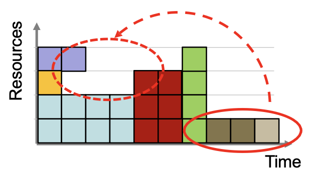

# Slurm: Simple Linux Utility for Resource Management 

Slurm è il sistema fondamentale di controllo all'interno di un cluster, svolge principalmente **3 compiti**:  

1. Resource Manager: Sa esattamente che hardware c'è nel cluster e sa in che stato è (nodo1 spento, nodo3 non ha gpu, ...). È l'**inventario in tempo reale**  

2. Job Scheduler: È il pianificatore, riceve richieste e decide quali fare passare per prime, dove metterle e per quanto tempo.  

3. Basic Interaction:  Fornisce comandi all'utente per interagire con il sistema 

Oltre ai 3 compiti, svolge 3 funzioni core:
1. **Allocazione**: Slurm da le chiavi di una porzione di hardware per un tempo limitato (es: nodo02 per 1h)

2. **Esecuzione**: Fornisce il framework per lanciare il programma su quel nodo 

3. **Arbitraggio**: Gestisce la coda (Pending Work); se tutti i nodi sono occupati Slurm mette il tuo lavoro in una coda e lo fa partire quando si libera posto nel sistema.  

Considerato al giorno d'oggi lo standard de-facto in quanto opensource, scalabile e fault-tolarant!  

### Slurm Job

Un Job è un **allocazione di risorse**, ogni job ha:
- ID (univoco)
- Time Limit 
- Size (n nodi e N core)
- State (pending, running, completed, failed)

Dentro un job possiamo avere **Job-Steps**:  
- si creano con il comando `srun`  
- possono essere sequenziali o paralleli 
- Es: prenoti il nodo1 per un ora (questo è il job!)
    - copi i dati (`cp src dest`)
    - lanci calcolo/script (`srun python ...`)
    - copi i risultati indietro (`cp src dest`)  
    Tutti questi passaggi vivono dentro lo stesso JobID e condividono le stesse risorse allocate, ma sono di fatto step diversi.  

 

### Scheduling  

Slurm è lo scheduler dei job dentro il cluster, questo vuol dire che slurm ha il compito di incastrare i job che gli arrivano con le risorse a disposizione cercando di tenere le risorse del sistema il più occupate possibili, rispettando un ordine di importanza per job.  

Il metodo naive sarebbe quello di usare una coda FIFO per schedulare i lavori, ma questo bloccherebbe job piccoli (se preceduti da job grossi) anche quando le risorse sono iin raltà libere.  

**Backfill:**  
È il metodo che usa realmete Slurm, è un algoritmo che rispetta la fila ma guarda anche se ci sono buchi/risorse libere e se esiste un job abbastanza piccolo da entrare in quel buco con il vincolo di non fare ritardare gli altri job che sono già in coda!  

Per funzionare questo algoritmo ha bisogno di 2 informazioni fondamentali:
- **Job priority**: [in dettaglio sotto]
- **Time limit**: Tempo limite al quale è vincolato un job! È fondamentale in quanto slurm deve saper esattamente quanto durerà ogni job, senza questa info non potrebbe calcolare se c'è spazio per incastrare un altro job.  

  

 
  

### Job Priority 

I Job vengono organizzati in base alla loro priorità, che è un fattore calcolato con una somma pesata di diverse varibili.  
I pesi sono scelti dagli amministratori di sistema.  

Le più importanti da conoscere sono: (elencate in ordine di importanza)  

1. **QoS (Quality of Service):**  
    È il fattore più potente, ogni volta che si sottomette un job, questo viene associato a un QoS; i tipici livelli sono:  
    - normal: livello standard 
    - low : bassa priorità, i job con QoS low passano solo se non c'è nessun normal in coda 
    - class_a, class_b,... : sono QoS riservati a specifici gruppi che hanno pagato per avere garanzie di esecuzione  
    legato direttamente all'importanza (dentro il cluster) dell'utente che lancia il job

2. **Fairshare:**  
    Meccanismo democratico di slurm, serve a impedire che un singolo utente monopolizzi l'intero cluster; È un fattore che dipende direttamente da:
    - Consumption: quanto hai usato cluster nei giorni/settimane passate 
    - Resources Requested: quanto stai chiedendo ora   
    Il concetto è che chi ha consumato molto deve aspettare, mentre chi ha consumato poco riceve un boost di priorità.  

3. **Age:**  
    Il fattore age serve a evitare la starvation di job dovuta a una bassa quota di fairshare.  
    Ogni minuto che il job passa in pending guadagna un po' di punti  
    La crescita non è infinita, esiste un upperbound impostato dall'admin  
    Non è un meccanismo che funziona per job dipendenti, il job in attesa che dipende da un altro job non guadagna punti age fino a quando non diventa 'runnabile'  

4. **Job Size:**  
    Questo fattore favorisce i lavori grossi. Questo perchè i lavori grossi favoriscono e aiutano lo scheduler. Se i job grossi non avessero questo bonus rischierebbero di venire sorpassati di continuo dai job piccoli.  
    Il bonus è dato SOLAMENTE per risorse e NON per tempo, il bonus viene dato se si chiedono tanti nodi/core; non viene dato se chiedi 1 nodo per 30 giorni.  

Quando si lancia `sbatch` su un cluster slurm fa:
1. guarda chi sei e quanto hai lavorato recentemente (fairshare)
2. guarda che tipo di servizio hai richiesto (QoS)
3. guarda quanto è grosso il job size 
4. somma tutto quanto e ti dà un punteggio iniziale 
5. ti mette in coda 
6. per ogni minuto passato in coda, ti vengono aggiunti punti (age)

 

---

 

