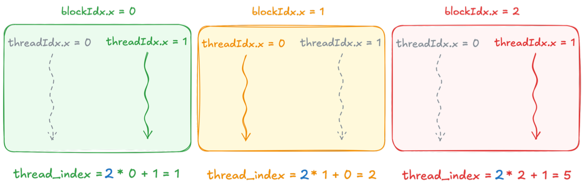
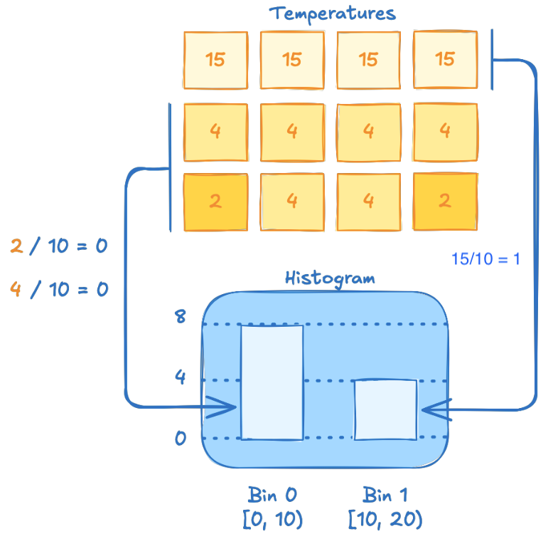
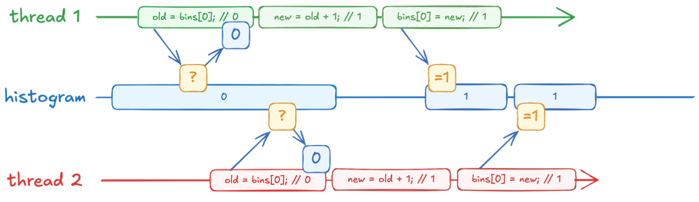
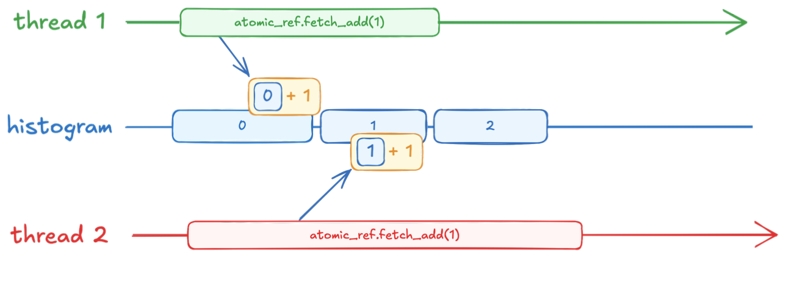

# Implementazione di algoritmi con kernel CUDA     


Le librerie come thrust e cub non sono magiche, sono solo codice ottimizzato scritto da altri programmatori, se l'algoritmo specifico che vogliamo usare non esiste in queste librerie dovremmo scriverlo noi da zero lanciando il lavoro su GPU.  

### Qualificatori

Per scrivere codice GPU usiamo delle keyword speciali che dicono al compilatore nvcc dove deve essere eseguito quel codice: 
- **__host__**: Codice standard C++, viene compilato per CPU, è il modo di esecuzione di defualt (nel caso non venga specificato altro).  
- **__device__**: Codice di funzioni che vivono **solo** su GPU, vengono chiamate dalla GPU ed eseguite sulla GPU. 
- **__global__**: Funziona come ponte tra CPU e GPU, infatti viene invocata dalla CPU (host) ma eseguita sulla GPU (device)   

Il nostro codice iniziale è:    

```cpp
using temperature_grid_f = 
    cuda::std::mdspan<float, cuda::std::dextents<int, 2>>;

void simulate(temperature_grid_f in,
            float* out, 
            cudaStream_t stream)
{
    auto ids = thrust::make_counting_iterator(0);
    cub::DeviceTransform::transform(
        ids, out, in.size(),
        [in] __host__ __device__ (int cell_id){
            return dli::compute(cell_id, in);
        },
        stream

    );
}
```


Scriviamo lo stesos codice usando un singolo Kernel:  

```cpp
__global__ 
void single_thread_kernel(dli::temperature_grid_f in, float *out)
{
    for(int id = 0; id<in.size;id++)
    {
        out[id] = dli::compute(id,in);
    }
}

void simulate(dli::temperature_grid_f in,
        float *out,
        cudaStream_t stream)
{
    single_thread_kernel<<<1,1,0>>>(in,out);
}
```


- la sintassi per usare i kernel è:   
    `kernel_function<<<X,Y,Z>>>(in, out)`    
    - X è il blocco 
    - Y è il numero di thread per blocco 
    - Z è il riferiemento allo stream di appartenenza. 
- questo codice è estremamente lento, ci mette circa 4.15s per fare la computazione vs i 0.000043s di CUB
    - questo perchè stiamo usando la GPU come se fosse una CPU, abbiamo usato un solo thread per fare tutto il lavoro.  


**Proviamo a fare la stessa cosa ma con due thread**:   

```cpp
const int number_of_threads = 2;

__global__ block_kernel(dli::temperature_grid_f in , float *out)
{
    int thread_index = threadIdx.x;
    for(int id = thread_index; id< in.size; id+=number_of_threads)
    {
        out[id] = dli::compute(id,in);
    }
}

void simulate(dli::temperature_grid_f in, 
        float *out, 
        cudaStream_t stream)
{
    block_kernel<<<1, number_of_threads, 0, stream>>>(in, out);
}
```

- threadIdx.x mi permette di ottenere il suo identificativo numerico 
- il ciclo for parte dal thread index e salta di 2 (numero di thread), stiamo intervallando le iterazioni da eseguire tra i due thread!  
    - th0 esegue celle: 0, 2, 4, ... 
    - th1 esegue celle: 1, 3, 5, ... 
    - lavorano insieme. questo pattern si chiama grid-stride loop.  

- Risultato: il tempo di esecuzione diventa 2.6s, è stato dimezzato!
- se proviamo con 256 thread (`<<<1,254,stream>>>`) il tempo crolla a 0.037s!  

Ogni architettura GPu ha un limite fisico di thread che possono stare dentro un singolo blocco, attualmente il limite è **2024 thread per blocco!**     
Se proviamo a chiederne di più il kernel non parte nemmeno e riceviamo errore.   


### Gerarchia GPU: 

La GPU organizza i thread in modo gerarchico per gestire milioni di operazioni:

- **thread**: unita singola (operaio)
- **block**: un gruppo di thread, tutti i thread in un blocco possono comunicare facilmente e risiedono sullo stesso multiprocessore (limite di 1024 thread per blocco)
- **grid**:  L'insieme di tutti i blocchi lanciati per un kernel


Variabili di sistema importantissime:
- `blockIdx.x`: restituisce l'indice del blocco attuale (es: sono blocco 2)
- `blockDim.x`: restituisce il numero di thread presenti in ogni blocco (es: 256)
- `gridDim.x`: restituisce il numero di blocchi totali che compongono la griglia.  


Per sapere quanti thread abbiamo attualmente attivi possiamo usare la formula (1).  
Per avere l'**indice globale** di un thread all'interno delll'intero sistema usiamo la formula (2) (ci restituisce la posizione assoluta alla griglia, non quella locale al blocco).  

```cpp
// Formula (1)

int numero_totale_thread = 
    blockDim.x. * gridDim.x;

// Formula (2)

int thread_index = 
    blockDim.x * blockIdx.x + threadIdx.x;
```


      


### Scegliere le dimensioni:

- **Dimensioni del blocco**:   
    La dimensione del blocco _NON_ dipende dal dalla dimensione del problema _MA_ dall'architettura della GPU.    
    - Regola: usare sempre multipli di 32 (in quanto i thread vengono eseguite in gruppi da 32 chiamati warps)     
    - Tip: Si consiglia di usarne 256 di default. 

<br>

- **Dimensioni della griglia**:  
    La griglia dipende dalla dimensione del problema!  
    Vogliamo che esistano abbastanza blocchi da coprire tutti i dati, useremo la seguente formula:
    - grid_size = `ceil_div(totale_elem / block_size);`  
    - Se abbiamo ad esempio 1000 elementi e blocchi da 256, serviranno 4 blocchi totali! (se ne usassimo 3 avremmo 768 elementi coperti).  


Risultato finale:

```cpp
__global__
void grid_kernel(dli::temperature_grid_f in, float *out)
{
    int thread_idx = blockDim.x * blockIdx.x + threadIdx.x;
    int n_threads = blockDim.x * gridDim.x;

    for(int id = thread_index; id < in.size(); id+= n_threads)
    {
        out[id] = dli::compute(id,in);
    }
}

void simulate(dli::temperature_grid_f in,
        float *out, 
        cudaStream_t stream)
{
    int block_size = 256;
    int grid_size = cuda::ceil_div(in.size(), block_size);
    
    grid_kernel<<<grid_size, block_size,stream>>>(in, out);
}
```


### Spiegazione sull'esecuzione del codice:

- Osserviamo `__global__` sulla firma della funzione kernel, questo fa si che quando la CPU arriva a leggere `grid_kernel<<<grid_size, block_size,stream>>>(in, out);` non esegue lui direttamente la funzione ma la manda alla GPU.  
- Invia un pacchetto di istruzioni al controller della GPU, in cui dice quante grid e quanti thread istanziare. 
- La CPU subito dopo aver mandato questo ordine, prosegue alla riga successiva del programma! il lancio del kernel e la sua computazione è un operazione ASINCRONA non bloccante per la CPU.         

<br>

- L'hardware della GPU (scheduler) accede migliaia di thread contemporaneamente e fornisce a tutti gli stessi dati (grid)
- Ogni thread svolgerà un operazione diversa nella grid grazie al loro identificatore thread_index e grazie al fatto che la logica preveda che il ciclo for avvenga con accesso a stride.  
- supponiamo di avere 1000 elementi e 256 thread totali (e 1 solo blocco)
    - th0: entra nel loop con `id=0`, fa il calcolo e poi fa `id+256`. 
        al prossimo giro lavorerà su `256`, poi su `512` e poi `768`.
    - th1: entra con `id=1`, poi farà `257`, `513`, `769`.


<br>

## Gerarchia dei thread

I thread sono divisi in blocchi per una buona ragione, la risposta è che i thread nello stesso blocco possono scambiarsi dati velocemente tramite la **shared memory**.  


**Gestire i dati nei kernel in modo sicuro**:   

NVIDIA consiglia l'uso di uno strumento del C++ per gestire i dati in modo sicuro all'interno dei kernel: `span`. 

```cpp
cuda::std::span<int> span(a.data(), 3);
span.size(); // restituisce 3 
```

È la variante monodimensionale di mdspan che abbiamo visto in precedenza.  
- vantaggi: È una view ma include informazioni sulla dimensione, è molto più _sicuro_ dei puntatori nudi perchè riduce gli errori ed è leggero.  

Per inizializzare un oggetto span gli si passa un puntatore ai dati e la dimensione.  

Ci possiamo interfacciare ai dati come ad un array standard con l'operatore `[]` che ci permette l'accesso (span[0] legge il primo elemento).   


### Esempio dell'Istrogramma 

Torniamo alla nostra simulzione del calore, ora vogliamo creare un istrogramma dalle temperature ottenute.   
Un istrogramma raggruppa dati in bin contando quanti valori cadono nell'intervallo definito nel bin.  

Nel nostro caso questo mostra la distribuzione della temperatura 
(l'ortogramma è usato per valori discreti, non utile in questo caso).  




Ogni bin copre un range di temperature, e l'altezza della barra mostra quante celle cadono in tale range.  


Lo eseguiamo con un kernel:  

```cpp
__global__ void histogram_kernel(
    cuda::std::span<float> temperatures, 
    cuda::std::span<int> histogram
    )
{
    int cell = blockIdx.x * blockDim.x + threadIdx.x;
    int bin = static_cast<int>(temperatures[cell] / bin_width);

    int old_count = histogram[bin];
    int new_count = old_count +1;
    histogram[bin];
}
```

**!!! Attenzione: il codice presenta una data race !!!**     


Il nostro kernel ha una **datarace**.  
Nel nostro esempio abbiamo circa 4 milioni di celle; milioni di thread leggono e scrivono dalla e nella stessa locazione di memoria!  




### Operazioni di memoria Atomiche    

Le operazioni di memoria atomiche sono la soluzione alle data race.  
Ci permettono di render un operazione di `Read-Modify-Write` indivisibile.  

```cpp
cuda::std::atomic_ref<int> ref(count[0]);
ref.fetch_add(n);
ref.fetch_sub(n);
ref.fetch_and(n);
```

- `cuda::std::atomic_ref<T>` è un wrapper che applicato a una variabile permette di applicare operazioni atomiche su di essa.    
- le funzioni comuni iniziano con .fetch_op();
- **vantaggio:** È estremamente leggero e permette di usare le operazioni atomiche solo dove servono senza dichiarare tutta la memoria come atomica.  

     


L'istogramma in questo modo segna il valore corretto, non avremo ghost updates! L'hardware ha garantito che i thread non si calpestassero i piedi.  

- esempio di blocco hardware:  
    - th1 lancia fetch_add(1) sul bin0, quindi legge il valore 0 e calcola 1 come nuovo valore 
    - mentre sta calcolando (o dopo aver calcolato) il th2 cerca di fare anche lui la sua fetch_add(1) sullo stesso bin0.  
        il th2 viene messo in attesa! non può leggere ne scrivere fino a quando l'intero ciclo read-modify-write del th1 non ha finito!  
    - il th1 finisce la sua operazione atomica
    - a questo punto il th2 può può finalmente iniziare e fare la sua operazione.  

Prezzo da pagare: le operazioni atomiche sono più lente di una scrittura normale perchè costringono i thread che colpiscono lo stesso bin a mettersi in coda (**serializzazione**), ma è l'unico modo per avere risultati corretti ed eliminare le data race in algoritmi come quello sopra dell'istrogramma.   


