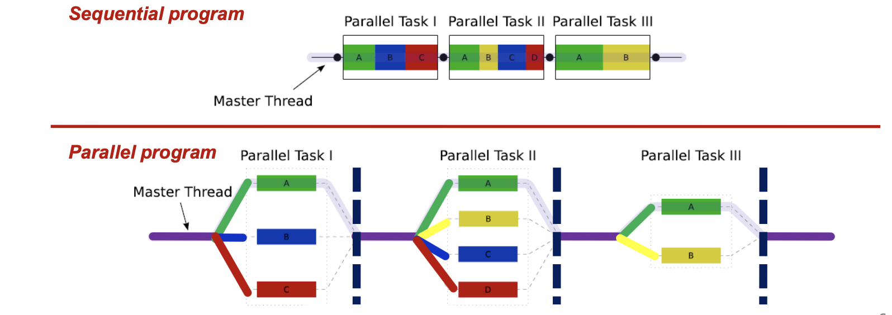
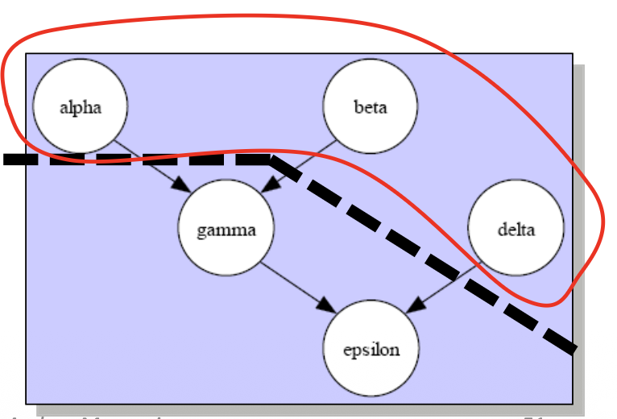

# Parallel Programming with OpenMP  


**OpenMP**(Open Multi-Processing) è un estensione per C/C++ 
- corrisponde allo _standard de facto_ per fare **shared memory programming**  

È composto da un insieme di 3 cose:
1. **Compiler Directives**: Sono istruzioni speciali (`#pragma`) che dicono al compilatore come comportarsi 
2. **Library Routines**: Funzioni da chiamare direttamente nel codice (es: per sapere quanti running threads ci sono)
3. **Environment Variables**: Variabili da settare come flag dal terminale prima di lanciare il programma  


Il vantaggio di openMP è che permette di rendere parallelo codice seriale! Infatti il programmatore scrive il codice sequenziale normale, aggiunge la riga`#pragma` e la parte dentro tale zona diventa parallela, se togliamo la riga allora il codice ritorna ad essere sequenziale.  


### Modello di esecuzione:

Il programma inizia sempre con un solo master thread.  
Quando il mater thread incontra una direttiva parallela, fa un **Fork**: clona se stesso o sveglia thread dormienti per rendere il lavoro parallelo.  

Il blocco dentro una direttiva OpenMP si chiama **Parallel Region**, e alla fine di ogni regione parallela c'è una **Barriera** implicita.  
Il master non può andare avanti finche tutti i thread non hanno finito il loro pezzo.  
Una volta superata la barriera, i thread creati dal fork muoiono o si addormentano; il master thread prosegue da solo in modo sequenziale fino al prossimo fork.     





### Pragmas

Usiamo i `pragmas` per indicare al compilatore dove fare i fork   

```cpp
#pragma omp <comando>
```

Portabilità dell'uso di `Pragma`:
- se si compila il codice con un compilatore che capisce OpenMP, allora il codice diventa parallelo 
- se si compila con un compilatore vecchio o che non conosce OpenMP, il compilatore ignora la riga che inizia con `#pragma` e genera codice normale e sequenziale 


### Components 

Breakdown di cosa offre OpenMP

- **Direttive**: sono le azioni   
    - `parallel`: crea i thread (fork)
    - `for`: divide il lavoro di un ciclo (work sharing)
    - `barrier/critical/atomic`: operazioni di sincronizzazione (Lock)

- **Data Scoping**: gestione della memoria  
    - `private`: ogni thread ha la sua variabile 
    - `shared`: variabile condivisa tra tutti i thread

- **Runtime Library**: funzioni utili  
    - `omp_get_thread_num()`: restituisce id thread
    - `omp_get_num_threads()`: quanti thread ci sono in totale 


Esempi:


```cpp
int main()
{
    #pragma omp parallel 
    {
        printf("Hello World!");
    }
}
```  

- il master thread arriva al pragma ed effettua il fork creando altri thread (supponiamo ne crei in totale 4 se non viene specificato un numero).  
- la direttiva parallel NON divide il lavoro, lo replica! ogni thread eseguirà le righe di codice contenute nel blocco firmato da pragma.  
- come risultato si vedrà stampato Hello World 4 volte.  


Possiamo anche decidere quanti thread creare e lo scoping delle variabili:  

```cpp
int main()
{
    int id;
    int a = 5;

    #pragma omp parallel private(id) shared(a)
    {
        id = omp_get_thread_num();
        if(id == 0){
            prinft("Master: a = %d.", a*2)
        }else{
            print("Slave: a = %d". ,a);
        }
    }
}
```


__Note__:

- se non avessimo definito come private la variabile id, allora tutti i thread avrebbero scritto nella stessa cella di memorai il proprio valore, tipica condizione di data race

- **le variabili private definite fuori dal blocco pragma non sono inizalizzate!** se avessimo definito `a` come privata, dentro il blocco omp questa variable avrebbe restituito valori spazzatura.


### Raffinamenti sulla memoria

Come anticipato, le variabili `private` NON sono inizializzate! 

```cpp
int a = 10;
#pragma omp parallel private(a)
{
    printf(a); // stampa spazzatura 
}
```

OpenMP offre due clausole per risolvere questo problema:

- `firstprivate(a)`: crea una copia privata di `a` per ogni thread, inizializza il suo valore con quello che aveva prima del blocco parallelo

- `lastprivate(a)`: fa il calcolo parallelo dentro il blocco omp e prende il valore calcolato dall'ultima iterazione(logica) del ciclo per copiarlo nella variabile `a` originale (quella fuori dal parallelo), utile se serve il risultato finale fuori dal ciclo.  


**Direttiva `for`** (worksharing):  

È la direttiva più usata, serve per dividere il lavoro delle iterazioni di un ciclo, se usassimo il classico `#parallel ` avremmo che ogni thread esegue il ciclo iterazione per iterazione senza collaborare.  

La direttiva `for` dice al compilatore che il ciclo non deve essere duplicato ma spezzato e **distribuito** tra i thread.  


```cpp
#pragma omp parallel
{
    #pragma omp for
    for(...) {}
}

/*Oppure*/

#pragma omp parallel for
for(...) {}
```

- OpenMP calcola automaticamente i bordi (LB=lower bound, UP=upper bound) per ogni thread 


Divisione del lavoro tra thread (`scheduling`):

- `schedule(static)`: modalità di default, calcoliamo noi quante iterazioni deve fare ogni thread con una formula:
    $$
    C = \text{ceil}(\frac{N}{N_{\text{threads}}})
    $$
    
    Es: 12 iterazioni, 4 thread $\rightarrow$ chunk = 3  
    th0: iterazioni 0,1,2    
    th1: iterazioni 3,4,5   
    ...  
    Se le iterazioni hanno durata imprevedibile lo scheduling statico porta a un pessimo bilanciamento del carico.  

- `schedule(dynamic)`: risolve il probela di sbilanciamento del lavoro se le iterazioni hanno carichi di lavoro imprevedibili  
    Non indichiamo a priori il chunksize, openMP crea una **Work Queue**, i thread fanno pull da questa coda per ottenere lavoro.  
    Trattandosi di una workqueue i thread si devono sincronizzare per prendere il prossimo indice, che introduce overhead ma garantisce che nessun thread stia fermo se c'è lavoro.  


Useremo assegnazione statica se le iterazioni hanno stessa durata, è la modalità più veloce per questi casi in quanto ha meno overhead.  

Useremo quella dinamica se le iteazioni hanno durata variabile, costa di più a livello di overhead ma bilancia il carico di lavoro.  


### Parallelization Granularity:  

- fine grain: tanti pezzi piccoli  
    pro: bilanciamento perfetto  
    contro: alto overhead! se il lavoro è veloce costa di più la sincronizzazione che il lavoro stesso.

- coarse grain: pochi pezzi ma grossi  
    Pro: overhead basso (minor gestione di synch)  
    contro: rischio di forte sbilanciamento  

L'ideale sarebbe ottenre il bilanciamento del fine-grain con l'efficienza del coaese grain 


Quando facciamo dynamic scheduling del lavoro, il chunk size di default è 1.  
Come detto prima, se il lavoro è molto veloce questo crea grande congestione per gestire la sincronizzazione e quindi un alto tradeoff.   

Per sopperire a questo problema possiamo specificare noi stessi il chunk size:  
- `#pragma omp for schedule(dynamic, n)`   

_Attenzione_: Se teniamo chunk size troppo grandi nel dynamic rischiamo di andare in contro al **tail problem** e di tornare quindi al problema dello 'statico' (compito lunghissimo rimane per ultimo e quindi un processore solo lavora mentre gli altri aspettano).  

Per superare questo problema possiamo fare:

- `schedule(guided)`: il chunk size non è fisso ma cambia nel tempo, inizalmente i chunk saranno grossi (c'è tanto lavoro) per ridurre overhead. Verso la fine i chunk size diventano piccoli! per tappare i buchi e migliorare il load balancing.  

- `schedule(runtime)`: offre la flessibilità massima, decide il programmatore tramite variabili di ambiente `export OMP_SCHEDULE="dynamic, 4"`; È utilissimo per fare benchmark e tuning senza dover ricompilare il codice, aiuta a trovare il chunk size più performante.   


### Barriere Implicite 

openMP ha delle regole di sincronizzaizone, in particolare:  

1. Dopo un blocco `#pragma omp parallel`:  
    C'è sempre una barriera implicità, NON può essere rimossa 

2. `#pragma omp for`:  
    Anche questa ha una barriera implicita alla fine del blocco, tutti i thread aspettando che tutti abbiano finito il ciclo for prima di passare oltre.  
    A volte questa barriera è inutile, specialmente se abbiamo davanti due cicli che sono completamente indipendenti (primo ciclo for fa calcoli su array A, e subito dopo il secondo ciclo for fa calcoli su B; due cicli indipendenti!).  
    
    Possiamo elimiare la barriera implicita del for aggiungendo la clausola `nowait`, il tutto diventa `#pragma omp for nowait`  


### Sincronizzazione e Lock:  

- Sincronizzazione esplicita: `#pragma omp barrier`  
Permette di creare una barriera oltre la quale i thread non possono andare fino a quando ci sono thread che hanno ancora lavoro da svolgere (evita che un thread veloce legga dati inconsistenti da un thread lento).  

- Lock: `#pragma omp critical`  
Direttiva per la mutua esclusione, il codice racchiuso dentro questo blocco potrà essere eseguito da un solo thread per volta, risolve il problema di race condition.  
```cpp
#pragma omp critical 
{
    // codice pericoloso
}
```
OpenMP gestisce tutto sotto il cofano, non dobbiamo pensare a creare lock/aquire e release.  


<br>

### Correctness vs. Performance

Bisogna stare molto attenti quando si usa un lock, in quanto se usato male può rallentare il programma fino a renderlo peggiore di quello sequenziale.  

Es: siamo in un ciclo che ha 1M di iterazioni, abbiamo una variabile che accumula dentro il ciclo e per evitare la race condition la mettiamo dentro una sezione critica.  
I thread passeranno il 99% del loro tempo a contendersi il lock! prestazioni pessime.  


Il pattern "somma tutto in una variabile globale" è così comune che OpenMP offre una soluzione dedicata e veloce: la clausola **REDUCTION**  

Invece di fare litigare i thread su una variabile globale condivisa, creiamo una copia privata per ogni thread, dove tale thread accumulerà le sue somme e solo alla fine uniamo tutto!  


```cpp
#pragma omp parallel for private(x) shared(area) reduction(+:area)  
```

- si crea una copia privata di area per ogni thread 
- inizilizziamo ogni copia a 0 (perchè l'operatore di riduzione è `+`)  
- durante il ciclo, ogni thread aggiorna la sua copia locale, nessun lock! 
- alla fine del ciclo (dopo la barriera), si sommano tutte le copie nella variabile globale.  

### Altri costrutti di worksharing: 

- `#pragma omp master`:  
    A volte dentro una regione parallela vogliamo poter fare un'operazione che deve essere fatta una  volta sola (es: stampare a video, inizializzare una risorsa di rete, fare I/O).  
    La direttiva master fa si che la sezione racchiusa dentro tale blocco venga eseguita **solamente** dal master thread (thread0), gli altri thread saltano il blocco e vanno avanti!  
    - **attenzione**: Non c'è una barriera dopo la direttiva, se il master stava facendo qualcosa che serve agli altri, sarà responsabilità del programmatore mettere una barriera esplicita dopo.  


- `pragma omp single`:  
    Concettualmente uguale alla master, ma il codice racchiuso in tale sezione viene eseguito dal primo thread che raggiunge questa zona.  
    - **attenzione**: C'è una barriera esplicita alla fine di questo blocco! gli altri thread saltano il blocco e aspettano che il thread 'prescelto' finisca il suo lavoro (spesso single si usa per caricare dati condivisi che servono anche agli altri), c'è comunque la possibilità di usare la `nowait`.  


## MPMD (multiple program multiple data):   

Ricordiamo che in SPMD tutti i thread eseguono lo stesso codice ma su dati diversi!  
In MPMD i processori eseguono codici diversi ( es: uno fa alpha(), l'altro fa beta() )   

### Task parallelism  

Prendiamo il seguente snippet di codice C++ come esempio:

```cpp
int main(){
    v = alpha();
    w = beta();
    y = delta();

    x = gamma(v,w);
    z = epsilon(x,y);

    printf("%f\n", z);
}
```

Guardiamo il grafico delle dipendenze per individuare task paralleli e notiamo che che le prime 3 funzioni sono parallelizabili.  
Le ultime due dipendono dalle prime 3, quindi dovranno aspettare.  




Il task parallelism si implementa in OpenMP con `#pragma omp parallel sections`, e nel blocco sottostante vanno specificate le funzioni che dovranno essere parallelizate con la direttiva `section`.  
Alla fine di questo blocco c'è una barriera implicita (concessa anche la `nowait`)  

```cpp
int main()
{
    #pragma omp parallel sections
    {   
        #pragma omp section 
        v = alpha();
        #pragma omp section 
        w = beta();
        #pragma omp section 
        y = delta();
    }

    /*Barriera implicita qui!*/

    x = gamma(v,w);
    z = epsilon(x,y);

    printf("%f\n", z);
}
```


<br>

---
