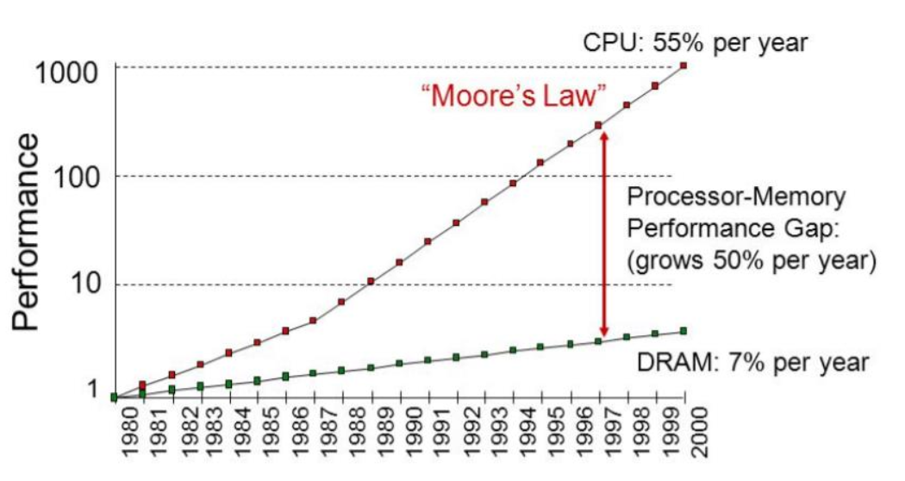
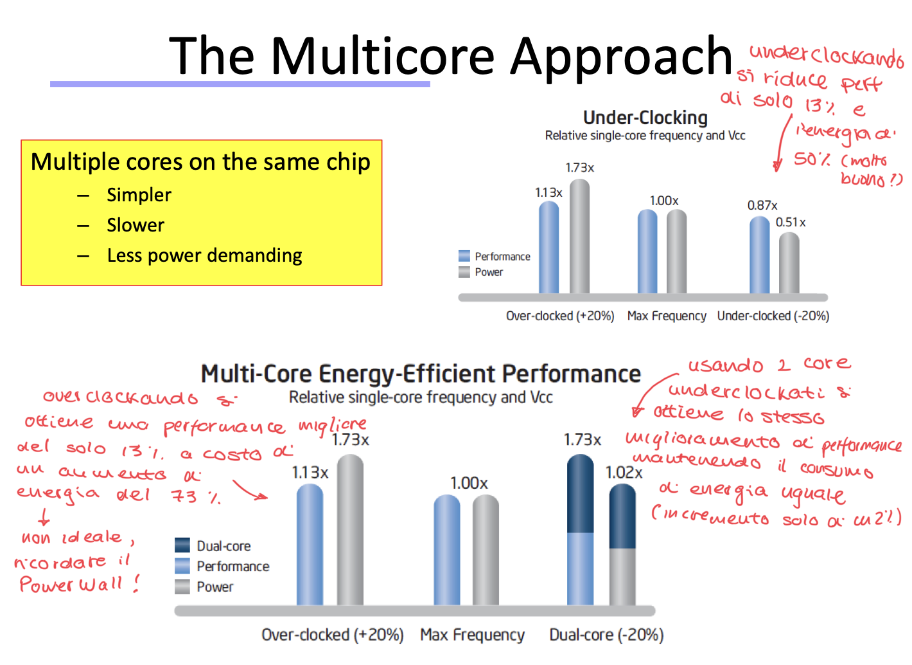

# Lezione 2: Multicore Revolution

HPC è diventato un tema di estrema importanza negli ultimi anni, presneti in varie settori: 
- da supercomputing (es: supercomputer Leonardo del cineca che vuole massimizzare le performance ma tenendo il più basso possibile il consumo di energia!!)
- embedded systems: (es: chip denntro un'auto di guida autonoma, ha limiti di batteria ma deve saper fare dei calcoli importanti per l'AI)

Due parole di estrema importanza dato il contesto:
1. **Architectural Heterogeneity:** Non si usa più solo la CPU per fare tutto, si usa CPU+GPU+NPU (neural processing unit)
2. **Massive Parallelism:** si fanno tantissime cose alla volta in parallelo piuttosto di fare una sola velocissima.  

## Perchè i multicores:

le SPECint performance dei chip migliorava di un 52% di anno in anno dal 1986 circa al 2002, dove da tale anno la crescita è diventata di un 20% per anno e successivamente solo di un 6%.  
L'incremento quindi decrese in maniera significativa, i benefici sono sempre minori (processori basati su un singolo core), bisogna quindi cambiare architettura e trovare altre soluzioni $\rightarrow$ parallelismo.  

ILP -> instruction level parallelism

Il cambiamento di paradigma verso architettura multicore corregge il trend migliorando di un 23% le perfomance di anno in anno.  

**in breve:** Fino al 2005 le performance dei processori single core hanno smesso di crescere, nonostante la legge di Moore ci desse ancora più transistor non si potevano usare per fare un core più veloce, quindi si ha virato verso sistemi multicore ed eterogenei.  

**Legge di Moore:** Il numero di transistors in un circuito integrato (IC) raddoppia ogni due anni (18 mesi) 

Un numero incrementale di transistors sempre più piccolo per ogni generazione di processori dovrebbe tradursi sempre in performance migliorate, ma intorno agli anni 2000 questo smette di succedere.

Il problema per cui l'aumento di transistors e clock rate non si traduce in miglioramenti di performance è legato alle leggi della fisica, in quanto tutta l'energia elettrica consumata deve eventualmente essere radiata come calore e serviva quindi dissipare grandissime quantità di energia (proibitivo). Diventa fisicamente impossibile quindi avere un cosi alto numero di transistors operativi contemporaneamente a quelle frequenze.  

### Formula fondamentale: 

$$
\text{Power} = C \times V^2 \times f
$$

- $C \rightarrow$ Capacitive Load: concettualmente come la grandezza di un secchio che bisogna riempire di elettroni per far scattare il transistor da 0 a 1. Più è piccolo il transistor più è piccolo $C$  
- $V^2 \rightarrow$ Voltaggio o tensione: concettualmente la pressione con cui spingiamo gli elettroni (notare che è al quadrato).  
- $f \frequency$ frequenza: consiste nel numero di volte che riempiamo e svuotiamo il secchio per secondo

Inizialmente rimpicciolendo i transistor si riusciva ad abbassare anche il voltaggio, permetteva d avere una densità di transistor raddoppiata a velocità aumentata ma con un consumo di energia costante! era il sogno !  (circa: anni '70 ~ 2000)  

La formula precedente in realtà non è la formula intera, la vera formula per stimare il consumo è la seguente:

$$
\text{Power}= \text{Power}_{\text{DYN}} + \text{Power}_{\text{STATIC}}
$$

- $\text{Power}_{\text{STATIC}} \rightarrow$ Leakage o perdita: fino a inizi anni 2000 ignorata. Un transistor dovrebbe essere un rubinetto: chiuso (0) o aperto (1), ma quando i transistor diventano minuscoli il 'rubinetto' non chiude più bene, e fa passare corrente anche quando è spento.  
Questa perdita dipende dal voltaggio, ma esiste un threashold minimo sotto al quale non possiamo abbassare il voltaggio altrimenti il segnale si confonde con il rumore e il transistor smette di essere deterministico.  

**Conseguenza:** Non possiamo abbassare ulteriormente $V$, ma continuiamo a raddoppiare il numero di transistor (legge di moore) e quindi se raddoppiammo transistor e non abbassiamo il voltaggio, la potenza aumenta esponenzialmente.  

Questo è il **POWER WALL** $\rightarrow$ Non possiamo aumentare la frequenza perchè non possiamo abbassare il voltaggio per compensare il calore.  

Riassumendo si ha:

- smaller transistors $\rightarrow$ faster processors 
- faster processors $\rightarrow$ higher energy consumption
- higher energy consumption $\rightarrow$ more heat 
- more heat $\rightarrow$ unreliable processor !!  

Soluzione $\rightarrow$ smettere di aumentare la frequenza del singolo processore e iniziare a metter epiù processori (core) che girano a frequenza più bassa!  

---

### ILP (Instruction Level Parallelism)

Non migliora la latenza ma migliora il throughput delle istruzioni (istruzioni leggermanete più lente ma migliorato il numero di istruzioni che eseguo per ciclo)

L'obiettivo è quello di aumentare il numero di istruzioni per ciclo, e per farlo sono state esplorate svariate strade:
1. Pipelining 
2. Superscalar/MultipleIssue: si lanciano più istruzioni per ciclo di clock 
3. Out-of-order execution 

Per fare tutte queste ottimizzazioni (capire cosa eseguire fuori ordine, prevedere i salti, gestire le dipendenze) servono circuiti di controlo complessissimi, che consumano energia! si ha un pessimo tradeoff tra aumento di complessità e miglioramento delle performance.  

A questo fenomeno (basso guadagno) si da il nome di **ILP Wall**.  

# Memory Wall !! 

Ci si accorge di un grandissimo problema ossia la differenza tra la velocità di calcolo della CPU e la velocità della RAM!  
La CPU può fare migliaia di calcoli al secondo ma passa il 90% del tempo ad aspettare che i dati arrivino dalla RAM, bisogna dedicare più transistors per migliorare il sottositema di memoria. 

Il ruolo di un HPC engineer è spesso e volentieri ottimizzare il codice per 'spostare meno dati' piuttosto di fare algoritmi con meno calcoli.  
Ottimizzare la cache e l'accesso alla memoria è fondamentale.  

Notare come la velocità della CPU cresce del 55% ma quella della RAM solo del 7% (fino anni 2000, illustra bene il memory wall).  

---

## Approccio Multicore

Serve un processore multicore:
    - più semplice (pipeline con meno stage)
    - più lento 
    - meno esigente di energia (power demanding)

  

### Dark Silicon

Non risolviamo tutti i problemi con il multicore, la legge di moore rimane valida e il numero di transistors aumenta sempre di più **MA** non possiamo accenderli tutti insieme contemporaneamente, altrimenti il chip fonde.  
Con dark silicon ci riferiamo proprio a quella parte di silicio sul chip che deve rimanere spenta.  

Dark Silicon $\rightarrow$ Porzione di silicio sul chip che deve rimanere spenta (o rallentata) in un dato momento per non superare il budget termino (TDP [thermal design power])  

I 4 Horsemen del dark silicon:

Rispondono alla domanda del 'cosa fare con tutto questo spazio se non possiamo accederlo tutto'.  

1. Shrinking Horseman: fare chip sempre più piccoli 
2. Dim Horseman: Si accendono i transistors a turno / raffica facendoli andare piano
3. **Specialized Horseman:** L'idea vincente, si usa il silicio extra per creare acceleratori specializzati.
    es: invece di usare la CPU per decoficiare un video (consuma ~100W) uso un circuito dedicato (un pezzo di silicio fatto SOLO per quella operazione) che consuma 1W.  
    Accendo quel pezzo solamente quando serve, per il resto del tempo rimane spento!  
4. Deus Ex Machina: si attende che vengano creati nuovi materiali, ma per ora si dovrà lavorare con il silicio.  

