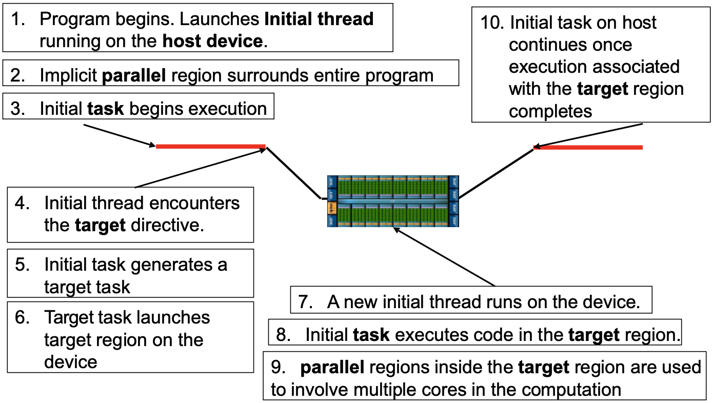
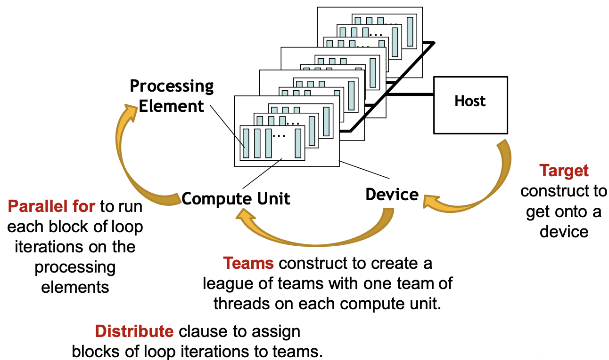
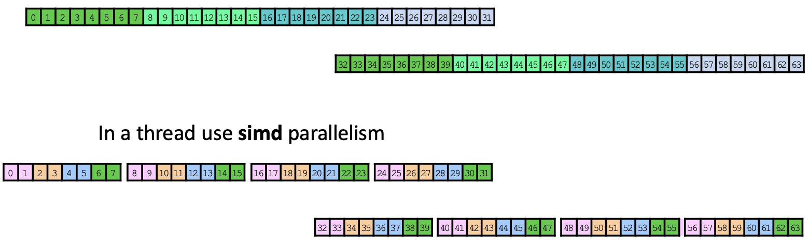

# OpenMP: Accelerator model 

Dalla versione 4.5 di OpenMP possiamo usare lo stesso standard per programmare i thread della CPU, le unità SIMD e la GPU.  

### Architettura di una GPGPU (Nvidia Xavier SoC, 2018)  

  

- **Device DRAMX**: La GPU ha la sua memoria RAM, fisicamente staccata dalla RAM della CPU (dovremo copiare i dati avanti e indietro)  
- **SM (streaming multiprocessor)**: Sono i quadrati verdi grandi, una sorta di 'super-core', a seconda della GPU potremmo averne 8,80,100,...  
- **CUDA Cores (PE)**: Dentro ogni SM ci sono tanti piccoli quadratini, sono le unità di calcolo vere e proprie (Processing Elements); in una CPU abbiamo pochi core molto intelligenti, in una GPU abbiamo migliaia di core 'stupidi' raggruppati in SM  

Ogni SM è composto da $n$ PE/CUDA cores e ogni SM ha una cache L1 in condivisione tra i suoi core.  
Gli SM condividono tra loro una cache L2.  

<br>

### Modello Host-Device:  

Si usa un modello Owner-worker, in particolare:  

- Host (Owner):  
    - La CPU dove gira il sistema operativo 
    - Il programma main() inizia sempre da qui 
    - L'Host decide cosa fare e quando farlo 

- Target Device (Worker): 
    - La GPU
    - È un dispositivo di calcolo passivo, non fa nulla fino a quando l'host non gli ordina di eseguire un pezzo di codice
    - Un host potrebbe avere collegati più target (es. un server con 4 schede NVIDIA)  

Questo modello vale sia per sistemi discreti (CPU e GPU collegate a schede PCIe) sia per sistemi SoC integrati (dove CPU e GPU sono sullo stesso silicio; es. macbook pro).   


### Flusso di esecuzione:  

<center>



</center>

1. Il programma parte sull'Host (con un master thread, inizialmente tutto è sequenziale) 
2. OpenMP considera tutto il programma avvolto in una 'regione parallela'
3. Il master thread esegue il task iniziale 
4. master thread incontra `#pragma omp target`, il codice racchiuso in questa direttiva deve essere eseguito su GPU
5. master thread genera un **target task**, è il pacchetto di lavoro da spedire alla GPU 
6. **offload**: il controllo passa al host device (in questo momento se ci sono dati necessari questi devono venire copiati dalla memoria del host alla memoria del device attraverso il bus PCIe)
7. Sul device GPU nasce un **initial thread** (all'inizio la GPU parte con solo un thread!)  
8. l'initial thread inizia ad eseguire il codice
9. Se dentro il blocco `target` c'è altro codice parallelo (`teams` o `distribute`) allora la GPU accende i suoi core, altrimenti la GPU rimane con un solo thread (spreco totale di risorse)  
10. quando la GPU finisce, il controllo torna al Host, i risultati vengono copiati dalla memoria device a quella host e il master sulla CPU si sveglia e continua l'esecuzione sequenziale (esiste anche la possibilità di eseguire il tutto in maniera asincrona)  

**In breve:**     
È un modello Host-centric e basato sull'Offloading del lavoro. Richiede lo spostamento fisico dei dati tra due memorie diverse e l'esecuzione sulla GPU inizia con un solo thread che deve poi espandersi per usare tutta la potenza.    

<br>

### a

```cpp
double A[n,n], B[n,n], C[n,n];
int count = 50;
#pragma omp target map(to: A[:n,:m],B[:n,:m]) map(from:C[:n,:m]) [nowait]
{
    int n=64;
    #pragma omp parallel for 
    {
        for(int i=0; i<n;i++)
            for(int j=0; j<n; j++)
                for(int k=0; k<n; k++)
                    C[i,j] = A[i,k] * B[k,j] + count;
    }
}
``` 

  

- `#pragma omp target`: sposta l'esecuzione sulla GPU; crea 1 SOLO thread sulla GPU
- `map(to: A,B)` e `map(from: C)`:  
    - `to:` copia A e B dalla RAM della CPU alla RAM della GPU prima di iniziare 
    - `from:` copia C dalla RAM della GPU alla RAM della GPU alla fine del blocco
- `#pragma omp parallel for`: siccome target crea un solo thread nella GPU, se vogliamo usare tutti i core a disposizione dobbiamo creare un team dentro il target, questo comando accede i core della GPU per eseguire il calcolo.  

_Nota_: Esistono regole implicite di mapping  
- variabili scalari: quando usi uno scalare in una regione target, OpenMP lo copia automaticamente e lo tratta come `firstprivate` 
- puntatori e array: in questo caso il compilatore non può agire automaticamente e serve la copia esplicita del dato!  

<br>

<center>

## Work Distribution 

</center>

La work distribution tratta la distribuzione del calcolo tra i vari core.  


<br>

### `target` construct 

```cpp 
#pragma omp target [clause/clauses]
    { structured block; }
```

È l'istruzione che porta l'esecuzione dall'Host al Device; in particolare il controllo passa dal Host a un **singolo** thread iniziale sul device.  
Clausole importanti:
- `device(id)`: specifica su quale device mandare il lavoro, da usare nel caso avessimo sistema multi GPU.  
- `if (condizione)`: se la condizione è falsa (es: n < 1000) il lavoro non viene offloadato ma viene eseguito direttamente su CPU; utile perchè spostare pochi dati sulla GPU costa più tempo di quanto se ne risparmia con l'offloading
- `map(...)`: oltre al to - from - tofrom abbiamo anche la possibilità di usare
    - alloc: riserva spazio sulla GPU per una variabile ma NON copia i dati dalla CPU, utile per risparmiare tempo quando dobbiamo creare array temporali di appoggio.  
    - delete: libera memoria sulla GPU 

**Importante**: La dichiarazione di una funzione che vogliamo offloadare su GPU deve essere racchiusa dalla direttiva `declare target`, in quanto questo dice al compilatore di creare due versioni compilate di quel codice: una per la CPU e una per la GPU.  
Se omesso allora viene compilato tutto per CPU e quando la GPU prova ad eseguirlo il programm crasha!  


<br>

### `teams` construct 

Introduciamo il concetto OpenMP di _League of Teams_; un team corrisponde fisicamente a un SM nell'hardware GPU.  
Dentro ogni team (SM) ci sono tanti thread (processing elements).  

Attenzione: thread di team diversi non possono sincronizzarsi tra di loro (si rischierebbe un deadlock).  

L'uso di teams prevede regole molto rigide:  

1. Nesting perfetto: il costrutto `teams` deve essre scritto **subito dopo** `target`, non si può inserire condice nel mezzo!  

```cpp
#pragma omp target 
{
    x = 0; // <- Errore 
    #pragma omp teams
    ...
}
```


2. Contenuto limitato: Dentro un blocco `teams` **NON** può essere inserito un for noramle o codice sequenziale arbitrario (verrebbe eseguito solo dal master thread)
    -  vanno inseriti costrutti specifici per distribuire il lavoro!  
    - es: `distribute`, `parallel`     

Possiamo configurare manualmente i teams:
- num_teams(N): definiamo il numero di team che vogliamo (CUDA: gridDim)
- thread_limit(M): definiamo il numero massimo di thread che vogliamo dentro ogni team (CUDA: blockIDIM)  

<br> 

### `distribute` construct

```cpp
#pragma omp distribute [clause/clauses]
    { ... }
```

Prende le itearzioni di un ciclo e le **assegna** ai team!  
**Attenzione:** A questo punto, dentro ongi team sta lavorando solo il master thread!! gli altri stanno ancora dormendo; la `distribute` non parallelizza i calcoli finali ma assegna pacchi di lavoro (chunk) per ogni squadra.  

Possiamo anche usare `dist_schedule(kind, chunck size)` per definire staticamente come dividere il lavoro tra i vari team; se omesso il compulatore sceglie per noi il modo migliore.    


### Accelerated Model in action 

 

- target: la prima freccia arancione da sinistra; parte dall'Host e tocca il device, abbiamo trasferito il controllo ma non stiamo ancora calcolando in parallelo, c'è solo il master 
- teams + distribute: freccia arancione in mezzo; va dal device e si divide verso le compute units! abbiamo creato il league of teams, ogni team ha il suo master attivo.  
- parallel for: ultima freccia arancione; entra dentro la singola compute unit e tocca i suoi processing elements! ora tutti i core della GPU stanno lavorando.  

**Host** $\rightarrow$ **Device** (target) $\rightarrow$ **SM** (teams) $\rightarrow$ **Core** (parallel)    


Es: Considerare un ciclo for da 64 iterazioni (da 0 a 63) 



1. Livello Distribute (teams):  
    - Abbiamo 2 team, il ciclo viene diviso a metà
    - team1 prende [0 - 31]
    - team2 prende [32 - 63]

2. Livello Workshare (threads): 
    - concentriamoci su team2 (è uguale al team1 tanto) che parte da 32 -> 63  
    - il team ha 4 thread, allora le 32 iterazioni vengono divise per 4  
    - ogni thread si prende 8 iterazioni  
    - es: th1 prende da [32-39], th2 prende [40-47], ... 

3. Livello SIMD:  
    - conentriamoci sul promimo thread del secondo team, che prende [32-39]
    - il thread ha capacità SIMD di 2
    - esegue le istruzioni per coppia (32,33), (34,35), ... 


Esempio di codice SAXPY accellerato:  
```cpp
void saxpy(float* restrict y, float* restrict x, float a, int n)
{
    #pragma omp target teams map(to:m,a,x[:n]) map(y[:n])
    {
        int block_size = n/omp_get_num_teams();
        #pragma omp distribute dist_sched(static, 1)
        for(int i=0; i<n; i+=block_size)
        {
            #pragma omp parallel for 
            for(int j= i; j < i+ block_size; j++)
            {
                y[j] = a*x[j] + y[j];
            }
        }
    }
}
```

Possiamo anche usare costrutti combinati per risparmiare in indentazione e parantesi graffe:


```cpp
void saxpy(float* restrict y, float* restrict x, float a, int n)
{
    #pragma omp target teams distribute parallel for map(to:n,a,x[:n]) map(y[:n])
    for (int i = 0; i< n; ++i)
    {
        y[i] = a*x[i]+y[i];
    }
}
```

note:
- passare alla map n ed a non è strettamente necessario in quanto non essendo puntatori o array verranno copiate come firstprivate, si possono comunque mettere nella clausola per chiarezza 
- se non definiamo il modificatore di direzione (from, to, tofrom, alloc, ...) si usa il comportamento di default, ossia `map(tofrom: ...)`  
    - nell'esempio usiamo il tofrom default per y (e specifichiamo anche quanto è grande tale array), questo perchè se guardiamo la formula notiamo:  
        `y[i] = ... + y[i]`, quindi ci serve il valore y[i] per la formula (parte destra) e di conseguenza serve il `to` per copiare da CPU a GPU; ma guardando la parte sinistra ci accorgiamo che stiamo salvando il dato, quindi serve il `from` per salvare il dato dalla GPU alla CPU.  


- quando passiamo array statici alla GPU non serve specificare la dimensione nella map, ma quando passiamo array dinamici SI, è fondamentale.  
    Per robustezza si preferisce passare sempre le dimensioni degli array. 


