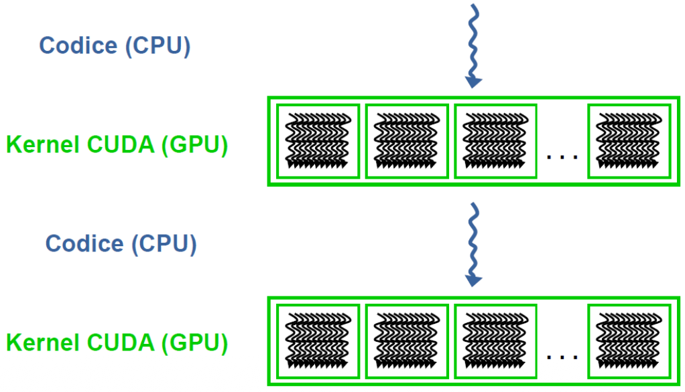
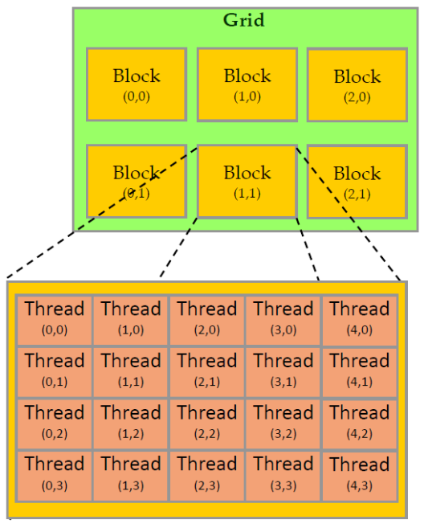

# CUDA: basics 


CUDA sta per "Compute Unified Device Architecture" e non è solo un linguaggio, è una piattaforma Hardware/Software.    

Layer Software $\rightarrow$ Permette di accedere al set di istruzioni virtuale della GPU   
Quando compiliamo codice CUDA con `nvcc` questo non viene subito tradotto in linguaggio macchina, viene tradotto in `PTX` (parallel thread execution), che è un assembly intermedio.  
- questo perchè ogni generazione di NVIDIA (volta, ampere, hopper) ha hardware diverso, e quindi il driver video prende il PTX e lo traduce nel codice macchina reale per quella specifica GPU, favorisce compatibilità!  

Useremmo come linguaggio di programmazione C/C++ con estensioni.  


### Librerie  

Prima di scrivere un kernel CUDA a mano, vale controllare se NVIDIA dispone già di tale funzione nelle sue librerie, che sono ottimizzate a livello di assembly e saranno di conseguenza più veloci.  

Il concetto chiave è: "Non reinventare la ruota"  


<br>

### CUDA execution model

- Host: È la CPU 
- Device: È la GPU ed è un **coprocessore** 
    - la sua memoria, fisicamente separata dalla RAM (vale per le GPU discrete PCIe)
    - è **passiva**, esegue solo ciò che l'Host le comanda di fare  


**Kernel**:  
È il nome tecnico di una funzione che gira su GPU; quando si esegue un Kernel la GPU lancia migliaia di thread che eseguono tutti la stessa funzione (SIMT).  
- il programmatore scrive codice per un singolo thread e l'hardware raggruppa thread a gruppi di 32 (warp) ed esegue la stessa istruzione su ognuno di essi.  

**CPU threads vs GPU threads**:
I thread della GPU non creano un costo extra per il context switch!  
- CPU: consideriamo 4 core e 100 thread, a una certa l'OS deve fermare il threadA per switchare al thradB quindi dovrà salvare tutti i registri del threadA in RAM, caricare i registri del threadB e ripartire.  
    Questo context switch costa tantissimi cicli 

- GPU: La GPU ha un file di registri enorme, tutti i thread attivi hanno i loro registri già caricati nell'hardware; se il threadA si blocca (es.aspetta memoria), la GPU passa al threadB in 0 cicli!  
    Non deve caricare nulla dalla RAM, i dati del threadB sono già lì!  
    Per questo motivo nella GPU abbiamo migliaia di thread, serve a nascndere la latenza di quelli bloccati.  


### CUDA Execution Flow





1. Il programma parte dalla CPU (Host) come codice seriale
2. Offload: quando sevrve potenza, l'host lancia il `kernel` sul Device (GPU)
    - Parallel Kernel: La griglia verde rappresenta i mille thread che partono; notare che sono organizzati in una griglia di blocchi!  

L'esecuzione del `kernel` è **asincrona**, quando la CPU lancia il kernel la funzione ritorna subito e la CPU prosegue a lavorare in parallelo con la GPU.  
Se la CPU ha bisogno dei risultati, deve fare una chiamata esplicita di attesa o provare a copiare la memoria indietro (che blocca la cpu fino a quando la GPU non ha finito).  


### CUDA Threads

I thread sono organizzati gerarchicamente:  

1. **Grid**: È l'insieme di tutti i thread lanciati per un singolo kernel, è divisa in blocchi!  
2. **Block**: Un gruppo di thread che vivono sullo stesso processore SM, il block ha dimensione massima di 1024 thread, se si vogliono usare più thread vanno usati più blocchi.  
3. **Thread**: L'unità base che esegue la computazione 




Dentro il codice del kernel abbiamo accesso a variabili speciali per distinguere univocamente ogni thread!   

- `threadIdx`: l'id del thread locale relativo al blocco a cui appartiene
- `blockIdx`: id del blocco a cui appartiene il thread corrente
- `blockDim`: dimensione del blocco
- `gridDim`: dimensione della grid, ossia numero di blocchi totali 

Queste variabili speciali ci permettono di indentificare il thread a livello globale di device con una formula: 

$$
\text{Global}_{\text{ID}} = ( \text{blockIdx.x}\times \text{blockDim.x} ) + \text{threadIdx.x}  
$$  


Per lanciare un kernel da Host usiamo la seguente sintassi:   

```cpp
kernelCuda<<<numBlocks, numThreads>>>([params]);
``` 

Va specificato il numero di blocchi, e il numero di thread per blocco!  


Es: cuda programming 

La versione sequenziale prevede un ciclo di 1000 iterazioni, un solo worker farà tutto il lavoro:     

```cpp
int main()
{
    int i;
    const int N = 1000;
    double u[N], v[N], z[N];

    // z = u + v
    for(i=0;i<N;i++)
        z[i] = u[i] + v[i];
}
```

L'equivalente kernel CUDA diventa:

```cpp
void gpuVectAdd(const double *u, const double *v, double *z)
{
    int i = getThreadIdx();
    z[i] = u[i] + v[i];
}
```  

Sembra che sia una sola istruzione ma noi sappiamo che trattandosi di SIMT questo stesso codice verrà eseguito da 1000 thread!  
il getThreadIdx() serve per accedere all'indice giusto (es: th0 accede a z[0], th[528] accede a z[528]).    
L'esempio manca di dettagli che verranno mostrati successivamente (con lo stesso codice)


### Limiti dei blocchi e grid  

I limiti dipendono dall'architettura specifica che usiamo, per scoprire i nostri limiti possiamo usare dal terminale `./deviceQuery`.  

In quanto ci si trova spesso a dover lavorare con matrici o strutture 3d possiamo organizzare i nostri thread per meglio riflettere queste situazioni.     

nota: È una semplice notazione artificiale, i thread in realtà sono mappati adiacentemente nella SM ma possiamo usare indici artificiali per facilitare la scrittura di algoritmi.  

```cpp
dim3 block, grid;
block.x = 32; block.y = 4;
grid.x = 12; grid.y =14;
```

Creiamo un blocco come una matrice da 32 righe e 4 colonne (128 thread totali), e una grid da 12 righe e 14 colonne (168 blocchi totali).  
Alla fine avremo 168 * 128 = 21.504

Negli esempi si assume un limite massimo di 1024 thread per blocco 

<br>

## Cuda Porting 

1. *Identify*: individua il ciclo `for` pesante da parallelizzare
2. **Identify data**: quali variabili/array servono ?
3. **Kernel**: scrivi la funzione kernel da eseguire su GPU
4. **Host code**: modificare il main per:
    - allocare memoria su GPU
    - copiare i dati su GPU
    - lanciare il kernel 
    - recuperare i risultati 


Riprendiamo l'esempio di prima, questa volta nel dettaglio:   

```cpp
int main(int argc, char* argv[])
{
    int i;
    const int N = 1000;
    double u[N], v[N], z[N];
    initVector(u, N, 1.0);
    initVector(v, N, 2.0);
    initVector(z, N, 0.0);

    for(i=0;i<N;i++)
        z[i] = u[i] + v[i];

    printVector(z, N);
    return 0;
}
```

Ci ricordiamo che ogni thread esegue lo **stesso** kernel ma su dati diversi! guardando il codice individuiamo il ciclo for da 1000 iterazioni come la parte parallelizzabile da un kernel.  

trasformiamo il ciclo for nella seguente funzione:  

```cpp
__global__ void gpuVectAdd(const double *u, const double *v, double* z, int N)
{
    int index = ...; 
    if (index < N)
        z[index] = u[index] + v[index];
}
```

Per poter invocare questo kernel, avremo bisogno della sintass di invocazione e del qualificatore `__global__`:
- invocabile solo dall'host 
- il kernel deve essere lanciato con una configurazione:
    - cudaKernel<<<numBlocks, numThreads>>>(params);
- deve ritornare void 
- esegue in modo asincrono (restituisce il controllo prima che il kernel finisca)  


**Come determinare il numero di blocchi:**  
Abbiamo deciso che ogni blocco conterrà $n$ thread, dobbiamo decidere quanti blocchi mandare in esecuzione per massimizzare l'uso, per farlo useremo la formula:

$$
\text{numBlocks} = \frac{N + \text{numThreads} - 1}{\text{numThreads}}
$$

- il numThreads - 1 è un trucco matematico per fare la divisione per eccesso

Es: Abbiamo un array di 100 elementi e abbiamo deciso di usare blocchi da 32 thread!   
N=100, Num_threads=32  
(100 + 31)/32 = 132/32 = 4 $\rightarrow$ lanceremo 4 blocchi!  
se avessimo fatto la divisione intera avremmo ottenuto:  
100/32 = 3 $\rightarrow$ 3 blocchi da 32 thread = 96 thread! mancano 4 elementi!! 


### Gestione della memoria

Dobbiamo creare spazio nella memoria della nostra GPU per le nostre variabili, per farlo useremo la **cudaMalloc** che ha la seguente sintassi:

```cpp
cudaMalloc((void**)&u_dev, size);
```

Note importantissime:  
- la `malloc` normale in C ritorna l'indirizzo della nuova memoria allocata, in CUDA le funzioni restituiscono un codice di errore e quindi dobbiamo usare un parametro della funzione per ottenere l'indirizzo su GPU che ci interessa.  
- prima di usare la malloc creiamo una variabile `type* u_dev` dove 'dev' sta per device e la usiamo come contenitore dell'indirizzo della memoria allocata in GPU. La passiamo con '&' in quanto per default le funzioni prendono valore per riferimento e noi vogliamo che questo valore sia modificabile dalla funzione. Quindi avremo un puntatore a un puntatore.  
- usiamo il casting a `(void**)`, dove il doppio `**` indica puntatore-a-puntatore e usiamo void in quanto è il tipo di dato universale, altrimenti dovremmo avere malloc specifiche per tutti i tipi (int, double, float, ...) e non vogliamo questo comportamento.  
- in breve la cudaMalloc risponde a: "questo è l'indirizzo (&) del mio puntatore (u_dev). Trattalo come generico (void**) e scrivici dentro l'indirizzo della GPU." 


Errore da evitare: Dobbiamo stare attenti alla differenza tra host memory e device memory, non possiamo usare la stessa variabile per entrambi!  

```cpp
double h_a[] = {1,2,3};
double* d_a;

cudaMalloc((void**)&d_a, 3 * sizeof(double)); // giusto!
// cudaMalloc((void**)&h_a, 3 * sizeof(double)); <- Errore!
```
- h_a punta alla RAM della CPU (contine 1, 2, 3)  
- d_a punta alla VRAM della GPU, per ora contiene spazzatura, per riempirla useremo la cudaMemcpy.  

Una volta allocata la memoria possiamo copiare e spostare i dati dalla CPU alla GPU, useremo **cudaMemcpy**: 

```cpp
cudaMemcpy(dst, src, size, direction);
```

definire la direzione è fondamentale, essa può essere:
- `HostToDevice`: CPU -> GPU
- `DeviceToHost`: GPU -> CPU
- `DeviceToDevice`: copia interna 

_Attenzione_: A differenza del kernel launch, la cudaMemcpy è BLOCCANTE:
- la CPU si ferma fino a quando tutti i dati non sono arrivati a destinazione


**Dove mettiamo `cudaMalloc` e `cudaMemcpy`?**  

Entrambe vanno messe nel codice del Host, **FUORI** dal kernel.  

Flusso:  
1. HOST(CPU): chiediamo alla GPU di riservare spazio con cudaMalloc e poi copiamo i dati con cudaMemcpy; solamente dopo lanciamo il kernel
2. Device(GPU): la GPU ora può lavorare e calcolare il kernel, la CPU prosegue in maniera asincrona con il suo lavoro
3. HOST(CPU): torniamo a chiamare la cudaMemcpy da host per copiare i dati dalla GPU alla CPU, questa chiamata è bloccante per la CPU che prima di eseguire questa funnzione dovrà assicurarsi che il kernel abbia finito la sua computazione e abbia i dati pronti!  


### Unified Virtual Addressing (UVA)

Le GPU moderne e i driver mappano la memoria della CPU e della GPU in un unico spazio di indirizzi virtuali (esiste dalla versione 4.0 di CUDA).    
- `0x0000` - `0x0FFF`: indirizzi RAM CPU 
- `0xF000` - `0xFFFF`: indirizzi VRAM GPU  

Possiamo usare `cudaMemcpyDefault` per fare la copia direttamente, la funzione guarda i puntatori e in base al loro range capisce da sola che tipo di copia deve fare (se H2D, D2D, D2H).  

 
Il codice finale del nostro esempio inziale diventa:

```cpp
double *u_dev, *v_dev, *z_dev;

cudaMalloc((void**)&u_dev, N * sizeof(double));
cudaMalloc((void**)&v_dev, N * sizeof(double));
cudaMalloc((void**)&z_dev, N * sizeof(double));

// Copy: Host to Device
cudaMemcpy(u_dev, u, sizeof(u), cudaMemcpyHostToDevice);
cudaMemcpy(v_dev, v, sizeof(v), cudaMemcpyHostToDevice);

dim3 numThreads(256); // 128-512 are good choices
dim3 numBlocks((N + numThreads.x -1) / numThreads.x );

// chiamata al kernel
gpuVectAdd<<<numBlocks, numThreads>>>(u_dev, v_dev, z_dev, N);

// Copy: Device to Host (sincrona)
cudaMemcpy(z, z_dev, N * sizeof(double), cudaMemcpyDeviceToHost);
``` 


### Function Qualifiers  

- `__device__`: funzione che gira su GPU e che viene invocata da GPU, sono funzioni ausiliarie dei kernel
- `__global__`: È il kernel, gira su GPU ed è invocato da CPU. Il punto di ingresso deve essere perforza `void`
- `__host__`: gira su CPU ed è chiamato da CPU, il default se non si specifica niente.  

si possono anche combinare per dire al compilatore di creare una versione per CPU e una per GPU: `__host__ __device__ void myFunc(){ ... }`    


### Execution Model:  

Quando un kernel viene lanciato su GPU succede: 

1. Ogni blocco viene assegnato a una SM (streming multiprocessor) 
    - il numero massimo di blocks eseguiti da un SM dipende dalle spec dell'hardware e dalle risorse che chiede il kernel 
2. Non c'è un ordine specifico in cui i blocks vengono eseguiti (no synchronization) 
3. Ogni block rimane ancorato allo SM a cui viene assegnato, non ci sono migrazioni di blocchi.  
4. Dentro i blocks i thread sono raggruppati in gruppi da 32 unità, questi gruppi si chiamano **warps**
5. Lo scheduler della GPU seleziona un warp per l'esecuzione tra quelli disponibili dentro i blocks
6. I block idle (fermi) partono nel momeno in cui un altro block si ferma o finisce la sua esecuzione 


Note su **SM (Streaming Multiprocessor), Blocks e Warps**:  

Un SM ha una capienza di registri finita.  
Es: prendiamo SM da 64k registri, lanciamo un Kernel dove ogni blocco chiede 20k registri, allora in ogni SM possono entrare $64/20=3.2$ $\rightarrow$ $3$ blocchi.  

Se la grid del mio kernel ha 100 blocchi, e abbiamo solo un SM, allora tale SM prenderà 3 blocchi, gli altri 97 resteranno fuori in sala d'attesa finchè uno dei 3 blocchi che ha preso non finisce completamente.  

**Schedulazione:**   

A livello di GPU abbiamo un **GigaThread Engine**: È uno smistatore globale che prende i blocchi e li assegna agli SM liberi, fa solo questo; una volta fatto ciò finisce il suo lavoro.  
A livello di SM abbiamo un **Warp Scheduler**: Ogni SM ha al suo interno 1 o più warp schedulers; sono schedulatori locali velocissimi che gestiscono solamente i warp che risiedono dentro tale SM.  

Dentro lo SM ci sono fisicamente caricati i dati (registri) di tutti i warp che riescono a stare lì dentro, lo scheduler vede:
- una lista di warp {w1,w2,...,w_n}
- ad ogni ciclo di clock, lo scheduler guarda la lista e guarda quale dei warp è pronto
    - w1 sta aspettando memoria (stall), mentre altri warp sono pronti
    - allora seleziona w6 e lo manda in esecuzione sui CUDA core a costo zero!  

Un SM moderno è diviso in 4 partizioni, ogni partizione ha il suo Scheduler, le sue ALU e i suoi registri. In un singolo ciclo di clock, poichè ci sono 4 scheduler indipendenti dentro una sola SM, l'SM può lanciare 4 istruzioni warp diverse nello stesso istante (l'SM è parallelo a livello di warp).  
Il parallelismo fisico (4 warp che eseguono insieme) **non basta a coprire i buchi della memoria**.   
Un SM ha magari 64 warp attivi residenti, ma l'hardware può eseguirne solo 4 alla volta per ciclo di clock; per questo motivo se uno dei warp si blocca in un operazione lunga (load) lo schduler può fare context switch con un warp residente che non stava eseguendo ed eseguire quella istruzione!  

Il context switch è a **costo zero**! non dobbiamo salvare i dati del warp1 in RAM e caricare quelli del warp6, i dati di entrambi sono già nei registri, ma in spazi separati!!!  


**Register Pressure:**   

In CUDA usare troppe variabili locali (registri) può ridurre drasticamente il numero di thread che possono girare insieme, rallentando tutto.  

ES: Un blocco del nostro kernel occupa 7.680 registri, e nella nostra GPU ogni SM ha una capienza di 32.768 registri.  
Allora in ogni SM ci staranno (32.768/7680 =)4 blocchi contemporaneamente.  
Se complichiamo il kernel e aggiungiamo altre variabili, succederà che ogni thread avrà bisogno di un po' più di registri, mettiamo caso che il blocco con più variaibli arrivi a pesare 8.448 registri.  
Risultato $\rightarrow$ (32.768/8.448) = 3 blocchi contemporaneamente per SM; Abbiamo perso il 25% del parallelismo (da 4 a 3 blocchi attivi), l'SM sarà meno efficiente nel nascondere le latenze!   


### Gerarchia di parallelismo nella GPU:  

1. **Livello SIMT**: (avviene dentro al warp) 32 thread eseguono la stessa istruzione contemporaneamente (parallelismo di dati)  
2. **Livello SM**: (dentro lo streaming multiprocessor) 4 warp diversi eseguono istruzioni diverse insieme (parallelismo di istruzioni)  
3. **Livello GPU**: (tra SM) 80 SM eseguono n blocchi diversi insieme (parallelismo hardware massiccio)  


--- 


**Scalaibilità Trasparente**:  
Ogni kernel CUDA scala su qualsiasi GPU indipendentemente dal numero di SM che possiede. permette di scrivere il codice una volta sola, definendo i blocchi che servono e ignorando il numero di SM fisici che ha la GPU target.  


### CUDA Driver vs Runtime API:  

Esistono due principali livelli per parlare con la GPU:  

1. **CUDA Runtime API (CUDART):** 
    - È la libreria ad alto livello costruita sopra la Driver API
    - no gestione esplicita di risorse (es. inizializzare gpu manualmente) e permette la sintassi speciale per lanciare kernel.  
    - più concisa e facile

2. **CUDA Driver API:**  
    - È la libreria che parla direttamente col driver video, è più a basso livello del runtime api.  
    - molto più verbosa e richiede gestione manuale delle risorse, i context e i modules (caricare il binario da file); non permette l'uso di sintassi speciale per lanciar kernel  
    - serve a chi scrive linguaggi o framework e ha bisogno di controllo totale  


### CUDA compiler: `NVCC`   

Il compilatore NVCC è capace di compilare sia per CPU che per GPU e segue questo flusso di lavoro: 

0. Viene fornito un file `.cu` che contiene sia codice CPU che codice GPU 
1. NVCC separa il codice; il codice _host_ viene estratto e dato a un compilatore standard mentre il codice _device_ segue un'altra strada.  
2. Compilazione device: il codice di device viene tradotto in **PTX**
    - PTX (parallel thread execution) è un assembly virtuale, un linguaggio macchina che va bene per tutte le GPU NVIDIA 
    - Il PTX viene compilato in CUBIN (CUDA Binary) che è il codice macchina vero specifico per la scheda target.  
3. Link: a..a fine il codice CPU e il codice GPU (che ora è un oggetto binario) vengono impacchettati in un unico eseguibile.   

quando compiliamo dobbiamo dire a nvcc per quale GPU deve generare l'eseguibile.  

<br>


## Signaling Errors to the CPU:  


Quasi tutte le funzioni API di CUDA restituiscono un tipo `cudaError_t`  
- un numero intero che vale 0 in caso di successo e un altro numero in caso di fallimento

Se una funzione API restituisce un numero, vuol dire  che è fallita e vorremmo sapere quale errore ha causato il problema
- la funzione `cudaGetErrorString(code)` prende quel numero e restituisce una stringa leggibile 

**Gestire errori asincroni**:  

I Kernel hanno come tipo di ritorno `void`, non possono restituire un codice di errore; inoltre sono asincroni, quando la CPU lancia il kernel la GPU non ha ancora iniziato, quindi la CPU non può sapere subito dopo se il kernel fallirà tra pochi millisecondi.    

Si usa lo **Sticky Error** che è una variabile nascosta che ricorda l'ultimo errore avvenuto 
- se un kernel fallisce, questa variabile viene settata a 'errore' 
- resta settata finchè qualcuno non la legge e la resetta esplicitamente


Per fare benchmark su GPU usiamo gli `events` di CUDA, che mettono a disposizione varie API per misurare il tempo di esecuzione di kernel su GPU.  

