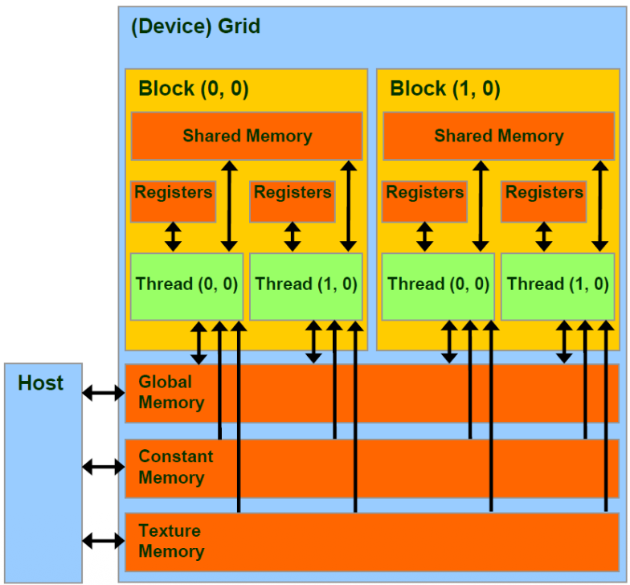
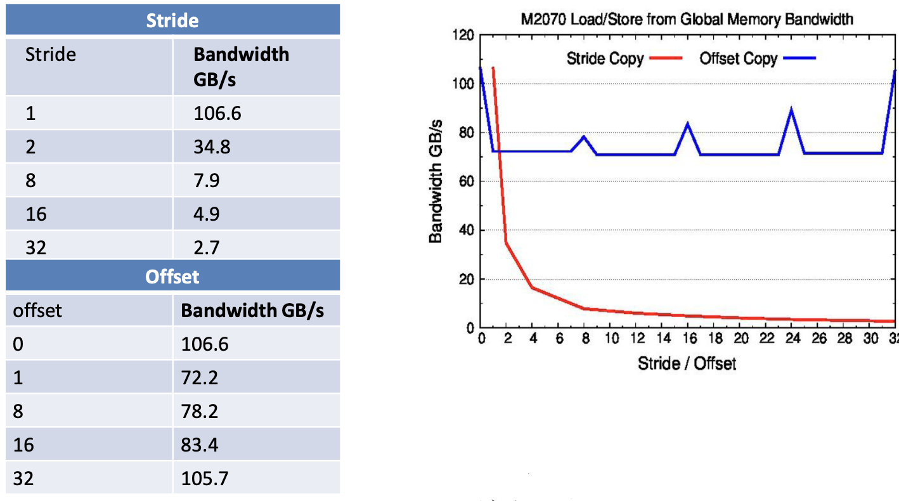

# CUDA Memory Model: 


1. **Risorse locali del SM**: 
    - registers: ogni thread ha i suoi registri privati e velocissimi 

    - shared memory: è una memoria speciale condivisa tra i thread dello stesso blocco, e solo da loro; se il blocco 0 scrive in shared il blocco 1 non potrà vederlo.  
2. **Memorie Globali**: 
    - Global memory: È la RAM della GPU, grande ma lenta; tutti i thread di tutti i blocchi possono leggerla e scriverci sopra 
    - Constant memory: memoria di sola lettura, ottimizzata per dati che non cambiano 
    - Texture memory: memoria di sola lettura, ottimizzata per grafica (cache speciale 2D)

<center>



</center>


### Global Memory:  

È la RAM ed è la memoria più grande sulla GPU (in termini di GB), visibile da tutti e i dati sopravvivono tra un kernel e l'altro.  
Prestazioni: 
- **High Latency**: Latenza altissima (centinaia di cicli), ogni volta che bisogna leggere da qui il thread si blocca per molto tempo.   
- **High Bandwidth**: Banda alta (passano tanti dati) MA solo se usata bene!  


Possiamo creare dati in global memory in 2 modi:
1. **Allocazione statica**:  `__device__ int x;`
    Usiamo il qualificatore `__device__`; dichiarata fuori dalle funzioni, l'analogo di una variabile globale in C.  

2. **Allocazione dinamica**: si usano i puntatori  
    Si dichiara un puntatore al tipo di dato `int* ptr` e si chiama dal host `cudaMalloc`; per liberare spazio si usa `cudaFree`.  


### Accesso alla Global Memory:  

Il modo di accedere alla global memory impatta la **performance**.  
Esistono due tipi di accesso:
- **offset access**: I thread leggono dati consecutivi ma spostati in avanti.  
    - avviene quello che si definisce come **coalescence**: la GPU vede che titti i thread chiedono dati vicini, fa un unica richiesta grossa alla memoria (es. pacchetto da 128Byte); massima efficienza.  

- **stride access**: i thread leggono dati distanziati (es: th0 legge idx0, th1 legge idx2, th2 legge idx4, ...)  
    - qui nasce un **problema**: i dati richiesti non sono vicini (soprattutto per stride larghi), non stanno nello stesso pacchettoda 128Byte; la GPU è costretta a fare tante piccole richieste separate, la banda crolla.  


<center>



</center>


**Conclusione**: Quando si progettano e si usano strutture dati (es. matrici), bisogna fare il possibile per garantire che thread adiacenti (tid, tid+1, ...) leggano dati adiacenti in memoria!  


<br>

## Cache Model:  


Dall'architettura Fermi in poi NVIDIA ha introdotto una gerarchia di cache dentro le GPU.  

- `L2 Cache`: È memoria condivisa tra **tutti** gli SM  
    - Capienza grande (in ordine di MB)
    - Tutti gli accessi alla global memory passano prima di qui, è il punto di incontro

- `L1 Cache`: privata per ogni singolo SM
    - È una memoria molto veloce ma piccola  
    - **Conflitto L1/Shared-Memory**: Fisicamente la cache L1 e la shared memory usano lo stesso baco di memoria on chip (spesso 64kb totali)  
        - se si vuole tanta shared memory, allora rimane poca L1
        - se non si usa shared memory in un programma si può dare l'intero spazio alla L1 
        - è una **partizione logica dinamica**: Una partizione del banco di memoria condiviso viene assegnata alla L1 cache e il resto è allocata per la shared memory; la shared memory è fisicamente la stessa per ogni SM ma diversa per ogni blocco dentro lo SM, una porzione della shared memory è data ad ogni blocco ed è l'hardware ad aggiungere automaricamente l'offset per gli accessi a seconda del blocco; in questo modo fisicamente usano lo stesso banco di memoria ma logicamente lavorano su spazi di memoria separati e protetti.  
    - Possiamo configurare la L1 e la shared memory per decidere la partizione di interese, per farlo usiamo `cudaFuncSetCacheConfig`.  

Si possono anche avere **Load Policies**, che permettono di decidere se usare o non usare la cache L1 (il vantaggio sta nel scegliere la policy giusta al momento giusto, solitamente si salta il caching in L1 quando dobbiamo leggere un dato una sola volta, evitando di inquinare la L1 buttando dati che magari potevano servire).   


<br>

### Meccanica delle operazione di `Load` sulla global memory:

La load avviene attraverso 3 passaggi: 

1. **Richiesta**: tutti i 32 thread del warp presentano il loro indirizzo di memoria
2. **Analisi** (coalescing): l'unità hardware guarda i 32 indirizzi per vedere se sono tutti vicini (es. da 0 a 127) o se sono sparpagliati
3. **Segmentazione**: L'unità calcola quante transazioni (viaggi verso la memoria) servono
    - se gli indirizzi cadono tutti in un unico blocco da 128B $\rightarrow$ 1 transazione
    - se cadono in $N$ blocchi diversi $\rightarrow$ $N$ transazioni (lento)  

ES: Abbiamo le seguenti istruzioni con la load  
```cpp
int i = threadIdx.x;
float x = aA[i];
```

L'istruzione è unica ma viene eseguita (ovviamente) come SIMT, quindi:
- th0 calcola i=0 e il suo indirizzo target è `&A[0]`  
- th1 calcola i=1 e il suo indirizzo target è `&A[1]`
- th_n calcola i=n e il suo indirizzo target è `&A[n]` 

Quando il warp arriva all'istruzione di load, la load/store unit vede arrivare 32 indirizi diversi contemporaneamente! vogliamo che i dati siano contingui per fare il minor numero di transazioni possibili.  

La segmentazione ci spiega perchè gli accessi in stride fanno crollare la banda, servono più transazioni!  


<br>

### Allineamento: 

**Le GPU leggono blocchi da 128B**, per minimizzare le transazioni verso la memoria, gli indirizzi dovrebbero essere allineati (l'indirizzo di partenza deve esere un multiplo di 32 o 128), ma questo non è sempre il caso.   

**FONDAMENTALE**: La memoria della GPU è come un foglio a quadretti predisegnato e diviso in blocchi fissi da 128Byte.  
NON puoi chiedere alla GPU di leggere "128Byte partendo dall'indirizzo 50", la GPU può leggere SOLAMENTE blocchi di memoria che iniziano a indirizzi multipli di 128 (0, 128, 256, ...).  
I blocchi sono indirizzi fisici nella RAM allineati rigidamente.  


prendiamo una matrice da 100 colonne (`width=100`) float, quindi 400 Byte.    
il warp è composto da 32 thread, e ogni thread legge un float (4 Byte), quindi un warp collettivamente vuole leggere 32x4 = 128Byte!  

Ricordiamo che gli accessi in memoria sono a blocchi fissi da 128B, per leggere la prima riga da 100 elementi devo leggere 400 byte, la GPU lancia i warp:
- b0 [0 - 127] : w0 chiede questo blocco, è contiguo e quindi eseguito in una singola transazione
- b1 [128 - 255]: w1 chiede questo blocco, uguale a sopra.

Per questa prima riga ogni richiesta del warp si traduce in una singola transazione in memoria, il che è ottimo.  

Il problema nasce quando vogliamo leggere la riga1, ossia i primi 128B a partire dal byte 400.  
Per leggere i 32 float della prima riga il warp responsabile ha bisogno degli indirizzi da [400 - 527]!   
Ma l'indirizzo 400 non è multiplo di 128! e siccome i dati sono organizzati in blocchi da 128B avremo queta situazione:
- b3 [384 - 511]
- b4 [512 - 639]  

Il warp che vuole leggere da 400 a 527 dovrà quindi aprire 2 blocchi! il blocco3 e il blocco4, il che si traduce in 2 transazioni!  
Tutti gli altri warp di questa riga dovranno fare 2 transazioni per portarsi in memoria gli elementi che servono, stiamo facendo 2 transazioni per ogni richiesta di warp da quel punto il che penalizza fortemente le performance (in quanto viaggiare in memoria è l'operazione più lenta).  


Per risolvere questo problema usiamo il Padding 

<br>


### Padding:

Dobbiamo allungare la riga della matrice per fare in modo che la successiva inizi a un indirizzo multiplo di 128, per fare in modo di evitare doppia transazione per richiesta di warp $\rightarrow$ aggiungiamo byte vuoti alla fine di ogni riga per garantire queta proprietà!  

- `cudaMalloc`: alloca un blocco 1D semplice, non garantisce l'allineamento delle righe interne se si usa una logica 2D
- `cudaMallocPitch`: è la soluzione intelligente! bisogna fornire il numero di righe e di colonne e lui in automatico calcola quanto padding aggiungere.  
    Restituisce un valore chiamato `pitch`


Esempio con `pitch`

```cpp
int width = 64, int height = 64;
float a[width][height];
float* devPtr;
int pitch;

cudaMallocPitch(&devPtr, &pitch, width * sizeof(float), height);
cudaMemCopy2D(devPtr, pitch, a, width * sizeof(float), heigth, cudaMemcpyHostToDevice);

// Kernel call 
```


### CUDA Shared Memory:  

È memoria che risiede dentro l'SM, logicamente privata per ogni blocco dello SM.  
- **bassa latenza**: 1-2 cicli di clock, veloce quasi quanto i registri  
- **volatile**: quando il blocco finisce l'esecuzione la sua shared memory viene cancellata
- **configurabile**: condivide lo stesso spazio fisico della L1 cache, possiamo decidere quanta memoria allocare alla shared.  

Si usa come una cache gestita dal programmatore, solitamente segue questo flusso di uso:
1. load: i thread collaborano per copiare i dati dalla global memory alla shared memory 
2. synchronize: prima di iniziare i calcoli, bisogna assicurarsi che tutti i thread abbiano finito di caricare i dati in memoria (`__synchthreads()`)
3. use: si fanno i calcoli pesanti leggendo e scrivendo direttamente sulla shared memory
4. synchronize: si sincronizza nuovamente per aspettare che tutti i thread abbiano finito
5. write: si copiano i risultati finali dall shared alla global memory  


### Banchi di memoria   
La shared memory non è un blocco unico, è divisa in **32 banchi** verticali.  
Ogni banco può contenere una quantità di word (4Byte) che varia in base alla quantità di memoria che allochiamo alla shared-memory.  

**Modalità di accesso ottimali:**   
- parallelismo: se 32 thread accedono a 32 banchi diversi, l'accesso avviene in un solo ciclo di clock, è la velocità massima alla quale possiamo ambire.  
- multicast/broadcast: se più thread chiedono lo stesso indirizzo, l'hardware lo legge una volta sola e invia il dato a tutti; 1 ciclo di clock 

<br>

**Bank Conflict:**      
Avviene quando due thread vogliono accedere a indirizzi diversi che però sono mappati nello stesso banco. Ogni banco ha una sola porta, non può servire contemporaneamente due thread, di conseguenza l'accesso viene serializzato.  


**Allocazione della Shared Memory**  
Abbiamo due modi per allocare la shared memoy: staticamente / dinamicamente

1. **Allocazione Statica**:  
    La usiamo se sappiamo la dimensione a compile time, è facile e 

```cpp

__global__ void myKernel(...){
    __shared__ int shmem[64];
    ... 
}
```


2. **Allocazione Dinamica**:   
    Da preferire qunando dobbiamo usare un kernel generico che funzioni per una dimensione N che non sappiamo a priori (magari decisa dall'utente nel main).   
    Definiamo la dimensione della memoria tramite una variabile che passiamo al kernel nel momento della sua invocazione.  

```cpp
extern __shared__ int dynshmem[];
__global__ void myKernel(...)
{
    ...
    dynshmem[i] = ... ;
}

void hostFunc(...)
{
    ...
    myKernel<<<<gs, bs, MEMSZ>>>>();
}

```


